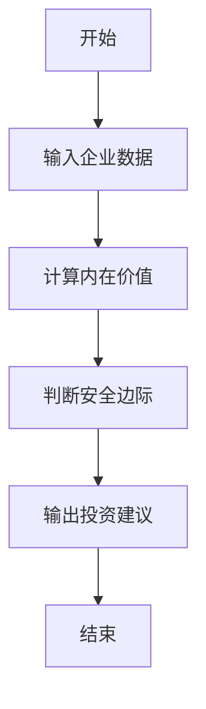
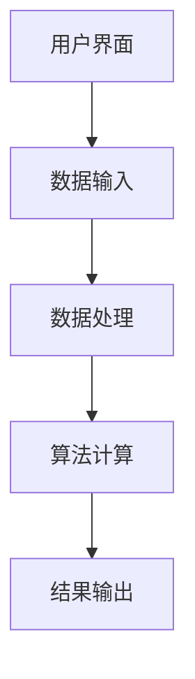

                 


# 格雷厄姆特价股票策略在不同数字企业文化生态中的适应

## 关键词：格雷厄姆策略，数字企业文化，投资策略，企业文化生态，算法设计，系统架构

## 摘要：  
本文探讨了格雷厄姆特价股票策略在不同数字企业文化生态中的适应性。通过分析数字企业文化的核心要素，结合格雷厄姆价值投资理念，本文提出了在科技型、传统型和互联网型等不同企业中的策略应用方法。同时，本文还详细阐述了策略的算法设计和系统架构，为投资者提供了实用的指导和参考。

---

# 第一部分: 引言

## 1.1 特价股票策略与数字企业文化概述

### 1.1.1 格雷厄姆特价股票策略的核心理念  
格雷厄姆特价股票策略是一种基于价值投资的股票选择方法，强调以低于内在价值的价格购买优质企业股票。其核心理念包括：  
1. 企业内在价值的评估是投资的关键。  
2. 避免情绪化投资，注重基本面分析。  
3. 长期持有优质企业，获取复利收益。  

### 1.1.2 数字企业文化生态的定义与特征  
数字企业文化生态是指企业在数字化转型过程中形成的文化特征和商业模式的集合。其核心特征包括：  
1. 数据驱动：企业决策依赖数据支持。  
2. 创新文化：鼓励技术创新和模式创新。  
3. 协作性：强调团队协作和跨部门沟通。  
4. 快速迭代：企业通过持续优化适应市场变化。  

### 1.1.3 本书的研究目标与意义  
本书旨在探讨格雷厄姆特价股票策略在不同数字企业文化生态中的适用性，为企业投资者提供理论支持和实践指导。通过分析不同类型企业的文化特征，本书为投资者选择合适的投资策略提供了参考。

---

## 1.2 问题背景与研究现状

### 1.2.1 特价股票策略在传统投资中的应用  
在传统投资中，格雷厄姆策略强调对企业基本面的分析，如市盈率、市净率等指标。然而，随着数字化转型的推进，企业的文化和商业模式也在发生变化，传统的策略需要与时俱进。

### 1.2.2 数字化对企业文化生态的影响  
数字化转型不仅改变了企业的运营方式，还深刻影响了企业文化。例如，数据驱动决策、敏捷开发和远程协作等文化特征的兴起，使得企业更加注重灵活性和创新性。

### 1.2.3 当前研究中的空白与挑战  
当前研究多集中于传统企业的投资策略，而对数字企业文化的适应性研究较少。此外，如何将格雷厄姆策略与数字化文化特征相结合，仍是一个待探索的领域。

---

## 1.3 本书结构与内容框架

### 1.3.1 各章节内容概述  
- 第二部分：格雷厄姆策略的核心理论与数字企业文化生态的构成。  
- 第三部分：格雷厄姆策略在不同类型企业中的具体应用。  
- 第四部分：策略的算法设计与系统架构。  
- 第五部分：项目实战与总结。  

### 1.3.2 核心概念与方法论  
本文以格雷厄姆价值投资理论为核心，结合数字企业文化分析，采用案例分析和算法设计的方法，探讨策略的适应性。

### 1.3.3 预期成果与读者收益  
读者将通过本文深入了解格雷厄姆策略在数字企业中的应用，掌握如何根据企业文化特征选择投资标的，并熟悉相关的算法设计与系统架构。

---

# 第二部分: 格雷厄姆策略的核心概念与理论基础

## 2.1 格雷厄姆投资理论的深度解析

### 2.1.1 格雷厄姆的价值投资理念  
格雷厄姆强调以低于内在价值的价格购买股票，注重企业的财务状况和盈利能力。以下是其核心理念的总结：  
1. **内在价值**：企业未来现金流的现值。  
2. **安全边际**：买入价格低于内在价值，以降低风险。  
3. **长期视角**：通过长期持有优质企业获取复利收益。  

### 2.1.2 特价股票的定义与筛选标准  
格雷厄姆提出的特价股票筛选标准包括：  
1. 市净率（P/B）低于2。  
2. 每股收益（EPS）稳定且高于市场平均水平。  
3. 企业财务状况健康，无重大负债。  

### 2.1.3 投资组合构建与风险管理  
格雷厄姆建议构建分散化的投资组合，以降低风险。其风险管理方法包括：  
1. 避免过度集中投资。  
2. 保持足够的安全边际。  
3. 定期评估投资组合的健康状况。  

---

## 2.2 数字企业文化生态的构成要素

### 2.2.1 数字化转型对企业文化的影响  
数字化转型推动了企业文化的变革，例如：  
1. **数据驱动决策**：依赖数据分析而非主观判断。  
2. **敏捷开发**：快速迭代和小步快跑。  
3. **远程协作**：依赖数字化工具实现团队协作。  

### 2.2.2 企业文化的核心要素与特征  
数字企业文化的核心要素包括：  
1. **创新文化**：鼓励技术创新和商业模式创新。  
2. **协作文化**：强调团队协作和跨部门沟通。  
3. **数据文化**：以数据驱动决策。  

### 2.2.3 数字生态系统的构建与优化  
数字生态系统的构建需要从以下几个方面入手：  
1. **技术基础设施**：构建高效的IT系统。  
2. **组织架构**：优化组织结构以适应数字化需求。  
3. **文化培训**：通过培训强化企业文化。  

---

## 2.3 格雷厄姆策略与数字企业文化的关系

### 2.3.1 格雷厄姆策略在数字企业中的适用性  
格雷厄姆策略的核心是企业内在价值的评估，这与数字企业的数据驱动决策高度契合。然而，数字企业的商业模式和文化特征也对策略的应用提出了新的要求。

### 2.3.2 数字企业文化对企业投资策略的影响  
数字企业的文化特征（如创新性和协作性）影响了投资策略的选择。例如，科技型企业的高成长性可能需要更高的市盈率容忍度。

### 2.3.3 格雷厄姆策略与数字企业文化的融合  
通过将格雷厄姆策略与数字企业文化特征相结合，投资者可以更好地识别具有长期竞争优势的企业。

---

# 第三部分: 格雷厄姆策略在不同数字企业文化中的应用

## 3.1 科技型企业的格雷厄姆策略应用

### 3.1.1 科技企业的核心特征与估值方法  
科技企业的核心特征包括高研发投入、快速迭代和高成长性。其估值方法包括：  
1. 市盈率（P/E）：适用于高成长企业。  
2. 市净率（P/B）：适用于重资产企业。  

### 3.1.2 格雷厄姆策略在科技企业中的具体应用  
在科技企业中，格雷厄姆策略需要结合企业的技术创新能力和市场前景进行调整。例如，选择市盈率低于行业平均水平且研发投入占比高的企业。

### 3.1.3 案例分析：某知名科技企业的投资策略  
以某知名科技企业为例，分析其如何通过格雷厄姆策略实现投资收益。  
- 该企业市盈率低于行业平均水平。  
- 每股收益稳定且高于市场平均水平。  

---

## 3.2 传统型企业的格雷厄姆策略应用

### 3.2.1 传统企业的数字化转型与文化变革  
传统企业的数字化转型需要从文化、技术、组织等多个方面进行调整。例如，从传统的部门壁垒转向协作型组织。

### 3.2.2 格雷厄姆策略在传统企业中的适应性  
传统企业的文化特征（如稳定性）与格雷厄姆策略的长期视角高度契合。然而，数字化转型可能要求投资者更加关注企业的创新能力。

### 3.2.3 案例分析：某传统企业的投资策略调整  
以某传统制造企业为例，分析其如何通过格雷厄姆策略实现投资收益。  
- 该企业财务状况健康，市净率低于2。  
- 企业开始数字化转型，具有较大的增长潜力。  

---

## 3.3 互联网型企业的格雷厄姆策略应用

### 3.3.1 互联网企业的商业模式与文化特点  
互联网企业的核心特征包括高用户粘性和数据驱动决策。其商业模式通常以广告、订阅或增值服务为主。

### 3.3.2 格雷厄姆策略在互联网企业中的创新应用  
在互联网企业中，格雷厄姆策略需要结合企业的用户增长和盈利能力进行评估。例如，选择用户增长率高且市盈率合理的企业。

### 3.3.3 案例分析：某互联网企业的投资策略优化  
以某互联网企业为例，分析其如何通过格雷厄姆策略优化投资策略。  
- 该企业用户增长率高于行业平均水平。  
- 每股收益稳定且高于市场平均水平。  

---

## 3.4 其他类型企业的格雷厄姆策略应用

### 3.4.1 其他类型企业的文化特征与投资策略  
其他类型企业（如金融、教育等）的文化特征各不相同，投资者需要根据具体情况进行调整。

### 3.4.2 格雷厄姆策略的普适性与灵活性  
格雷厄姆策略具有较强的普适性，但需要根据企业的具体文化特征进行调整。

### 3.4.3 案例分析：不同类型企业的投资策略对比  
通过对比不同类型企业的投资策略，总结格雷厄姆策略在不同企业中的适用性。

---

# 第四部分: 格雷厄姆策略在数字企业文化中的算法与系统设计

## 4.1 格雷厄姆策略的核心算法

### 4.1.1 核心算法的数学模型  
以下是格雷厄姆策略的核心算法数学模型：  
$$ \text{内在价值} = \sum_{t=1}^{n} \frac{\text{现金流}_t}{(1 + r)^t} $$  
其中，\( r \) 是折现率，\( \text{现金流}_t \) 是第 \( t \) 年的现金流。  

---

## 4.2 算法设计与系统架构

### 4.2.1 算法设计流程图  
以下是格雷厄姆策略的算法设计流程图：  



### 4.2.2 系统架构图  
以下是系统架构图：  



---

## 4.3 系统实现与代码

### 4.3.1 核心算法实现  
以下是Python实现的核心算法代码：  

```python
def calculate_intrinsic_value(cash_flows, discount_rate):
    intrinsic_value = 0
    for t in range(len(cash_flows)):
        intrinsic_value += cash_flows[t] / (1 + discount_rate)**t
    return intrinsic_value
```

### 4.3.2 数据处理与分析  
以下是数据处理与分析的代码示例：  

```python
import pandas as pd

# 读取企业数据
data = pd.read_csv('enterprise_data.csv')

# 计算内在价值
data['intrinsic_value'] = data.apply(lambda x: calculate_intrinsic_value(x['cash_flows'], x['discount_rate']), axis=1)

# 输出结果
print(data[['企业名称', 'intrinsic_value', '股价']])
```

---

# 第五部分: 项目实战与总结

## 5.1 项目环境安装与配置

### 5.1.1 环境要求  
- Python 3.8 或更高版本  
- Pandas 和 Matplotlib 库  

### 5.1.2 代码实现  
以下是完整的代码实现：  

```python
import pandas as pd
import matplotlib.pyplot as plt

def calculate_intrinsic_value(cash_flows, discount_rate):
    intrinsic_value = 0
    for t in range(len(cash_flows)):
        intrinsic_value += cash_flows[t] / (1 + discount_rate)**t
    return intrinsic_value

# 读取企业数据
data = pd.read_csv('enterprise_data.csv')

# 计算内在价值
data['intrinsic_value'] = data.apply(lambda x: calculate_intrinsic_value(x['cash_flows'], x['discount_rate']), axis=1)

# 可视化结果
plt.figure(figsize=(10, 6))
plt.plot(data['企业名称'], data['intrinsic_value'], label='内在价值')
plt.plot(data['企业名称'], data['股价'], label='股价')
plt.xlabel('企业名称')
plt.ylabel('价值')
plt.legend()
plt.show()
```

### 5.1.3 案例分析与结果解读  
通过具体案例分析，展示如何利用上述代码进行投资决策。

---

## 5.2 总结与展望

### 5.2.1 全书总结  
本文通过分析格雷厄姆策略在不同数字企业文化中的适应性，为投资者提供了理论支持和实践指导。

### 5.2.2 最佳实践 tips  
- 投资者应根据企业的文化特征调整投资策略。  
- 格雷厄姆策略需要结合企业的实际情况进行优化。  
- 数据分析和算法设计是实现策略的重要工具。  

### 5.2.3 未来展望  
未来的研究可以进一步探讨格雷厄姆策略在新兴领域的应用，如人工智能和区块链企业。

---

# 作者：AI天才研究院 & 禅与计算机程序设计艺术

---

通过本文，读者可以深入了解格雷厄姆策略在不同数字企业文化中的适应性，并掌握相关的算法设计与系统架构。希望本文能够为投资者提供有价值的参考和启发。

