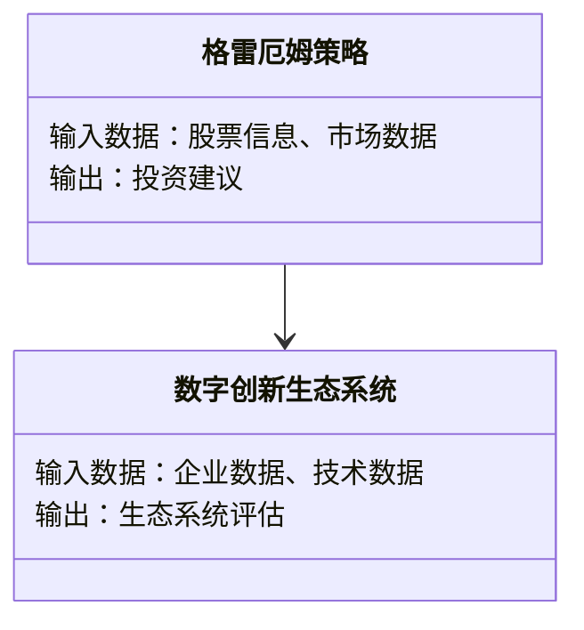
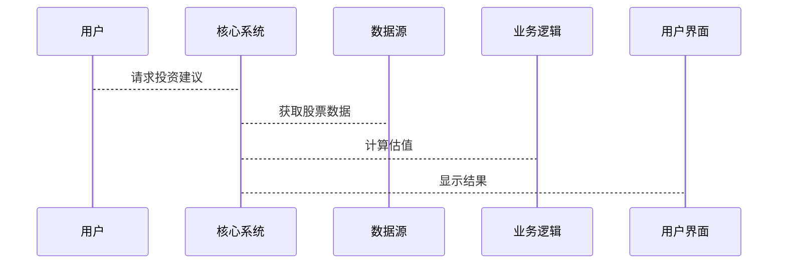

                 


# 格雷厄姆特价股票策略在不同数字创新生态系统复杂度的效果

---

## 关键词
格雷厄姆投资理论、数字创新生态系统、股票估值、系统复杂度、金融科技、区块链、互联网企业

---

## 摘要
本文探讨格雷厄姆的价值投资策略在不同数字创新生态系统复杂度下的应用效果。首先，我们分析了格雷厄姆策略的核心思想及其在数字化时代的适应性。然后，我们详细研究了数字创新生态系统的分类及其对股票投资的影响。接着，我们通过实际案例分析了格雷厄姆策略在互联网企业、金融科技和区块链生态系统中的应用效果。最后，我们讨论了数字创新生态系统复杂度对格雷厄姆策略的影响，并提出了相应的优化建议。本文结合理论分析和实际案例，为投资者在复杂数字生态系统中应用格雷厄姆策略提供了深入的指导。

---

# 第一部分: 格雷厄姆特价股票策略与数字创新生态系统概述

## 第1章: 格雷厄姆投资理论的核心思想

### 1.1 价值投资的基本概念
- 价值投资的定义与核心理念
  - 价值投资是一种以内在价值为导向的投资策略，旨在通过分析企业的基本面，寻找市场价格低于内在价值的股票。
  - 格雷厄姆的“安全边际”概念：买入价格低于企业内在价值的股票，以降低投资风险。

### 1.2 格雷厄姆的选股标准
- 企业基本面分析：市盈率（P/E）、市净率（P/B）、股息率等指标。
- 低估股票的识别：市场价格与内在价值的差距。
- 长期投资与耐心持有：避免短期市场波动的干扰。

### 1.3 特价股票的定义与特征
- 特价股票：市场价格显著低于内在价值的股票。
- 特征：低估值、高分红、稳定的财务状况。

---

## 第2章: 数字创新生态系统的基本概念

### 2.1 数字创新的定义与特征
- 数字创新：通过数字化技术推动商业模式、业务流程和服务方式的创新。
- 数字创新生态系统：由技术、数据、平台、用户和企业等多方利益相关者共同构成的复杂系统。

### 2.2 创新生态系统的核心要素
- 技术：人工智能、大数据、区块链等新兴技术。
- 数据：数据的收集、分析和应用。
- 平台：数字化平台连接各方参与者。
- 用户：用户需求和行为驱动创新。
- 企业：企业作为创新的主体。

### 2.3 数字化对金融市场的深远影响
- 数据驱动的投资决策：利用大数据分析提升选股的精准度。
- 数字化交易平台：在线交易、算法交易的普及。
- 金融科技的崛起：支付、借贷、保险等领域的数字化转型。

---

## 第3章: 格雷厄姆策略在数字创新生态系统中的适应性

### 3.1 数字化对股票投资的影响
- 数据驱动的选股：利用算法分析企业基本面和市场趋势。
- 算法交易：高频交易和自动化决策。
- 数字平台的便利性：投资者可以通过在线平台快速获取信息和交易。

### 3.2 格雷厄姆策略在数字时代的挑战
- 市场波动加剧：数字化交易可能导致市场短期波动增加。
- 数据质量与可靠性：如何确保数据来源的准确性和完整性。
- 竞争加剧：数字创新生态系统中的竞争更加激烈，企业盈利能力可能受到影响。

### 3.3 数字创新生态系统中的投资机会
- 互联网企业：电子商务、社交媒体等领域的投资机会。
- 金融科技：区块链、智能合约等技术的应用。
- 区块链生态系统：分布式账本技术的应用带来的投资机会。

---

# 第二部分: 格雷厄姆策略在不同数字创新生态系统中的应用

## 第4章: 互联网企业生态系统中的应用

### 4.1 互联网企业的估值方法
- 市盈率（P/E）：适用于高增长企业的估值。
- 市销率（P/S）：适用于收入驱动型企业。
- 现金流折现模型：评估企业的未来现金流。

### 4.2 格雷厄姆策略在互联网企业中的成功案例
- 案例分析：亚马逊、谷歌等互联网企业的估值与投资机会。
- 成功经验：长期持有、注重企业基本面。

### 4.3 互联网企业的风险与挑战
- 市场竞争激烈：互联网企业的盈利能力可能受到挤压。
- 技术更新快：技术落后可能导致企业竞争力下降。
- 监管政策变化：政策风险对互联网企业的影响。

---

## 第5章: 金融科技生态系统中的应用

### 5.1 金融科技的核心特征
- 技术驱动：人工智能、大数据等技术的应用。
- 金融产品创新：智能投顾、量化交易等新型金融服务。
- 数据安全：金融数据的保护与隐私问题。

### 5.2 格雷厄姆策略在金融科技中的应用
- 量化分析：利用算法筛选低估值的金融资产。
- 金融科技企业的估值：关注企业的技术创新能力和市场前景。
- 风险控制：通过技术手段降低投资风险。

### 5.3 金融科技对企业价值的影响
- 技术创新提升企业效率：金融科技企业通过技术创新降低成本、提高效率。
- 数字化转型带来的投资机会：金融科技生态系统中的投资潜力。

---

## 第6章: 区块链生态系统中的应用

### 6.1 区块链技术的基本原理
- 分布式账本：区块链技术的核心原理。
- 智能合约：自动执行的合同代码。
- 去中心化：区块链的去中心化特点。

### 6.2 格雷厄姆策略在区块链项目中的应用
- 项目评估：评估区块链项目的团队、技术、市场需求。
- 代币估值：分析代币的内在价值和市场价值。
- 投资风险：区块链项目的不确定性和波动性。

### 6.3 区块链生态系统中的投资机会
- 数字货币：比特币、以太坊等加密货币的投资机会。
- 区块链应用：供应链管理、智能合约等领域的投资机会。

---

# 第三部分: 数字创新生态系统复杂度对格雷厄姆策略的影响

## 第7章: 数字创新生态系统复杂度的定义与度量

### 7.1 系统复杂度的度量标准
- 结构复杂度：系统的模块化程度。
- 行为复杂度：系统的动态变化。
- 交互复杂度：系统内部和外部的交互关系。

### 7.2 数字创新生态系统复杂度的分类
- 低复杂度生态系统：结构简单、参与者少。
- 中等复杂度生态系统：结构复杂、参与者多。
- 高复杂度生态系统：高度动态、参与者众多、技术复杂。

### 7.3 复杂度对投资策略的影响
- 高复杂度生态系统中的投资风险：信息不对称、市场波动大。
- 低复杂度生态系统中的投资机会：信息透明、市场波动小。

---

## 第8章: 不同复杂度下的格雷厄姆策略调整

### 8.1 低复杂度生态系统中的策略应用
- 简单的估值模型：适用于低复杂度生态系统。
- 长期持有：低复杂度生态系统的稳定性。

### 8.2 中等复杂度生态系统中的策略优化
- 综合估值模型：结合多种指标进行估值。
- 动态调整：根据市场变化及时调整投资策略。

### 8.3 高复杂度生态系统中的策略挑战
- 高度动态的市场：需要实时监控和快速反应。
- 信息过载：如何筛选有用的信息。

---

## 第9章: 系统分析与架构设计方案

### 9.1 问题场景介绍
- 数字创新生态系统中的投资决策问题。
- 格雷厄姆策略在复杂系统中的应用挑战。

### 9.2 项目介绍
- 项目目标：优化格雷厄姆策略在不同复杂度生态系统中的应用。
- 项目范围：互联网企业、金融科技和区块链生态系统。

### 9.3 系统功能设计
- 领域模型：使用Mermaid类图展示系统的功能模块。


### 9.4 系统架构设计
- 使用Mermaid架构图展示系统的整体架构。


### 9.5 系统交互设计
- 使用Mermaid序列图展示系统交互流程。


---

## 第10章: 项目实战与案例分析

### 10.1 环境安装
- 安装必要的软件和工具：Python、数据处理工具、数据分析库（如Pandas、NumPy）。

### 10.2 核心代码实现
- 使用Python代码实现格雷厄姆策略的应用。
```python
def calculate_value(selling_price, cost_price, year_depreciation):
    return selling_price - cost_price * (1 - (1 / (1 + year_depreciation)))
```

### 10.3 案例分析
- 分析互联网企业的实际案例：如亚马逊、谷歌的投资机会。
- 分析金融科技企业的实际案例：如支付宝、PayPal的投资价值。

### 10.4 项目小结
- 项目总结：格雷厄姆策略在不同生态系统中的应用效果。
- 经验教训：如何在复杂生态系统中优化投资策略。

---

## 第11章: 最佳实践与小结

### 11.1 最佳实践
- 数据驱动的投资决策：利用大数据分析提升选股的精准度。
- 风险管理：分散投资、设置止损点。
- 长期投资：避免短期波动的影响，坚持长期价值投资。

### 11.2 小结
- 格雷厄姆策略在数字创新生态系统中的有效性。
- 数字化对股票投资的深远影响。
- 未来研究方向：如何进一步优化格雷厄姆策略在复杂生态系统中的应用。

---

## 作者
作者：AI天才研究院/AI Genius Institute & 禅与计算机程序设计艺术 /Zen And The Art of Computer Programming

