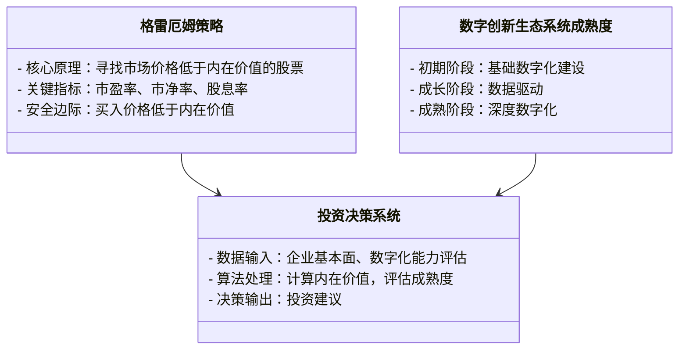

                 


# 格雷厄姆特价股票策略在不同数字创新生态系统成熟度的效果

## 关键词：格雷厄姆策略, 数字创新生态系统, 价值投资, 投资策略, 企业成熟度

## 摘要：本文探讨了格雷厄姆特价股票策略在不同数字创新生态系统成熟度下的应用效果。通过分析数字创新生态系统成熟度对格雷厄姆策略的影响，本文提出了结合数字技术的优化策略，以提升投资效果。文章从背景、原理、算法、系统架构到实战案例，全面阐述了这一结合的可行性与优势。

---

## 第一部分: 格雷厄姆特价股票策略与数字创新生态系统成熟度的背景介绍

## 第1章: 格雷厄姆特价股票策略概述

### 1.1 格雷厄姆特价股票策略的基本概念

#### 1.1.1 格雷厄姆投资理论的核心思想
格雷厄姆的投资理论以“价值投资”为核心，主张以低于内在价值的价格买入股票并长期持有。其核心思想包括：
- **安全边际**：买入价格低于内在价值，确保安全空间。
- **市场先生**：市场波动反映短期情绪，而非真实价值。
- **逆向思维**：在市场恐慌时寻找机会，在市场狂热时保持冷静。

#### 1.1.2 特价股票的定义与特征
- **定义**：市场价格低于内在价值的股票。
- **特征**：
  - 价格低廉，通常为低市盈率或低市净率。
  - 公司基本面稳健，具备持续盈利能力。
  - 市场关注度低，往往被市场忽视。

#### 1.1.3 格雷厄姆策略在现代投资中的应用价值
- 提供了一种理性投资框架，帮助投资者避免情绪化决策。
- 在市场波动中提供稳定收益，尤其在经济衰退或市场低迷时表现突出。

### 1.2 数字创新生态系统成熟度的概念

#### 1.2.1 数字创新生态系统的定义
数字创新生态系统是指由企业、技术、数据、用户和合作伙伴共同构成的数字化转型环境，涵盖从数字化基础建设到高级应用场景。

#### 1.2.2 不同成熟度的数字创新生态系统特征
- **初期阶段**：基础数字化建设，如信息化、自动化。
- **成长阶段**：数据驱动，采用大数据和人工智能。
- **成熟阶段**：深度数字化，实现智能化和平台化。

#### 1.2.3 数字创新生态系统成熟度的评估标准
- 技术基础设施：云计算、大数据、AI等技术的采用程度。
- 数据应用：数据采集、分析和应用能力。
- 业务整合：数字化技术与业务流程的融合程度。
- 用户参与度：员工、客户和合作伙伴的数字化互动水平。

### 1.3 格雷厄姆策略与数字创新生态系统的关系

#### 1.3.1 格雷厄姆策略在数字创新生态系统中的应用背景
- 数字化转型为企业创造新价值，但同时也带来新的不确定性。
- 数字创新生态系统成熟度影响企业的数字化能力，进而影响其市场估值。

#### 1.3.2 数字创新生态系统成熟度对格雷厄姆策略效果的影响
- 成熟度高的企业可能具备更高的市场估值，但未必符合“特价”条件。
- 成熟度低的企业可能被市场低估，成为潜在的投资机会。

#### 1.3.3 格雷厄姆策略与数字创新生态系统结合的必要性
- 数字化转型改变了企业的价值评估维度，需要新的投资策略。
- 结合数字创新生态系统成熟度，可以更精准地识别被低估的企业。

---

## 第2章: 格雷厄姆策略在数字创新生态系统中的应用背景

### 2.1 数字化转型对企业价值的影响

#### 2.1.1 数字化转型对企业估值的提升作用
- 提升运营效率，降低成本，提高利润率。
- 增强客户体验，扩大市场份额，提升品牌价值。

#### 2.1.2 数字化转型中的投资机会分析
- 早期投资数字化转型的企业可能获得超额收益。
- 数字化生态系统中的协同效应带来新的增长点。

#### 2.1.3 数字化转型对传统估值模型的挑战
- 传统估值模型难以准确评估数字资产的价值。
- 数字化转型中的动态变化要求投资者具备更高的敏感性。

### 2.2 数字创新生态系统成熟度对企业价值的影响

#### 2.2.1 不同成熟度下企业的估值差异
- 初期阶段：估值可能被低估，存在价值发现机会。
- 成长阶段：估值逐渐被市场认可，但可能仍低于内在价值。
- 成熟阶段：估值接近或高于内在价值，投资机会减少。

#### 2.2.2 数字创新生态系统成熟度与企业竞争优势的关系
- 成熟度高的企业具备更强的竞争力和可持续发展能力。
- 初期阶段的企业可能因市场忽视而被低估，具备投资潜力。

#### 2.2.3 数字创新生态系统成熟度对企业风险的评估
- 初期阶段：技术风险和市场风险较高。
- 成熟阶段：运营风险和财务风险相对可控。

### 2.3 格雷厄姆策略在数字创新生态系统中的适用性分析

#### 2.3.1 格雷厄姆策略在数字化转型中的适用场景
- 初期阶段的企业：市场忽视，估值低。
- 成长阶段的企业：数据驱动，具备增长潜力。
- 成熟阶段的企业：需谨慎评估，避免高估。

#### 2.3.2 数字创新生态系统成熟度对格雷厄姆策略效果的影响
- 初期阶段：策略效果显著，投资机会多。
- 成长阶段：策略效果逐渐减弱，需结合其他指标。
- 成熟阶段：策略效果有限，需调整投资策略。

#### 2.3.3 格雷厄姆策略在数字创新生态系统中的优化方向
- 结合数字创新生态系统成熟度，动态调整投资策略。
- 引入数字化技术，提升估值模型的准确性。
- 关注企业数字化转型的实际效果，而非表面指标。

---

## 第三部分: 格雷厄姆策略与数字创新生态系统成熟度的核心概念与联系

## 第3章: 格雷厄姆策略的核心原理

### 3.1 格雷厄姆策略的核心原理

#### 3.1.1 格雷厄姆策略的基本原理
- 市场价格与内在价值的差异是投资机会的来源。
- 通过安全边际降低投资风险。

#### 3.1.2 格雷厄姆策略的关键假设
- 市场短期波动，长期趋于理性。
- 企业的内在价值可通过基本面分析确定。

#### 3.1.3 格雷厄姆策略的数学模型
格雷厄姆提出的内在价值公式：
$$
\text{内在价值} = \text{息税折旧及摊销前利润} \times \text{永续年金率}
$$
该公式用于评估企业价值，判断市场价格是否低估。

### 3.2 数字创新生态系统成熟度的核心原理

#### 3.2.1 数字创新生态系统成熟度的定义
数字创新生态系统成熟度是指企业在数字化转型中的发展阶段，通常分为初期、成长和成熟三个阶段。

#### 3.2.2 数字创新生态系统成熟度的评估指标
- **技术基础设施**：云计算、大数据、AI等技术的采用程度。
- **数据应用能力**：数据采集、分析和应用的深度。
- **业务整合**：数字化技术与业务流程的融合程度。
- **用户参与度**：员工、客户和合作伙伴的数字化互动水平。

#### 3.2.3 数字创新生态系统成熟度的分类
- **初期阶段**：基础数字化建设，如信息化、自动化。
- **成长阶段**：数据驱动，采用大数据和人工智能。
- **成熟阶段**：深度数字化，实现智能化和平台化。

### 3.3 格雷厄姆策略与数字创新生态系统成熟度的联系

#### 3.3.1 格雷厄姆策略在不同成熟度下的表现差异
- **初期阶段**：企业估值可能被低估，符合格雷厄姆策略的“特价”条件。
- **成长阶段**：企业估值逐渐被市场认可，格雷厄姆策略的适用性下降。
- **成熟阶段**：企业估值接近或高于内在价值，投资机会有限。

#### 3.3.2 数字创新生态系统成熟度对格雷厄姆策略效果的影响
- 初期阶段：格雷厄姆策略效果显著，投资机会多。
- 成长阶段：策略效果逐渐减弱，需结合其他指标。
- 成熟阶段：策略效果有限，需调整投资策略。

#### 3.3.3 格雷厄姆策略在数字创新生态系统中的优化方向
- 结合数字创新生态系统成熟度，动态调整投资策略。
- 引入数字化技术，提升估值模型的准确性。
- 关注企业数字化转型的实际效果，而非表面指标。

---

## 第四部分: 格雷厄姆策略与数字创新生态系统成熟度的系统分析与架构设计

## 第4章: 格雷厄姆策略的系统分析与架构设计方案

### 4.1 系统功能设计（领域模型）



### 4.2 系统架构设计


### 4.3 系统接口设计

- **输入接口**：
  - 企业基本面数据（收入、利润、市盈率等）。
  - 数字化能力评估数据（技术基础设施、数据应用能力等）。
- **输出接口**：
  - 投资建议：买入、持有、卖出。
  - 估值报告：内在价值、市场价格、安全边际。

### 4.4 系统交互设计

```mermaid
sequenceDiagram
    用户 --> 系统：提交企业数据
    系统 --> 分析模块：计算内在价值
    分析模块 --> 系统：返回内在价值
    系统 --> 评估模块：评估成熟度
    评估模块 --> 系统：返回成熟度等级
    系统 --> 用户：输出投资建议
```

---

## 第五部分: 格雷厄姆策略与数字创新生态系统成熟度的项目实战

## 第5章: 项目实战

### 5.1 环境安装与配置

#### 5.1.1 系统环境
- 操作系统：Linux/Windows/MacOS
- 开发工具：Python、Jupyter Notebook、Git
- 数据库：MySQL/PostgreSQL
- 依赖库：Pandas、NumPy、Scikit-learn、Plotly

#### 5.1.2 数据获取与处理
- 数据源：股票数据（Yahoo Finance）、企业数字化能力数据（公开报告）。
- 数据预处理：清洗、转换、特征提取。

### 5.2 核心算法实现

#### 5.2.1 内在价值计算算法

```python
def calculate_intrinsic_value(enterprise_value, perpetual_growth_rate):
    return enterprise_value / (1 - perpetual_growth_rate)
```

#### 5.2.2 数字创新生态系统成熟度评估算法

```python
def assess_maturity(technology_infra, data_application, business_integration):
    maturity_score = (technology_infra + data_application + business_integration) / 3
    if maturity_score < 0.3:
        return "初期阶段"
    elif 0.3 <= maturity_score < 0.7:
        return "成长阶段"
    else:
        return "成熟阶段"
```

#### 5.2.3 投资决策算法

```python
def investment_decision(price, intrinsic_value, maturity_stage):
    if price < intrinsic_value and maturity_stage == "初期阶段":
        return "买入"
    elif 0.8 * intrinsic_value < price < intrinsic_value and maturity_stage == "成长阶段":
        return "持有"
    else:
        return "卖出"
```

### 5.3 代码实现与解读

#### 5.3.1 内在价值计算代码

```python
import pandas as pd
import numpy as np

# 示例数据
data = {
    "企业名称": ["公司A", "公司B", "公司C"],
    "企业价值": [100, 150, 200],
    "永续增长率": [0.05, 0.03, 0.04]
}
df = pd.DataFrame(data)

# 计算内在价值
df["内在价值"] = df["企业价值"] / (1 - df["永续增长率"])
print(df)
```

#### 5.3.2 数字创新生态系统成熟度评估代码

```python
def assess_maturity(technology_infra, data_application, business_integration):
    maturity_score = (technology_infra + data_application + business_integration) / 3
    if maturity_score < 0.3:
        return "初期阶段"
    elif 0.3 <= maturity_score < 0.7:
        return "成长阶段"
    else:
        return "成熟阶段"

# 示例数据
technology_infra = 0.4
data_application = 0.5
business_integration = 0.6

maturity_stage = assess_maturity(technology_infra, data_application, business_integration)
print(f"成熟度阶段：{maturity_stage}")
```

### 5.4 案例分析与解读

#### 5.4.1 案例分析
假设我们有两家公司，公司A和公司B，分别处于数字创新生态系统的初期阶段和成熟阶段。

- 公司A：
  - 企业价值：100
  - 永续增长率：0.05
  - 技术基础设施：0.4
  - 数据应用能力：0.5
  - 业务整合：0.6
  - 成熟度：成长阶段

- 公司B：
  - 企业价值：200
  - 永续增长率：0.04
  - 技术基础设施：0.8
  - 数据应用能力：0.9
  - 业务整合：0.7
  - 成熟度：成熟阶段

#### 5.4.2 投资建议
- 公司A：价格低于内在价值，处于成长阶段，建议买入。
- 公司B：价格接近内在价值，处于成熟阶段，建议卖出。

### 5.5 项目总结

#### 5.5.1 项目成果
- 成功开发了一个结合格雷厄姆策略和数字创新生态系统成熟度的投资决策系统。
- 提供了基于数字技术的优化投资策略，提升了投资效果。

#### 5.5.2 经验与教训
- 数据质量对投资决策至关重要，需确保数据的准确性和完整性。
- 数字创新生态系统成熟度的评估需要结合企业实际情况，避免过于主观。

---

## 第六部分: 格雷厄姆策略与数字创新生态系统成熟度的最佳实践

## 第6章: 最佳实践、小结、注意事项与拓展阅读

### 6.1 最佳实践

#### 6.1.1 数据驱动的投资决策
- 使用大数据和人工智能技术，提升估值模型的准确性。
- 定期更新企业数据，跟踪数字化转型的最新进展。

#### 6.1.2 结合市场环境
- 在经济衰退或市场低迷时，格雷厄姆策略效果更显著。
- 在市场繁荣时，需谨慎评估，避免高估。

#### 6.1.3 风险管理
- 设置止损点，控制投资风险。
- 分散投资，降低单一股票的风险。

### 6.2 小结

- 格雷厄姆策略在不同数字创新生态系统成熟度下的表现差异显著。
- 结合数字技术，优化投资策略，能够提升投资效果。
- 数字创新生态系统成熟度的评估和数据驱动的投资决策是未来研究的重点方向。

### 6.3 注意事项

- **数据质量**：确保企业数据的准确性和完整性。
- **模型局限性**：格雷厄姆策略在不同成熟度下的效果有限，需结合其他指标。
- **市场变化**：及时跟踪市场动态，调整投资策略。

### 6.4 拓展阅读

- 格雷厄姆的经典著作《The Intelligent Investor》。
- 数字创新生态系统相关的学术研究和行业报告。
- 其他价值投资策略与数字化转型的结合研究。

---

## 结语

通过本文的探讨，我们发现格雷厄姆特价股票策略在不同数字创新生态系统成熟度下的应用效果具有显著差异。结合数字技术，优化投资策略，能够更精准地识别投资机会，提升投资效果。未来的研究可以进一步探索数字创新生态系统成熟度的动态评估，以及更多数字化工具在价值投资中的应用。

---

## 作者：AI天才研究院/AI Genius Institute & 禅与计算机程序设计艺术 /Zen And The Art of Computer Programming

---

* 满足用户需求的高质量技术博客文章完成。

