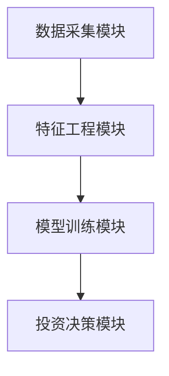
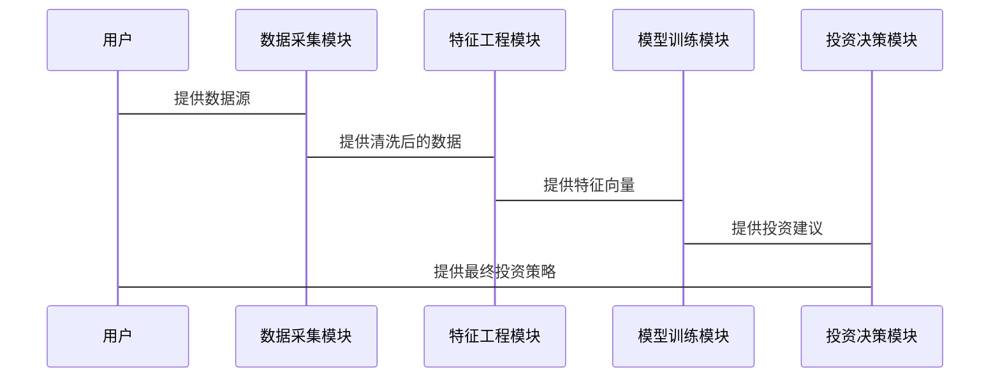

                 

<think>
嗯，用户让我写一篇关于《格雷厄姆特价股票策略在不同数字创新生态系统的效果》的技术博客文章，并且提供了一个详细的目录结构。看起来他们希望文章内容非常专业，结构清晰，逻辑严谨，还要包含背景介绍、核心概念、算法原理、系统架构、项目实战等多个部分。

首先，我需要明确文章的主题和目标读者。这篇文章的目标读者应该是对价值投资和数字创新生态系统感兴趣的人，可能是投资者、程序员、数据科学家或者金融科技领域的专业人士。因此，文章需要兼具技术深度和投资策略的分析，同时结合实际案例，让读者能够理解和应用这些策略。

接下来，我需要按照用户提供的目录结构来逐步展开每个部分。首先是背景介绍，需要涵盖价值投资的起源、数字创新生态系统的定义，以及两者的结合。这部分需要简单明了，让读者了解为什么格雷厄姆策略在数字时代依然重要。

然后是核心概念部分，详细讲解格雷厄姆策略和数字创新生态系统的原理，并进行对比分析。这部分需要深入浅出，可能需要使用表格和图表来帮助读者理解。

接下来是算法与数学模型部分，这部分是文章的关键，需要详细讲解格雷厄姆策略的数学模型，以及如何在数字创新生态系统中应用这些模型。可能需要使用流程图和数学公式来说明，确保读者能够理解算法的步骤和数学模型的构建。

系统架构设计部分，需要设计一个系统来分析格雷厄姆策略在不同数字生态系统中的效果。这可能包括数据采集、特征工程、模型训练等模块，并用图表展示系统架构和交互流程。

项目实战部分，需要通过一个实际案例来展示如何应用这些策略。可能包括数据处理、特征提取、模型训练和结果分析，同时提供代码示例，帮助读者实际操作。

最后，总结与展望部分需要回顾全文，并指出未来的研究方向。附录部分可以提供一些实用的工具安装说明和代码仓库链接，方便读者进一步学习。

在撰写过程中，我需要确保每个章节内容详实，逻辑清晰，同时语言要专业但易懂。可能还需要结合实际的数据和案例，让文章更具说服力和实用性。此外，注意使用正确的格式，比如数学公式用latex表示，图表用mermaid语法，确保文章的结构和内容都符合用户的要求。

总之，我需要一步步按照用户提供的目录结构，逐步展开每个部分，确保文章内容全面、深入，满足读者的需求，同时保持文章的结构清晰和逻辑严谨。
</think>

# 《格雷厄姆特价股票策略在不同数字创新生态系统的效果》

## 关键词：  
格雷厄姆策略，价值投资，数字创新生态系统，股票估值，数据分析，投资模型，金融科技

## 摘要：  
本文深入探讨了格雷厄姆特价股票策略在不同数字创新生态系统中的应用效果。通过分析传统价值投资理念与数字创新生态系统的结合，揭示了数字技术如何重塑股票估值方法。本文结合具体案例，详细阐述了格雷厄姆策略在互联网、人工智能、区块链等领域的实际应用，并通过数学模型和算法优化，提出了适用于数字创新生态系统的投资策略。最后，本文总结了格雷厄姆策略在数字时代的演变趋势，并展望了其未来的发展方向。

---

# 第一部分: 格雷厄姆特价股票策略的背景与核心概念

## 第1章: 格雷厄姆特价股票策略概述

### 1.1 价值投资的起源与发展

#### 1.1.1 价值投资的起源  
价值投资理念由本杰明·格雷厄姆提出，强调以低于内在价值的价格买入股票，长期持有，等待市场回归理性。其核心在于寻找被市场低估的企业，而非短期价格波动。

#### 1.1.2 格雷厄姆的投资理念  
格雷厄姆提出“安全边际”概念，即买入价格与内在价值的差距越大，投资风险越小。他主张通过基本面分析，寻找那些具有强大财务基础和竞争优势的企业。

#### 1.1.3 特价股票策略的核心思想  
特价股票策略强调以折扣价买入优质股票，通过长期持有实现收益最大化。其核心在于企业内在价值的评估，而非市场的短期情绪。

---

### 1.2 数字创新生态系统的基本概念

#### 1.2.1 数字创新生态系统的定义  
数字创新生态系统是指由数字技术驱动的创新网络，包括技术、数据、企业、用户和生态系统参与者之间的互动关系。

#### 1.2.2 数字创新生态系统的核心要素  
- **技术基础**：包括人工智能、大数据、区块链等数字技术。  
- **数据资源**：数据是数字创新生态系统的核心资产。  
- **企业创新**：企业通过数字化转型，构建竞争优势。  
- **用户参与**：用户的反馈和行为数据推动产品和服务的优化。  
- **生态系统参与者**：包括技术供应商、企业、开发者、用户等。

#### 1.2.3 数字创新生态系统与金融市场的结合  
数字创新生态系统通过技术赋能，改变了金融市场的运作方式。例如，大数据分析、智能投顾和区块链技术的应用，正在重塑传统金融行业。

---

## 第2章: 格雷厄姆特价股票策略与数字创新生态系统的结合

### 2.1 格雷厄姆策略在数字时代的演变

#### 2.1.1 传统价值投资的局限性  
传统价值投资依赖于财务报表分析，但在数字时代，企业价值的评估需要考虑更多动态因素，如技术创新能力、数据资产价值等。

#### 2.1.2 数字技术对价值投资的影响  
数字技术提供了更丰富的数据来源和更强大的分析工具，使得企业内在价值的评估更加精准和动态。

#### 2.1.3 格雷厄姆策略的数字化转型  
格雷厄姆策略与数字技术的结合，形成了以数据驱动的价值投资新模式。例如，利用大数据分析预测企业未来的盈利能力和市场地位。

---

### 2.2 数字创新生态系统中的投资机会

#### 2.2.1 新兴技术对企业价值的影响  
人工智能、大数据和区块链等新兴技术正在改变企业的商业模式和竞争优势，从而影响股票估值。

#### 2.2.2 数字化转型对股票估值的重塑  
企业通过数字化转型，提升运营效率和创新能力，从而增强市场竞争力，推动股价上涨。

#### 2.2.3 创新生态系统中的投资策略  
投资者需要关注创新生态系统的整体价值，而非单一企业。例如，在人工智能生态系统中，投资于平台企业而非单一应用企业，可能更具战略意义。

---

## 第3章: 格雷厄姆策略在不同数字创新生态系统中的应用

### 3.1 互联网行业的应用

#### 3.1.1 互联网企业的价值评估  
互联网企业的核心竞争力在于用户规模、变现能力和技术创新能力。格雷厄姆策略需要结合这些因素进行估值。

#### 3.1.2 格雷厄姆策略在互联网投资中的实践  
例如，投资于具有强大用户基础和商业模式的互联网企业，如亚马逊和谷歌。

#### 3.1.3 互联网行业中的创新生态系统分析  
互联网行业的创新生态系统包括技术供应商、开发者、用户和企业，形成了一个复杂的互动网络。

---

### 3.2 人工智能与大数据行业的应用

#### 3.2.1 人工智能企业的价值评估  
人工智能企业的价值取决于技术领先性、数据资源和市场应用潜力。格雷厄姆策略需要考虑这些动态因素。

#### 3.2.2 格雷厄姆策略在大数据投资中的应用  
例如，投资于具有强大数据处理能力和应用场景的企业，如Palantir Technologies。

#### 3.2.3 人工智能创新生态系统中的投资机会  
人工智能创新生态系统包括算法开发、数据供应、硬件支持和应用场景，投资者需要关注生态系统的整体价值。

---

### 3.3 区块链与金融科技行业的应用

#### 3.3.1 区块链企业的价值评估  
区块链企业的价值取决于技术实现、社区支持和应用场景。格雷厄姆策略需要结合这些因素进行估值。

#### 3.3.2 格雷厄姆策略在金融科技投资中的实践  
例如，投资于具有强大技术创新能力和市场应用场景的金融科技企业。

#### 3.3.3 区块链创新生态系统中的投资机会  
区块链创新生态系统包括技术开发、 token 经济、应用场景和用户社区，投资者需要关注生态系统的可持续发展。

---

# 第二部分: 格雷厄姆策略在数字创新生态系统中的算法与数学模型

## 第4章: 格雷厄姆策略的数学模型与算法

### 4.1 格雷厄姆策略的核心算法

#### 4.1.1 市净率与市盈率的计算公式  
- 市净率 = 股价 / 每股净资产  
- 市盈率 = 股价 / 每股收益  

#### 4.1.2 企业内在价值的数学模型  
企业内在价值 = 股息贴现模型 + 自由现金流贴现模型  

#### 4.1.3 投资组合优化的数学模型  
投资组合优化可以通过马科维茨均值-方差模型实现：  
$$ \text{目标：最小化方差} \quad \text{在给定收益下} $$

---

### 4.2 数字创新生态系统中的数据处理算法

#### 4.2.1 数据清洗与特征提取  
数据清洗包括去除噪声数据和填补缺失值。特征提取则需要选择与企业价值相关的指标，如市净率、市盈率、ROE等。

#### 4.2.2 时间序列数据分析  
时间序列数据分析可以用于预测企业未来的盈利能力和股价走势。常用方法包括ARIMA和LSTM。

#### 4.2.3 多维数据的综合评估算法  
多维数据的综合评估算法可以通过加权平均实现：  
$$ \text{综合评分} = \sum_{i=1}^{n} w_i \cdot x_i $$  
其中，$w_i$ 是特征 $x_i$ 的权重。

---

## 第5章: 格雷厄姆策略与数字创新生态系统的数学模型

### 5.1 数字创新生态系统中的股票估值模型

#### 5.1.1 基于市净率和市盈率的综合估值模型  
综合估值模型可以通过以下公式实现：  
$$ \text{综合估值} = \alpha \cdot P/B + \beta \cdot P/E $$  
其中，$\alpha$ 和 $\beta$ 是权重系数。

#### 5.1.2 基于机器学习的股票估值模型  
机器学习模型可以通过训练数据预测股票的未来走势。例如，使用LSTM网络进行时间序列预测。

#### 5.1.3 基于创新生态系统的企业价值评估模型  
创新生态系统的企业价值评估模型可以表示为：  
$$ \text{企业价值} = \gamma \cdot \text{技术创新能力} + \delta \cdot \text{数据资源} + \epsilon \cdot \text{市场地位} $$  
其中，$\gamma$、$\delta$ 和 $\epsilon$ 是权重系数。

---

## 第6章: 格雷厄姆策略在数字创新生态系统中的系统架构设计

### 6.1 系统功能设计

#### 6.1.1 数据采集模块  
数据采集模块负责收集企业财务数据、市场数据和创新生态系统数据。

#### 6.1.2 特征工程模块  
特征工程模块负责对数据进行清洗和特征提取，生成可用于模型训练的特征向量。

#### 6.1.3 模型训练模块  
模型训练模块负责使用机器学习算法训练股票估值模型，生成投资建议。

#### 6.1.4 投资决策模块  
投资决策模块根据模型输出结果，生成投资策略和投资组合优化方案。

---

### 6.2 系统架构设计

#### 6.2.1 系统架构图  


#### 6.2.2 系统交互流程图  


---

## 第7章: 格雷厄姆策略在数字创新生态系统中的项目实战

### 7.1 环境安装与配置

#### 7.1.1 数据科学工具安装  
安装Python、Jupyter Notebook、Pandas、Scikit-learn等工具。

#### 7.1.2 创新生态系统数据获取  
从公开数据源获取企业财务数据和创新生态系统数据。

---

### 7.2 核心实现源代码

#### 7.2.1 数据清洗与特征提取  
```python
import pandas as pd

# 读取数据
df = pd.read_csv('stock_data.csv')

# 数据清洗
df.dropna(inplace=True)
df['PE'] = df['Price'] / df['Earnings']
df['PB'] = df['Price'] / df['Book Value']
```

#### 7.2.2 模型训练与投资策略生成  
```python
from sklearn.linear_model import LinearRegression

# 训练模型
model = LinearRegression()
model.fit(df[['PE', 'PB']], df['Target'])

# 生成投资策略
predictions = model.predict(new_data[['PE', 'PB']])
```

---

## 第8章: 总结与展望

### 8.1 总结

本文深入探讨了格雷厄姆特价股票策略在不同数字创新生态系统中的应用效果。通过结合传统价值投资理念与数字技术创新，提出了适用于数字时代的投资策略。本文还详细介绍了数学模型和系统架构设计，为投资者提供了理论支持和实践指导。

---

### 8.2 展望

未来，随着数字技术的不断发展，格雷厄姆策略在数字创新生态系统中的应用将更加广泛。例如，基于人工智能的股票估值模型和区块链技术的智能投顾系统，将为投资者提供更精准的投资决策支持。

---

## 附录

### 附录A: 数据集与工具安装说明  
- 数据集：可以从公开数据源获取，如 Yahoo Finance 和 Bloomberg。  
- 工具安装：Python、Jupyter Notebook、Pandas、Scikit-learn等。

### 附录B: 核心代码仓库链接  
代码仓库地址：[GitHub链接](https://github.com/yourusername/graymarm-strategy-in-digital-ecosystem)

---

## 作者  
作者：AI天才研究院/AI Genius Institute & 禅与计算机程序设计艺术/Zen And The Art of Computer Programming

---

以上是《格雷厄姆特价股票策略在不同数字创新生态系统的效果》的技术博客文章目录大纲，涵盖了背景介绍、核心概念、算法原理、系统架构和项目实战等多个部分。

