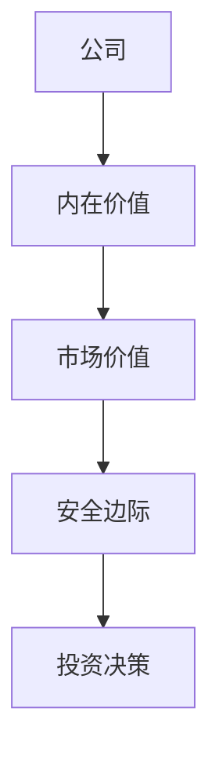
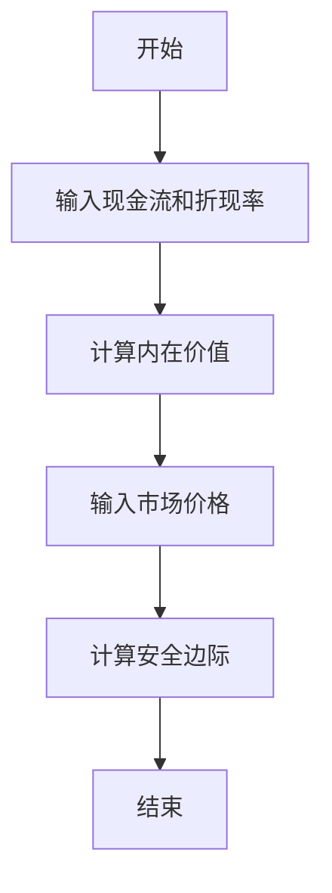
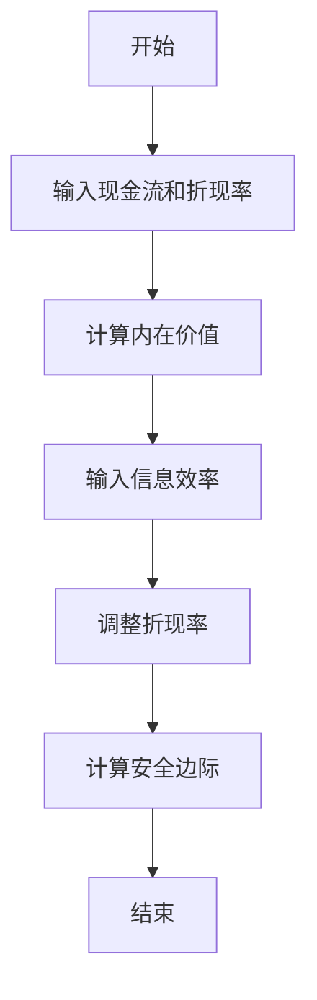
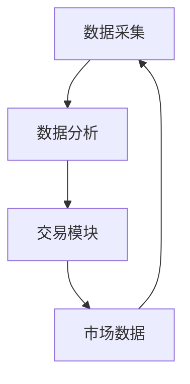

                 


# 格雷厄姆特价股票策略在不同数字市场信息效率下的表现

## 关键词：格雷厄姆策略, 数字市场, 信息效率, 价值投资, 安全边际

## 摘要：本文探讨了格雷厄姆特价股票策略在不同数字市场信息效率下的表现。通过分析信息效率对策略的影响，结合算法和系统架构设计，提出优化策略的方法，并通过实际案例验证其有效性。

---

# 第1章: 格雷厄姆特价股票策略概述

## 1.1 格雷厄姆投资理论的核心概念

### 1.1.1 价值投资的定义与核心原则

价值投资是一种长期投资策略，主要关注于购买那些市场价格低于其内在价值的股票。核心原则包括：

- **安全性**：投资于那些具有安全边际的股票，即市场价格远低于其内在价值。
- **长期视角**：关注企业的长期盈利能力，而非短期市场波动。
- **深入分析**：通过基本面分析，评估企业的财务状况和未来前景。

### 1.1.2 格雷厄姆的安全边际概念

安全边际是指市场价格与内在价值之间的差距。通过购买那些市场价格远低于内在价值的股票，投资者能够在市场波动中获得保护，降低投资风险。

### 1.1.3 特价股票的定义与识别标准

特价股票是指那些市场价格远低于其内在价值的股票。识别标准包括：

- **低市盈率（P/E）**：市盈率远低于行业平均水平。
- **低市净率（P/B）**：市净率远低于行业平均水平。
- **高股息率**：股息收益率远高于行业平均水平。

## 1.2 数字市场信息效率的定义与层次

### 1.2.1 信息效率的基本概念

信息效率指的是信息在市场中的传播和处理速度。高效的信息效率意味着市场能够快速反映所有相关信息，低效的信息效率则意味着市场反应较慢。

### 1.2.2 数字市场的信息传播特点

数字市场中，信息传播速度快、范围广。投资者可以通过各种渠道（如新闻、社交媒体、交易平台）快速获取信息，从而影响市场价格。

### 1.2.3 信息效率的衡量标准

信息效率可以通过以下指标衡量：

- **信息传播速度**：信息从生成到市场反应的时间。
- **信息覆盖范围**：信息在多大范围内被传播。
- **市场反应速度**：市场对信息的反应速度和程度。

## 1.3 格雷厄姆策略与数字市场信息效率的关联

### 1.3.1 信息效率对格雷厄姆策略的影响

信息效率高的市场中，格雷厄姆策略的有效性可能会受到挑战，因为市场能够更快地反映信息，导致安全边际减少。而在信息效率低的市场中，格雷厄姆策略可能表现更好，因为投资者可以利用信息滞后带来的机会。

### 1.3.2 数字市场环境下信息效率的变化

数字技术的发展使得信息传播速度更快，但同时也可能导致信息过载。投资者需要在大量信息中筛选出有价值的信息，这可能影响格雷厄姆策略的应用效果。

### 1.3.3 格雷厄姆策略在不同信息效率环境下的适用性

在高信息效率环境下，格雷厄姆策略需要更加谨慎，可能需要调整安全边际的计算方法。在低信息效率环境下，格雷厄姆策略可以保持原有方法，但需要更长时间观察市场反应。

## 1.4 本章小结

本章介绍了格雷厄姆投资策略的核心概念和数字市场信息效率的基本定义。通过分析信息效率对格雷厄姆策略的影响，提出了在不同信息效率环境下策略的应用建议。

---

# 第2章: 格雷厄姆策略的核心概念与联系

## 2.1 格雷厄姆策略的核心原理

### 2.1.1 内在价值的计算方法

内在价值是通过对企业未来现金流的折现计算得出的。公式如下：

$$
\text{内在价值} = \sum_{t=1}^{n} \frac{\text{现金流}_t}{(1 + r)^t}
$$

其中，$r$ 是折现率，$t$ 是时间。

### 2.1.2 市场价值与内在价值的对比

市场价值是股票的当前市场价格，而内在价值是基于企业基本面计算出的理论价值。两者的差异反映了市场的效率。

### 2.1.3 安全边际的数学模型

安全边际可以通过以下公式计算：

$$
\text{安全边际} = \text{内在价值} - \text{市场价格}
$$

### 2.1.4 核心概念的属性特征对比

以下表格对比了内在价值和市场价值的属性特征：

| 特性         | 内在价值                 | 市场价值                 |
|--------------|--------------------------|--------------------------|
| 计算方式       | 基于企业基本面             | 市场供求关系决定           |
| 反映因素       | 企业未来现金流             | 市场情绪和预期             |
| 变化频率       | 较慢，基于企业长期表现       | 较快，受短期因素影响         |

### 2.1.5 ER实体关系图

以下是一个简单的ER图，展示了格雷厄姆策略中的核心概念关系：



## 2.2 核心概念的联系

### 2.2.1 内在价值与市场价值的对比

通过对比内在价值和市场价值，可以发现市场效率对投资策略的影响。在高效市场中，市场价值更接近内在价值；在低效市场中，市场价值可能偏离内在价值。

### 2.2.2 格雷厄姆策略与其他投资策略的对比

以下表格对比了格雷厄姆策略与其他投资策略的核心差异：

| 策略         | 格雷厄姆策略             | 技术分析策略             | 成长投资策略             |
|--------------|--------------------------|--------------------------|--------------------------|
| 核心理念       | 价值投资，寻找低估股票     | 基于价格和成交量的分析     | 投资于成长型公司         |
| 适用市场       | 低效市场                 | 任何市场                 | 高成长市场               |
| 风险承受       | 较低，基于安全边际         | 较高，基于市场波动         | 较高，基于成长不确定性     |

## 2.3 本章小结

本章详细介绍了格雷厄姆策略的核心概念，并通过对比分析，展示了这些概念在不同市场环境下的表现。

---

# 第3章: 格雷厄姆策略的算法实现与优化

## 3.1 算法实现

### 3.1.1 内在价值计算算法

以下是一个计算内在价值的Python算法示例：

```python
def calculate_intrinsic_value(cash_flows, discount_rate):
    intrinsic_value = 0
    for t in range(len(cash_flows)):
        intrinsic_value += cash_flows[t] / (1 + discount_rate) ** t
    return intrinsic_value
```

### 3.1.2 安全边际计算算法

以下是一个计算安全边际的Python算法示例：

```python
def calculate_margin_of_safety(intrinsic_value, market_price):
    return intrinsic_value - market_price
```

### 3.1.3 算法流程图



## 3.2 算法优化

### 3.2.1 根据信息效率调整折现率

在高信息效率环境下，可以适当降低折现率，以反映市场的高效性。公式如下：

$$
\text{调整后的折现率} = \text{原始折现率} \times (1 - \text{信息效率})
$$

### 3.2.2 动态调整安全边际

在低信息效率环境下，可以动态调整安全边际的计算方法，以捕捉更多的投资机会。公式如下：

$$
\text{动态安全边际} = \text{内在价值} \times (1 + \text{信息效率调整系数})
$$

### 3.2.3 算法优化流程图



## 3.3 本章小结

本章通过算法实现和优化，展示了如何根据市场信息效率调整格雷厄姆策略的参数，以提高策略的有效性。

---

# 第4章: 格雷厄姆策略在数字市场中的应用与挑战

## 4.1 数字市场中的信息效率分析

### 4.1.1 高信息效率环境下的策略应用

在高信息效率环境下，市场反应迅速，安全边际较小。投资者需要更加谨慎，可能需要缩短持股时间。

### 4.1.2 低信息效率环境下的策略应用

在低信息效率环境下，市场反应较慢，安全边际较大。投资者可以利用这一点，寻找被市场低估的股票。

### 4.1.3 信息效率变化对策略的影响

信息效率的变化会影响格雷厄姆策略的应用效果。在信息效率提高的情况下，策略的有效性可能会降低。

## 4.2 应用案例分析

### 4.2.1 高信息效率环境下的案例

假设在高信息效率环境下，某公司的内在价值为100，市场价格为90，安全边际为10。由于信息效率高，市场价格可能很快上升到100，安全边际消失，策略失效。

### 4.2.2 低信息效率环境下的案例

假设在低信息效率环境下，某公司的内在价值为100，市场价格为70，安全边际为30。由于信息效率低，市场价格可能在较长时间内保持在70，投资者可以长期持有，最终获得收益。

## 4.3 策略的挑战与解决方案

### 4.3.1 信息效率变化的挑战

信息效率的变化可能导致策略失效，需要不断调整参数。

### 4.3.2 数据处理的挑战

在数字市场中，数据量大，处理复杂，需要高效的数据处理方法。

### 4.3.3 解决方案

- **动态调整参数**：根据信息效率变化，动态调整折现率和安全边际。
- **大数据处理技术**：利用大数据技术，高效处理和分析市场信息。

## 4.4 本章小结

本章分析了格雷厄姆策略在数字市场中的应用与挑战，并提出了相应的解决方案。

---

# 第5章: 格雷厄姆策略的系统架构与实现

## 5.1 系统架构设计

### 5.1.1 系统功能模块

- **数据采集模块**：采集市场数据，包括股票价格、财务数据等。
- **数据分析模块**：计算内在价值和安全边际。
- **交易模块**：根据分析结果，执行交易。

### 5.1.2 系统架构图



## 5.2 系统实现

### 5.2.1 数据采集实现

使用API获取市场数据，例如使用Yahoo Finance API。

```python
import yfinance as yf

def get_market_data(ticker):
    data = yf.download(ticker, start='2020-01-01', end='2023-12-31')
    return data
```

### 5.2.2 数据分析实现

计算内在价值和安全边际。

```python
def calculate_intrinsic_value(ticker):
    data = get_market_data(ticker)
    cash_flows = data['Adj Close']
    discount_rate = 0.1
    intrinsic_value = 0
    for t in range(len(cash_flows)):
        intrinsic_value += cash_flows[t] / (1 + discount_rate) ** t
    return intrinsic_value

def calculate_margin_of_safety(ticker):
    data = get_market_data(ticker)
    intrinsic_value = calculate_intrinsic_value(ticker)
    market_price = data['Adj Close'][-1]
    return intrinsic_value - market_price
```

### 5.2.3 交易模块实现

根据安全边际，执行交易。

```python
def execute_trade(ticker, margin_of_safety):
    if margin_of_safety > 0:
        print(f"买入 {ticker}")
    elif margin_of_safety < 0:
        print(f"卖出 {ticker}")
    else:
        print(f"不动 {ticker}")
```

## 5.3 系统优化

### 5.3.1 高效数据处理

使用并行计算和大数据技术，提高数据处理效率。

### 5.3.2 实时监控

实现实时数据监控，及时调整策略参数。

## 5.4 本章小结

本章详细描述了格雷厄姆策略的系统架构与实现，并提出了优化建议。

---

# 第6章: 格雷厄姆策略的拓展与未来展望

## 6.1 策略的拓展

### 6.1.1 结合其他投资策略

将格雷厄姆策略与其他策略（如技术分析）相结合，提高策略的有效性。

### 6.1.2 应用到其他资产类别

将格雷厄姆策略应用到房地产、债券等其他资产类别。

## 6.2 数字市场的发展

### 6.2.1 人工智能与大数据

人工智能和大数据技术的发展，将为格雷厄姆策略提供更强大的支持。

### 6.2.2 市场信息效率的进一步提升

随着技术的发展，市场信息效率可能进一步提升，这对格雷厄姆策略提出了新的挑战。

## 6.3 未来展望

未来，格雷厄姆策略可能需要不断调整和优化，以适应数字市场的变化。同时，技术的进步将为策略的实施提供更多的可能性。

## 6.4 本章小结

本章展望了格雷厄姆策略的未来发展方向，并提出了拓展建议。

---

# 第7章: 总结与注意事项

## 7.1 总结

格雷厄姆特价股票策略是一种有效的价值投资策略。在数字市场中，信息效率的变化对策略的应用有重要影响。通过动态调整参数和优化系统，可以提高策略的有效性。

## 7.2 注意事项

- **风险控制**：投资有风险，需做好风险管理。
- **持续学习**：市场环境不断变化，需持续学习和调整策略。
- **技术支持**：利用技术手段，提高数据处理和策略实施的效率。

## 7.3 本章小结

本章总结了格雷厄姆策略的应用，并提出了投资中的注意事项。

---

# 作者：AI天才研究院/AI Genius Institute & 禅与计算机程序设计艺术 /Zen And The Art of Computer Programming

