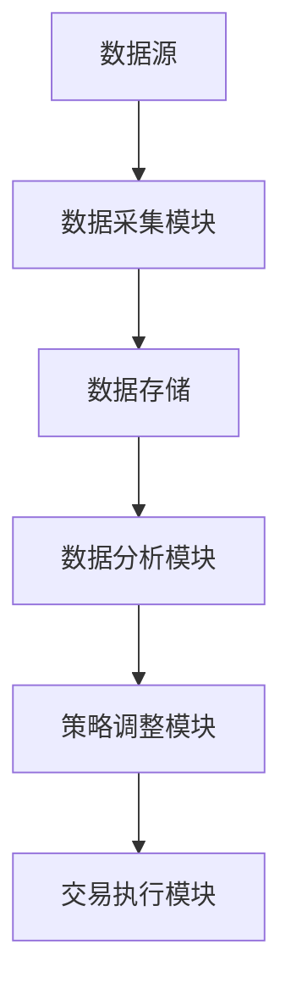
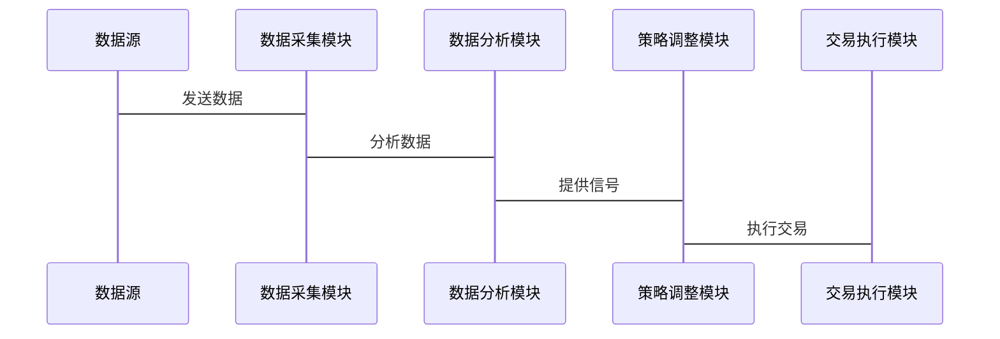

                 


# 格雷厄姆特价股票策略在不同数字市场微观结构演化中的动态调整

> 关键词：格雷厄姆策略，数字市场，微观结构，动态调整，算法交易，价值投资

> 摘要：本文探讨了格雷厄姆的价值投资策略在数字市场中的应用，分析了数字市场微观结构的演化，并提出了动态调整策略的实现方法。通过结合金融理论与现代算法，本文为投资者提供了在复杂市场环境中优化投资决策的实践指南。

---

# 第1章: 格雷厄姆特价股票策略概述

## 1.1 价值投资与格雷厄姆策略

### 1.1.1 价值投资的核心理念
价值投资是一种以低于内在价值的价格购买优质资产的投资策略。其核心在于识别市场低估的股票，并长期持有，等待其价值回归。格雷厄姆是这一策略的奠基人，他强调安全边际和对基本面的深入分析。

### 1.1.2 格雷厄姆策略的基本原则
1. **安全边际**：买入价格应显著低于内在价值，以降低风险。
2. **长期视角**：关注企业的长期盈利能力，而非短期价格波动。
3. **分散投资**：通过投资组合分散风险，避免过度集中。

### 1.1.3 格雷厄姆策略在现代金融市场的适用性
尽管格雷厄姆策略最初针对传统市场设计，但在数字市场中仍具有重要价值，尤其是在市场波动加剧的情况下。

## 1.2 数字市场微观结构基础

### 1.2.1 数字市场的定义与特点
数字市场是指通过电子交易平台进行的金融资产交易市场。其特点是高频交易、算法交易和非对称信息的普遍存在。

### 1.2.2 微观结构的核心要素
1. **订单簿**：记录当前所有未成交订单的结构。
2. **市场参与者**：包括机构投资者、高频交易商和零售投资者。
3. **交易机制**：如限价订单、市价订单和 iceberg orders。

### 1.2.3 数字市场与传统市场的区别
数字市场具有更高的透明度和流动性，同时受到算法交易的影响，市场波动性显著增加。

## 1.3 动态调整策略的重要性

### 1.3.1 策略动态调整的定义
动态调整是指根据市场环境的变化，实时优化投资策略的过程。

### 1.3.2 动态调整的必要性
市场环境的快速变化使得静态策略难以适应，动态调整能够提高策略的有效性和稳定性。

### 1.3.3 动态调整的实现路径
1. **实时数据采集**：获取市场微观结构的实时数据。
2. **模型更新**：根据新数据调整投资模型。
3. **策略优化**：动态调整投资组合。

---

# 第2章: 数字市场微观结构的演化分析

## 2.1 微观结构的演化阶段

### 2.1.1 初级阶段：传统市场数字化
数字技术的引入使传统市场逐渐数字化，提高了交易效率。

### 2.1.2 发展阶段：高频交易的兴起
高频交易的出现使得市场参与者能够以极快速度进行交易，加剧了市场波动。

### 2.1.3 现现阶段：算法交易与智能系统
算法交易和人工智能的结合使得市场微观结构更加复杂，交易策略更加智能化。

## 2.2 微观结构的关键特征

### 2.2.1 市场流动性分析
流动性影响交易成本和市场深度，是微观结构的重要指标。

### 2.2.2 市场深度与广度
市场深度指在给定价格下可交易的数量，广度则指不同价格水平上的订单分布。

### 2.2.3 市场参与者行为模式
不同参与者的行为模式（如机构投资者的长线投资与高频交易商的短线交易）影响市场微观结构。

## 2.3 微观结构演化对策略的影响

### 2.3.1 市场波动性增加
高频交易和算法交易加剧了市场波动，增加了投资风险。

### 2.3.2 交易机会的多样化
市场微观结构的复杂化为投资者提供了更多交易机会，但也增加了策略调整的难度。

### 2.3.3 策略失效的风险
传统策略在市场结构变化中可能失效，需动态调整以适应新环境。

---

# 第3章: 格雷厄姆策略的理论基础

## 3.1 格雷厄姆投资理论的核心要素

### 3.1.1 安全边际的概念
安全边际是买入价格与内在价值之间的差距，确保投资的安全性。

### 3.1.2 内在价值的计算
内在价值是企业未来现金流的现值，是价值投资的核心。

### 3.1.3 股票市场的周期性
格雷厄姆认为市场具有周期性，投资者应避免在市场高点买入。

## 3.2 现代金融理论与格雷厄姆策略的结合

### 3.2.1 CAPM模型与价值投资
CAPM模型用于评估资产的预期收益，与价值投资中的内在价值计算相辅相成。

### 3.2.2 风险溢价与安全边际
风险溢价影响资产的预期收益，安全边际提供了风险补偿。

### 3.2.3 现代投资组合理论与价值投资
通过分散投资降低风险，符合现代投资组合理论的核心思想。

## 3.3 数字市场环境下的策略调整

### 3.3.1 现代市场环境对格雷厄姆策略的影响
数字市场中的高频交易和算法交易要求投资者更灵活地调整策略。

### 3.3.2 技术分析与基本面分析的结合
结合技术分析和基本面分析，能够更全面地评估投资机会。

### 3.3.3 算法交易对传统策略的挑战
算法交易的快速发展要求传统策略不断优化，以应对新的市场环境。

---

# 第4章: 格雷厄姆策略的动态调整算法

## 4.1 动态调整的核心算法

### 4.1.1 基于市场微观结构的信号检测
通过分析订单簿和交易数据，识别市场趋势的变化。

### 4.1.2 基于机器学习的策略优化
使用机器学习模型预测市场变化，并动态调整投资策略。

### 4.1.3 基于时间序列分析的动态调整
利用时间序列分析预测市场走势，并实时调整投资组合。

## 4.2 算法实现步骤

### 4.2.1 数据收集与预处理
收集市场数据并进行清洗，提取有用的特征。

### 4.2.2 模型训练与参数优化
训练机器学习模型，并调整参数以优化性能。

### 4.2.3 策略执行与反馈机制
根据模型预测结果执行交易，并根据反馈优化策略。

## 4.3 算法实现的数学模型

### 4.3.1 时间序列模型（ARIMA）
ARIMA模型用于预测未来的价格走势。

### 4.3.2 机器学习模型（随机森林）
随机森林用于分类和回归，帮助识别市场信号。

### 4.3.3 动态调整的数学公式
$$ \text{调整比例} = \alpha \times \text{信号强度} + \beta \times \text{市场情绪} $$

---

# 第5章: 系统分析与架构设计

## 5.1 系统功能设计

### 5.1.1 数据采集模块
负责收集市场数据，包括订单簿和交易数据。

### 5.1.2 数据分析模块
对数据进行分析，识别市场趋势和信号。

### 5.1.3 策略调整模块
根据分析结果动态调整投资策略。

## 5.2 系统架构设计

### 5.2.1 系统架构图


### 5.2.2 系统接口设计
定义接口，确保各模块之间的通信和数据交换。

### 5.2.3 系统交互序列图


---

# 第6章: 项目实战

## 6.1 环境安装
安装必要的工具和库，如Python、Pandas、Scikit-learn和Plotly。

## 6.2 核心实现源代码

### 6.2.1 数据采集
```python
import pandas as pd
from pandas_datareader import DataReader

def get_data(ticker, start, end):
    data = DataReader(ticker, 'yahoo', start, end)
    return data
```

### 6.2.2 策略实现
```python
from sklearn.ensemble import RandomForestClassifier
from sklearn.metrics import accuracy_score

def dynamic_adjustment(data):
    # 特征工程
    features = data[['open', 'high', 'low', 'close', 'volume']]
    labels = data['close'].shift(-1).fillna(method='ffill')
    
    # 模型训练
    model = RandomForestClassifier()
    model.fit(features, labels)
    
    # 预测
    predictions = model.predict(features)
    accuracy = accuracy_score(labels, predictions)
    return accuracy, predictions
```

## 6.3 案例分析与解读
通过具体案例分析，展示如何在实际中应用格雷厄姆策略和动态调整算法。

## 6.4 项目小结
总结项目实现的过程，分析优缺点，并提出改进建议。

---

# 第7章: 总结与展望

## 7.1 核心观点回顾
总结全文的核心观点，强调格雷厄姆策略在数字市场中的重要性。

## 7.2 未来趋势
展望数字市场的发展，分析未来可能的变化和挑战。

## 7.3 最佳实践 tips
给出投资者在实际操作中的建议，如数据源的选择、模型的优化等。

---

# 作者：AI天才研究院 & 禅与计算机程序设计艺术

---

通过本文的详细分析，我们可以看到格雷厄姆策略在数字市场中的应用潜力，以及动态调整算法的重要性。未来，随着市场结构的进一步复杂化，投资者需要更加灵活地调整策略，以应对不断变化的市场环境。

