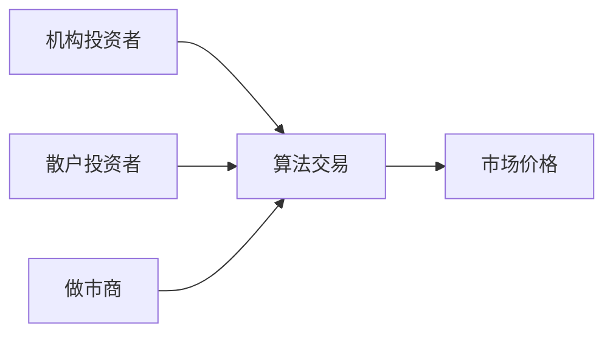

                 


# 格雷厄姆特价股票策略在不同数字市场微观结构自组织中的动态调整

> 关键词：格雷厄姆投资理论，特价股票，数字市场，微观结构，自组织系统，动态调整，价值评估，算法设计，系统架构，项目实战

> 摘要：本文探讨了格雷厄姆价值投资策略在数字市场中的应用，特别是特价股票策略在不同数字市场微观结构自组织中的动态调整。通过分析数字市场的特点和自组织系统的特性，结合格雷厄姆投资理论的核心概念，提出了一种动态调整策略的数学模型，并通过实际案例展示了如何在数字市场中实现这种策略。本文还详细介绍了系统的架构设计和实现方案，为投资者提供了新的视角和方法。

---

# 第一部分: 格雷厄姆特价股票策略与数字市场微观结构概述

## 第1章: 格雷厄姆特价股票策略的背景与核心概念

### 1.1 格雷厄姆投资理论概述

#### 1.1.1 价值投资的起源与发展

价值投资是一种以公司基本面分析为基础的投资策略，起源于20世纪初。本杰明·格雷厄姆是该领域的奠基人之一，他提出的“安全边际”概念和“内在价值”评估方法奠定了价值投资的基础。

- 格雷厄姆认为，股票价格经常偏离其内在价值，这种偏离为理性投资者提供了获利机会。
- 价值投资的核心在于寻找被市场低估的股票，并长期持有，等待其价格回归内在价值。

#### 1.1.2 格雷厄姆投资策略的核心思想

- **安全边际**：通过购买价格低于内在价值的股票，降低投资风险。
- **内在价值**：通过基本面分析计算股票的真实价值。
- **逆向思维**：在市场恐慌时买入，市场狂热时卖出。

#### 1.1.3 特价股票的定义与特征

- **定义**：特价股票是指市场价格低于内在价值的股票。
- **特征**：
  - 低市盈率（P/E）或低市净率（P/B）。
  - 公司基本面良好，具有稳定的盈利能力。
  - 市场关注度低，流动性适中。

### 1.2 数字市场微观结构的基本概念

#### 1.2.1 数字市场的定义与特点

- **定义**：数字市场是指通过电子交易平台进行的金融资产交易市场。
- **特点**：
  - 高频交易：算法交易和自动化交易占据主导。
  - 信息透明：数据量大，信息传播速度快。
  - 自组织特性：市场参与者通过互动形成复杂的网络结构。

#### 1.2.2 微观结构的内涵与外延

- **内涵**：数字市场的微观结构指的是市场参与者的互动方式及其对市场价格和流动性的 影响。
- **外延**：包括订单簿、交易成本、信息传播、市场深度等。

#### 1.2.3 自组织系统的基本原理

- **自组织**：系统在没有外部干预的情况下，通过内部规则形成有序结构。
- **特征**：
  - 分布式决策：市场参与者独立决策。
  - 局部规则：个体行为遵循简单的规则。
  - 全局涌现：局部规则导致全局结构的形成。

### 1.3 格雷厄姆策略与数字市场的结合

#### 1.3.1 格雷厄姆策略在现代市场的适用性

- 格雷厄姆的策略在传统市场中有效，但在数字市场中需要进行调整。
- 数字市场的高频交易和算法交易使得传统策略需要动态调整。

#### 1.3.2 数字市场对传统投资策略的挑战

- 信息过载：数据量大，信息更新快，难以及时处理。
- 短暂窗口：交易机会窗口短暂，需要快速决策。
- 市场深度：高频交易可能导致市场深度变化，影响策略的有效性。

#### 1.3.3 动态调整策略的必要性与目标

- **必要性**：数字市场的动态变化要求投资策略能够实时调整。
- **目标**：通过动态调整策略，捕捉市场中的低估股票，降低投资风险。

---

## 图表：格雷厄姆策略与数字市场的结合


---

## 第2章: 格雷厄姆策略的核心原理

### 2.1 价值评估的基本方法

#### 2.1.1 市盈率与市净率的计算

- **市盈率（P/E）**：股价除以每股收益。
  $$ P/E = \frac{P}{E} $$
- **市净率（P/B）**：股价除以每股净资产。
  $$ P/B = \frac{P}{B} $$

#### 2.1.2 股票内在价值的公式推导

- 内在价值公式：
  $$ V = \frac{E \times (1 + g)}{r - g} $$
  其中，$E$ 是当前收益，$g$ 是增长率，$r$ 是期望回报率。

#### 2.1.3 价值评估中的关键指标

- 市盈率：衡量股价相对于收益的高低。
- 市净率：衡量股价相对于资产的高低。
- 股息率：衡量股票的分红能力。

### 2.2 格雷厄姆安全边际的概念

#### 2.2.1 安全边际的定义与作用

- 安全边际：市场价格与内在价值之间的差额。
  $$ \text{安全边际} = \text{内在价值} - \text{市场价格} $$

#### 2.2.2 安全边际的计算方法

- 通过比较市场价格与内在价值，确定安全边际的大小。

#### 2.2.3 安全边际与投资风险的关系

- 安全边际越大，投资风险越小。
- 安全边际为负时，投资风险增加。

### 2.3 格雷厄姆策略的数学模型

#### 2.3.1 价值评估的数学公式

- 内在价值公式：
  $$ V = \frac{E \times (1 + g)}{r - g} $$

#### 2.3.2 安全边际的数学表达

- 安全边际公式：
  $$ \text{安全边际} = V - P $$

#### 2.3.3 数学模型的实际应用

- 通过计算内在价值和市场价格，确定安全边际，选择具有正安全边际的股票。

---

## 图表：格雷厄姆策略的数学模型


---

## 第3章: 数字市场微观结构的自组织特性

### 3.1 数字市场的参与者与角色

#### 3.1.1 市场参与者的主要类型

- **机构投资者**：通过算法交易进行高频交易。
- **散户投资者**：通过交易平台进行交易。
- **做市商**：提供流动性，撮合交易。

#### 3.1.2 各类参与者的行为特征

- 机构投资者：高频交易，算法驱动。
- 散户投资者：情绪化交易，依赖市场信息。
- 做市商：提供流动性，维护市场秩序。

#### 3.1.3 市场结构的动态变化

- 市场参与者的行为影响市场结构。
- 市场结构的变化影响市场价格和流动性。

### 3.2 微观结构的自组织机制

#### 3.2.1 自组织系统的定义

- 自组织：系统通过内部规则形成有序结构，无需外部干预。

#### 3.2.2 微观结构的自组织特征

- **局部规则**：个体行为遵循简单规则。
- **全局涌现**：局部规则导致全局结构的形成。
- **分布式决策**：个体独立决策，影响全局结构。

#### 3.2.3 自组织与市场效率的关系

- 自组织提高市场效率。
- 自组织可能导致市场波动。

### 3.3 数字市场中的信息传播与价格形成

#### 3.3.1 信息传播的基本原理

- 信息传播速度快，影响范围广。
- 信息不对称影响市场参与者的决策。

#### 3.3.2 价格形成的机制

- 市场供需决定价格。
- 信息影响市场参与者的预期，进而影响价格。

#### 3.3.3 信息不对称对市场的影响

- 信息不对称导致市场失灵。
- 通过技术手段减少信息不对称，提高市场效率。

---

## 图表：数字市场的参与者与角色



---

## 第4章: 格雷厄姆策略在数字市场中的动态调整

### 4.1 动态调整策略的理论基础

#### 4.1.1 动态调整的必要性

- 数字市场的高频交易要求策略能够实时调整。
- 市场环境的变化需要策略能够灵活应对。

#### 4.1.2 动态调整的目标与原则

- **目标**：通过实时调整策略，捕捉市场机会。
- **原则**：根据市场变化，动态调整投资组合。

### 4.2 动态调整策略的数学模型

#### 4.2.1 动态调整的数学公式

- 通过实时计算安全边际，动态调整投资组合。
  $$ \text{动态调整} = f(\text{当前市场价格}, \text{当前内在价值}) $$

#### 4.2.2 动态调整的算法设计

- **算法步骤**：
  1. 计算股票的内在价值。
  2. 计算安全边际。
  3. 根据安全边际调整投资组合。

#### 4.2.3 数学模型的实际应用

- 通过实时数据计算安全边际，动态调整投资组合。

---

## 图表：动态调整策略的数学模型


---

## 第5章: 系统架构设计与实现方案

### 5.1 系统功能设计

#### 5.1.1 系统功能模块

- **数据采集模块**：采集市场数据。
- **价值评估模块**：计算股票的内在价值。
- **动态调整模块**：根据市场变化调整策略。
- **交易执行模块**：执行交易指令。

#### 5.1.2 系统功能流程

1. 数据采集模块采集市场数据。
2. 价值评估模块计算股票的内在价值。
3. 动态调整模块根据市场变化调整策略。
4. 交易执行模块执行交易指令。

---

## 图表：系统功能设计


---

## 第6章: 项目实战与案例分析

### 6.1 项目实战

#### 6.1.1 环境安装

- 安装必要的开发工具和库。
- 配置数据源。

#### 6.1.2 系统核心实现源代码

```python
def calculate_intrinsic_value(e, g, r):
    return e * (1 + g) / (r - g)
```

#### 6.1.3 代码应用解读与分析

- 通过代码计算股票的内在价值。
- 根据计算结果调整投资策略。

#### 6.1.4 实际案例分析

- 选择具体的股票进行分析。
- 根据分析结果调整投资组合。

---

## 图表：系统架构设计


---

## 第7章: 总结与展望

### 7.1 总结

- 本文探讨了格雷厄姆价值投资策略在数字市场中的应用。
- 通过动态调整策略，捕捉市场机会，降低投资风险。

### 7.2 未来展望

- 进一步研究数字市场的自组织特性。
- 开发更高效的算法，提高策略的执行效率。

---

## 作者：AI天才研究院/AI Genius Institute & 禅与计算机程序设计艺术 /Zen And The Art of Computer Programming

