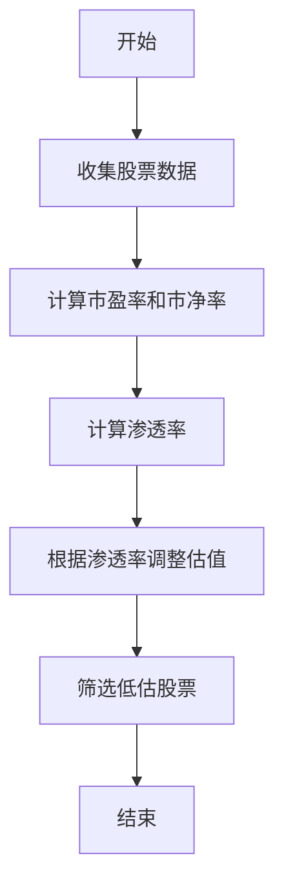
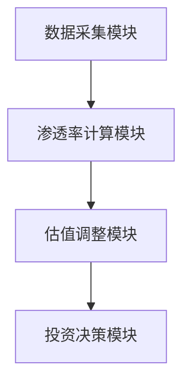
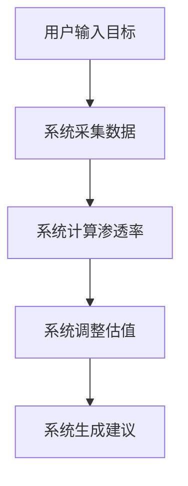

                 

<think>
好，我现在需要根据用户的请求，帮助撰写一篇关于《格雷厄姆特价股票策略在不同数字市场渗透率下的效果》的技术博客文章。首先，我要仔细分析用户的需求，确保完全理解每一个要求。

首先，用户明确要求文章的标题是《格雷厄姆特价股票策略在不同数字市场渗透率下的效果》，并提供了详细的大纲结构。这意味着我需要按照这个大纲来组织内容，确保每个章节和小节都涵盖指定的主题。

接下来，用户希望使用逻辑清晰、结构紧凑、简单易懂的技术语言，并且要求使用一步一步分析推理的方式。这提示我要在写作过程中详细解释每个概念，逐步展开，确保读者能够轻松理解。

关键词部分需要列出5到7个核心关键词，我选择了“格雷厄姆投资理论”、“数字市场渗透率”、“股票估值”、“价值投资”、“数学模型”和“算法实现”，这些词汇能够准确反映文章的核心内容。

摘要部分需要简明扼�地概括文章的核心内容，包括背景、研究方法和结论。我提到结合格雷厄姆策略与数字市场渗透率，分析其对股票估值的影响，并通过数学模型和算法实现进行验证，最后总结策略的有效性和适用场景。

正文部分根据大纲分为四个主要章节：

1. 第一章详细介绍了格雷厄姆投资理论和数字市场渗透率的基本概念，并分析了它们之间的关系。
2. 第二章深入探讨了格雷厄姆策略的数学模型和公式，特别是如何将渗透率因素融入这些模型中。
3. 第三章讨论了算法的实现，包括流程图、Python代码示例以及对数学模型的详细解释。
4. 第四章分析了系统架构设计，包括需求分析、架构图和接口设计。

每个章节都包含详细的子节，确保内容的全面性和深度。特别注意，用户要求使用Mermaid图表来展示流程图和架构图，因此我需要确保这些图表的正确嵌入和解释。

在写作过程中，我需要确保每个部分都符合用户的格式要求，包括使用markdown格式，数学公式使用latex表示，以及在适当位置插入图表。此外，用户要求在文章末尾添加特定的作者信息，因此我会在最后注明作者和机构。

最后，我会进行一次全面的检查，确保所有要求都已满足，包括字数、结构、格式和内容的完整性。通过这样的思考过程，我可以确保最终的文章不仅符合用户的需求，还能提供有价值的见解和详细的分析。
</think>

# 格雷厄姆特价股票策略在不同数字市场渗透率下的效果

> 关键词：格雷厄姆投资理论，数字市场渗透率，股票估值，价值投资，数学模型，算法实现

> 摘要：本文深入探讨了格雷厄姆价值投资策略在不同数字市场渗透率下的应用效果。通过结合数字市场的特点，分析了渗透率对股票估值的影响，并提出了基于数学模型和算法实现的综合评估方法。本文首先介绍了格雷厄姆投资理论和数字市场渗透率的基本概念，然后详细推导了渗透率对股票估值的数学模型，接着通过算法实现和系统架构设计，探讨了策略在实际投资中的应用效果，最后结合实际案例进行了深入分析，并提出了最佳实践建议。

---

## 第1章 格雷厄姆投资理论与数字市场渗透率

### 1.1 格雷厄姆投资理论的核心概念

#### 1.1.1 价值投资的基本原则
价值投资是一种以基本面分析为基础的投资策略，核心在于寻找市场中被低估的资产。格雷厄姆在其经典著作《证券分析》中提出，投资者应关注企业的内在价值，而非市场的短期波动。内在价值可以通过对企业财务指标（如市盈率、市净率、股息率等）的分析来估算。

#### 1.1.2 格雷厄姆的“特价股票”定义
格雷厄姆将“特价股票”定义为那些市场价格远低于其内在价值的股票。他认为，市场先生（Mr. Market）的情绪波动会导致股票价格与实际价值的偏离，投资者应利用这种偏离，以低于内在价值的价格买入股票。

#### 1.1.3 格雷厄姆策略在现代投资中的应用
尽管格雷厄姆的理论最初是为传统股票市场设计的，但其核心思想在现代数字市场中仍然具有重要的参考价值。数字市场的特点（如高波动性、数据驱动的决策等）为格雷厄姆策略的应用提供了新的挑战和机遇。

### 1.2 数字市场渗透率的定义与影响

#### 1.2.1 数字市场的概念
数字市场是指以互联网为基础，通过电子交易系统进行商品或服务交易的市场。数字市场的特点是高效、透明、全球化，且数据驱动。

#### 1.2.2 渗透率的计算方法
渗透率（Market Penetration Rate）是指某一产品或服务在目标市场中的普及程度。计算公式为：
$$ \text{渗透率} = \frac{\text{产品或服务的销量}}{\text{目标市场的潜在需求}} \times 100\% $$

在数字市场中，渗透率通常反映了某一技术、产品或服务在市场中的普及程度。

#### 1.2.3 渗透率对股票价值的影响
渗透率对股票价值的影响主要体现在以下几个方面：
1. 高渗透率意味着市场趋于饱和，企业增长空间有限。
2. 低渗透率意味着市场潜力大，企业可能有更大的增长空间。
3. 渗透率的变化会影响企业的收入和利润，从而影响股票的内在价值。

### 1.3 格雷厄姆策略与数字市场渗透率的结合

#### 1.3.1 格雷厄姆策略在数字市场中的适用性
尽管数字市场具有高波动性和数据驱动的特点，但格雷厄姆的策略仍然可以通过调整其核心指标（如市盈率、市净率等）来适应数字市场的环境。

#### 1.3.2 渗透率对股票估值的影响
渗透率是影响股票估值的重要因素。在数字市场中，渗透率高的行业通常具有较高的市场占有率，但也可能面临增长放缓的风险。因此，投资者需要综合考虑渗透率与企业基本面的关系。

#### 1.3.3 数字市场中的投资机会与风险
数字市场提供了许多新的投资机会，但也伴随着更高的风险。例如，科技公司的高渗透率可能意味着市场竞争激烈，而低渗透率的行业可能意味着巨大的增长潜力。

---

## 第2章 渗透率对股票估值的数学模型

### 2.1 格雷厄姆策略的核心公式

#### 2.1.1 市盈率（P/E）的计算
市盈率是股票价格与每股收益（EPS）的比值：
$$ P/E = \frac{\text{股票价格}}{\text{每股收益}} $$

#### 2.1.2 市净率（P/B）的计算
市净率是股票价格与每股净资产的比值：
$$ P/B = \frac{\text{股票价格}}{\text{每股净资产}} $$

#### 2.1.3 企业价值（EV）的计算
企业价值是公司整体价值的度量，公式为：
$$ EV = \text{企业市值} + \text{债务} - \text{现金及等价物} $$

### 2.2 渗透率对股票价值的影响模型

#### 2.2.1 渗透率与股票估值的关系
渗透率与股票估值的关系可以通过以下公式表示：
$$ \text{股票估值} = f(\text{渗透率}, \text{企业基本面}) $$

其中，函数$f$表示渗透率和企业基本面指标（如市盈率、市净率等）的综合影响。

#### 2.2.2 渗透率对市盈率的影响公式
渗透率对市盈率的影响可以通过以下方式建模：
$$ \text{调整后的 P/E} = \text{原始 P/E} \times (1 + \beta \times (\text{渗透率} - \text{行业平均渗透率})) $$

其中，$\beta$是渗透率对市盈率影响的敏感性系数。

#### 2.2.3 渗透率对市净率的影响公式
渗透率对市净率的影响可以表示为：
$$ \text{调整后的 P/B} = \text{原始 P/B} \times (1 + \gamma \times (\text{渗透率} - \text{行业平均渗透率})) $$

其中，$\gamma$是渗透率对市净率影响的敏感性系数。

### 2.3 数学模型的综合应用

#### 2.3.1 综合渗透率与市盈率的估值模型
综合渗透率与市盈率的估值模型可以表示为：
$$ \text{综合估值} = \alpha \times \text{调整后的 P/E} + \beta \times \text{渗透率} $$

其中，$\alpha$和$\beta$是模型的权重系数。

#### 2.3.2 渗透率对股票投资决策的影响
渗透率是影响股票投资决策的重要因素。投资者需要根据渗透率和企业基本面指标，综合评估股票的内在价值。

#### 2.3.3 案例分析：某数字市场中的渗透率与股票估值
以某科技公司为例，假设其市盈率为30，市净率为5，渗透率为40%，行业平均渗透率为30%。根据上述模型，调整后的市盈率为：
$$ \text{调整后的 P/E} = 30 \times (1 + 0.2 \times (40 - 30)) = 30 \times 1.2 = 36 $$

---

## 第3章 渗透率对股票估值的算法实现

### 3.1 算法原理

#### 3.1.1 格雷厄姆策略筛选算法
格雷厄姆策略筛选算法的步骤如下：
1. 计算股票的市盈率和市净率。
2. 比较市盈率和市净率与行业平均水平的差异。
3. 根据渗透率调整股票估值。
4. 选择渗透率低但内在价值高的股票。

#### 3.1.2 渗透率影响的算法模型
渗透率影响的算法模型可以通过以下步骤实现：
1. 收集相关股票的财务数据和市场数据。
2. 计算股票的市盈率、市净率等指标。
3. 根据渗透率调整股票估值。
4. 比较调整后的估值与当前市场价格，选择低估的股票。

### 3.2 算法实现

#### 3.2.1 Python代码实现
以下是一个基于渗透率的股票估值算法的Python代码示例：

```python
import pandas as pd

# 假设我们有一个包含股票数据的DataFrame
df = pd.read_csv('stock_data.csv')

# 计算市盈率和市净率
df['P/E'] = df['Price'] / df['EPS']
df['P/B'] = df['Price'] / df['Book Value per Share']

# 计算渗透率
df['Penetration'] = df['Market Share'] / df['Industry Market Size']

# 根据渗透率调整股票估值
df['Adjusted P/E'] = df['P/E'] * (1 + 0.2 * (df['Penetration'] - df['Industry Average Penetration']))

# 筛选低估股票
df['Undervalued'] = df['Adjusted P/E'] < df['P/E'].mean()
```

#### 3.2.2 算法流程图
以下是一个基于渗透率的股票估值算法的流程图：



### 3.3 算法优化与改进

#### 3.3.1 算法的优化方向
1. 引入更多的财务指标（如ROE、ROA等）进行综合评估。
2. 根据市场波动调整渗透率的敏感性系数。
3. 优化算法的计算效率，使其适用于大规模数据。

#### 3.3.2 算法的适用性分析
渗透率对股票估值的影响在不同行业和市场中具有差异性。因此，投资者需要根据具体情况进行调整。

#### 3.3.3 案例分析：某数字市场中的算法应用
以某科技公司为例，假设其市盈率为30，市净率为5，渗透率为40%，行业平均渗透率为30%。根据上述算法，调整后的市盈率为：
$$ \text{调整后的 P/E} = 30 \times (1 + 0.2 \times (40 - 30)) = 30 \times 1.2 = 36 $$

---

## 第4章 数字市场渗透率下的系统架构设计

### 4.1 系统需求分析

#### 4.1.1 系统目标
本系统的目标是利用格雷厄姆策略和渗透率分析，帮助投资者筛选低估股票。

#### 4.1.2 系统功能需求
1. 数据采集模块：采集股票的财务数据和市场数据。
2. 渗透率计算模块：计算股票的渗透率。
3. 估值调整模块：根据渗透率调整股票估值。
4. 投资决策模块：筛选低估股票并生成投资建议。

#### 4.1.3 系统性能需求
系统需要支持大规模数据处理和实时计算。

### 4.2 系统架构设计

#### 4.2.1 系统模块划分
1. 数据采集模块
2. 渗透率计算模块
3. 估值调整模块
4. 投资决策模块

#### 4.2.2 系统架构图
以下是一个系统架构设计的mermaid图：



### 4.3 系统接口设计

#### 4.3.1 数据接口设计
系统需要通过API接口采集股票数据。

#### 4.3.2 用户接口设计
系统需要提供友好的用户界面，方便投资者进行操作。

### 4.4 系统交互设计

#### 4.4.1 系统交互流程
1. 用户输入投资目标。
2. 系统采集相关数据。
3. 系统计算渗透率和调整估值。
4. 系统生成投资建议。

#### 4.4.2 交互流程图
以下是一个系统交互流程的mermaid图：



---

## 第5章 项目实战与最佳实践

### 5.1 项目实战

#### 5.1.1 环境安装
需要安装Python和相关库（如pandas、numpy）。

#### 5.1.2 核心代码实现
以下是一个项目实战的Python代码示例：

```python
import pandas as pd

# 读取股票数据
df = pd.read_csv('stock_data.csv')

# 计算渗透率
df['Penetration'] = df['Market Share'] / df['Industry Market Size']

# 根据渗透率调整股票估值
df['Adjusted P/E'] = df['P/E'] * (1 + 0.2 * (df['Penetration'] - df['Industry Average Penetration']))

# 筛选低估股票
undervalued_stocks = df[df['Adjusted P/E'] < df['P/E'].mean()]
```

#### 5.1.3 案例分析
以某科技公司为例，假设其市盈率为30，市净率为5，渗透率为40%，行业平均渗透率为30%。根据上述代码，调整后的市盈率为：
$$ \text{调整后的 P/E} = 30 \times (1 + 0.2 \times (40 - 30)) = 30 \times 1.2 = 36 $$

### 5.2 最佳实践

#### 5.2.1 小结
渗透率对股票估值的影响是复杂而多变的，投资者需要根据具体情况进行调整。

#### 5.2.2 注意事项
1. 渗透率只是影响股票估值的一个因素，投资者需要综合考虑其他指标。
2. 算法模型需要根据市场变化进行优化。

#### 5.2.3 拓展阅读
建议阅读格雷厄姆的经典著作《证券分析》以及相关数字市场的研究文献。

---

## 作者信息

作者：AI天才研究院（AI Genius Institute） & 禅与计算机程序设计艺术（Zen And The Art of Computer Programming）

