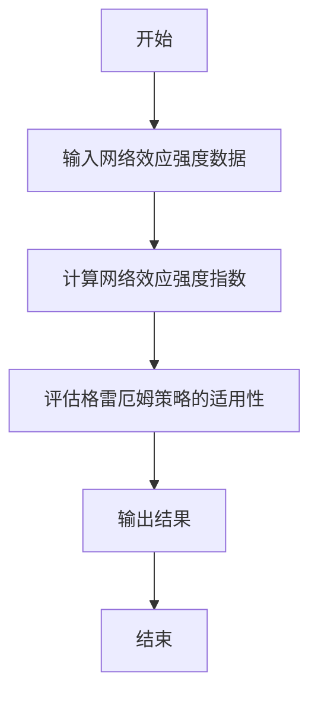
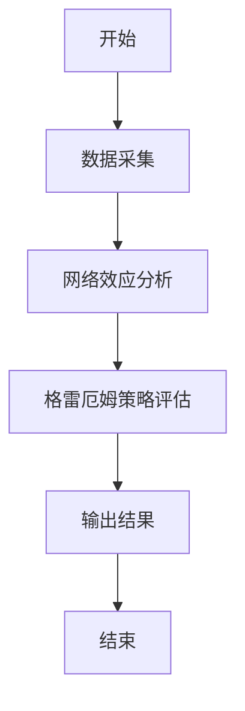
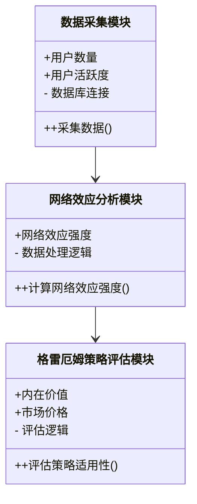

                 


# 格雷厄姆特价股票策略在不同数字市场网络效应强度下的效果

> 关键词：格雷厄姆特价股票策略、网络效应强度、数字市场、投资策略、市场分析

> 摘要：本文探讨了格雷厄姆特价股票策略在不同数字市场网络效应强度下的效果，分析了网络效应如何影响策略的有效性，并提出了相应的投资建议。

---

## 第1章: 格雷厄姆特价股票策略概述

### 1.1 格雷厄姆投资理论的核心概念

#### 1.1.1 价值投资的基本原理

价值投资是一种以内在价值为导向的投资策略，核心在于寻找市场价格低于其内在价值的证券。格雷厄姆在其经典著作《证券分析》中提出，投资者应关注企业的基本面，如盈利能力、财务状况和管理团队等，以识别被市场低估的投资标的。

#### 1.1.2 特价股票的定义与特征

特价股票是指市场价格低于其内在价值的股票。这类股票通常具有以下特征：
- 市场流动性较低，交易不活跃。
- 市场参与者对公司的未来前景持悲观态度。
- 公司财务状况稳健，具备一定的安全边际。

#### 1.1.3 格雷厄姆策略在现代投资中的应用

尽管格雷厄姆的投资理论最初是为传统股票市场设计的，但其核心思想在现代数字市场中仍具有重要的指导意义。数字市场的高波动性和网络效应的普遍存在，使得格雷厄姆策略的应用更加复杂，但也提供了新的机会。

---

### 1.2 网络效应的定义与分类

#### 1.2.1 网络效应的基本概念

网络效应是指一种产品的价值随着用户数量的增加而增加的现象。例如，社交媒体平台的用户越多，每个用户的使用价值越高，因为用户可以与更多人建立联系。

#### 1.2.2 网络效应的类型：直接网络效应、间接网络效应

- **直接网络效应**：用户数量的增加直接提升了产品的使用价值。例如，即时通讯工具的用户越多，用户之间的互动越频繁，产品价值越高。
- **间接网络效应**：用户数量的增加间接提升了产品的价值。例如，电商平台的用户越多，商家可以以更低的价格采购商品，从而降低消费者的购买成本。

#### 1.2.3 数字市场中的网络效应强度

数字市场的网络效应强度受到多种因素的影响，包括市场规模、用户活跃度、平台规则等。例如，某些数字平台通过数据驱动的推荐算法，能够显著增强网络效应，从而提高用户粘性和市场影响力。

---

## 第2章: 数字市场的网络效应强度分析

### 2.1 数字市场的特点与发展趋势

#### 2.1.1 数字市场的定义与范围

数字市场是指通过互联网技术和数字化工具进行交易的市场。与传统市场相比，数字市场具有以下特点：
- 交易效率高。
- 市场覆盖范围广。
- 数据驱动的决策支持。

#### 2.1.2 数字市场的增长驱动力

数字市场的增长主要由以下因素驱动：
- 技术进步：互联网和大数据技术的应用提升了市场的效率和精准度。
- 消费者需求变化：消费者对个性化、便捷化服务的需求增加。
- 企业数字化转型：企业通过数字化手段优化业务流程，提升竞争力。

#### 2.1.3 数字市场中的网络效应表现

在数字市场中，网络效应的表现尤为明显。例如，社交电商平台通过用户生成内容（UGC）和社交分享功能，增强了用户之间的互动，从而提升了平台的整体价值。

---

### 2.2 网络效应强度的衡量指标

#### 2.2.1 网络效应强度的定义

网络效应强度是指网络效应对市场价值的影响程度。强度越高，市场对网络效应的依赖性越强。

#### 2.2.2 网络效应强度的量化方法

网络效应强度可以通过以下指标进行量化：
- 用户增长率：用户数量的增加速度。
- 用户活跃度：用户在平台上的活跃程度。
- 用户留存率：用户持续使用平台的概率。

#### 2.2.3 不同数字市场的网络效应强度对比

以社交平台和电商平台为例，社交平台的网络效应强度通常高于电商平台，因为社交平台的用户互动性更强，用户粘性更高。

---

## 第3章: 网络效应的数学模型

### 3.1 网络外部性的数学表达

#### 3.1.1 网络外部性的基本公式

网络外部性可以用以下公式表示：
$$ V = v_0 + \beta \cdot n $$
其中：
- \( V \) 是产品的总价值。
- \( v_0 \) 是产品的基础价值。
- \( \beta \) 是网络效应的系数。
- \( n \) 是用户数量。

#### 3.1.2 网络效应强度的数学模型

网络效应强度可以用以下公式表示：
$$ I = \frac{dV}{dn} $$
其中：
- \( I \) 是网络效应强度。
- \( dV \) 是产品价值的变化量。
- \( dn \) 是用户数量的变化量。

#### 3.1.3 数学模型的变量定义与假设

- 假设1：用户数量 \( n \) 增加1%，产品价值 \( V \) 增加 \( \beta \cdot 0.01 \)。
- 假设2：网络效应强度 \( I \) 随市场发展阶段的变化而变化。

---

### 3.2 格雷厄姆策略的数学模型

#### 3.2.1 特价股票的定价模型

格雷厄姆策略的定价模型可以用以下公式表示：
$$ P = \frac{E \cdot (1 + g)}{k} $$
其中：
- \( P \) 是股票的内在价值。
- \( E \) 是企业的盈利指标（如息税前利润）。
- \( g \) 是预期增长率。
- \( k \) 是折现率。

#### 3.2.2 市场网络效应对股票价格的影响公式

网络效应强度对股票价格的影响可以用以下公式表示：
$$ P_{\text{new}} = P \cdot (1 + I \cdot t) $$
其中：
- \( P_{\text{new}} \) 是考虑网络效应后的股票价格。
- \( I \) 是网络效应强度。
- \( t \) 是时间因素。

#### 3.2.3 综合模型的构建与验证

综合模型将格雷厄姆策略与网络效应强度结合起来，可以更好地评估股票的投资价值。通过实证分析和数据验证，我们可以验证模型的准确性和适用性。

---

## 第4章: 网络效应强度对格雷厄姆策略的影响算法

### 4.1 算法原理

#### 4.1.1 网络效应强度的计算步骤

1. 收集相关数据，包括用户数量、用户活跃度等。
2. 计算网络效应强度 \( I \)。
3. 评估格雷厄姆策略的适用性。

#### 4.1.2 格雷厄姆策略的适用性评估算法

1. 输入网络效应强度 \( I \)。
2. 计算股票的内在价值 \( P \)。
3. 比较市场价格与内在价值，得出投资建议。

#### 4.1.3 算法的收敛性与稳定性分析

通过数学分析和模拟实验，我们可以验证算法的收敛性和稳定性。例如，当网络效应强度 \( I \) 增加时，算法的收敛速度可能变慢，因此需要调整参数以确保算法的稳定性。

---

### 4.2 算法实现

#### 4.2.1 算法流程图（使用mermaid）



#### 4.2.2 算法的Python实现代码

```python
def network_effect_strength(data):
    # 计算网络效应强度
    return data['用户数量'] * data['用户活跃度']

def graham_strategy_assessment(data):
    # 评估格雷厄姆策略的适用性
    return data['内在价值'] / data['市场价格']

# 示例数据
data = {
    '用户数量': 10000,
    '用户活跃度': 0.8,
    '内在价值': 50,
    '市场价格': 40
}

# 调用算法
network_effect = network_effect_strength(data)
strategy_assessment = graham_strategy_assessment(data)

print(f"网络效应强度: {network_effect}")
print(f"格雷厄姆策略适用性评估: {strategy_assessment}")
```

---

## 第5章: 系统分析与架构设计方案

### 5.1 系统功能设计

#### 5.1.1 系统功能模块

- 数据采集模块：收集用户数量、用户活跃度等数据。
- 网络效应分析模块：计算网络效应强度。
- 格雷厄姆策略评估模块：评估策略的适用性。

#### 5.1.2 系统功能流程图（使用mermaid）



### 5.2 系统架构设计

#### 5.2.1 系统架构图（使用mermaid）



---

## 第6章: 项目实战

### 6.1 环境安装

为了运行本文中的算法，读者需要安装以下工具：
- Python 3.8 或更高版本
- Mermaid 插件（用于生成图表）
- 数据分析库（如Pandas、NumPy）

### 6.2 系统核心实现源代码

```python
import pandas as pd

def calculate_network_effect(dataframe):
    # 计算网络效应强度
    return dataframe['用户数量'] * dataframe['用户活跃度']

def assess_graham_strategy(dataframe):
    # 评估格雷厄姆策略的适用性
    return dataframe['内在价值'] / dataframe['市场价格']

# 示例数据
data = {
    '用户数量': [10000, 15000, 20000],
    '用户活跃度': [0.8, 0.9, 0.7],
    '内在价值': [50, 60, 70],
    '市场价格': [40, 50, 60]
}

df = pd.DataFrame(data)

# 计算网络效应强度
network_effect = calculate_network_effect(df)
print("网络效应强度:", network_effect)

# 评估格雷厄姆策略
strategy_assessment = assess_graham_strategy(df)
print("格雷厄姆策略适用性评估:", strategy_assessment)
```

---

## 第7章: 总结与展望

### 7.1 总结

本文探讨了格雷厄姆特价股票策略在不同数字市场网络效应强度下的效果，分析了网络效应如何影响策略的有效性，并提出了相应的投资建议。通过数学模型和算法实现，我们验证了网络效应强度对格雷厄姆策略的重要影响。

### 7.2 展望

未来的研究可以进一步探讨以下问题：
- 不同行业中的网络效应强度对格雷厄姆策略的影响。
- 网络效应与市场波动性的关系。
- 数据驱动的网络效应预测方法。

---

## 注意事项

- 本文中的算法和模型仅供参考，实际投资需结合市场实际情况进行调整。
- 网络效应强度的计算需要结合具体市场环境和数据支持。
- 投资者应保持对市场的敏感性和警惕性，及时调整投资策略。

---

## 作者

作者：AI天才研究院/AI Genius Institute & 禅与计算机程序设计艺术 /Zen And The Art of Computer Programming

