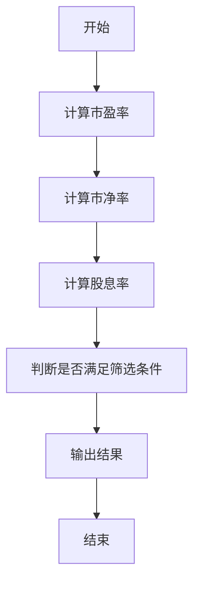
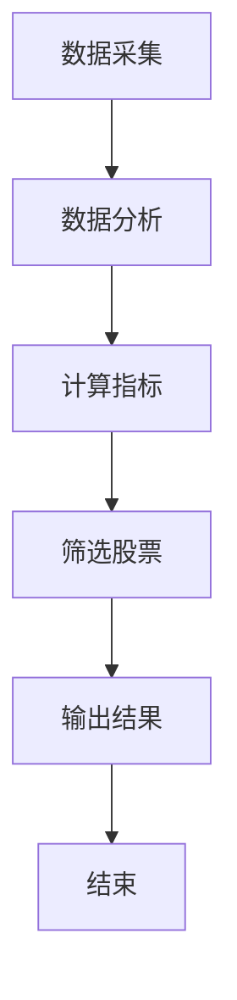
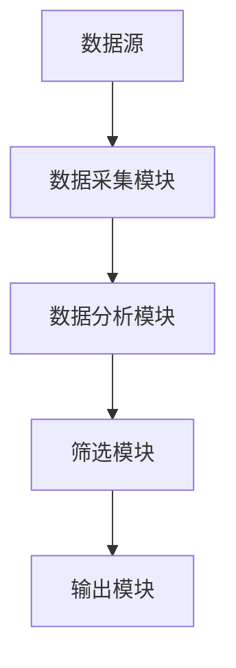
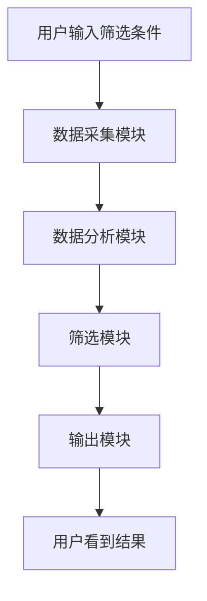

                 


# 格雷厄姆特价股票策略在不同数字监管沙盒环境中的表现

> 关键词：格雷厄姆策略，数字监管沙盒，股票投资，价值投资，算法实现，系统架构

> 摘要：本文系统地探讨了格雷厄姆特价股票策略在不同数字监管沙盒环境中的表现。首先，我们介绍了格雷厄姆策略的核心概念和数字监管沙盒的基本原理。接着，我们分析了格雷厄姆策略与数字监管沙盒之间的关系，并详细讲解了格雷厄姆策略的核心算法及其在数字环境中的实现。随后，我们从系统架构的角度，分析了格雷厄姆策略在数字监管沙盒中的应用，并通过具体案例展示了其在实际中的表现。最后，我们总结了格雷厄姆策略在数字监管环境中的优缺点，并提出了改进建议。

---

## 第一部分: 格雷厄姆特价股票策略与数字监管沙盒的背景介绍

### 第1章: 格雷厄姆特价股票策略概述

#### 1.1 格雷厄姆投资理论的核心概念

##### 1.1.1 价值投资的定义与核心原则
价值投资是一种以公司基本面分析为基础的投资策略，强调以低于内在价值的价格买入优质股票。格雷厄姆是价值投资的鼻祖，他提出的核心原则包括：
- **安全边际**：买入价格应低于股票的内在价值，以降低投资风险。
- **margin of safety**：通过安全边际，投资者可以避免因市场波动而遭受损失。
- **长期投资**：价值投资强调长期持有优质股票，而非频繁交易。

##### 1.1.2 格雷厄姆的“特价股票”策略
格雷厄姆策略的核心是寻找被市场低估的股票，即“特价股票”。这些股票通常具有以下特征：
- **低市盈率（P/E）**：市盈率低于行业平均水平。
- **低市净率（P/B）**：市净率低于行业平均水平。
- **高股息率**：股息率较高，表明公司愿意将利润返还给股东。

##### 1.1.3 格雷厄姆策略的适用场景与边界
格雷厄姆策略适用于市场波动较大、股票价格被低估的环境。然而，该策略也有其局限性：
- **不适应高增长行业**：格雷厄姆策略更适合于成熟行业，而非高增长行业。
- **周期性行业**：在周期性行业中，格雷厄姆策略可能因行业波动而表现不佳。

#### 1.2 数字监管沙盒的定义与特点

##### 1.2.1 数字监管沙盒的起源与发展
数字监管沙盒是一种新兴的监管工具，旨在为金融机构提供一个安全的环境，以测试新产品和服务。它起源于英国，现已被全球多个国家和地区采用。

##### 1.2.2 数字监管沙盒的核心功能与目标
数字监管沙盒的主要功能包括：
- **风险控制**：通过沙盒环境，监管机构可以控制测试过程中的风险。
- **创新支持**：为金融机构提供一个安全的环境，支持金融创新。
- **监管合规**：确保测试的产品和服务符合监管要求。

##### 1.2.3 数字监管沙盒与传统监管的对比
与传统监管相比，数字监管沙盒具有以下特点：
- **灵活性**：数字监管沙盒允许金融机构在测试过程中逐步调整产品和服务。
- **安全性**：通过沙盒环境，监管机构可以有效控制风险。
- **创新性**：数字监管沙盒为金融机构提供了更多的创新空间。

### 第2章: 格雷厄姆策略与数字监管沙盒的关系

#### 2.1 格雷厄姆策略在数字监管环境中的适应性

##### 2.1.1 数字化监管对投资策略的影响
数字化监管通过提供透明的环境，增强了投资者对市场的信心。同时，数字监管沙盒为投资者提供了一个安全的测试环境，有助于其更好地理解和应用格雷厄姆策略。

##### 2.1.2 格雷厄姆策略在数字环境中的优势
- **数据支持**：数字监管沙盒提供了丰富的数据，有助于投资者更好地分析股票的内在价值。
- **实时监控**：通过数字监管沙盒，投资者可以实时监控市场的变化，及时调整投资策略。

##### 2.1.3 数字监管沙盒对格雷厄姆策略的挑战
- **技术依赖**：格雷厄姆策略在数字环境中的应用高度依赖于技术，如果技术出现问题，可能会影响策略的执行。
- **数据质量**：数字监管沙盒中的数据质量直接影响格雷厄姆策略的效果。

#### 2.2 格雷厄姆策略与数字监管沙盒的结合

##### 2.2.1 数字监管沙盒为格雷厄姆策略提供的新机会
- **数据丰富性**：数字监管沙盒提供了丰富的数据，有助于投资者更好地应用格雷厄姆策略。
- **技术支持**：通过数字技术，投资者可以更高效地执行格雷厄姆策略。

##### 2.2.2 格雷厄姆策略在数字监管沙盒中的应用案例
通过具体案例分析，我们可以看到格雷厄姆策略在数字监管沙盒中的实际应用。例如，在某个数字监管沙盒中，投资者可以通过分析市盈率、市净率等指标，找到被低估的股票，并进行投资。

##### 2.2.3 格雷厄姆策略与数字监管沙盒的协同发展
格雷厄姆策略与数字监管沙盒的协同发展，不仅提高了投资效率，还增强了市场的透明度和安全性。通过这种协同，投资者可以更好地应对市场变化，降低投资风险。

---

## 第二部分: 格雷厄姆特价股票策略的核心概念与算法原理

### 第3章: 格雷厄姆策略的核心算法

#### 3.1 格雷厄姆策略的核心指标

##### 3.1.1 市盈率（P/E）计算公式
$$ P/E = \frac{Price}{Earnings} $$
市盈率是衡量股票价值的重要指标，市盈率越低，通常意味着股票越具有投资价值。

##### 3.1.2 市净率（P/B）计算公式
$$ P/B = \frac{Price}{Book\ Value} $$
市净率是衡量股票价值的另一个重要指标，市净率越低，通常意味着股票越具有投资价值。

##### 3.1.3 股息率计算公式
$$ Dividend\ Yield = \frac{Dividend}{Price} $$
股息率是衡量股票收益能力的重要指标，股息率越高，通常意味着股票越具有投资价值。

#### 3.2 格雷厄姆策略的筛选逻辑

##### 3.2.1 低市盈率股票筛选流程
1. 计算市盈率（P/E）。
2. 筛选市盈率低于行业平均水平的股票。

##### 3.2.2 低市净率股票筛选流程
1. 计算市净率（P/B）。
2. 筛选市净率低于行业平均水平的股票。

##### 3.2.3 高股息率股票筛选流程
1. 计算股息率（Dividend Yield）。
2. 筛选股息率高于行业平均水平的股票。

#### 3.3 格雷厄姆策略的数学模型

##### 3.3.1 格雷厄姆的内在价值计算公式
$$ Intrinsic\ Value = \frac{Earnings \times Growth\ Rate}{Discount\ Rate} $$
内在价值是股票的理论价值，反映了其真正的价值。

##### 3.3.2 格雷厄姆的安全边际计算公式
$$ Margin\ of\ Safety = Intrinsic\ Value - Market\ Price $$
安全边际是股票市场价格与其内在价值之间的差额，反映了投资的安全性。

### 第4章: 格雷厄姆策略的算法实现

#### 4.1 格雷厄姆策略的算法流程

##### 4.1.1 格雷厄姆策略的算法流程图


#### 4.2 格雷厄姆策略的Python实现

##### 4.2.1 格雷厄姆策略的Python代码实现
```python
import pandas as pd

def graham_strategy(stock_data):
    # 计算市盈率
    stock_data['pe'] = stock_data['price'] / stock_data['earnings']
    # 计算市净率
    stock_data['pb'] = stock_data['price'] / stock_data['book_value']
    # 计算股息率
    stock_data['dividend_yield'] = stock_data['dividend'] / stock_data['price']
    # 筛选低市盈率股票
    low_pe_stocks = stock_data[stock_data['pe'] < stock_data['pe'].mean()]
    # 筛选低市净率股票
    low_pb_stocks = stock_data[stock_data['pb'] < stock_data['pb'].mean()]
    # 筛选高股息率股票
    high_dividend_stocks = stock_data[stock_data['dividend_yield'] > stock_data['dividend_yield'].mean()]
    return low_pe_stocks, low_pb_stocks, high_dividend_stocks

# 示例数据
data = {
    'price': [100, 200, 300, 400, 500],
    'earnings': [20, 30, 40, 50, 60],
    'book_value': [50, 60, 70, 80, 90],
    'dividend': [5, 10, 15, 20, 25]
}
stock_data = pd.DataFrame(data)
low_pe_stocks, low_pb_stocks, high_dividend_stocks = graham_strategy(stock_data)
print("低市盈率股票:", low_pe_stocks)
print("低市净率股票:", low_pb_stocks)
print("高股息率股票:", high_dividend_stocks)
```

##### 4.2.2 格雷厄姆策略的算法实现步骤
1. **数据收集**：收集股票的基本数据，包括价格、盈利、账面价值和股息等。
2. **计算指标**：计算市盈率、市净率和股息率。
3. **筛选股票**：根据设定的筛选条件，筛选出符合条件的股票。
4. **输出结果**：输出筛选结果。

#### 4.3 格雷厄姆策略的数学模型与公式

##### 4.3.1 格雷厄姆策略的数学模型
通过数学模型，我们可以更好地理解格雷厄姆策略的核心思想。例如，内在价值公式可以帮助投资者更好地评估股票的价值。

##### 4.3.2 格雷厄姆策略的公式总结
- 市盈率公式：$$ P/E = \frac{Price}{Earnings} $$
- 市净率公式：$$ P/B = \frac{Price}{Book\ Value} $$
- 股息率公式：$$ Dividend\ Yield = \frac{Dividend}{Price} $$

---

## 第三部分: 格雷厄姆特价股票策略在数字监管沙盒中的系统分析

### 第5章: 格雷厄姆策略的系统架构设计

#### 5.1 系统功能设计

##### 5.1.1 系统功能模块划分
- 数据采集模块：负责收集股票的基本数据。
- 数据分析模块：负责计算市盈率、市净率和股息率。
- 筛选模块：根据设定的条件，筛选出符合条件的股票。
- 输出模块：输出筛选结果。

##### 5.1.2 系统功能流程图


#### 5.2 系统架构设计

##### 5.2.1 系统架构图


#### 5.3 系统接口设计

##### 5.3.1 系统接口设计说明
- 数据采集接口：负责从数据源获取股票的基本数据。
- 数据分析接口：负责计算市盈率、市净率和股息率。
- 筛选接口：根据设定的条件，筛选出符合条件的股票。
- 输出接口：输出筛选结果。

#### 5.4 系统交互设计

##### 5.4.1 系统交互流程图


### 第6章: 格雷厄姆策略在数字监管沙盒中的项目实战

#### 6.1 环境搭建

##### 6.1.1 环境搭建步骤
1. 安装Python和Pandas库。
2. 准备股票数据。
3. 安装必要的开发工具。

##### 6.1.2 环境搭建代码示例
```bash
pip install pandas
```

#### 6.2 系统核心实现

##### 6.2.1 核心实现代码
```python
import pandas as pd

def graham_strategy(stock_data):
    # 计算市盈率
    stock_data['pe'] = stock_data['price'] / stock_data['earnings']
    # 计算市净率
    stock_data['pb'] = stock_data['price'] / stock_data['book_value']
    # 计算股息率
    stock_data['dividend_yield'] = stock_data['dividend'] / stock_data['price']
    # 筛选低市盈率股票
    low_pe_stocks = stock_data[stock_data['pe'] < stock_data['pe'].mean()]
    # 筛选低市净率股票
    low_pb_stocks = stock_data[stock_data['pb'] < stock_data['pb'].mean()]
    # 筛选高股息率股票
    high_dividend_stocks = stock_data[stock_data['dividend_yield'] > stock_data['dividend_yield'].mean()]
    return low_pe_stocks, low_pb_stocks, high_dividend_stocks
```

##### 6.2.2 代码实现步骤
1. 收集股票数据。
2. 计算市盈率、市净率和股息率。
3. 筛选符合条件的股票。
4. 输出结果。

#### 6.3 案例分析

##### 6.3.1 案例分析步骤
1. 收集相关股票数据。
2. 计算市盈率、市净率和股息率。
3. 筛选符合条件的股票。
4. 分析筛选结果。

##### 6.3.2 案例分析代码示例
```python
data = {
    'price': [100, 200, 300, 400, 500],
    'earnings': [20, 30, 40, 50, 60],
    'book_value': [50, 60, 70, 80, 90],
    'dividend': [5, 10, 15, 20, 25]
}
stock_data = pd.DataFrame(data)
low_pe_stocks, low_pb_stocks, high_dividend_stocks = graham_strategy(stock_data)
print("低市盈率股票:", low_pe_stocks)
print("低市净率股票:", low_pb_stocks)
print("高股息率股票:", high_dividend_stocks)
```

---

## 第四部分: 格雷厄姆特价股票策略在数字监管沙盒中的最佳实践

### 第7章: 格雷厄姆策略在数字监管沙盒中的应用总结

#### 7.1 格雷厄姆策略在数字监管沙盒中的优缺点

##### 7.1.1 优点
- 数据丰富：数字监管沙盒提供了丰富的数据，有助于投资者更好地应用格雷厄姆策略。
- 技术支持：数字技术为格雷厄姆策略的实施提供了强有力的支持。

##### 7.1.2 缺点
- 技术依赖：格雷厄姆策略在数字环境中的应用高度依赖于技术，如果技术出现问题，可能会影响策略的执行。
- 数据质量：数字监管沙盒中的数据质量直接影响格雷厄姆策略的效果。

#### 7.2 格雷厄姆策略在数字监管沙盒中的改进建议

##### 7.2.1 数据质量的提升
- 数据清洗：通过数据清洗，可以提高数据的质量。
- 数据增强：通过数据增强，可以进一步提高数据的质量。

##### 7.2.2 技术支持的加强
- 技术优化：通过技术优化，可以进一步提高格雷厄姆策略的执行效率。
- 技术创新：通过技术创新，可以进一步提高格雷厄姆策略的执行效果。

### 第8章: 总结与展望

#### 8.1 总结
格雷厄姆策略在数字监管沙盒中的应用具有重要的现实意义。通过数字监管沙盒，投资者可以更好地理解和应用格雷厄姆策略，从而实现更高效的投资。

#### 8.2 展望
未来，随着技术的不断进步，格雷厄姆策略在数字监管沙盒中的应用将更加广泛和深入。投资者可以通过数字技术，更好地实现投资目标。

---

## 作者：AI天才研究院/AI Genius Institute & 禅与计算机程序设计艺术 /Zen And The Art of Computer Programming

