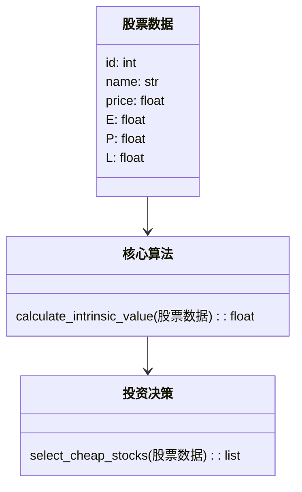
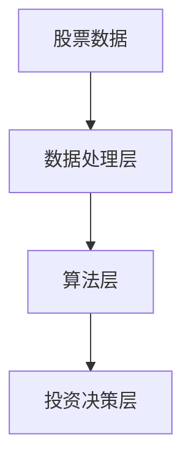

                 


# 格雷厄姆特价股票策略在不同数字监管科技环境中的表现

> 关键词：格雷厄姆策略，数字监管科技，股票估值，价值投资，算法模型

> 摘要：本文探讨了格雷厄姆特价股票策略在不同数字监管科技环境中的表现。通过分析价值投资的核心理念、数字监管科技的影响，结合数学模型和算法，展示了如何在现代金融市场中优化策略实施。文章还通过案例分析和系统设计，详细阐述了策略在实际应用中的潜力与挑战。

---

## 第一部分：引言

### 第1章：价值投资与数字监管科技的背景

#### 1.1 价值投资的基本概念
- **1.1.1 价值投资的定义与核心思想**
  - 价值投资是由本杰明·格雷厄姆提出的一种投资策略，强调以低于内在价值的价格购买优质股票。
  - 核心思想：市场波动不可预测，但可以通过基本面分析找到低估的股票。

- **1.1.2 格雷厄姆特价股票策略的起源与发展**
  - 起源于20世纪，格雷厄姆通过分析企业财务报表，寻找市场价格低于内在价值的企业。
  - 该策略强调安全边际，即购买价格与内在价值之间的差距。

- **1.1.3 数字监管科技的定义与现状**
  - 数字监管科技（RegTech）利用数字技术优化金融监管，包括区块链、人工智能等技术。
  - 当前，RegTech在风险评估、合规监控等方面发挥着重要作用。

#### 1.2 数字监管科技对金融市场的深远影响
- **1.2.1 数字化监管的定义与特点**
  - 数字化监管通过技术手段提高监管效率，降低合规成本。
  - 特点包括实时监控、数据驱动决策、自动化合规等。

- **1.2.2 数字监管科技在金融领域的应用**
  - 在证券发行、交易监控、反洗钱等领域，RegTech提高了监管效率。
  - 例如，利用人工智能分析交易数据，识别异常行为。

- **1.2.3 数字监管科技对股票市场的潜在影响**
  - 提高市场透明度，减少信息不对称。
  - 可能影响股票估值模型，需要投资者重新调整策略。

#### 1.3 本书的研究目标与意义
- **1.3.1 研究目标**
  - 探讨格雷厄姆策略在不同数字监管环境下的表现。
  - 分析数字监管科技对股票估值的影响。

- **1.3.2 研究意义**
  - 为投资者提供新的视角，优化投资决策。
  - 探讨RegTech在金融领域的潜力与挑战。

- **1.3.3 本书的结构安排**
  - 结构清晰，逻辑严谨，从理论到实践逐步展开。

---

## 第二部分：格雷厄姆特价股票策略的核心原理

### 第2章：格雷厄姆特价股票策略的理论基础

#### 2.1 价值投资的核心理念
- **2.1.1 股票的内在价值与市场价值**
  - 内在价值是基于企业基本面的合理估值。
  - 市场价值受情绪和市场波动影响，可能偏离内在价值。

- **2.1.2 格雷厄姆的安全边际概念**
  - 安全边际 = 内在价值 - 市场价格。
  - 通过购买价格低于内在价值的股票，降低投资风险。

- **2.1.3 价值投资的长期收益与风险控制**
  - 长期投资，避免频繁交易。
  - 通过分散投资降低风险。

#### 2.2 格雷厄姆特价股票策略的实施步骤
- **2.2.1 确定目标行业与公司**
  - 选择具有稳定收益和良好管理的公司。
  - 分析行业前景，避免选择夕阳行业。

- **2.2.2 财务分析与估值方法**
  - 通过财务报表分析评估企业盈利能力。
  - 使用市盈率、市净率等指标估算内在价值。

- **2.2.3 投资组合的构建与管理**
  - 分散投资，降低行业风险。
  - 定期调整投资组合，跟踪企业基本面变化。

#### 2.3 格雷厄姆策略与现代金融学的结合
- **2.3.1 现代金融学中的价值评估模型**
  - 使用CAPM、DDM等模型评估股票价值。
  - 这些模型与格雷厄姆的策略有相似之处。

- **2.3.2 格雷厄姆策略在量化投资中的应用**
  - 将格雷厄姆的策略转化为量化指标，通过算法筛选股票。
  - 结合大数据分析，提高选股效率。

- **2.3.3 现代市场环境对格雷厄姆策略的影响**
  - 信息透明度提高，股票估值更准确。
  - 市场波动加剧，策略执行难度增加。

---

## 第三部分：数字监管科技环境下的股票策略分析

### 第3章：数字监管科技对股票市场的具体影响

#### 3.1 数字监管科技对股票市场的影响
- **3.1.1 数字化监管对市场透明度的提升**
  - 提供实时数据监控，减少信息不对称。
  - 投资者可以更准确地评估股票价值。

- **3.1.2 数字监管科技对市场效率的优化**
  - 自动化交易系统提高市场流动性。
  - 降低交易成本，提升市场效率。

- **3.1.3 数字监管科技对投资策略的影响**
  - 提供新的数据源和分析工具，优化选股模型。
  - 增加策略执行的复杂性，需要投资者适应新技术。

#### 3.2 数字监管科技环境下的股票估值挑战
- **3.2.1 数据质量与完整性**
  - 高质量数据是准确估值的基础。
  - 数据清洗和处理是关键步骤。

- **3.2.2 算法与模型的优化**
  - 使用机器学习优化估值模型。
  - 模型需要不断更新，适应市场变化。

- **3.2.3 监管政策的变化**
  - 监管政策变化可能影响股票估值。
  - 投资者需要及时调整策略，应对政策变化。

---

## 第四部分：算法与数学模型

### 第4章：格雷厄姆策略的算法实现

#### 4.1 算法原理
- **4.1.1 算法思路**
  - 收集企业财务数据，计算内在价值。
  - 对比市场价格，判断是否低估。

- **4.1.2 实现步骤**
  - 数据收集：获取企业的收入、利润、现金流等数据。
  - 计算内在价值：使用格雷厄姆的估值方法。
  - 判断投资价值：比较市场价格与内在价值。

#### 4.2 数学模型
- **4.2.1 格雷厄姆估值模型**
  - 内在价值公式：
    $$ V = \frac{E}{P} \times 4 \times \left(1 - \frac{L}{E}\right) $$
  - 其中，E为净利润，P为市盈率，L为长期负债，E为股东权益。

- **4.2.2 安全边际计算**
  - 安全边际 = 内在价值 × 余地系数（如1.2）。
  - 例如：
    $$ \text{安全边际} = V \times 1.2 $$

#### 4.3 算法实现
- **4.3.1 数据预处理**
  - 使用Python的pandas库清洗数据。
    ```python
    import pandas as pd
    data = pd.read_csv('stock_data.csv')
    data = data.dropna()
    ```

- **4.3.2 计算内在价值**
  - 使用上述公式计算内在价值。
    ```python
    def calculate_intrinsic_value(data):
        V = data['E'] / data['P'] * 4 * (1 - data['L'] / data['E'])
        return V
    ```

- **4.3.3 筛选低估股票**
  - 比较市场价格与内在价值，找出低估股票。
    ```python
    data['低估'] = data['Price'] < data['V']
    ```

---

## 第五部分：系统与架构设计

### 第5章：系统分析与架构设计

#### 5.1 系统功能设计
- **5.1.1 功能模块**
  - 数据采集：从数据库获取股票数据。
  - 估值计算：使用算法计算内在价值。
  - 投资决策：根据结果推荐股票。

- **5.1.2 领域模型**
  - 使用mermaid类图展示系统模块关系。



#### 5.2 系统架构设计
- **5.2.1 架构图**
  - 展示系统的分层结构。



---

## 第六部分：项目实战

### 第6章：项目实战与案例分析

#### 6.1 项目环境安装
- **6.1.1 安装Python与相关库**
  - 使用pip安装pandas、numpy、scikit-learn等库。

#### 6.2 核心代码实现
- **6.2.1 数据获取与处理**
  ```python
  import pandas as pd
  data = pd.read_csv('stock_data.csv')
  data = data.dropna()
  ```

- **6.2.2 估值计算与筛选**
  ```python
  def calculate_intrinsic_value(data):
      V = data['E'] / data['P'] * 4 * (1 - data['L'] / data['E'])
      return V

  data['V'] = calculate_intrinsic_value(data)
  data['低估'] = data['Price'] < data['V']
  ```

#### 6.3 案例分析
- **6.3.1 案例选择**
  - 选择某行业中的几只股票进行分析。
  - 对比市场价格与内在价值，找出低估股票。

- **6.3.2 分析结果**
  - 展示筛选出的低估股票列表。
  - 分析这些股票的投资潜力。

---

## 第七部分：总结与展望

### 第7章：总结与最佳实践

#### 7.1 小结
- 总结全文内容，强调格雷厄姆策略在数字监管环境中的应用潜力。

#### 7.2 最佳实践
- 提供实际操作建议，如：
  - 定期更新估值模型，适应市场变化。
  - 结合RegTech工具，优化投资决策。
  - 注意数据质量和模型的可解释性。

#### 7.3 展望
- 未来，随着RegTech的发展，格雷厄姆策略将更加精准和高效。
- 数据科学与人工智能将进一步优化股票估值模型。

---

## 作者：AI天才研究院/AI Genius Institute & 禅与计算机程序设计艺术 /Zen And The Art of Computer Programming

---

通过本文，读者可以全面了解格雷厄姆特价股票策略在数字监管科技环境中的表现，从理论到实践，系统地掌握策略的应用方法。

