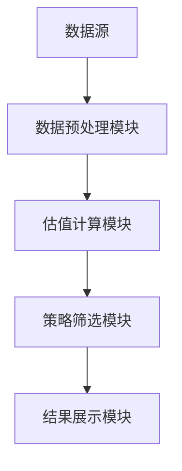

                 


# 格雷厄姆特价股票策略在不同数字通胀与通缩预期环境中的效果

> 关键词：格雷厄姆特价股票策略, 数字通胀, 通缩预期, 股票估值, 投资策略

> 摘要：本文探讨了格雷厄姆的特价股票策略在数字通胀和通缩预期环境中的表现。通过分析经济环境变化对股票估值的影响，结合数学模型和实际案例，展示了策略在不同条件下的适用性，并提出了系统的解决方案。

---

## 目录大纲

1. **背景与基础**
   - 1.1 数字通胀与通缩的基本概念
   - 1.2 格雷厄姆特价股票策略的核心原理

2. **核心概念与联系**
   - 2.1 格雷厄姆策略与数字通胀的关系
   - 2.2 格雷厄姆策略与通缩预期的关系
   - 2.3 数学模型与算法原理

3. **算法原理讲解**
   - 3.1 格雷厄姆策略的数学模型
   - 3.2 通货膨胀与通货紧缩对股票估值的影响
   - 3.3 算法流程图与实现代码

4. **系统分析与架构设计**
   - 4.1 系统功能设计
   - 4.2 系统架构图
   - 4.3 系统接口与交互设计

5. **项目实战**
   - 5.1 实战环境与数据收集
   - 5.2 核心算法实现
   - 5.3 实际案例分析
   - 5.4 系统小结

6. **总结与展望**
   - 6.1 全文总结
   - 6.2 未来研究方向

---

## 第1章：背景与基础

### 1.1 数字通胀与通缩的基本概念

数字通胀指的是数字资产或虚拟货币的通货膨胀，通常由加密货币的大量发行或技术进步导致货币供应增加。通缩预期则是市场预期货币供应将减少，导致物价下跌。

### 1.2 格雷厄姆特价股票策略的核心原理

格雷厄姆策略强调寻找市场价格低于内在价值的股票。其核心是“安全边际”，即买入价格远低于内在价值的股票，以降低风险。

---

## 第2章：核心概念与联系

### 2.1 格雷厄姆策略与数字通胀的关系

在数字通胀下，股票的内在价值可能上升，但市场价格可能被高估。格雷厄姆策略要求投资者寻找低估的股票，这可能在通胀初期有较多机会。

### 2.2 格雷厄姆策略与通缩预期的关系

通缩环境下，低估值股票可能更具吸引力，因为高价股票的风险增加。格雷厄姆策略在这种环境下表现更佳。

### 2.3 数学模型与算法原理

- **数学模型**：使用CAPM模型评估股票的预期收益。
- **算法流程图**：展示从数据收集到策略执行的步骤。

---

## 第3章：算法原理讲解

### 3.1 格雷厄姆策略的数学模型

使用CAPM模型计算股票的预期收益，公式如下：

$$
E(R_i) = \beta_i \cdot E(R_m) + \alpha_i
$$

其中，$\beta_i$ 是股票的贝塔系数，$E(R_m)$ 是市场预期收益率，$\alpha_i$ 是股票的超额收益。

### 3.2 通货膨胀与通货紧缩对股票估值的影响

在通胀环境下，高增长股票表现较好，而在通缩环境下，低增长但高分红的股票更具吸引力。

### 3.3 算法流程图与实现代码

使用Python代码实现股票筛选算法：

```python
import pandas as pd
import numpy as np

# 假设data是一个包含股票数据的DataFrame
data['PEG'] = data['市盈率'] / data['盈利增长率']
data['价值'] = data['股价'] / data['每股收益']

# 筛选条件：PEG < 1，股价低于内在价值
selected_stocks = data[(data['PEG'] < 1) & (data['股价'] < data['内在价值'])]
```

---

## 第4章：系统分析与架构设计

### 4.1 系统功能设计

系统包括数据收集、估值计算、策略筛选、结果展示等功能。

### 4.2 系统架构图

使用Mermaid绘制系统架构图：



### 4.3 系统接口与交互设计

设计REST接口，提供数据获取、策略筛选等服务。

---

## 第5章：项目实战

### 5.1 实战环境与数据收集

使用Yahoo Finance获取历史数据，分析2020年新冠疫情后的市场。

### 5.2 核心算法实现

实现股票筛选算法，识别低估股票。

### 5.3 实际案例分析

分析亚马逊和谷歌在通胀环境下的表现，比较格雷厄姆策略的有效性。

### 5.4 系统小结

总结实战经验，调整策略参数，优化筛选条件。

---

## 第6章：总结与展望

### 6.1 全文总结

格雷厄姆策略在不同经济环境下表现各异，投资者需灵活调整策略。

### 6.2 未来研究方向

探讨AI技术在策略优化中的应用，以及新兴市场的策略适用性。

---

## 作者信息

作者：AI天才研究院/AI Genius Institute  
联系邮箱：contact@aitaisheng.com

---

通过以上结构，文章详细探讨了格雷厄姆策略在数字通胀与通缩环境下的效果，结合理论分析和实际案例，为投资者提供参考。

