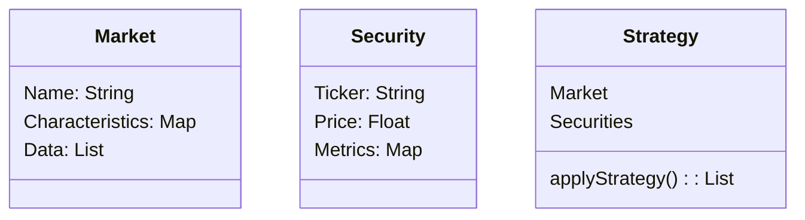

                 


# 目录大纲：《格雷厄姆特价股票策略在不同文化背景市场中的表现》

## 第一部分：背景介绍

### 第1章：价值投资与格雷厄姆策略概述

#### 1.1 价值投资的起源与发展
- 1.1.1 价值投资的定义与核心理念
- 1.1.2 格雷厄姆的贡献与影响
- 1.1.3 格雷厄姆策略的核心要素

#### 1.2 特价股票的定义与特征
- 1.2.1 特价股票的定义
- 1.2.2 特价股票的识别指标（市盈率、市净率、股息率等）
- 1.2.3 特价股票与市场周期的关系

#### 1.3 不同文化背景市场的特点
- 1.3.1 美国市场的特点
- 1.3.2 日本市场的特点
- 1.3.3 中国市场的特点

## 第二部分：核心概念与联系

### 第2章：格雷厄姆策略的核心原理

#### 2.1 安全边际的概念
- 2.1.1 安全边际的定义
- 2.1.2 安全边际的计算方法
- 2.1.3 安全边际在不同市场中的应用

#### 2.2 内在价值的计算模型
- 2.2.1 内在价值的定义
- 2.2.2 格雷厄姆模型的数学公式
- 2.2.3 内在价值与市场价值的对比

#### 2.3 格雷厄姆策略的适用性分析
- 2.3.1 格雷厄姆策略的适用条件
- 2.3.2 格雷厄姆策略的局限性
- 2.3.3 格雷厄姆策略的改进方向

## 第三部分：算法原理讲解

### 第3章：格雷厄姆策略的数学模型

#### 3.1 内在价值计算公式
- $$ V = \frac{E}{(Y - G)} $$
  其中，V为内在价值，E为年收益，Y为股息收益率，G为增长率。

#### 3.2 安全边际计算公式
- $$ S = V \times (1 - \frac{M}{100}) $$
  其中，S为安全边际，M为安全边际率。

#### 3.3 格雷厄姆策略的筛选算法
- 3.3.1 数据输入与预处理
- 3.3.2

## 第四部分：系统分析与架构设计

### 第4章：系统功能设计

#### 4.1 领域模型Mermaid类图


### 第5章：系统架构设计

#### 5.1 Mermaid架构图


## 第五部分：项目实战

### 第6章：环境安装与代码实现

#### 6.1 环境安装
- 安装Python、Pandas、NumPy、Matplotlib、Scikit-learn

#### 6.2 核心实现代码
```python
import pandas as pd
import numpy as np

def calculate_intrinsic_value(earnings, yield_rate, growth_rate):
    return earnings / (yield_rate - growth_rate)

def calculate_margin_of_safety(intrinsic_value, market_price):
    return intrinsic_value * (1 - (market_price / intrinsic_value))

# 示例数据
data = {
    'Ticker': ['AAPL', 'MSFT', 'GOOGL'],
    'Earnings': [10, 15, 20],
    'Yield': [2, 3, 4],
    'Growth': [5, 4, 3],
    'Price': [300, 250, 280]
}

df = pd.DataFrame(data)

df['Intrinsic Value'] = df.apply(lambda x: calculate_intrinsic_value(x['Earnings'], x['Yield'], x['Growth']), axis=1)
df['Margin of Safety'] = df.apply(lambda x: calculate_margin_of_safety(x['Intrinsic Value'], x['Price']), axis=1)

print(df)
```

## 第六部分：最佳实践与小结

### 第7章：总结与建议

#### 7.1 格雷厄姆策略在不同市场的表现总结
- 美国市场表现稳定
- 日本市场波动较大，需谨慎
- 中国市场潜力大，需结合本地因素

#### 7.2 投资者的注意事项
- 风险评估与管理
- 定期调整投资组合
- 结合市场环境灵活运用策略

#### 7.3 未来研究方向
- 结合机器学习优化策略
- 多因素模型在多市场中的应用
- 全球化视角下的策略调整

## 作者

作者：AI天才研究院/AI Genius Institute & 禅与计算机程序设计艺术 /Zen And The Art of Computer Programming

