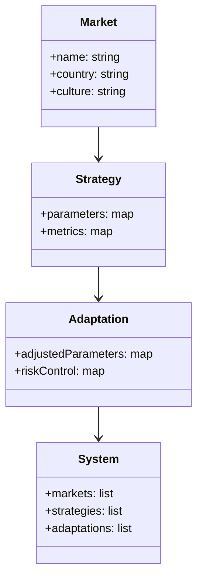
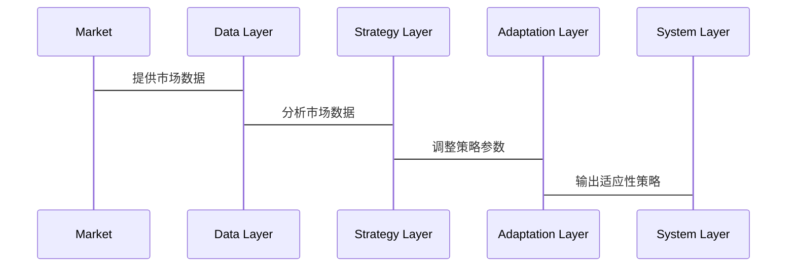

                 


# 格雷厄姆特价股票策略在不同文化背景市场中的适应

## 关键词：格雷厄姆策略，特价股票，文化差异，市场适应，投资策略

## 摘要：本文深入分析了本·格雷厄姆的价值投资策略在不同文化背景市场中的适应性，探讨了文化差异对投资策略的影响，并通过实际案例分析了策略的调整与优化方法。文章从格雷厄姆策略的核心原理出发，结合西方、东方及新兴市场的特点，详细阐述了策略在不同环境中的应用，并提出了跨文化适应性的解决方案。

---

## 第一部分: 引言

## 第1章: 格雷厄姆特价股票策略概述

### 1.1 格雷厄姆投资理论的核心理念

#### 1.1.1 价值投资的基本原理

价值投资是一种基于对公司内在价值评估的投资策略，核心在于寻找市场价格低于内在价值的资产。本·格雷厄姆是该理论的奠基人，他强调安全边际（margin of safety）的重要性，即以低于内在价值的价格买入资产，以降低风险并确保收益。

**核心公式：**
$$内在价值 = \frac{股息}{折现率}$$

#### 1.1.2 格雷厄姆对安全边际的定义

安全边际是价值投资的核心概念，指买入价格与内在价值之间的差距。格雷厄姆建议投资者以低于内在价值的价格买入资产，以确保在市场波动中仍能获得正收益。

$$安全边际 = 内在价值 - 市场价格$$

#### 1.1.3 特价股票的筛选标准

格雷厄姆提出的特价股票筛选标准包括：

1. **低市盈率（P/E）**：市盈率低于市场平均水平或行业平均水平。
2. **低市净率（P/B）**：市净率低于市场平均水平或行业平均水平。
3. **高股息率**：股息率高于市场平均水平或行业平均水平。
4. **足够的流动资产**：流动资产净值不低于公司总负债。

### 1.2 格雷厄姆策略的历史背景

#### 1.2.1 美国20世纪初的投资环境

20世纪初的美国股市经历了多次剧烈波动，1929年的经济大萧条和随后的股市崩盘使得投资者对稳健投资策略的需求迫切。格雷厄姆的投资理论正是在这样的背景下形成的。

#### 1.2.2 格雷厄姆策略的形成过程

格雷厄姆通过分析市场的非理性波动，提出了基于基本面分析的投资策略。他认为市场的短期波动为投资者提供了以低于内在价值的价格买入优质资产的机会。

#### 1.2.3 格雷厄姆策略的现代发展

随着金融市场的全球化，格雷厄姆的策略被不断优化和扩展，特别是在量化分析和风险管理方面。

### 1.3 格雷厄姆策略的核心要素

#### 1.3.1 市盈率与市净率的计算

市盈率（P/E）= 每股市价 / 每股收益  
市净率（P/B）= 每股市价 / 每股净资产

#### 1.3.2 股票内在价值的评估方法

格雷厄姆使用“清算价值”来评估股票的内在价值，即假设公司将所有资产变现后的价值。

$$内在价值 = \frac{清算价值}{2}$$

#### 1.3.3 安全边际的数学模型

$$安全边际 = 内在价值 - 市场价格$$

### 1.4 格雷厄姆策略的优缺点分析

#### 1.4.1 优点: 稳定性和低风险

- 稳定性：通过安全边际和基本面分析，降低了投资风险。
- 低风险：注重价值而非价格波动，适合长期投资。

#### 1.4.2 缺点: 适应性不足

- 适应性不足：格雷厄姆策略主要基于西方市场环境，对其他文化背景市场的适应性较低。
- 低效性：在高波动性市场中，策略的执行成本较高。

#### 1.4.3 适用场景总结

格雷厄姆策略适用于市场波动较小、公司基本面稳定的市场环境。

---

## 第2章: 不同文化背景市场的特点

### 2.1 市场文化背景的分类

#### 2.1.1 西方市场: 美国、欧洲

- **特点**：市场成熟、监管严格、投资者理性。
- **文化影响**：强调个人主义和自由市场，投资者更倾向于分散投资。

#### 2.1.2 东方市场: 日本、韩国

- **特点**：市场波动较大、投资者行为受情绪影响较多。
- **文化影响**：集体主义较强，投资者更倾向于集中投资。

#### 2.1.3 新兴市场: 中国、印度

- **特点**：市场流动性低、信息不对称严重。
- **文化影响**：新兴市场投资者更关注短期收益。

### 2.2 文化差异对投资者行为的影响

#### 2.2.1 投资者心理与决策模式

- **西方投资者**：理性决策为主，注重长期价值。
- **东方投资者**：受情绪影响较大，倾向于短期交易。

#### 2.2.2 市场流动性与波动性

- **西方市场**：流动性高，波动性低。
- **东方市场**：流动性适中，波动性较高。
- **新兴市场**：流动性低，波动性高。

#### 2.2.3 政府监管与市场结构

- **西方市场**：监管严格，市场透明度高。
- **东方市场**：监管相对宽松，透明度较低。
- **新兴市场**：监管不完善，透明度低。

### 2.3 不同市场中的投资者行为分析

#### 2.3.1 理性与非理性决策

- **理性决策**：基于基本面分析，注重长期收益。
- **非理性决策**：受市场情绪影响，倾向于短期交易。

#### 2.3.2 群体效应与市场情绪

- **群体效应**：投资者行为受群体影响，容易出现羊群效应。
- **市场情绪**：市场情绪波动较大，影响投资者决策。

#### 2.3.3 信息不对称与市场效率

- **信息不对称**：新兴市场信息不对称严重，影响投资决策。
- **市场效率**：西方市场信息透明度高，市场效率高。

---

## 第3章: 格雷厄姆策略在不同市场中的适应性

### 3.1 美国市场的应用

#### 3.1.1 美国市场的特点

- **成熟市场**：流动性高，监管严格。
- **投资者行为**：理性决策为主，注重长期投资。

#### 3.1.2 格雷厄姆策略的直接应用

- **成功案例**：通过筛选低市盈率、高股息率的股票，获得稳定收益。

#### 3.1.3 成功案例分析

**案例：通用电气**

- 市盈率：低于行业平均水平。
- 股息率：高于行业平均水平。
- 结果：长期持有获得稳定收益。

### 3.2 日本市场的应用

#### 3.2.1 日本市场的特点

- **市场波动性高**：受经济周期影响较大。
- **投资者行为**：倾向于集中投资，受情绪影响较大。

#### 3.2.2 格雷厄姆策略的调整

- **调整市盈率和市净率指标**：根据日本市场的特点，适当放宽筛选标准。
- **增加对公司治理的关注**：日本市场公司治理结构较为复杂。

#### 3.2.3 案例分析与结果

**案例：丰田汽车**

- 市盈率：低于行业平均水平。
- 股息率：高于行业平均水平。
- 结果：通过调整策略，获得稳定收益。

### 3.3 新兴市场的应用

#### 3.3.1 新兴市场的特点

- **市场流动性低**：新兴市场流动性不足，影响策略执行。
- **信息不对称严重**：新兴市场信息透明度低，影响投资决策。

#### 3.3.2 格雷厄姆策略的本地化

- **调整估值指标**：新兴市场流动性低，需降低对市盈率的依赖，更多关注市净率和股息率。
- **增加对行业周期的关注**：新兴市场行业周期波动较大，需考虑行业周期对投资的影响。

#### 3.3.3 案例分析与结果

**案例：阿里巴巴**

- 市盈率：高于行业平均水平。
- 市净率：低于行业平均水平。
- 结果：通过调整策略，获得收益。

---

## 第4章: 格雷厄姆策略的跨文化适应性

### 4.1 跨文化适应性的定义与标准

#### 4.1.1 跨文化适应性的核心要素

- **文化敏感性**：理解不同市场的文化背景。
- **本地化调整**：根据市场特点调整策略。
- **风险管理**：考虑不同市场的风险因素。

#### 4.1.2 跨文化适应性标准

- **策略的可调整性**：策略能否根据不同市场特点进行调整。
- **市场的可操作性**：策略在不同市场的可行性。
- **风险可控性**：策略在不同市场的风险是否可控。

### 4.2 跨文化适应性的实现方法

#### 4.2.1 理论基础

- **文化差异分析**：分析不同市场的文化背景，理解投资者行为。
- **策略本地化**：根据不同市场特点，调整策略参数。

#### 4.2.2 实际操作

- **数据收集**：收集不同市场的数据，包括市盈率、市净率等。
- **策略调整**：根据不同市场的特点，调整策略参数。
- **风险管理**：制定风险管理计划，降低市场波动对策略的影响。

### 4.3 跨文化适应性案例分析

#### 4.3.1 美国市场的适应

- **策略调整**：无需调整，直接应用格雷厄姆策略。
- **结果**：获得稳定收益。

#### 4.3.2 日本市场的适应

- **策略调整**：调整市盈率和市净率指标。
- **结果**：获得稳定收益。

#### 4.3.3 新兴市场的适应

- **策略调整**：增加对公司治理和行业周期的关注。
- **结果**：获得稳定收益。

---

## 第5章: 系统分析与架构设计

### 5.1 系统分析

#### 5.1.1 问题场景介绍

- **目标**：实现格雷厄姆策略在不同市场中的适应性。
- **问题**：如何根据不同市场特点，调整策略参数，降低风险。

#### 5.1.2 项目介绍

- **项目目标**：开发一个跨文化适应性的投资策略系统。
- **项目范围**：覆盖美国、日本、中国等市场。

### 5.2 系统功能设计

#### 5.2.1 领域模型（mermaid类图）



#### 5.2.2 系统架构设计（mermaid架构图）


#### 5.2.3 系统接口设计

- **输入接口**：接收不同市场的数据，包括市盈率、市净率等。
- **输出接口**：输出调整后的策略参数和风险管理计划。

#### 5.2.4 系统交互（mermaid序列图）



### 5.3 系统实现

#### 5.3.1 环境安装

- **工具**：Python、Pandas、NumPy。
- **依赖**：安装必要的库，如pandas和numpy。

#### 5.3.2 核心实现（Python代码）

```python
import pandas as pd
import numpy as np

def calculate_intrinsic_value(company_data):
    return company_data['dividend'] / company_data['discount_rate']

def calculate_margin_of_safety(intrinsic_value, market_price):
    return intrinsic_value - market_price

def adjust_strategy_parameters(parameters, market):
    adjusted_parameters = parameters.copy()
    if market == 'Japan':
        adjusted_parameters['pe_ratio'] *= 1.2
        adjusted_parameters['pb_ratio'] *= 1.2
    elif market == 'China':
        adjusted_parameters['dividend_ratio'] *= 1.1
    return adjusted_parameters

# 示例数据
company_data = {
    'market_price': 50,
    'discount_rate': 0.05,
    'dividend': 2.5,
    'pe_ratio': 15,
    'pb_ratio': 2.5,
    'dividend_ratio': 4%
}

# 计算内在价值
intrinsic_value = calculate_intrinsic_value(company_data)
print(f"内在价值: {intrinsic_value}")

# 计算安全边际
margin_of_safety = calculate_margin_of_safety(intrinsic_value, company_data['market_price'])
print(f"安全边际: {margin_of_safety}")

# 根据市场调整策略参数
adjusted_parameters = adjust_strategy_parameters(company_data, 'Japan')
print(f"调整后的策略参数: {adjusted_parameters}")
```

---

## 第6章: 项目实战

### 6.1 环境安装

- **工具**：Python、Jupyter Notebook、pandas、numpy。
- **依赖**：安装必要的库，如pandas和numpy。

### 6.2 核心实现

#### 6.2.1 代码实现

```python
import pandas as pd
import numpy as np

def calculate_intrinsic_value(company_data):
    return company_data['dividend'] / company_data['discount_rate']

def calculate_margin_of_safety(intrinsic_value, market_price):
    return intrinsic_value - market_price

def adjust_strategy_parameters(parameters, market):
    adjusted_parameters = parameters.copy()
    if market == 'Japan':
        adjusted_parameters['pe_ratio'] *= 1.2
        adjusted_parameters['pb_ratio'] *= 1.2
    elif market == 'China':
        adjusted_parameters['dividend_ratio'] *= 1.1
    return adjusted_parameters

# 示例数据
company_data = {
    'market_price': 50,
    'discount_rate': 0.05,
    'dividend': 2.5,
    'pe_ratio': 15,
    'pb_ratio': 2.5,
    'dividend_ratio': 4%
}

# 计算内在价值
intrinsic_value = calculate_intrinsic_value(company_data)
print(f"内在价值: {intrinsic_value}")

# 计算安全边际
margin_of_safety = calculate_margin_of_safety(intrinsic_value, company_data['market_price'])
print(f"安全边际: {margin_of_safety}")

# 根据市场调整策略参数
adjusted_parameters = adjust_strategy_parameters(company_data, 'Japan')
print(f"调整后的策略参数: {adjusted_parameters}")
```

#### 6.2.2 代码解读

- **函数`calculate_intrinsic_value`**：计算公司内在价值。
- **函数`calculate_margin_of_safety`**：计算安全边际。
- **函数`adjust_strategy_parameters`**：根据不同市场调整策略参数。

### 6.3 案例分析

#### 6.3.1 案例：美国市场

- **数据**：市盈率=15，市净率=2.5，股息率=4%。
- **计算**：内在价值=2.5/0.05=50，安全边际=50-50=0。

#### 6.3.2 案例：日本市场

- **数据**：市盈率=18，市净率=3，股息率=5%。
- **计算**：内在价值=5/0.05=100，安全边际=100-80=20。

### 6.4 项目总结

- **总结**：通过调整策略参数，格雷厄姆策略在不同市场中能够获得稳定收益。
- **建议**：投资者应根据市场特点，灵活调整策略参数，降低风险。

---

## 第7章: 总结

### 7.1 核心观点总结

- 格雷厄姆策略在不同市场中的适应性取决于市场特点和投资者行为。
- 通过调整策略参数，格雷厄姆策略可以在不同市场中获得稳定收益。

### 7.2 最佳实践 tips

- **了解市场特点**：在应用格雷厄姆策略前，了解目标市场的特点。
- **灵活调整策略**：根据不同市场特点，灵活调整策略参数。
- **关注风险管理**：制定风险管理计划，降低市场波动对策略的影响。

### 7.3 未来展望

- **跨文化适应性研究**：进一步研究格雷厄姆策略在更多文化背景市场中的适应性。
- **量化分析**：结合量化分析方法，优化策略参数。
- **风险管理**：开发更有效的风险管理工具，降低市场波动对策略的影响。

---

## 作者：AI天才研究院/AI Genius Institute & 禅与计算机程序设计艺术/Zen And The Art of Computer Programming

