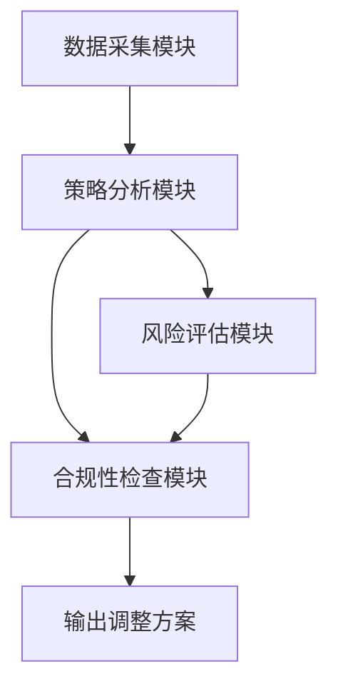

                 


# 格雷厄姆特价股票策略在不同监管环境下的调整

> 关键词：格雷厄姆投资理论，特价股票策略，监管环境，投资策略调整，风险管理

> 摘要：本文详细探讨了格雷厄姆特价股票策略在不同监管环境下的调整方法，分析了监管政策对投资策略的影响，提出了风险评估和合规性分析的具体步骤，并通过实际案例分析和系统架构设计，展示了如何在不同监管环境下优化投资策略。

---

# 第一部分: 格雷厄姆特价股票策略概述

## 第1章: 格雷厄姆特价股票策略的核心概念

### 1.1 格雷厄姆投资理论基础

#### 1.1.1 价值投资的定义与核心理念

价值投资是一种以基本面分析为基础的投资策略，强调以低于内在价值的价格购买优质资产。格雷厄姆的价值投资理论强调安全边际和长期稳健回报，主张通过分析财务报表和市场估值来寻找被低估的投资标的。

- **安全边际**：格雷厄姆认为，投资者应以低于内在价值的价格购买资产，以确保在市场波动中仍能获得正收益。
- **长期稳健回报**：价值投资的核心目标是通过长期持有优质资产，实现财富的稳步增长。

#### 1.1.2 格雷厄姆的选股标准

格雷厄姆的选股标准主要基于财务指标和市场估值，包括以下几点：

- **低市盈率（P/E）**：市盈率低于行业平均水平或历史平均水平。
- **低市净率（P/B）**：市净率低于1，表示资产以低于账面价值的价格出售。
- **高股息率**：股息率较高，表明公司愿意将利润返还给股东。
- **稳健的财务状况**：低负债率、健康的现金流和稳定的收益。

#### 1.1.3 特价股票的定义与特征

特价股票是指市场价格低于其内在价值的股票。其特征包括：

- **价格低估**：市场价格低于公司净资产或未来现金流的现值。
- **低估值指标**：市盈率、市净率等估值指标低于市场平均水平。
- **高安全边际**：购买价格与内在价值之间的差距较大。

### 1.2 格雷厄姆特价股票策略的背景与现状

#### 1.2.1 现代市场环境下的价值投资

现代市场环境复杂多变，传统价值投资策略面临新的挑战。例如，市场的流动性增加、信息透明度提高、机构投资者增多等因素，使得市场价格更难偏离内在价值。然而，价值投资的基本原理依然有效，但需要根据市场环境进行调整。

#### 1.2.2 特价股票策略的演变

随着市场的变化，价值投资策略也在不断演变。例如，引入量化分析方法、动态调整安全边际、关注新兴行业和公司等。这些调整使价值投资策略更加灵活和适应性强。

#### 1.2.3 当前市场中特价股票策略的应用情况

当前，价值投资策略在机构和个人投资者中依然受欢迎。特别是在市场波动加剧的情况下，投资者更倾向于寻找价格低估的股票，以规避市场风险。

---

## 第2章: 监管环境对投资策略的影响

### 2.1 全球主要市场的监管框架

#### 2.1.1 美国市场的监管体系

美国市场的监管体系较为完善，主要监管机构包括：

- **美国证券交易委员会（SEC）**：负责监管公开发行的证券，确保信息披露的准确性和完整性。
- **纽约证券交易所（NYSE）和纳斯达克（NASDAQ）**：交易所层面的监管，包括上市规则、交易规则等。
- **金融监管机构**：如美国联邦储备银行等，负责系统性风险的监管。

#### 2.1.2 欧盟市场的监管体系

欧盟市场的监管体系以《金融工具市场指令》（MiFID）和《资本充足性指令》为核心，强调透明度和投资者保护。主要监管机构包括欧盟证券和市场管理局（ESMA）等。

#### 2.1.3 中国市场的监管体系

中国市场的监管体系以中国证监会（CSRC）为核心，强调市场秩序和合规性。近年来，中国加强了对资本市场的监管，特别是对杠杆资金和关联交易的监管。

### 2.2 不同监管环境下的投资策略调整

#### 2.2.1 监管政策对投资策略的影响

监管政策直接影响投资策略的可行性和效果。例如：

- **信息披露要求**：严格的披露要求提高了市场的透明度，有助于投资者做出更明智的投资决策。
- **交易规则**：如短线交易限制、大额交易申报等，可能影响交易策略的执行。
- **合规性要求**：如仓位限制、杠杆限制等，影响投资组合的构建。

#### 2.2.2 不同市场中监管规则的异同

不同市场的监管规则存在差异，主要体现在：

- **信息披露要求**：美国和欧盟市场要求较高，而中国市场的信息披露相对严格，但执行力度可能有所不同。
- **交易规则**：如短线交易限制、涨跌停板等，不同市场的规则差异较大。
- **合规性要求**：不同市场的监管机构对投资组合的合规性要求不同，如杠杆率限制、持仓集中度等。

#### 2.2.3 如何在不同监管环境下制定投资策略

制定投资策略时，需要综合考虑监管环境的差异。例如：

- **了解监管规则**：在进入新市场前，必须了解该市场的监管规则，特别是信息披露、交易规则和合规性要求。
- **动态调整策略**：根据监管环境的变化，及时调整投资策略，确保合规性。
- **风险管理**：在不同监管环境下，需要加强风险管理，避免因监管政策变化导致的投资损失。

---

## 第3章: 格雷厄姆特价股票策略的调整方法

### 3.1 确定监管环境下的投资限制

#### 3.1.1 监管对投资组合的影响

监管政策对投资组合的影响主要体现在：

- **投资品种的限制**：如某些行业的限制、某些交易品种的限制等。
- **投资比例的限制**：如单一股票的持仓比例限制、杠杆率限制等。
- **信息披露的义务**：如定期披露投资组合的变化情况。

#### 3.1.2 如何识别监管风险

识别监管风险的方法包括：

- **持续关注监管动态**：通过订阅监管机构的公告、参加行业会议等方式，及时了解监管政策的变化。
- **评估政策影响**：对监管政策的变化进行分析，评估其对投资策略的潜在影响。
- **咨询专业意见**：在遇到复杂监管问题时，寻求专业律师或合规顾问的帮助。

#### 3.1.3 监管环境下的合规性要求

合规性要求是投资者在不同监管环境下必须遵守的规则。例如：

- **合规性检查**：定期对投资组合进行合规性检查，确保所有投资行为符合监管要求。
- **记录保存**：妥善保存交易记录、持仓记录等，以备监管机构审查。
- **合规性报告**：向监管机构提交必要的报告，如季度报告、年度报告等。

### 3.2 制定调整策略的具体步骤

#### 3.2.1 评估现有投资组合的合规性

评估现有投资组合的合规性，需要：

- **检查持仓比例**：确保单一股票的持仓比例不超过监管规定的上限。
- **检查交易记录**：确保所有交易行为符合监管机构的交易规则。
- **检查信息披露**：确保所有信息披露的内容真实、准确、及时。

#### 3.2.2 调整投资组合以符合监管要求

调整投资组合的具体步骤包括：

- **优化持仓结构**：根据监管要求，调整持仓结构，分散风险，降低集中度。
- **调整杠杆比例**：根据监管要求，调整杠杆比例，确保合规性。
- **替换不符合条件的股票**：对于不符合监管要求的股票，及时进行替换，选择符合要求的股票。

#### 3.2.3 监管环境变化下的动态调整

监管环境可能会发生变化，投资者需要：

- **实时监控监管动态**：及时了解监管政策的变化，评估其对投资组合的影响。
- **动态调整策略**：根据监管政策的变化，及时调整投资策略，确保合规性。
- **加强风险管理**：在监管环境变化的情况下，加强风险管理，避免因政策变化导致的投资损失。

---

## 第4章: 案例分析

### 4.1 美国市场中的监管调整案例

#### 4.1.1 案例背景

假设某投资者在美国市场运用格雷厄姆特价股票策略，但由于美国证券交易委员会（SEC）加强了对短线交易的监管，投资者需要调整其交易策略。

#### 4.1.2 调整步骤

1. **评估现有投资组合的合规性**：检查持仓比例、交易记录等，确保符合SEC的规定。
2. **调整交易策略**：减少短线交易，增加长线持有，降低交易频率。
3. **优化持仓结构**：分散投资，避免集中持有某一只股票。

#### 4.1.3 调整后的效果

调整后的投资组合更加合规，交易策略更加稳健，投资风险得到有效控制。

---

### 4.2 中国市场的监管调整案例

#### 4.2.1 案例背景

某投资者在中国市场运用格雷厄姆特价股票策略，但由于中国证监会（CSRC）加强了对杠杆资金的监管，投资者需要调整其投资策略。

#### 4.2.2 调整步骤

1. **评估现有投资组合的合规性**：检查杠杆比例、持仓集中度等，确保符合CSRC的规定。
2. **调整杠杆比例**：降低杠杆比例，避免因杠杆过高导致的风险。
3. **优化持仓结构**：分散投资，降低单一股票的持仓比例。

#### 4.2.3 调整后的效果

调整后的投资组合更加合规，杠杆风险得到有效控制，投资组合的稳定性增强。

---

## 第5章: 系统架构与实现

### 5.1 系统架构设计

#### 5.1.1 系统功能模块

- **数据采集模块**：采集市场数据、监管政策等信息。
- **策略分析模块**：分析监管环境对投资策略的影响，制定调整方案。
- **风险评估模块**：评估投资组合的风险，制定风险管理策略。
- **合规性检查模块**：检查投资组合的合规性，确保符合监管要求。

#### 5.1.2 系统架构图



### 5.2 算法实现

#### 5.2.1 数据采集与处理

```python
import pandas as pd

def collect_data(tickers):
    data = []
    for ticker in tickers:
        # 数据采集逻辑
        pass
    return pd.DataFrame(data)
```

#### 5.2.2 策略分析

```python
def analyze_strategy(data):
    # 策略分析逻辑
    pass
```

#### 5.2.3 风险评估

```python
def assess_risk(data):
    # 风险评估逻辑
    pass
```

#### 5.2.4 合规性检查

```python
def check_compliance(data):
    # 合规性检查逻辑
    pass
```

---

## 第6章: 总结与展望

### 6.1 总结

本文详细探讨了格雷厄姆特价股票策略在不同监管环境下的调整方法，分析了监管政策对投资策略的影响，并提出了风险评估和合规性分析的具体步骤。通过实际案例分析和系统架构设计，展示了如何在不同监管环境下优化投资策略。

### 6.2 展望

未来，随着全球市场的进一步整合和监管政策的变化，格雷厄姆特价股票策略的调整方法将更加复杂和多样化。投资者需要不断学习和适应新的监管环境，优化投资策略，以实现长期稳健的投资回报。

---

作者：AI天才研究院/AI Genius Institute & 禅与计算机程序设计艺术 /Zen And The Art of Computer Programming

