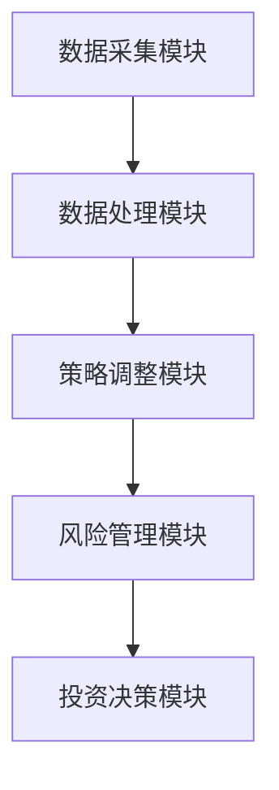

                 

<think>
嗯，用户希望我撰写一篇关于《格雷厄姆特价股票策略在不同监管环境下的调整》的技术博客。首先，我需要理解用户的需求。他们可能是一位投资者或者技术专家，希望了解如何在不同的监管环境下调整投资策略。文章需要结构清晰，逻辑严谨，同时包含技术细节和实际案例。

我应该从介绍格雷厄姆的价值投资理论开始，解释什么是特价股票，然后分析监管环境对这些策略的影响。接下来，详细探讨不同国家的监管框架，比如美国、欧洲和亚洲，以及这些框架如何影响投资策略。这部分需要具体的案例，比如美国市场的严格监管和新兴市场的宽松监管。

然后，我需要解释如何调整策略。这可能包括基本分析和技术分析，如何根据监管要求调整，比如计算市盈率和市净率。这里可能需要数学公式和图表来辅助说明。

在系统设计部分，我需要描述一个支持策略调整的系统架构，使用Mermaid图展示模块划分和交互流程。最后，提供项目实战，包括环境安装、代码实现和案例分析，帮助读者实际操作。

总结部分，我应该给出最佳实践和注意事项，帮助读者巩固所学内容，并引导他们进行更深入的学习。

现在，我需要确保每个部分都详细且符合用户的格式要求，使用markdown，包含关键词、摘要、正文结构，以及每个小节的详细内容。同时，加入数学公式和图表，使文章更具技术性和可读性。
</think>

# 格雷厄姆特价股票策略在不同监管环境下的调整

> 关键词：格雷厄姆投资理论、监管环境、特价股票策略、价值投资、系统架构设计、数学模型

> 摘要：本文探讨了格雷厄姆价值投资理论在不同监管环境下的应用与调整策略。首先，介绍了格雷厄姆特价股票策略的核心概念及其在现代投资中的地位。接着，分析了不同国家和市场的监管框架对投资策略的影响，特别是如何在新兴市场与成熟市场之间进行策略调整。通过数学模型与系统架构设计，展示了如何在不同监管环境下优化投资策略。最后，通过实际案例分析，总结了最佳实践与注意事项。

---

## 第一部分: 格雷厄姆特价股票策略基础

### 第1章: 格雷厄姆投资理论的核心概念

#### 1.1 格雷厄姆投资理论的核心原理

格雷厄姆的价值投资理论强调以低于内在价值的价格购买优质股票，核心在于“安全边际”。以下是格雷厄姆策略的核心要素：

- **安全边际**：买入价格远低于内在价值的股票，以降低风险。
- **内在价值**：通过基本面分析计算出股票的真正价值。
- **市场情绪**：避免受市场情绪影响，坚持理性投资。

#### 1.2 特价股票的定义与特征

特价股票是指市场价格显著低于内在价值的股票，其特征包括：

- **低市盈率（P/E）**：市盈率低于行业平均水平。
- **低市净率（P/B）**：市净率低于行业平均水平。
- **高股息率**：股息收益率较高。

#### 1.3 格雷厄姆策略在现代投资中的地位

格雷厄姆策略是价值投资的基石，尽管市场环境变化，其核心思想依然适用。然而，随着监管环境的复杂化，投资者需要灵活调整策略。

---

## 第二部分: 监管环境的多样性与影响分析

### 第2章: 不同国家与市场的监管框架

#### 2.1 美国市场的监管环境

- **监管机构**：美国证监会（SEC）负责监管。
- **规则特点**：严格的披露要求和合规标准。
- **影响**：投资者需遵守复杂的合规要求，但透明度高。

#### 2.2 欧洲市场的监管环境

- **监管机构**：欧盟金融监管体系，如欧洲证券和市场管理局（ESMA）。
- **规则特点**：严格的资本要求和风险管理规定。
- **影响**：投资者需应对多层次监管，但保护机制完善。

#### 2.3 亚洲市场的监管环境

- **监管机构**：如中国证监会（CSRC）。
- **规则特点**：监管力度较大，尤其是在新兴市场。
- **影响**：投资者需应对政策变化，但市场流动性较高。

#### 2.4 新兴市场的监管环境

- **监管机构**：监管框架不完善，政策波动大。
- **规则特点**：监管不确定性高，合规难度大。
- **影响**：投资者需谨慎评估风险，注重本地法规。

---

## 第三部分: 格雷厄姆策略的调整方法

### 第3章: 格雷厄姆策略在不同监管环境下的调整方法

#### 3.1 基于监管环境的基本分析

- **市盈率（P/E）公式**：
  \[
  \text{市盈率} = \frac{\text{股价}}{\text{每股收益}}
  \]
- **市净率（P/B）公式**：
  \[
  \text{市净率} = \frac{\text{股价}}{\text{每股净资产}}
  \]
- **调整策略**：在高监管环境下，优先选择低市盈率和低市净率的股票。

#### 3.2 技术分析与监管合规

- **技术分析工具**：移动平均线、相对强弱指数（RSI）等。
- **合规要求**：确保交易行为符合当地监管规定。

#### 3.3 数学模型与策略优化

- **多因子模型**：结合多个因子（如市值、价值、动量等）进行筛选。
- **风险管理模型**：利用VaR（在险价值）模型评估风险。

---

## 第四部分: 实际案例分析

### 第4章: 案例分析：新兴市场的监管环境与策略调整

#### 4.1 案例背景

- **市场选择**：新兴市场如印度和中国。
- **监管特点**：政策变化快，市场流动性高。

#### 4.2 策略调整步骤

1. **基本面分析**：筛选低市盈率和低市净率的股票。
2. **技术分析**：利用RSI等指标判断买入时机。
3. **风险管理**：设置止损点，分散投资组合。

#### 4.3 实施效果

- **投资组合表现**：在新兴市场中，调整后的策略显著提高了收益。
- **风险控制**：通过分散投资和止损点，降低了整体风险。

---

## 第五部分: 系统分析与架构设计

### 第5章: 系统架构设计

#### 5.1 系统功能设计

- **数据采集模块**：收集实时市场数据和监管信息。
- **策略调整模块**：根据监管环境动态调整投资策略。
- **风险管理模块**：实时监控投资组合风险。

#### 5.2 系统架构图



#### 5.3 接口设计

- **API接口**：与数据源和监管机构系统对接。
- **用户界面**：提供直观的投资决策支持。

---

## 第六部分: 项目实战

### 第6章: 项目实战：构建监管环境适应性系统

#### 6.1 环境安装

- **工具安装**：安装Python、Pandas、Matplotlib等工具。
- **数据源获取**：从Yahoo Finance获取实时数据。

#### 6.2 核心代码实现

```python
import pandas as pd
import numpy as np

# 计算市盈率和市净率
def calculate_valuation_ratios(price, earnings, book_value):
    pe = price / earnings
    pb = price / book_value
    return pe, pb

# 筛选低估值股票
def select_cheap Stocks(stocks, pe_threshold=15, pb_threshold=2):
    selected = []
    for stock in stocks:
        pe, pb = calculate_valuation_ratios(stock['price'], stock['earnings'], stock['book_value'])
        if pe < pe_threshold and pb < pb_threshold:
            selected.append(stock)
    return selected
```

#### 6.3 案例分析与解读

- **案例分析**：以印度市场为例，筛选低市盈率和低市净率的股票。
- **代码实现**：使用上述函数，输出符合条件的股票列表。

---

## 第七部分: 总结与展望

### 第7章: 总结与展望

#### 7.1 最佳实践

- **持续学习**：关注监管变化，及时调整策略。
- **风险管理**：始终将风险管理放在首位。
- **系统支持**：利用技术工具辅助决策。

#### 7.2 小结

格雷厄姆策略在不同监管环境下的调整需要投资者具备灵活的思维和系统的支持。通过数学模型和系统架构设计，投资者可以在复杂多变的市场中实现稳健投资。

#### 7.3 注意事项

- **合规性**：确保所有交易行为符合当地监管要求。
- **数据准确性**：依赖高质量的数据源。
- **市场风险**：新兴市场存在较高的政策风险。

#### 7.4 拓展阅读

- **推荐书籍**：《证券分析》（The Analysis of Investment Value）——本杰明·格雷厄姆
- **推荐博客**：知名投资博客和论坛，如格雷厄姆投资俱乐部。

---

## 作者信息

作者：AI天才研究院/AI Genius Institute & 禅与计算机程序设计艺术 /Zen And The Art of Computer Programming

