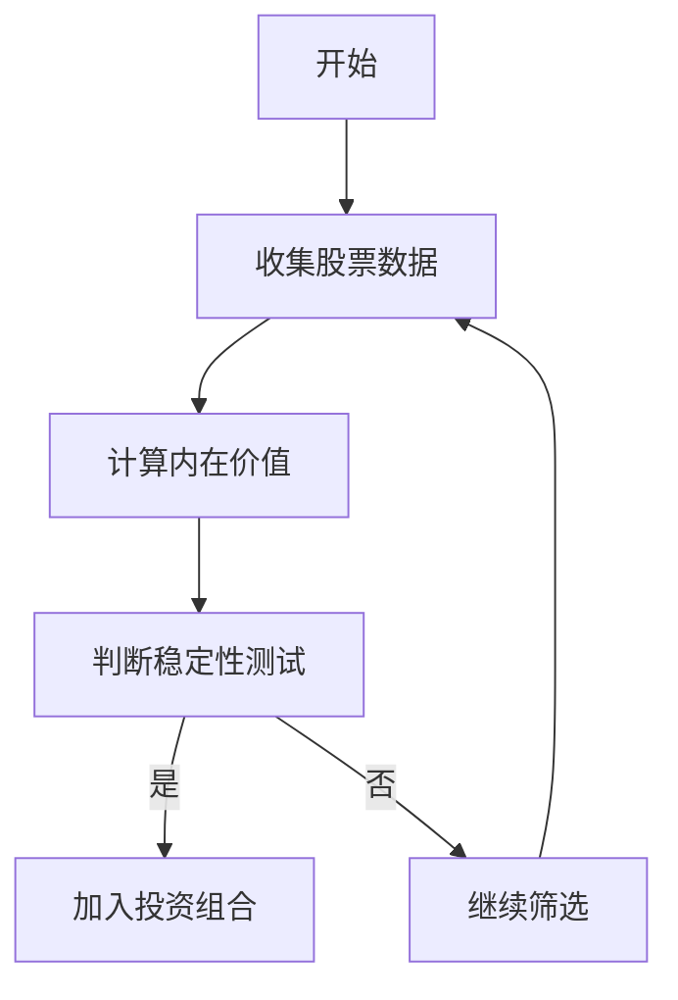
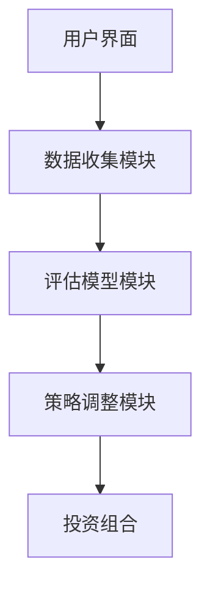

                 


# 格雷厄姆特价股票策略在不同监管环境下的适应

> 关键词：格雷厄姆策略，监管环境，股票投资，价值投资，算法优化

> 摘要：本文探讨了格雷厄姆特价股票策略在全球不同监管环境下的适应性，通过数学模型、算法实现、系统架构设计和实际案例分析，详细讲解了如何在不同市场环境下优化和调整策略，确保投资组合的稳健性和收益性。

---

# 第一部分: 格雷厄姆特价股票策略概述

## 第1章: 格雷厄姆特价股票策略的基本原理

### 1.1 格雷厄姆投资理念的核心思想

#### 1.1.1 价值投资的定义与特点
价值投资是一种以内在价值为导向的投资策略，核心在于寻找市场价格低于内在价值的股票。格雷厄姆的价值投资理念强调安全边际，即买入价格远低于内在价值的股票，以降低风险并确保长期收益。

#### 1.1.2 格雷厄姆的防御性投资策略
格雷厄姆倡导防御性投资，即通过分散投资、严格筛选和长期持有来降低风险。他认为，投资者应专注于寻找那些基本面稳定、财务健康且市场价格被低估的公司。

#### 1.1.3 特价股票的定义与筛选标准
特价股票是指市场价格远低于内在价值的股票。格雷厄姆提出了一套筛选标准，包括低市盈率、低市净率、高股息率等指标，以确保筛选出的股票具有较高的安全边际。

### 1.2 格雷厄姆策略在现代投资环境中的应用

#### 1.2.1 现代市场与传统投资策略的冲突
现代市场的复杂性（如高频交易、算法交易）使得传统的格雷厄姆策略面临挑战。例如，市场的波动性和信息不对称可能会影响策略的有效性。

#### 1.2.2 格雷厄姆策略的现代演变
随着市场的变化，格雷厄姆策略也在不断演变。例如，引入量化分析和大数据技术，以提高筛选效率和准确性。

#### 1.2.3 格雷厄姆策略的局限性与改进方向
格雷厄姆策略的局限性主要体现在对市场流动性和监管环境的适应性不足。因此，需要根据不同的监管环境进行策略调整。

---

## 第2章: 不同监管环境下的投资策略调整

### 2.1 全球主要市场的监管框架对比

#### 2.1.1 美国市场的监管特点
美国市场监管严格，注重信息披露和合规性。投资者在选择股票时，需遵守SEC的规定，确保投资行为的合法性。

#### 2.1.2 欧洲市场的监管特点
欧洲市场注重投资者保护和可持续投资。例如，ESG（环境、社会、治理）因素在投资决策中的重要性日益增加。

#### 2.1.3 亚洲市场的监管特点
亚洲市场（如中国、日本）监管环境较为复杂，常受到政府政策的影响。例如，中国的市场监管政策对投资者策略有显著影响。

### 2.2 监管环境对投资策略的影响

#### 2.2.1 监管政策对股票估值的影响
例如，某些监管政策可能限制某些行业的增长潜力，从而影响股票的内在价值。

#### 2.2.2 税收政策对投资决策的影响
税收政策直接影响投资成本和收益。例如，资本利得税的高低会影响投资者的策略选择。

#### 2.2.3 市场流动性与监管的关系
监管政策可能影响市场的流动性，进而影响股票的买卖价差和交易成本。

### 2.3 不同监管环境下的策略调整

#### 2.3.1 美国市场的策略调整
在美国市场，投资者需关注SEC的监管规定，同时结合市场流动性进行策略优化。

#### 2.3.2 欧洲市场的策略调整
在欧洲市场，需将ESG因素纳入考量，同时适应严格的投资者保护政策。

#### 2.3.3 亚洲市场的策略调整
在亚洲市场，需密切关注政府政策变化，同时灵活应对市场的流动性波动。

---

# 第二部分: 格雷厄姆策略的数学模型与算法实现

## 第3章: 格雷厄姆策略的数学模型

### 3.1 格雷厄姆策略的核心公式

#### 3.1.1 内在价值计算公式
$$\text{内在价值} = \frac{\text{每股收益} \times (8.5 + \text{市盈率})}{\text{市盈率}}$$

#### 3.1.2 稳定性测试公式
$$\text{稳定性测试} = \frac{\text{内在价值}}{\text{市场价格}} > 2$$

### 3.2 格雷厄姆策略的算法流程

#### 3.2.1 算法流程图（Mermaid）


---

## 第4章: 系统分析与架构设计方案

### 4.1 系统功能设计

#### 4.1.1 数据收集模块
- 从多个数据源收集股票数据，包括市盈率、市净率、股息率等。

#### 4.1.2 评估模型模块
- 使用格雷厄姆模型计算内在价值和稳定性测试。

#### 4.1.3 策略调整模块
- 根据监管环境调整投资策略。

### 4.2 系统架构设计

#### 4.2.1 系统架构图（Mermaid）


---

## 第5章: 项目实战

### 5.1 环境安装

```bash
pip install pandas numpy matplotlib
```

### 5.2 核心代码实现

#### 5.2.1 策略筛选代码
```python
import pandas as pd

def calculate_intrinsic_value(eps, pe_ratio):
    return (eps * (8.5 + pe_ratio)) / pe_ratio

def greaham_strategy(screening_data):
    selected_stocks = []
    for stock in screening_data:
        iv = calculate_intrinsic_value(stock['eps'], stock['pe_ratio'])
        if iv / stock['price'] > 2:
            selected_stocks.append(stock['ticker'])
    return selected_stocks
```

#### 5.2.2 数据分析代码
```python
import pandas as pd

# 加载数据
data = pd.read_csv('stock_data.csv')

# 筛选股票
selected = greaham_strategy(data)
print(selected)
```

### 5.3 实际案例分析

#### 5.3.1 美国市场的案例分析
假设在2023年，某投资者在美国市场使用格雷厄姆策略筛选股票，需考虑SEC的监管规定，选择那些符合稳定性测试且合规的股票。

#### 5.3.2 欧洲市场的案例分析
在欧洲市场，需将ESG因素纳入考量，选择那些在环保方面表现良好的公司。

#### 5.3.3 亚洲市场的案例分析
在亚洲市场，需关注政府政策变化，选择那些受益于政策支持的行业。

---

## 第6章: 最佳实践、小结、注意事项与拓展阅读

### 6.1 最佳实践
- 定期更新策略，适应市场变化。
- 结合监管环境，灵活调整策略。

### 6.2 小结
本文通过数学模型、算法实现和实际案例分析，详细讲解了格雷厄姆策略在不同监管环境下的适应性。

### 6.3 注意事项
- 监管环境的变化可能会影响策略的有效性。
- 数据质量和准确性直接影响策略结果。

### 6.4 拓展阅读
- 格雷厄姆的经典著作《 Intelligent Investor》
- 量化投资相关的技术书籍

---

# 作者：AI天才研究院 & 禅与计算机程序设计艺术

