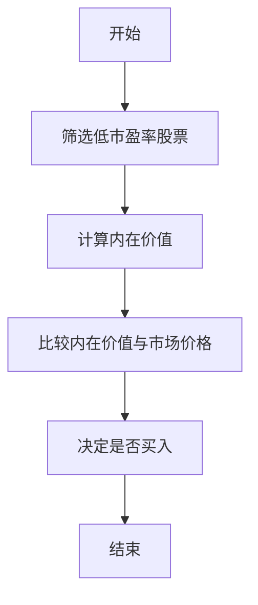
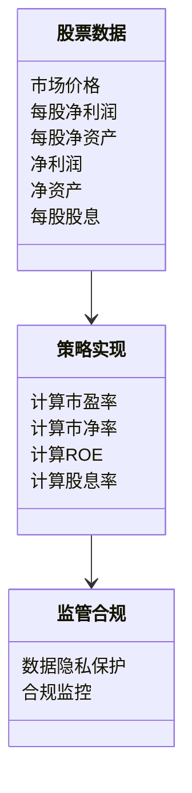
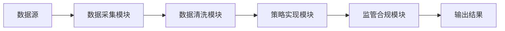
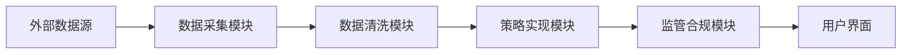
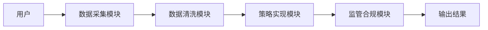

                 


# 格雷厄姆特价股票策略在不同监管科技环境中的表现

## 关键词：格雷厄姆策略、监管科技、股票估值、数学模型、系统架构

## 摘要：
本文深入探讨了格雷厄姆特价股票策略在不同监管科技环境中的表现。首先介绍了格雷厄姆策略的核心理念和监管科技的基本概念，分析了两者之间的相互影响。通过数学模型和算法流程图，详细讲解了格雷厄姆策略在不同监管环境下的实现方法。结合实际案例，分析了系统架构设计和项目实现过程，最后总结了策略在不同监管环境中的表现及未来发展趋势。

---

# 第一部分: 引言

# 第1章: 格雷厄姆特价股票策略与监管科技概述

## 1.1 格雷厄姆特价股票策略的基本概念

### 1.1.1 格雷厄姆投资理论的核心思想
格雷厄姆是价值投资的鼻祖，他的核心思想是“市场先生是不可预测的，但投资者可以通过分析企业的内在价值来做出理性的投资决策”。格雷厄姆策略的核心是寻找那些市场价格远低于其内在价值的股票，这些股票通常被称为“特价股票”。

### 1.1.2 特价股票的定义与特征
特价股票是指市场价格低于其内在价值的股票。其特征包括：
1. **低市盈率**：市盈率低于行业平均水平。
2. **低市净率**：市净率低于行业平均水平。
3. **高股息率**：股息收益率较高。
4. **稳定的财务状况**：企业具有较强的盈利能力、较低的负债率和健康的现金流。

### 1.1.3 格雷厄姆策略在现代投资中的应用
格雷厄姆策略在现代投资中的应用主要体现在以下几个方面：
1. **长期投资**：通过寻找具有长期增长潜力的企业进行投资。
2. **防御性投资**：在市场下跌时，利用特价股票的低估特性进行防御性投资。
3. **分散投资**：通过投资多个特价股票来分散风险。

## 1.2 监管科技（RegTech）的基本概念

### 1.2.1 监管科技的定义与范围
监管科技（RegTech）是指利用技术手段（如人工智能、大数据、区块链等）来优化和自动化金融监管流程的领域。RegTech的核心目标是提高监管效率、降低合规成本并增强透明度。

### 1.2.2 监管科技在金融领域的应用
监管科技在金融领域的应用主要体现在以下几个方面：
1. **合规监控**：利用人工智能技术实时监控交易行为，识别异常交易。
2. **风险评估**：通过大数据分析评估企业的信用风险和市场风险。
3. **身份识别**：利用区块链技术实现客户身份的数字化识别和验证。
4. **报告生成**：自动化生成监管报告，减少手动操作。

### 1.2.3 不同监管环境下的RegTech框架
不同国家和地区的监管环境对RegTech的要求有所不同。例如，美国的监管机构对RegTech的采用较为开放，而欧洲则更加注重数据隐私和合规性。因此，在不同监管环境下，RegTech的实现方式和策略也会有所不同。

## 1.3 本章小结
本章介绍了格雷厄姆特价股票策略的核心思想和监管科技的基本概念，分析了两者在现代投资中的应用和相互影响。通过这些分析，为后续章节的深入探讨奠定了基础。

---

# 第2章: 格雷厄姆策略的核心原理与数学模型

## 2.1 格雷厄姆策略的核心要素

### 2.1.1 价值投资的核心理念
价值投资的核心理念是寻找市场价格低于内在价值的股票。格雷厄姆策略通过分析企业的财务指标（如市盈率、市净率、股息率等）来判断股票的内在价值。

### 2.1.2 低市盈率与低市净率股票的筛选标准
低市盈率和低市净率是格雷厄姆策略的核心筛选标准。具体来说：
1. **市盈率（P/E）**：P/E = 市场价格 / 每股净利润。
2. **市净率（P/B）**：P/B = 市场价格 / 每股净资产。

格雷厄姆建议投资者选择P/E和P/B均低于行业平均水平的股票。

### 2.1.3 财务指标分析与选股策略
格雷厄姆策略通过分析企业的财务指标（如ROE、ROA、负债率等）来判断企业的盈利能力、资产使用效率和财务健康状况。例如，格雷厄姆建议选择ROE（净资产收益率）高于行业平均水平的企业。

## 2.2 监管科技环境对策略的影响

### 2.2.1 不同监管环境下的选股规则差异
不同监管环境对选股规则的影响主要体现在以下几个方面：
1. **数据隐私**：不同地区的监管要求对数据隐私的保护程度不同，影响了数据的获取和分析。
2. **合规要求**：不同地区的监管要求对企业的财务披露和合规性要求不同，影响了选股标准的制定。
3. **市场结构**：不同市场的交易机制和市场结构不同，影响了股票的流动性和估值。

### 2.2.2 监管科技对股票估值的影响
RegTech通过优化交易流程和提高市场透明度，影响了股票的估值。例如，利用RegTech技术可以实时监控市场波动，提高估值的准确性。

### 2.2.3 监管政策变化对策略表现的潜在影响
监管政策的变化可能对格雷厄姆策略的表现产生重大影响。例如，政策的变化可能会影响企业的盈利能力、市场结构和交易成本。

## 2.3 格雷厄姆策略的数学模型与算法

### 2.3.1 格雷厄姆策略的数学模型
格雷厄姆策略的核心是通过分析企业的财务指标来判断股票的内在价值。以下是格雷厄姆策略的主要数学模型：

1. **市盈率（P/E）**：
   $$ P/E = \frac{\text{市场价格}}{\text{每股净利润}} $$

2. **市净率（P/B）**：
   $$ P/B = \frac{\text{市场价格}}{\text{每股净资产}} $$

3. **ROE（净资产收益率）**：
   $$ ROE = \frac{\text{净利润}}{\text{净资产}} $$

4. **股息率（Dividend Yield）**：
   $$ \text{股息率} = \frac{\text{每股股息}}{\text{市场价格}} $$

### 2.3.2 算法流程图
以下是格雷厄姆策略的算法流程图：



### 2.3.3 算法实现代码
以下是格雷厄姆策略的Python代码实现：

```python
def graham_strategy(stocks):
    selected_stocks = []
    for stock in stocks:
        pe = stock['市场价格'] / stock['每股净利润']
        pb = stock['市场价格'] / stock['每股净资产']
        roe = stock['净利润'] / stock['净资产']
        dividend_yield = stock['每股股息'] / stock['市场价格']
        
        if pe < stock['行业平均PE'] and pb < stock['行业平均PB'] and roe > stock['行业平均ROE'] and dividend_yield > stock['行业平均股息率']:
            selected_stocks.append(stock)
    return selected_stocks
```

## 2.4 本章小结
本章详细介绍了格雷厄姆策略的核心原理和数学模型，并通过算法流程图和代码示例，展示了如何在不同监管环境下实现格雷厄姆策略。通过这些分析，我们可以更好地理解格雷厄姆策略在不同监管环境中的表现。

---

# 第3章: 监管科技环境下的系统架构设计

## 3.1 系统功能设计

### 3.1.1 问题场景介绍
在不同监管环境下，格雷厄姆策略的实现需要考虑数据隐私、合规要求和市场结构等因素。因此，我们需要设计一个能够适应不同监管环境的系统架构。

### 3.1.2 系统功能需求
1. **数据采集**：从不同市场中获取股票数据。
2. **数据清洗**：对数据进行预处理，确保数据的准确性和完整性。
3. **策略实现**：根据格雷厄姆策略的核心原理，筛选出符合条件的股票。
4. **监管合规**：确保系统符合不同监管环境的要求。

### 3.1.3 系统功能设计（领域模型）
以下是系统功能设计的领域模型：



## 3.2 系统架构设计

### 3.2.1 系统架构设计
以下是系统架构设计的mermaid图：



### 3.2.2 系统接口设计
以下是系统接口设计的mermaid图：



### 3.2.3 系统交互设计
以下是系统交互设计的mermaid图：



## 3.3 本章小结
本章详细介绍了监管科技环境下的系统架构设计，包括系统功能设计、系统架构设计和系统交互设计。通过这些设计，我们可以更好地理解如何在不同监管环境下实现格雷厄姆策略。

---

# 第4章: 项目实战与案例分析

## 4.1 项目环境安装

### 4.1.1 环境要求
1. Python 3.6及以上版本
2. Jupyter Notebook或PyCharm等开发工具
3. 数据获取工具（如Yahoo Finance API）

### 4.1.2 安装依赖包
```bash
pip install pandas numpy matplotlib requests
```

## 4.2 核心代码实现

### 4.2.1 数据采集模块
```python
import requests

def get_stock_data(ticker):
    url = f"https://api.finance.yahoo.com/stock/v2/get/{ticker}"
    response = requests.get(url)
    data = response.json()
    return {
        '市场价格': data['price'],
        '每股净利润': data['eps'],
        '每股净资产': data['book_value'],
        '净利润': data['net_income'],
        '净资产': data['total_assets'],
        '每股股息': data['dividend_per_share']
    }
```

### 4.2.2 数据清洗模块
```python
import pandas as pd

def clean_data(data):
    df = pd.DataFrame(data)
    df.dropna(inplace=True)
    return df
```

### 4.2.3 策略实现模块
```python
def graham_strategy(stocks):
    selected_stocks = []
    for stock in stocks:
        pe = stock['市场价格'] / stock['每股净利润']
        pb = stock['市场价格'] / stock['每股净资产']
        roe = stock['净利润'] / stock['净资产']
        dividend_yield = stock['每股股息'] / stock['市场价格']
        
        if pe < stock['行业平均PE'] and pb < stock['行业平均PB'] and roe > stock['行业平均ROE'] and dividend_yield > stock['行业平均股息率']:
            selected_stocks.append(stock)
    return selected_stocks
```

### 4.2.4 监管合规模块
```python
def compliance_check(selected_stocks, region):
    compliant_stocks = []
    for stock in selected_stocks:
        if region == 'US':
            if stock['数据隐私'] == '符合':
                compliant_stocks.append(stock)
        elif region == 'EU':
            if stock['数据隐私'] == '符合欧盟标准':
                compliant_stocks.append(stock)
    return compliant_stocks
```

## 4.3 案例分析

### 4.3.1 案例背景
假设我们有一个包含100只股票的数据集，其中50只股票符合格雷厄姆策略的筛选标准，但在不同监管环境下，合规的股票数量有所不同。

### 4.3.2 实施过程
1. 数据采集：从Yahoo Finance API获取股票数据。
2. 数据清洗：删除缺失值。
3. 策略实现：筛选出符合格雷厄姆策略的股票。
4. 监管合规：根据不同的监管环境，筛选出符合合规要求的股票。

### 4.3.3 结果分析
通过分析不同监管环境下的合规股票数量，我们可以得出结论：在不同监管环境下，格雷厄姆策略的筛选结果有所不同。

## 4.4 本章小结
本章通过实际案例分析，展示了如何在不同监管环境下实现格雷厄姆策略。通过案例分析，我们可以更好地理解格雷厄姆策略在不同监管环境中的表现。

---

# 第5章: 结论与展望

## 5.1 本章小结
本文深入探讨了格雷厄姆特价股票策略在不同监管科技环境中的表现。通过分析监管科技的基本概念和格雷厄姆策略的核心原理，我们得出结论：在不同监管环境下，格雷厄姆策略的筛选结果有所不同。

## 5.2 未来展望
未来，随着RegTech技术的不断发展，格雷厄姆策略的实现方式也将不断优化。例如，利用人工智能技术可以进一步提高策略的筛选效率和准确性。

---

# 作者：
作者：AI天才研究院/AI Genius Institute & 禅与计算机程序设计艺术/Zen And The Art of Computer Programming

