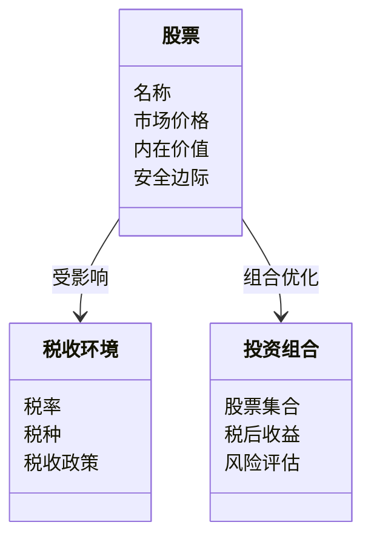
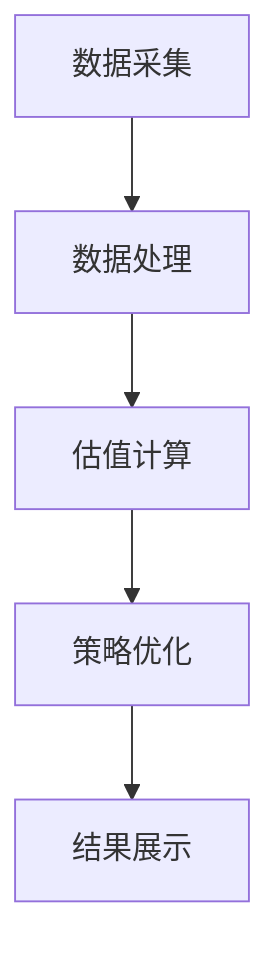
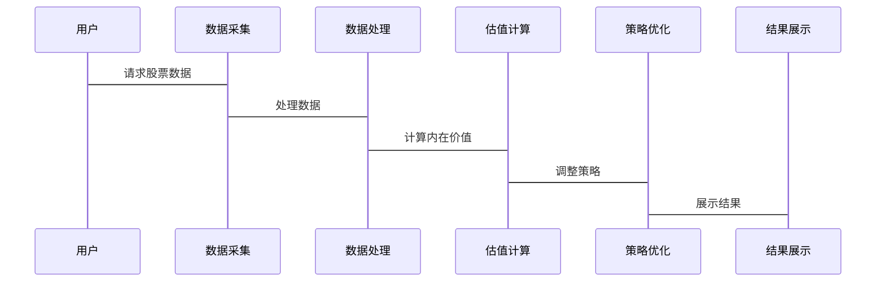

                 


# 格雷厄姆特价股票策略在不同税收环境下的调整

> 关键词：格雷厄姆特价股票策略，税收环境，投资策略，股票估值，安全边际

> 摘要：本文深入探讨了格雷厄姆特价股票策略在不同税收环境下的调整方法。首先介绍了格雷厄姆策略的核心概念，包括安全边际和内在价值。接着分析了税收环境对股票投资的具体影响，包括股息税和资本利得税。在此基础上，提出了在不同税收环境下调整策略的具体方法，包括内在价值的重新评估和安全边际的调整。最后，通过数学模型和算法详细讲解了如何在不同税收环境下优化投资决策。

---

# 第一部分: 格雷厄姆特价股票策略基础

## 第1章: 格雷厄姆特价股票策略概述

### 1.1 格雷厄姆投资理论的核心概念

#### 1.1.1 安全边际的定义与计算

安全边际是格雷厄姆策略的核心概念之一，是指股票市场价格与内在价值之间的差距。安全边际越大，投资的风险越小。计算公式如下：

$$ \text{安全边际} = \text{市场价格} - \text{内在价值} $$

安全边际反映了市场对股票价值的低估程度，投资者应选择安全边际较大的股票进行投资。

#### 1.1.2 内在价值的评估方法

内在价值是股票的真实价值，与市场波动无关。格雷厄姆常用的内在价值评估方法包括：

1. **股息贴现模型（DDM）**：基于股息的未来现金流折现。
2. **可比公司法**：通过与同行业公司比较，评估目标公司的内在价值。
3. **资产重置价值法**：评估公司资产的重置成本。

#### 1.1.3 格雷厄姆策略的基本原则

格雷厄姆策略强调以下基本原则：
- 投资于低估的股票。
- 保持投资组合的分散化。
- 留意安全边际，避免过度风险。

### 1.2 特价股票的特征与识别

#### 1.2.1 特价股票的定义与分类

特价股票是指市场价格低于内在价值的股票。根据低估程度的不同，可以将特价股票分为：
1. **极度低估股票**：安全边际超过30%。
2. **中度低估股票**：安全边际在10%-30%之间。
3. **轻度低估股票**：安全边际在5%-10%之间。

#### 1.2.2 市场低估的判断标准

判断股票是否低估，通常可以通过以下标准：
- **市盈率（P/E）**：低于行业平均水平。
- **市净率（P/B）**：低于行业平均水平。
- **股息率**：高于行业平均水平。

#### 1.2.3 特价股票的筛选方法

筛选特价股票的方法包括：
1. **基本面分析**：评估公司的财务状况、盈利能力。
2. **技术分析**：通过K线图判断股票的走势。
3. **估值指标**：结合市盈率、市净率等指标筛选低估股票。

## 第2章: 税收环境对投资策略的影响

### 2.1 税收环境的多样性与复杂性

#### 2.1.1 不同国家的税收政策差异

不同国家的税收政策差异较大，例如：
- **美国**：资本利得税税率较低，股息税根据收入 bracket 确定。
- **中国**：资本利得税暂未开征，股息税按 20% 征收。
- **英国**：资本利得税税率较高，股息税按 30% 征收。

#### 2.1.2 税收环境对企业投资决策的影响

税收政策直接影响企业的盈利能力，进而影响股票的价值。例如：
- **高税率环境**：企业税后利润减少，股票内在价值下降。
- **低税率环境**：企业税后利润增加，股票内在价值上升。

#### 2.1.3 税收对股票估值的调整作用

税收对股票估值的调整作用主要体现在以下几个方面：
1. **影响股息的可分配性**：高股息税会减少股息的可分配金额。
2. **影响资本利得的实现**：高资本利得税会降低资本利得的实际收益。

### 2.2 税收对股票投资的具体影响

#### 2.2.1 股息税对投资收益的影响

股息税对投资收益的影响可以通过以下公式计算：

$$ \text{税后股息收益} = \text{股息} \times (1 - \text{股息税率}) $$

例如，假设股息为 $1，股息税率为 30%，则税后股息收益为 $0.7。

#### 2.2.2 资本利得税对投资策略的影响

资本利得税对投资策略的影响体现在卖出时机的选择上。高资本利得税环境下，投资者更倾向于长期持有，以避免短期资本利得税。

#### 2.2.3 税收优惠政策与投资机会

税收优惠政策可以为投资者提供额外的收益。例如，某些地区的税收优惠可以降低整体税负，增加投资回报。

## 第3章: 格雷厄姆策略在不同税收环境下的调整

### 3.1 税收对格雷厄姆策略的核心影响

#### 3.1.1 税收对内在价值计算的影响

税收对内在价值计算的影响主要体现在股息和资本利得的税后收益上。例如，高股息税率会降低股息的可分配金额，从而影响股息贴现模型的评估结果。

#### 3.1.2 税收对安全边际的影响

税收对安全边际的影响体现在市场价格与内在价值的差距上。高税率环境下，内在价值可能被低估，从而影响安全边际的计算。

#### 3.1.3 税收对投资组合优化的影响

税收对投资组合优化的影响体现在资产配置和风险控制上。例如，高资本利得税环境下，投资者可能更倾向于选择股息收益率较高的股票。

### 3.2 不同税收环境下的策略调整方法

#### 3.2.1 高税率环境下的策略调整

在高税率环境下，投资者可以通过以下方式调整策略：
- **优先选择股息收益率高的股票**：降低资本利得税的影响。
- **长期持有策略**：避免短期资本利得税。
- **利用税收优惠政策**：选择税收优惠区域或产品。

#### 3.2.2 低税率环境下的策略优化

在低税率环境下，投资者可以通过以下方式优化策略：
- **短期交易策略**：利用低资本利得税实现快速收益。
- **高成长性股票投资**：通过资本利得实现高收益。
- **分散投资**：降低税收政策变化带来的风险。

#### 3.2.3 税收优惠政策下的投资机会

在税收优惠政策下，投资者可以关注以下投资机会：
- **税收优惠区域**：如某些自由贸易区或经济特区。
- **税收优惠产品**：如政府债券、优惠税率的股票。

---

# 第二部分: 格雷厄姆策略调整的数学模型与算法

## 第4章: 格雷厄姆策略的数学模型

### 4.1 内在价值的数学公式

#### 4.1.1 格雷厄姆内在价值计算公式

格雷厄姆的内在价值计算公式如下：

$$ V = \frac{D}{k} $$

其中，\( D \) 是股息，\( k \) 是贴现率。

#### 4.1.2 税收对内在价值的影响公式

考虑税收影响后的内在价值公式为：

$$ V_{\text{tax}} = V \times (1 - t) $$

其中，\( t \) 是税率。

#### 4.1.3 调整后的内在价值计算公式

综合考虑税收和安全边际后的内在价值公式为：

$$ V_{\text{adjusted}} = V_{\text{tax}} + \text{安全边际} $$

### 4.2 安全边际的数学模型

#### 4.2.1 安全边际的定义与计算公式

安全边际的计算公式为：

$$ \text{安全边际} = \text{市场价格} - V_{\text{adjusted}} $$

#### 4.2.2 税收对安全边际的影响模型

税收对安全边际的影响模型如下：

$$ \text{安全边际}_{\text{tax}} = (\text{市场价格} - V_{\text{tax}}) \times (1 - t) $$

#### 4.2.3 调整后安全边际的计算方法

调整后安全边际的计算方法为：

$$ \text{安全边际}_{\text{adjusted}} = \text{安全边际}_{\text{tax}} + \text{额外安全边际} $$

## 第5章: 税收环境下的策略调整算法

### 5.1 税收对股票估值的调整算法

#### 5.1.1 税收对股票价格的影响算法

1. 计算股票的内在价值 \( V \)。
2. 考虑税率 \( t \) 调整内在价值，得到 \( V_{\text{tax}} = V \times (1 - t) \)。
3. 计算安全边际 \( \text{安全边际} = \text{市场价格} - V_{\text{tax}} \)。
4. 调整后的安全边际 \( \text{安全边际}_{\text{adjusted}} = \text{安全边际} \times (1 - t) \)。

#### 5.1.2 税收对投资收益的影响算法

1. 计算股息税后收益 \( \text{税后股息} = \text{股息} \times (1 - t) \)。
2. 计算资本利得税后收益 \( \text{税后资本利得} = \text{资本利得} \times (1 - t) \)。
3. 总收益 \( \text{总收益} = \text{税后股息} + \text{税后资本利得} \)。

#### 5.1.3 税收对投资组合优化的影响算法

1. 确定投资组合中各资产的税率 \( t \)。
2. 计算各资产的税后收益。
3. 根据税后收益优化投资组合。

### 5.2 格雷厄姆策略调整的具体算法

#### 5.2.1 内在价值的调整算法

1. 计算股票的内在价值 \( V \)。
2. 根据税率 \( t \) 调整内在价值，得到 \( V_{\text{tax}} = V \times (1 - t) \)。
3. 调整后的内在价值 \( V_{\text{adjusted}} = V_{\text{tax}} + \text{安全边际} \)。

#### 5.2.2 安全边际的调整算法

1. 计算安全边际 \( \text{安全边际} = \text{市场价格} - V \)。
2. 根据税率 \( t \) 调整安全边际，得到 \( \text{安全边际}_{\text{tax}} = \text{安全边际} \times (1 - t) \)。
3. 调整后的安全边际 \( \text{安全边际}_{\text{adjusted}} = \text{安全边际}_{\text{tax}} + \text{额外安全边际} \)。

---

# 第三部分: 系统分析与架构设计方案

## 第6章: 系统分析与架构设计

### 6.1 问题场景介绍

格雷厄姆策略在不同税收环境下的调整需要一个综合的分析系统，包括数据采集、估值计算、策略优化和结果展示等功能。

### 6.2 系统功能设计

#### 6.2.1 领域模型设计

以下是领域模型的类图（使用 mermaid）：



#### 6.2.2 系统架构设计

以下是系统架构设计的架构图（使用 mermaid）：



#### 6.2.3 系统接口设计

系统接口设计包括：
1. 数据接口：股票数据接口、税收政策接口。
2. 用户接口：用户输入接口、结果展示接口。

#### 6.2.4 系统交互设计

以下是系统交互的序列图（使用 mermaid）：



---

# 第四部分: 项目实战

## 第7章: 项目实战

### 7.1 环境安装与配置

#### 7.1.1 安装Python环境

安装 Python 和必要的库，例如 pandas、numpy、scipy。

#### 7.1.2 安装数据分析工具

安装 Jupyter Notebook 或其他数据分析工具。

### 7.2 核心功能实现

#### 7.2.1 内在价值计算代码

```python
import pandas as pd

def calculate_intrinsic_value(dividend, discount_rate):
    return dividend / discount_rate

# 示例
dividend = 1.0
discount_rate = 0.1
intrinsic_value = calculate_intrinsic_value(dividend, discount_rate)
print("内在价值:", intrinsic_value)
```

#### 7.2.2 安全边际计算代码

```python
def calculate_margin_of_safety(price, intrinsic_value):
    return price - intrinsic_value

# 示例
price = 50.0
intrinsic_value = 40.0
margin_of_safety = calculate_margin_of_safety(price, intrinsic_value)
print("安全边际:", margin_of_safety)
```

### 7.3 代码解读与分析

#### 7.3.1 内在价值计算的解读

内在价值计算公式为 \( V = D / k \)，其中 \( D \) 是股息，\( k \) 是贴现率。例如，股息为 $1，贴现率为 10%，则内在价值为 $10。

#### 7.3.2 安全边际计算的解读

安全边际计算公式为 \( \text{安全边际} = \text{市场价格} - V \)。例如，市场价格为 $50，内在价值为 $40，则安全边际为 $10。

### 7.4 实际案例分析

#### 7.4.1 案例分析

假设某股票的市场价格为 $50，内在价值为 $40，税率为 30%。计算调整后的内在价值和安全边际：

1. 调整后的内在价值 \( V_{\text{tax}} = 40 \times (1 - 0.3) = 28 \)。
2. 调整后的安全边际 \( \text{安全边际}_{\text{adjusted}} = 50 - 28 = 22 \)。

---

# 第五部分: 总结与展望

## 第8章: 总结与展望

### 8.1 内容总结

本文详细探讨了格雷厄姆特价股票策略在不同税收环境下的调整方法，包括内在价值的重新评估和安全边际的调整。通过数学模型和算法，展示了如何在不同税收环境下优化投资决策。

### 8.2 最佳实践 tips

- **分散投资**：降低税收政策变化带来的风险。
- **长期持有**：避免短期资本利得税。
- **关注税收优惠政策**：利用税收优惠增加投资收益。

### 8.3 未来展望

未来的研究可以进一步探讨税收对投资组合优化的影响，以及如何在不同税收环境下实现最优投资组合。

---

# 作者：AI天才研究院/AI Genius Institute & 禅与计算机程序设计艺术 /Zen And The Art of Computer Programming

