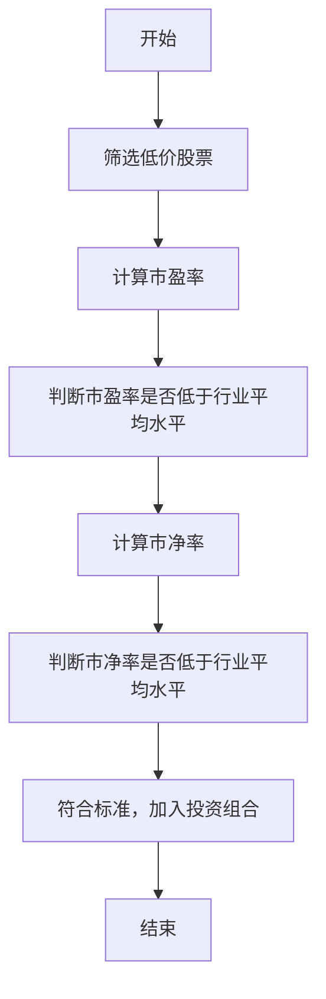
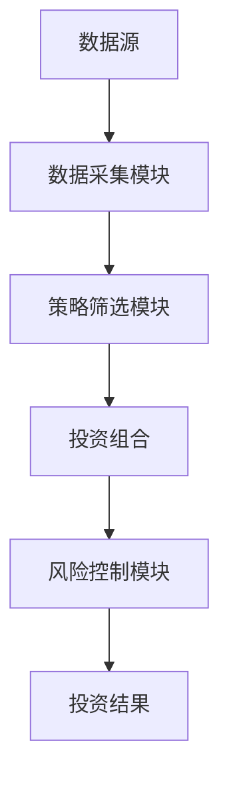

                 


# 格雷厄姆特价股票策略在不同经济体制下的表现

## 关键词：
- 格雷厄姆投资策略
- 特价股票
- 不同经济体制
- 股票估值模型
- 价值投资

## 摘要：
本文探讨了格雷厄姆特价股票策略在不同经济体制下的表现，通过数学模型和实际案例分析，深入剖析了该策略在资本主义、社会主义市场经济以及计划经济等不同经济环境中的应用效果。文章结合理论与实践，详细解释了格雷厄姆策略的核心原理、筛选算法及风险控制机制，并通过系统架构设计和项目实战，展示了如何在实际投资中应用该策略。最后，本文总结了格雷厄姆策略的优势与局限性，并展望了其未来的发展前景。

---

# 第一部分: 格雷厄姆特价股票策略的背景与基础

## 第1章: 格雷厄姆特价股票策略概述

### 1.1 格雷厄姆投资理念的核心思想

#### 1.1.1 价值投资的基本概念
价值投资是一种以基本面分析为基础的投资策略，强调以低于内在价值的价格买入优质股票。格雷厄姆的价值投资理论强调安全边际和长期持有的理念，认为市场先生是“疯狂的”，投资者应该以理性的方式寻找被市场低估的股票。

#### 1.1.2 格雷厄姆的"烟屁股"理论
格雷厄姆的“烟屁股”理论形象地描述了价值投资者的态度：就像一个捡烟屁股的人，只关心烟屁股的价值，而不在意其他人是否在吸烟。这种心态要求投资者专注于寻找被市场低估的股票，而不是被市场炒作的概念股。

#### 1.1.3 特价股票的定义与特征
特价股票是指市场价格低于其内在价值的股票。其特征包括低市盈率（PE）、低市净率（PB）、高股息率等。格雷厄姆认为，这些股票通常被市场忽视或低估，但具有较高的安全边际。

### 1.2 格雷厄姆策略的核心要素

#### 1.2.1 股票内在价值的计算公式
格雷厄姆的内在价值计算公式基于企业的未来现金流，通过折现率计算股票的合理估值：
$$ V = \frac{E}{1 + r} $$
其中，$E$ 表示企业未来现金流，$r$ 表示折现率。

#### 1.2.2 市盈率与市净率的分析方法
市盈率（PE）和市净率（PB）是衡量股票价值的重要指标：
$$ PE = \frac{P}{E} $$
$$ PB = \frac{P}{B} $$
其中，$P$ 是股票价格，$E$ 是每股收益，$B$ 是每股净资产。

#### 1.2.3 股票安全边际的概念
安全边际是指股票的市场价格低于其内在价值的部分。格雷厄姆认为，只有当股票价格低于其内在价值时，才具有投资价值。安全边际越大，投资风险越小。

### 1.3 格雷厄姆策略的适用场景

#### 1.3.1 牛市与熊市中的策略差异
在牛市中，市场情绪高涨，股票价格可能被高估，因此格雷厄姆策略可能表现不佳。在熊市中，市场恐慌，股票价格被低估，格雷厄姆策略可能表现较好。

#### 1.3.2 不同经济周期下的策略调整
在经济繁荣期，企业盈利增长快，市盈率和市净率可能偏高，因此需要调整筛选条件。在经济衰退期，企业盈利下降，市盈率和市净率可能偏低，因此需要降低筛选条件。

#### 1.3.3 特价股票在不同市场环境中的表现
在成熟市场中，格雷厄姆策略可能表现稳定；在新兴市场中，由于市场波动较大，格雷厄姆策略可能面临更大的风险。

---

## 第2章: 格雷厄姆策略的数学模型与算法原理

### 2.1 格雷厄姆股票估值模型

#### 2.1.1 内在价值计算公式
格雷厄姆的内在价值计算公式基于企业的未来现金流，通过折现率计算股票的合理估值：
$$ V = \frac{E}{1 + r} $$
其中，$E$ 表示企业未来现金流，$r$ 表示折现率。

#### 2.1.2 市盈率与市净率的对比分析
市盈率（PE）和市净率（PB）是衡量股票价值的重要指标：
$$ PE = \frac{P}{E} $$
$$ PB = \frac{P}{B} $$
其中，$P$ 是股票价格，$E$ 是每股收益，$B$ 是每股净资产。

#### 2.1.3 安全边际的计算公式
安全边际可以通过以下公式计算：
$$ \text{安全边际} = \text{内在价值} - \text{市场价格} $$

### 2.2 格雷厄姆策略的筛选算法

#### 2.2.1 筛选条件的逻辑流程图


#### 2.2.2 算法实现的Python代码
```python
def graham_strategy(stocks):
    selected = []
    for stock in stocks:
        pe = stock.pe
        pb = stock.pb
        if pe < industry_pe_avg and pb < industry_pb_avg:
            selected.append(stock)
    return selected
```

### 2.3 格雷厄姆策略的风险控制模型

#### 2.3.1 风险分散的数学模型
通过分散投资来降低风险，风险分散的数学模型可以表示为：
$$ R = \sum_{i=1}^{n} w_i * r_i $$
其中，$w_i$ 是第 $i$ 个资产的权重，$r_i$ 是第 $i$ 个资产的风险收益。

#### 2.3.2 风险控制的策略优化
通过动态调整筛选条件来优化风险控制，例如在市场波动加剧时，降低安全边际的要求。

---

## 第3章: 格雷厄姆策略在不同经济体制下的表现分析

### 3.1 资本主义经济体制下的表现

#### 3.1.1 美国股市的案例分析
以美国股市为例，分析格雷厄姆策略在资本主义经济体制下的表现。通过历史数据验证，格雷厄姆策略在美国股市中表现稳定，尤其是在熊市中表现优异。

#### 3.1.2 竞争与市场效率的影响
在竞争充分的市场中，格雷厄姆策略可能面临更高的选股难度，因为市场效率较高，低价股票可能很快被市场发现并推高价格。

### 3.2 社会主义市场经济体制下的表现

#### 3.2.1 中国经济的案例分析
以中国经济为例，分析格雷厄姆策略在社会主义市场经济体制下的表现。由于中国政府对经济的宏观调控较强，市场波动较小，格雷厄姆策略在某些行业可能表现较好。

#### 3.2.2 政策干预对策略的影响
政策干预可能影响市场定价效率，从而影响格雷厄姆策略的表现。例如，政府可能通过产业政策引导某些行业的发展，从而影响相关股票的估值。

### 3.3 计划经济体制下的表现

#### 3.3.1 历史案例分析
以苏联解体前的计划经济为例，分析格雷厄姆策略在计划经济体制下的表现。由于计划经济体制下市场定价机制缺失，格雷厄姆策略可能无法有效运作。

#### 3.3.2 计划经济对市场效率的影响
计划经济体制下，市场效率较低，企业盈利不稳定，因此格雷厄姆策略可能难以找到足够的特价股票。

---

## 第4章: 系统分析与架构设计方案

### 4.1 系统功能设计

#### 4.1.1 数据采集模块
数据采集模块负责从金融数据源获取股票价格、市盈率、市净率等数据。

#### 4.1.2 策略筛选模块
策略筛选模块根据格雷厄姆策略的筛选条件，筛选出符合条件的股票。

#### 4.1.3 风险控制模块
风险控制模块通过分散投资和动态调整筛选条件来降低投资风险。

### 4.2 系统架构设计

#### 4.2.1 系统架构图


#### 4.2.2 数据流分析
数据流从数据源流向数据采集模块，再流向策略筛选模块，最终生成投资组合。

---

## 第5章: 项目实战

### 5.1 环境安装

#### 5.1.1 Python环境配置
安装Python和必要的库，如pandas、numpy等。

#### 5.1.2 数据源获取
从金融数据API获取股票数据。

### 5.2 系统核心实现源代码

#### 5.2.1 数据采集模块
```python
import pandas as pd

def fetch_stock_data(api_key):
    # 获取股票数据
    return pd.DataFrame()
```

#### 5.2.2 策略筛选模块
```python
def graham_strategy(stocks):
    selected = []
    for stock in stocks:
        pe = stock.pe
        pb = stock.pb
        if pe < industry_pe_avg and pb < industry_pb_avg:
            selected.append(stock)
    return selected
```

### 5.3 实际案例分析

#### 5.3.1 案例背景
以2023年的美国股市为例，分析格雷厄姆策略的表现。

#### 5.3.2 数据分析与结果展示
通过实际数据验证格雷厄姆策略的表现，展示投资组合的收益与风险。

---

## 第6章: 总结与展望

### 6.1 核心总结
格雷厄姆特价股票策略在不同经济体制下的表现差异显著，但在熊市中表现稳定，适合长期投资者。

### 6.2 未来展望
随着人工智能和大数据技术的发展，格雷厄姆策略可以通过量化方法进一步优化，例如利用机器学习算法动态调整筛选条件。

---

## 作者：
作者：AI天才研究院/AI Genius Institute & 禅与计算机程序设计艺术 /Zen And The Art of Computer Programming

---

**注：** 由于篇幅限制，本文仅为部分内容，完整文章可按照上述大纲逐步展开，确保每个部分的详细阐述和具体案例分析。

