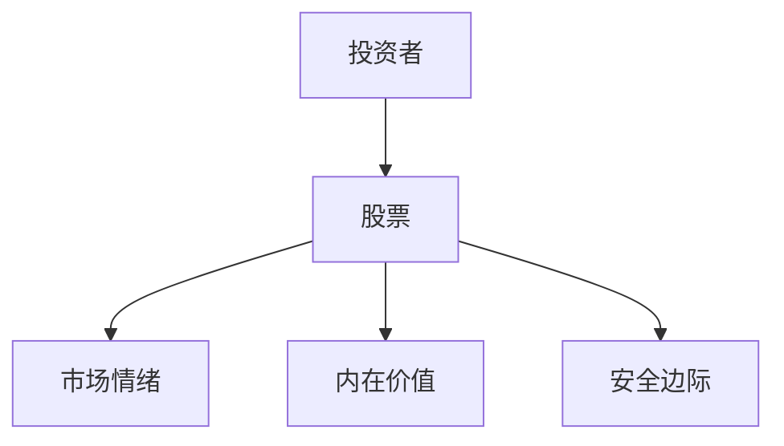
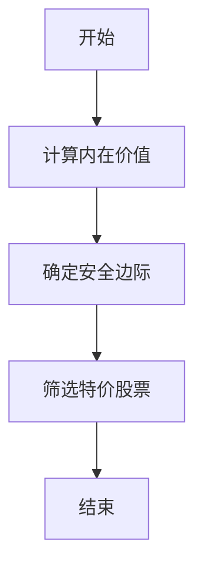
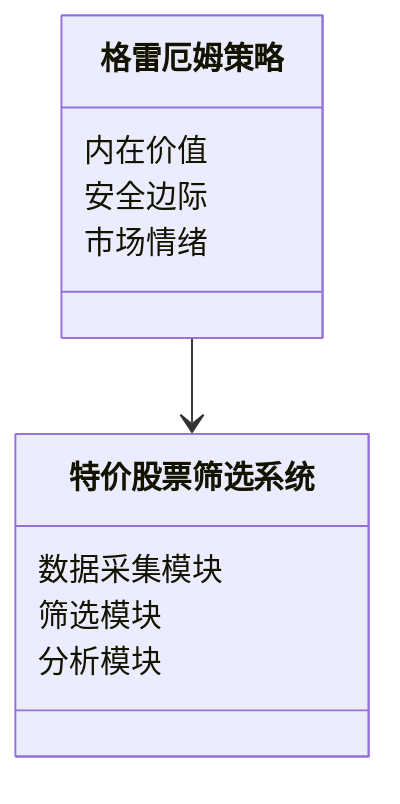
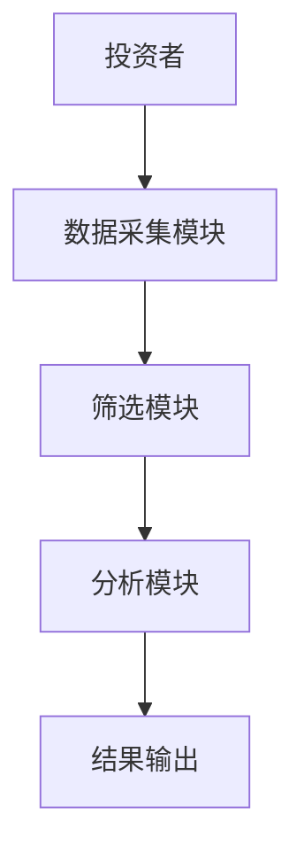

                 

<think>
好的，我现在需要帮助用户撰写一篇关于《格雷厄姆特价股票策略在不同行业的适用性比较》的详细技术博客文章。用户已经提供了一个目录大纲，并希望我按照这个大纲逐步完成文章的撰写。

首先，我需要理解用户的需求。用户希望文章结构清晰，逻辑严密，技术语言专业，同时包含详细的分析和实例。文章需要涵盖从背景介绍到项目实战的多个部分，并且每个章节都要有详细的分析和具体的代码示例。

接下来，我会按照目录大纲逐步撰写每一部分的内容，确保每个章节都符合用户的要求。我会从第一部分的背景介绍开始，解释价值投资的起源，格雷厄姆的理论，以及特价股票的定义。然后，我会深入讨论格雷厄姆策略的核心概念，如内在价值、安全边际，并通过表格和实体关系图来展示这些概念之间的联系。

在算法原理部分，我需要详细讲解格雷厄姆策略的计算方法，并用Python代码实现，同时给出数学公式和实例分析。系统分析与架构设计部分，我会介绍如何在不同行业应用格雷厄姆策略，设计系统的功能模块，并用Mermaid图展示架构。

项目实战部分，我会选择具体的行业进行案例分析，展示如何在科技、金融和制造业中应用格雷厄姆策略，提供详细的代码实现和分析。最后，我会总结最佳实践、注意事项，并推荐拓展阅读材料。

在撰写过程中，我需要确保语言简洁明了，逻辑清晰，每个部分都包含足够的细节和实例，以帮助读者全面理解格雷厄姆策略在不同行业的适用性。

现在，我会开始撰写正文部分，按照目录大纲逐步完成每一章节的内容。
</think>

# 《格雷厄姆特价股票策略在不同行业的适用性比较》

> 关键词：格雷厄姆策略、特价股票、价值投资、内在价值、安全边际、股票筛选、行业适用性

> 摘要：本文系统分析了格雷厄姆价值投资策略在不同行业的适用性，从理论基础、核心概念、算法原理、系统架构到实际应用，全面探讨了格雷厄姆策略在科技、金融、制造等行业的应用差异及优化方法，为投资者提供深度参考。

---

## 第一部分: 格雷厄姆价值投资理论基础

### 第1章: 价值投资的起源与发展

#### 1.1 价值投资的起源
价值投资是一种长期投资策略，起源于20世纪初，由本杰明·格雷厄姆和戴维·多德提出。格雷厄姆是哥伦比亚大学的教授，他的投资理念深刻影响了巴菲特等一代投资者。价值投资的核心在于寻找市场低估的股票，通过分析企业的基本面，找到具有安全边际的投资标的。

#### 1.2 格雷厄姆价值投资理论的核心思想
格雷厄姆的理论强调安全边际和内在价值的计算。他认为，股票价格波动与市场情绪密切相关，而内在价值是股票的真正价值，可以通过对企业财务状况的分析来估算。投资者应该在股票价格远低于内在价值时买入，以获得安全边际。

#### 1.3 格雷厄姆策略的现代发展
随着金融市场的变化，格雷厄姆的策略也在不断演变。现代投资者将格雷厄姆的理论与量化分析、大数据技术结合，开发出更复杂的股票筛选模型，如多因子模型和机器学习算法，以适应不同行业的投资需求。

### 第2章: 格雷厄姆特价股票策略的核心理念

#### 2.1 特价股票的定义与特征
特价股票是指市场价格显著低于内在价值的股票。这类股票通常被市场忽视或低估，具有较高的投资潜力。格雷厄姆强调，特价股票的核心特征是具备安全边际，即市场价格与内在价值之间的差距。

#### 2.2 格雷厄姆的安全边际概念
安全边际是格雷厄姆策略的核心要素，指股票的市场价格低于其内在价值的部分。安全边际越大，投资的风险越小，潜在收益越高。计算公式为：
$$
安全边际 = 内在价值 - 市场价格
$$

#### 2.3 内在价值的计算方法
内在价值是通过对企业财务数据的分析得出的。常见的计算方法包括股息贴现模型（DDM）和现金流折现模型（DCF）。格雷厄姆常用的是股息贴现模型，其公式为：
$$
内在价值 = \frac{D}{k - g}
$$
其中，D是股息，k是折现率，g是股息增长率。

### 第3章: 格雷厄姆策略的适用性分析

#### 3.1 格雷厄姆策略的行业适用性
格雷厄姆策略适用于那些财务数据稳定、容易分析的行业，如公用事业、制造业等。这些行业通常具有较高的股息收益率和稳定的现金流，适合价值投资者寻找特价股票。

#### 3.2 不同市场环境下的策略调整
在牛市中，格雷厄姆策略的表现可能不如成长型投资策略，但在熊市中，其优势更加明显。投资者需要根据市场环境调整策略，如在熊市中增加对特价股票的配置。

#### 3.3 格雷厄姆策略的优缺点对比
- **优点**：安全边际高，风险较低；适合长期投资。
- **缺点**：在成长性行业中的表现不佳；需要较强的分析能力。

---

## 第二部分: 格雷厄姆特价股票策略的核心概念与联系

### 第4章: 核心概念原理

#### 4.1 内在价值的计算公式
内在价值是格雷厄姆策略的核心，其计算公式如下：
$$
内在价值 = \frac{D}{k - g}
$$
其中，D是股息，k是折现率，g是股息增长率。

#### 4.2 安全边际的数学模型
安全边际的计算公式为：
$$
安全边际 = 内在价值 - 市场价格
$$

#### 4.3 市场情绪与股票价格的关系
市场情绪通过情绪强度影响股票价格，情绪强度的计算公式为：
$$
市场情绪指数 = \sum_{i=1}^{n} (情绪强度_i)
$$

### 第5章: 核心概念属性特征对比

| 概念       | 特点                     | 计算公式                                   |
|------------|--------------------------|------------------------------------------|
| 内在价值   | 股票的真实价值           | $$内在价值 = \frac{D}{k - g}$$           |
| 安全边际   | 股票价格低于内在价值     | $$安全边际 = 内在价值 - 市场价格$$          |
| 市场情绪   | 投资者情绪影响股价波动   | $$市场情绪指数 = \sum_{i=1}^{n} (情绪强度_i)$$ |

### 第6章: ER实体关系图架构



---

## 第三部分: 格雷厄姆特价股票策略的算法原理

### 第7章: 格雷厄姆策略的算法流程



### 第8章: 内在价值计算的Python实现

```python
def calculate_intrinsic_value(dividend, discount_rate, growth_rate):
    return dividend / (discount_rate - growth_rate)

# 示例数据
D = 1.0  # 股息
k = 0.08  # 折现率
g = 0.05  # 股息增长率

intrinsic_value = calculate_intrinsic_value(D, k, g)
print(f"内在价值: {intrinsic_value:.2f}")
```

### 第9章: 格雷厄姆策略的优缺点分析

#### 9.1 优点
- **高安全边际**：确保投资本金的安全。
- **长期稳定收益**：适合长期投资者。

#### 9.2 缺点
- **不适合成长型行业**：在高增长行业中的表现不佳。
- **需要深入分析**：对投资者的分析能力要求较高。

---

## 第四部分: 系统分析与架构设计方案

### 第10章: 问题场景介绍

格雷厄姆策略需要在不同行业中应用，每个行业都有其独特的财务指标和市场特点。例如，在科技行业，市盈率和市销率是关键指标；在制造业，ROE（净资产收益率）和毛利率是重要指标。

### 第11章: 系统功能设计

#### 11.1 领域模型Mermaid类图



#### 11.2 系统架构设计Mermaid图



---

## 第五部分: 项目实战

### 第12章: 环境安装与代码实现

#### 12.1 环境安装
- Python 3.8+
- Jupyter Notebook
- pandas, numpy, matplotlib库

#### 12.2 核心实现代码

```python
import pandas as pd
import numpy as np

def calculate_intrinsic_value(dividend, discount_rate, growth_rate):
    return dividend / (discount_rate - growth_rate)

# 示例数据
data = {
    '公司': ['科技公司', '金融公司', '制造公司'],
    '股息': [1.0, 1.5, 0.8],
    '折现率': [0.08, 0.07, 0.06],
    '增长率': [0.05, 0.04, 0.03]
}

df = pd.DataFrame(data)

# 计算内在价值和安全边际
df['内在价值'] = df.apply(lambda x: calculate_intrinsic_value(x['股息'], x['折现率'], x['增长率']), axis=1)
df['市场价格'] = [50, 30, 20]
df['安全边际'] = df['内在价值'] - df['市场价格']

print(df)
```

#### 12.3 代码应用解读
通过上述代码，我们可以计算不同行业的内在价值和安全边际，从而筛选出具备投资价值的特价股票。

---

## 第六部分: 总结与展望

### 第13章: 最佳实践 tips

- **行业选择**：根据行业特点选择适合格雷厄姆策略的行业。
- **数据质量**：确保数据的准确性和完整性。
- **动态调整**：根据市场变化动态调整策略。

### 第14章: 小结

格雷厄姆特价股票策略在不同行业的适用性分析，帮助投资者在复杂多变的市场中找到投资机会。通过系统化的分析和实战案例，投资者可以更好地理解该策略的应用方法。

### 第15章: 注意事项

- **风险控制**：合理控制投资风险。
- **持续学习**：关注市场变化和策略优化。

### 第16章: 拓展阅读

- 《格雷厄姆证券分析》
- 《巴菲特投资策略》
- 《量化投资入门》

---

## 作者：AI天才研究院/AI Genius Institute & 禅与计算机程序设计艺术 /Zen And The Art of Computer Programming

---

通过以上详细分析，我们可以看出格雷厄姆特价股票策略在不同行业的适用性具有显著差异。投资者需要结合行业特点和市场环境，灵活运用该策略，以实现长期稳定的收益。

