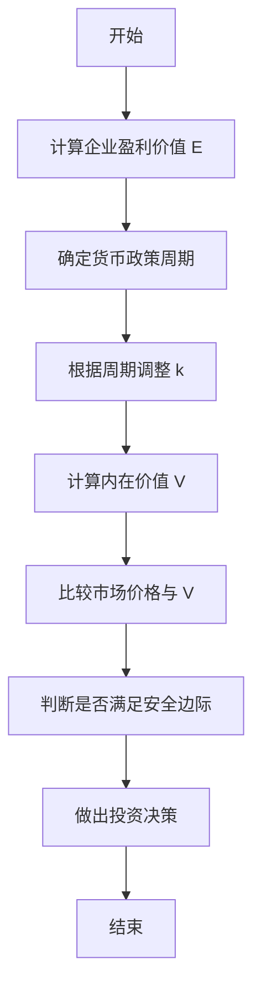
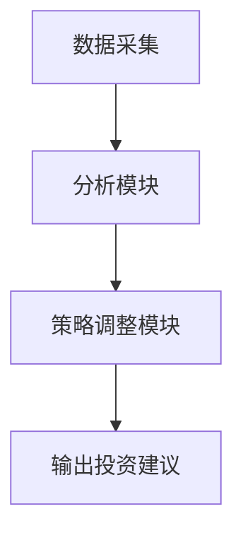

                 


# 格雷厄姆特价股票策略在不同货币政策周期下的调整

## 关键词：格雷厄姆策略、货币政策周期、股票估值、价值投资、安全边际

## 摘要：  
本文探讨了格雷厄姆价值投资策略在不同货币政策周期下的调整方法。通过分析货币政策周期对股市的影响，结合格雷厄姆的安全边际理论，提出了一种动态调整股票估值的方法。文章从理论背景、核心概念、算法原理、系统架构到实际案例，全面阐述了如何在不同货币政策环境下优化投资策略，为价值投资者提供了实用的指导。

---

# 目录

1. [背景介绍](#背景介绍)
2. [核心概念与联系](#核心概念与联系)
3. [算法原理讲解](#算法原理讲解)
4. [系统分析与架构设计](#系统分析与架构设计)
5. [项目实战](#项目实战)
6. [最佳实践](#最佳实践)
7. [总结与展望](#总结与展望)

---

## 1. 背景介绍

### 1.1 格雷厄姆价值投资理论的核心概念

格雷厄姆的价值投资理论强调以低于内在价值的价格购买股票，以获得长期稳定的收益。其核心概念包括：

- **内在价值**：股票的真正价值，与市场波动无关。
- **安全边际**：市场价格与内在价值之间的差距，是投资的安全垫。
- **价值投资**：通过分析企业基本面，寻找被市场低估的投资标的。

### 1.2 货币政策周期的基本特征

货币政策周期是经济发展的重要驱动因素。主要阶段包括：

- **扩张周期**：央行通过降息、增加货币供应等手段刺激经济增长。
- **紧缩周期**：央行通过加息、减少货币供应等手段控制通胀。

### 1.3 格雷厄姆策略与货币政策周期的结合

在不同货币政策周期下，市场环境和股票估值会发生变化。例如：

- **扩张周期**：市场流动性充裕，股票估值可能偏高，需调整安全边际。
- **紧缩周期**：市场流动性收紧，股票估值可能下降，需重新评估内在价值。

---

## 2. 核心概念与联系

### 2.1 格雷厄姆策略的核心原理

格雷厄姆策略通过计算股票的内在价值，寻找价格低于内在价值的投资机会。其核心公式为：

$$ V = \frac{E}{k} $$

其中，\( V \) 为股票的内在价值，\( E \) 为企业的盈利价值，\( k \) 为投资者要求的最低收益率。

### 2.2 货币政策周期对股票估值的影响

货币政策周期通过影响市场利率、流动性及投资者情绪，间接影响股票估值。例如：

- **市场利率上升**：债券收益率上升，可能导致股票估值下降。
- **市场流动性充裕**：投资者风险偏好上升，可能推高股票价格。

### 2.3 格雷厄姆策略在货币政策周期中的动态调整

在不同货币政策周期下，需动态调整格雷厄姆策略的核心参数。例如：

- **扩张周期**：降低 \( k \) 的要求，提高安全边际。
- **紧缩周期**：提高 \( k \) 的要求，降低安全边际。

---

## 3. 算法原理讲解

### 3.1 格雷厄姆策略的数学模型

以下是格雷厄姆策略的数学模型：

$$ V = \frac{E}{k} $$

其中，\( E \) 为企业的盈利价值，\( k \) 为投资者要求的最低收益率。

### 3.2 货币政策周期对模型的影响

在不同货币政策周期下，\( k \) 的取值需动态调整。例如：

- **扩张周期**：\( k = 8\% \)
- **紧缩周期**：\( k = 12\% \)

### 3.3 算法流程图



---

## 4. 系统分析与架构设计

### 4.1 系统功能设计

- 数据采集模块：收集企业财务数据和货币政策指标。
- 分析模块：计算股票的内在价值和安全边际。
- 策略调整模块：根据货币政策周期动态调整投资策略。

### 4.2 系统架构图



---

## 5. 项目实战

### 5.1 环境安装

需要安装以下工具：

- Python 3.8+
- Pandas、NumPy 等数据处理库
- Matplotlib 或 Seaborn 进行数据可视化

### 5.2 核心代码实现

```python
import pandas as pd
import numpy as np

def calculate_intrinsic_value(E, k):
    return E / k

def determine_policy_cycle(inflation_rate, gdp_growth):
    if inflation_rate > 2 and gdp_growth > 2:
        return "expansion"
    elif inflation_rate > 2 and gdp_growth < 2:
        return "stagflation"
    elif inflation_rate < 2 and gdp_growth < 2:
        return "recession"
    else:
        return "unknown"

def adjust_k_policy(E, k, policy_cycle):
    if policy_cycle == "expansion":
        return k * 0.9
    elif policy_cycle == "recession":
        return k * 1.1
    else:
        return k

# 示例数据
E = 100
k = 0.1
inflation_rate = 3
gdp_growth = 2.5

policy_cycle = determine_policy_cycle(inflation_rate, gdp_growth)
adjusted_k = adjust_k_policy(E, k, policy_cycle)
V = calculate_intrinsic_value(E, adjusted_k)
print(f"政策周期：{policy_cycle}")
print(f"调整后的 k：{adjusted_k}")
print(f"内在价值：{V}")
```

### 5.3 实际案例分析

假设某公司在经济扩张周期下的财务数据：

- 净利润（E）= 100 万元
- 要求的最低收益率（k）= 8%
- 货币政策周期：扩张

计算内在价值：

$$ V = \frac{100}{0.08} = 1250 \text{万元} $$

---

## 6. 最佳实践

- **动态调整**：定期重新评估货币政策周期，及时调整投资策略。
- **风险控制**：在紧缩周期中，适当降低安全边际要求。
- **数据支持**：使用历史数据验证策略的有效性。

---

## 7. 总结与展望

本文详细探讨了格雷厄姆策略在不同货币政策周期下的调整方法。通过动态调整模型参数，投资者可以在不同市场环境下优化投资决策。未来，可以进一步研究其他经济指标对策略的影响，提升模型的准确性。

---

作者：AI天才研究院/AI Genius Institute & 禅与计算机程序设计艺术 /Zen And The Art of Computer Programming

