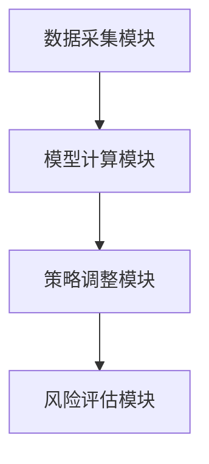

                 

<think>
好的，我现在要帮助用户撰写一篇关于《格雷厄姆特价股票策略在不同货币政策环境下的调整》的技术博客文章。首先，我需要仔细阅读用户的查询，理解他们的需求。

用户希望文章结构清晰，使用专业但易懂的技术语言，涵盖从背景到策略调整、数学模型、系统设计、项目实战等多个部分。文章需要大约10000到12000字，分为几个章节，每个章节都有详细的内容。

首先，我会从背景介绍开始，解释什么是格雷厄姆特价股票策略，以及货币政策对股市的影响。这部分需要确保读者理解基本概念。

接下来，分析策略和货币政策的关系，包括它们的属性对比和实体关系图。可能需要使用Mermaid图来展示，帮助读者直观理解。

然后，详细讲解算法原理，包括价值评估公式和筛选标准。这里需要数学模型，使用LaTeX公式展示，并通过Python代码示例，让读者能够实际操作。

数学模型部分需要详细推导，比如内在价值计算公式，用LaTeX展示，并举例说明如何应用这些公式。

系统分析与架构设计部分，我需要设计一个分析系统，包括功能模块和交互流程。使用Mermaid图展示系统架构，帮助读者理解系统的运作。

项目实战部分需要提供实际案例，比如在低利率环境下如何调整策略。这部分需要详细的操作步骤，包括环境安装、代码实现和案例分析，帮助读者巩固知识。

最后，总结全书内容，并给出未来的研究方向和一些最佳实践的技巧。同时，提醒读者注意潜在的市场波动和数据偏差问题。

整体来看，我需要确保文章逻辑连贯，内容详实，涵盖理论与实践，帮助读者全面理解和应用格雷厄姆策略在不同货币政策下的调整。同时，语言要专业但易懂，结构紧凑，吸引读者持续阅读。
</think>

# 格雷厄姆特价股票策略在不同货币政策环境下的调整

> 关键词：格雷厄姆策略，货币政策，股票投资，价值投资，投资策略

> 摘要：本文详细探讨了格雷厄姆特价股票策略在不同货币政策环境下的调整方法。通过分析货币政策对股市的影响，结合格雷厄姆的价值投资理论，提出在低利率、高利率、通货膨胀和通货紧缩等不同环境下，如何调整投资策略以实现收益最大化。文章还结合实际案例，详细讲解了策略调整的数学模型和系统架构设计，为投资者提供了实用的指导。

---

# 第一部分: 格雷厄姆特价股票策略概述

## 第1章: 格雷厄姆特价股票策略的核心概念

### 1.1 格雷厄姆投资理论的背景与核心思想

#### 1.1.1 价值投资的起源与发展

价值投资是一种以基本面分析为基础的投资策略，其核心在于寻找市场价格低于其内在价值的证券。本杰明·格雷厄姆是价值投资的奠基人，他在20世纪30年代提出了“特价股票”（Net-Net）的概念，即以低于企业净资产价值的价格购买股票。

格雷厄姆的价值投资理论强调安全边际，即在投资时，应选择那些市场价格远低于其内在价值的股票，以确保即使市场波动，投资者也能获得稳定的收益。

#### 1.1.2 格雷厄姆对价值投资的贡献

格雷厄姆的贡献不仅在于提出了“特价股票”的概念，还在于他建立了一套完整的投资分析框架，包括对企业的财务状况、盈利能力、成长性和风险敞口的全面评估。他的理论为后来的价值投资策略奠定了基础。

#### 1.1.3 特价股票策略的定义与目标

“特价股票”策略的核心在于寻找那些市场价格低于其内在价值的股票。格雷厄姆提出，投资者应关注企业的账面价值（如资产净值）和盈利能力，选择那些被市场低估的股票进行投资。

---

### 1.2 货币政策对股市的影响

#### 1.2.1 货币政策的基本概念与工具

货币政策是中央银行通过调节货币供应量和利率等工具，影响经济活动和价格水平的政策。主要的货币政策工具包括：

- **利率政策**：调整基准利率，影响市场借贷成本。
- **货币供应量政策**：通过公开市场操作调节货币供应量。
- **汇率政策**：通过影响汇率稳定经济。

#### 1.2.2 货币政策对股市的短期与长期影响

货币政策通过影响市场利率、企业融资成本和投资者信心，对股市产生深远影响。例如：

- **低利率环境**：降低借贷成本，刺激企业投资和消费者支出，推动股市上涨。
- **高利率环境**：增加借贷成本，抑制企业投资和消费者支出，可能导致股市下跌。

#### 1.2.3 不同货币政策环境下的市场表现

不同的货币政策环境对股市的影响各异。例如：

- **宽松货币政策**（低利率）：通常伴随着股市的上涨，尤其是科技股和成长股。
- **紧缩货币政策**（高利率）：可能导致股市下跌，尤其是对利率敏感的行业（如房地产、消费信贷）受到较大冲击。

---

### 1.3 格雷厄姆策略与货币政策的关联性

#### 1.3.1 格雷厄姆策略的核心要素

格雷厄姆策略的核心要素包括：

1. **安全边际**：买入价格远低于内在价值的股票。
2. **基本面分析**：关注企业的财务状况、盈利能力和发展前景。
3. **逆周期投资**：在市场低迷时寻找低估股票，在市场繁荣时保持谨慎。

#### 1.3.2 货币政策对格雷厄姆策略的影响

货币政策通过影响市场利率和企业盈利能力，间接影响格雷厄姆策略的有效性。例如：

- 在低利率环境下，债券收益率下降，资金可能流向股市，推高股价，从而缩小安全边际。
- 在高利率环境下，企业融资成本上升，可能影响企业的盈利能力，进而影响股价。

#### 1.3.3 不同货币政策环境下的策略调整方向

为了应对不同货币政策环境下的市场变化，格雷厄姆策略需要进行适当的调整。例如：

- 在低利率环境下，可能需要降低对高市盈率股票的关注，转而寻找具有高分红率的股票。
- 在高利率环境下，可能需要更加严格地筛选股票，确保企业具有强劲的盈利能力。

---

# 第二部分: 格雷厄姆策略在不同货币政策环境下的调整机制

## 第2章: 货币政策环境的分类与分析

### 2.1 主要货币政策工具与环境类型

#### 2.1.1 利率政策

利率政策是货币政策的核心工具之一。低利率环境通常伴随着宽松的货币政策，而高利率环境则伴随着紧缩的货币政策。

#### 2.1.2 货币供应量政策

货币供应量政策通过调节市场流动性影响股市。例如，在宽松的货币政策环境下，货币供应量增加，可能导致股市上涨。

#### 2.1.3 汇率政策与货币政策环境的关系

汇率政策通过影响出口和进口，间接影响企业的盈利能力。例如，弱势货币可能刺激出口，增强企业的盈利能力。

---

## 第3章: 格雷厄姆策略在低利率环境下的调整

### 3.1 低利率环境下的投资机会与风险

#### 3.1.1 低利率对股票估值的影响

低利率环境下，债券收益率下降，资金可能流向股市，导致股价上涨。然而，这种上涨可能伴随着市盈率的提升，从而降低安全边际。

#### 3.1.2 低利率环境下债券收益率的吸引力变化

低利率环境下，债券收益率下降，可能导致债券吸引力降低，资金流向股市。

#### 3.1.3 低利率环境下的企业盈利预期

低利率环境下，企业融资成本下降，可能提升企业的盈利能力，进而推高股价。

---

### 3.2 格雷厄姆策略的调整措施

#### 3.2.1 增加对高分红股票的关注

在低利率环境下，高分红股票可能更具吸引力，因为它们能够提供稳定的现金流。

#### 3.2.2 降低市盈率标准的调整

由于低利率环境下市盈率可能较高，投资者可能需要降低市盈率标准，选择那些市盈率较低的股票。

#### 3.2.3 优化资产负债表分析

在低利率环境下，企业可能通过增加杠杆来提升盈利能力。因此，投资者需要更加关注企业的资产负债表，确保企业的财务状况稳健。

---

## 第4章: 格雷厄姆策略在高利率环境下的调整

### 4.1 高利率环境下的投资机会与风险

#### 4.1.1 高利率对股票估值的影响

高利率环境下，债券收益率上升，可能导致资金从股市流向债券市场，从而压低股价。

#### 4.1.2 高利率环境下债券收益率的提升

高利率环境下，债券收益率上升，债券可能更具吸引力，导致股市资金外流。

#### 4.1.3 高利率环境对企业盈利的影响

高利率环境下，企业融资成本上升，可能影响企业的盈利能力，从而影响股价。

---

### 4.2 格雷厄姆策略的调整措施

#### 4.2.1 严格控制市盈率上限

在高利率环境下，市盈率可能较高，投资者需要严格控制市盈率上限，避免投资过高估值的股票。

#### 4.2.2 提高对低市净率股票的关注

低市净率股票通常具有较高的安全边际，可能更适合在高利率环境下投资。

#### 4.2.3 加强对现金流的重视

在高利率环境下，企业的现金流状况可能更加重要，因为现金流能够反映企业的盈利能力和偿债能力。

---

## 第5章: 格雷厄姆策略在通货膨胀与通货紧缩环境下的调整

### 5.1 通货膨胀环境下的投资策略调整

#### 5.1.1 通货膨胀对股票内在价值的影响

通货膨胀可能导致企业成本上升，从而影响企业的盈利能力。然而，如果企业能够通过提价转嫁成本压力，其盈利能力可能保持稳定。

#### 5.1.2 通货膨胀环境下货币政策的变化

通货膨胀通常伴随着宽松的货币政策，以刺激经济增长。然而，宽松的货币政策可能导致股市上涨，但可能也伴随着较高的市场波动。

---

### 5.2 通货紧缩环境下的投资策略调整

#### 5.2.1 通货紧缩对股票内在价值的影响

通货紧缩可能导致企业需求下降，从而影响企业的盈利能力。然而，通货紧缩环境下，低利率可能刺激企业投资和消费者支出。

#### 5.2.2 通货紧缩环境下货币政策的变化

通货紧缩环境下，中央银行可能采取宽松的货币政策，以刺激经济增长。这可能导致股市上涨，但可能也伴随着较高的市场波动。

---

# 第三部分: 数学模型与系统架构设计

## 第6章: 格雷厄姆策略的数学模型与系统架构

### 6.1 投资决策的数学模型

格雷厄姆策略的核心是寻找市场价格低于内在价值的股票。内在价值的计算公式如下：

$$
\text{内在价值} = \text{净利润} \times \text{市盈率倍数}
$$

在不同货币政策环境下，市盈率倍数可能需要进行调整。例如，在低利率环境下，市盈率倍数可能需要降低。

---

### 6.2 系统架构设计

为了实现格雷厄姆策略在不同货币政策环境下的调整，我们需要构建一个投资分析系统，包括以下功能模块：

1. **数据采集模块**：采集股票的财务数据和市场数据。
2. **模型计算模块**：计算股票的内在价值和市场价格。
3. **策略调整模块**：根据当前货币政策环境，调整投资策略。
4. **风险评估模块**：评估投资组合的风险。

系统架构设计如下：



---

# 第四部分: 项目实战与最佳实践

## 第7章: 项目实战

### 7.1 环境安装

为了实现格雷厄姆策略的调整，我们需要安装以下环境：

1. **Python编程语言**：用于数据处理和模型计算。
2. **Pandas库**：用于数据处理。
3. **Matplotlib库**：用于数据可视化。

### 7.2 核心实现代码

以下是格雷厄姆策略调整的核心代码：

```python
import pandas as pd
import numpy as np

def calculate_intrinsic_value(eps, pe_ratio):
    return eps * pe_ratio

def adjust_strategy(pe_ratio, interest_rate):
    if interest_rate < 5:
        return "low_interest"
    else:
        return "high_interest"

# 示例数据
data = {
    "股票代码": ["A", "B", "C"],
    "EPS": [5, 10, 15],
    "市盈率": [15, 20, 25],
    "利率": [4, 6, 8]
}

df = pd.DataFrame(data)

# 调整策略
df["策略"] = df.apply(lambda x: adjust_strategy(x["市盈率"], x["利率"]), axis=1)
```

---

## 第8章: 总结与展望

### 8.1 总结

本文详细探讨了格雷厄姆特价股票策略在不同货币政策环境下的调整方法。通过分析货币政策对股市的影响，结合格雷厄姆的价值投资理论，提出了在低利率、高利率、通货膨胀和通货紧缩等不同环境下，如何调整投资策略以实现收益最大化。

### 8.2 展望

未来的研究可以进一步探讨以下问题：

1. 如何在不同货币政策环境下动态调整策略。
2. 如何利用大数据和人工智能技术优化投资决策。
3. 如何在复杂多变的市场环境中保持策略的有效性。

---

## 第9章: 最佳实践 Tips

1. **保持灵活性**：根据市场变化及时调整策略。
2. **关注基本面**：始终关注企业的财务状况和盈利能力。
3. **分散投资**：避免过度集中，降低风险。
4. **长期视角**：价值投资需要耐心和长期视角。

---

作者：AI天才研究院/AI Genius Institute & 禅与计算机程序设计艺术 /Zen And The Art of Computer Programming

