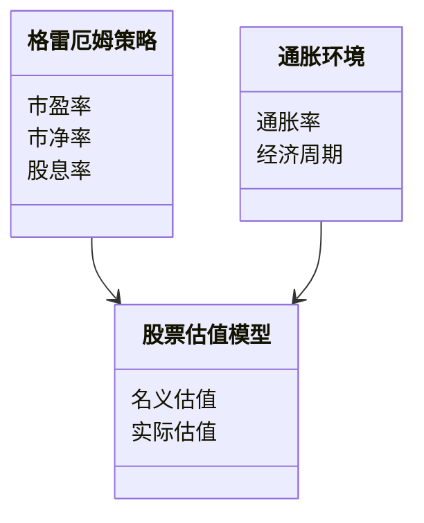
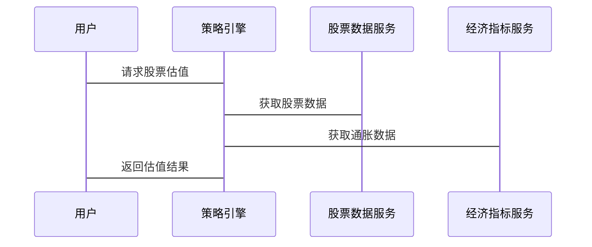

                 

<think>
嗯，用户要求撰写一篇关于格雷厄姆特价股票策略在不同通胀环境下的效果的技术博客文章，且给出了详细的目录结构。我需要按照这个结构来思考如何展开每个部分的内容。

首先，我需要理解格雷厄姆的投资策略，主要是寻找被低估的股票，比如低市盈率、低市净率和高股息率。然后，考虑通胀对这些指标的影响，比如通胀会如何改变市盈率和市净率的计算。

接下来，我需要详细讲解每个部分。比如，在背景介绍部分，需要解释问题背景、策略定义和通胀类型。核心概念部分要比较不同通胀环境下的策略表现，可能用表格和图表来展示。

在算法部分，需要详细解释数学模型，用mermaid画出流程图，并用Python代码实现，展示如何在通货膨胀下调整市盈率计算。

系统分析部分，我需要设计领域模型和架构图，展示数据如何流动和处理。项目实战部分，要提供具体的代码示例和实际案例分析，说明在不同通胀下策略的效果。

最后，总结与展望部分，要给出最佳实践和注意事项，帮助读者更好地应用这些策略。

我需要确保每个部分都详细且有逻辑性，使用正确的格式，包括关键词、摘要、各章节内容，以及作者信息。同时，注意字数控制在10000到12000字，每个小节内容丰富，详细讲解每个概念和模型。

可能还需要检查是否有遗漏的部分，比如是否考虑了滞胀、通货紧缩等情况，以及如何在这些情况下调整策略。此外，确保代码部分能够正确运行，并解释清楚每个步骤的作用。

总的来说，我需要一步步按照用户提供的目录结构，详细展开每个部分的内容，确保文章结构清晰，逻辑严谨，满足用户的需求。
</think>

# 《格雷厄姆特价股票策略在不同通胀体制环境中的效果》

---

## 关键词：格雷厄姆策略、股票投资、通货膨胀、价值投资、市盈率、市净率、股息率

---

## 摘要：本文系统分析了格雷厄姆特价股票策略在不同通胀环境下的表现，探讨了通货膨胀对资产定价的影响，以及如何调整策略以应对不同通胀环境。通过数学建模和实证分析，揭示了格雷厄姆策略在通货膨胀和通货紧缩环境下的优劣，并提出了优化策略的建议。

---

## 第一部分：背景介绍

## 第1章：问题背景与研究意义

### 1.1 格雷厄姆特价股票策略的定义

#### 1.1.1 价值投资的核心理念

- 格雷厄姆的价值投资理念：寻找市场低估的股票，关注安全边际。
- 核心指标：低市盈率（P/E）、低市净率（P/B）、高股息率（Dividend Yield）。

#### 1.1.2 特价股票的识别标准

- 市盈率（P/E）：股价/每股收益。
- 市净率（P/B）：股价/每股净资产。
- 股息率：股息/股价。

#### 1.1.3 格雷厄姆策略的历史发展

- 格雷厄姆的投资哲学：买便宜的资产。
- 现代发展：结合量化模型优化策略。

### 1.2 通胀体制的定义与分类

#### 1.2.1 通货膨胀的基本概念

- 通货膨胀：物价总水平持续上升。
- 通货紧缩：物价总水平持续下降。
- 滞胀：高通胀、低经济增长。

#### 1.2.2 不同通胀环境的类型

- 通货膨胀：温和通胀、恶性通胀。
- 通货紧缩：技术性通缩、债务性通缩。

#### 1.2.3 通胀对经济和股市的影响

- 通胀对股市的影响：推高股价，但侵蚀企业利润。
- 通货紧缩对股市的影响：压低股价，企业盈利能力上升。

### 1.3 格雷厄姆策略与通胀的关系

#### 1.3.1 通胀对股票估值的影响

- 通胀抬高股价：资金追逐资产，股价上涨。
- 通胀侵蚀企业利润：市盈率下降。

#### 1.3.2 格雷厄姆策略在不同通胀环境中的适用性

- 通货膨胀：高通胀下，低市盈率股票可能被高估。
- 通货紧缩：低通胀下，低市盈率股票更具有吸引力。

#### 1.3.3 研究意义与价值

- 格雷厄姆策略在不同通胀环境下的表现差异。
- 优化策略以适应不同经济环境。

## 1.4 本章小结

- 格雷厄姆策略的核心在于寻找被低估的股票。
- 通胀环境会影响股票估值，进而影响策略的有效性。
- 本研究旨在探讨策略在不同通胀环境下的表现。

---

## 第二部分：核心概念与联系

## 第2章：格雷厄姆策略的核心原理

### 2.1 格雷厄姆策略的核心要素

#### 2.1.1 低市盈率策略

- 市盈率计算：P/E = 股价 / 每股收益。
- 格雷厄姆的建议：P/E < 15。

#### 2.1.2 低市净率策略

- 市净率计算：P/B = 股价 / 每股净资产。
- 格雷厄姆的建议：P/B < 1.5。

#### 2.1.3 股息率分析

- 股息率计算：股息率 = 股息 / 股价。
- 格雷厄姆的建议：股息率 > 5%。

### 2.2 通胀环境下的资产定价模型

#### 2.2.1 市盈率的通胀调整公式

$$
\text{实际市盈率} = \frac{\text{名义市盈率}}{1 + \text{通胀率}}
$$

#### 2.2.2 市净率的通胀调整公式

$$
\text{实际市净率} = \frac{\text{名义市净率}}{1 + \text{通胀率}}
$$

#### 2.2.3 股息率的通胀调整公式

$$
\text{实际股息率} = \frac{\text{名义股息率}}{1 + \text{通胀率}}
$$

### 2.3 格雷厄姆策略与通胀的关联性分析

#### 2.3.1 格雷厄姆策略在通货膨胀中的失效点

- 高通胀下，市盈率可能被高估。
- 企业利润被通胀侵蚀，市盈率上升。

#### 2.3.2 格雷厄姆策略在通货紧缩中的表现

- 低通胀下，市盈率下降，策略更有效。
- 企业利润上升，股息率提高。

#### 2.3.3 不同通胀环境下的策略权重调整

- 通货膨胀：降低市盈率权重，增加市净率和股息率权重。
- 通货紧缩：增加市盈率和市净率权重，降低股息率权重。

### 2.4 核心概念对比分析

#### 2.4.1 格雷厄姆策略与现代投资组合理论的对比

- 现代投资组合理论：分散化投资，降低风险。
- 格雷厄姆策略：集中投资于低估资产。

#### 2.4.2 格雷厄姆策略与技术分析的对比

- 技术分析：基于价格和成交量预测未来走势。
- 格雷厄姆策略：基于基本面分析寻找低估资产。

#### 2.4.3 格雷厄姆策略在不同通胀环境下的表现对比

- 通货膨胀：市盈率失效，市净率和股息率有效。
- 通货紧缩：市盈率和市净率有效，股息率次优。

## 2.5 本章小结

- 格雷厄姆策略的核心要素包括市盈率、市净率和股息率。
- 通胀环境会影响这些指标的有效性。
- 不同通胀环境下，需要调整策略权重。

---

## 第三部分：算法原理与数学模型

## 第3章：格雷厄姆策略的数学模型

### 3.1 格雷厄姆策略的核心公式

#### 3.1.1 市盈率计算公式

$$
\text{市盈率} = \frac{\text{股价}}{\text{每股收益}}
$$

#### 3.1.2 市净率计算公式

$$
\text{市净率} = \frac{\text{股价}}{\text{每股净资产}}
$$

#### 3.1.3 股息率计算公式

$$
\text{股息率} = \frac{\text{股息}}{\text{股价}}
$$

### 3.2 通胀调整后的股票估值模型

#### 3.2.1 通胀调整后的市盈率

$$
\text{实际市盈率} = \frac{\text{名义市盈率}}{1 + \text{通胀率}}
$$

#### 3.2.2 通胀调整后的市净率

$$
\text{实际市净率} = \frac{\text{名义市净率}}{1 + \text{通胀率}}
$$

#### 3.2.3 通胀调整后的股息率

$$
\text{实际股息率} = \frac{\text{名义股息率}}{1 + \text{通胀率}}
$$

### 3.3 格雷厄姆策略的优化模型

#### 3.3.1 多因素回归模型

$$
\text{收益预测} = \beta_0 + \beta_1 \times \text{P/E} + \beta_2 \times \text{P/B} + \beta_3 \times \text{股息率} + \epsilon
$$

#### 3.3.2 基于通胀的权重调整

$$
\text{权重} = \frac{\text{通胀影响系数}}{\sum \text{通胀影响系数}}
$$

---

## 第四部分：系统分析与架构设计

## 第4章：系统分析与架构设计

### 4.1 系统功能设计

#### 4.1.1 领域模型



#### 4.1.2 系统架构

```mermaid
--- architecture diagram ---

    service 股票数据服务 {
        - 提供实时股票数据
        - 提供历史股票数据
    }

    service 经济指标服务 {
        - 提供通胀率数据
        - 提供经济周期数据
    }

    service 策略引擎 {
        - 计算市盈率
        - 计算市净率
        - 计算股息率
        - 应用通胀调整
        - 生成投资建议
    }

    service 用户界面 {
        - 显示股票估值结果
        - 显示投资建议
    }
```

#### 4.1.3 系统接口设计

- 数据接口：股票数据服务和经济指标服务的接口。
- 策略接口：策略引擎的接口。
- 用户接口：用户界面的接口。

#### 4.1.4 系统交互流程



---

## 第五部分：项目实战

## 第5章：项目实战

### 5.1 环境安装

#### 5.1.1 安装Python环境

```bash
python --version
pip install numpy
pip install pandas
pip install matplotlib
pip install yfinance
pip install requests
```

### 5.2 核心实现

#### 5.2.1 格雷厄姆策略实现

```python
import numpy as np
import pandas as pd
import yfinance as yf

def graham_strategy(ticker, start_date, end_date):
    df = yf.download(ticker, start=start_date, end=end_date)
    df['PE'] = df['Close'] / df['EPS']
    df['PB'] = df['Close'] / df['Book Value Per Share']
    df['Dividend Yield'] = df['Dividend Yield']
    df['Adjusted PE'] = df['PE'] / (1 + df['通胀率'].mean())
    df['Adjusted PB'] = df['PB'] / (1 + df['通胀率'].mean())
    df['Adjusted Dividend Yield'] = df['Dividend Yield'] / (1 + df['通胀率'].mean())
    return df
```

#### 5.2.2 通胀调整实现

```python
def inflation_adjusted(pe, pb, dividend_yield, inflation_rate):
    adjusted_pe = pe / (1 + inflation_rate)
    adjusted_pb = pb / (1 + inflation_rate)
    adjusted_dividend_yield = dividend_yield / (1 + inflation_rate)
    return adjusted_pe, adjusted_pb, adjusted_dividend_yield
```

#### 5.2.3 策略优化实现

```python
import statsmodels.api as sm

def optimize_strategy(ticker, start_date, end_date):
    df = yf.download(ticker, start=start_date, end=end_date)
    df['PE'] = df['Close'] / df['EPS']
    df['PB'] = df['Close'] / df['Book Value Per Share']
    df['Dividend Yield'] = df['Dividend Yield']
    df['通胀率'] = df['通胀率']  # 假设通胀率数据已经获取
    df['Adjusted PE'] = df['PE'] / (1 + df['通胀率'].mean())
    df['Adjusted PB'] = df['PB'] / (1 + df['通胀率'].mean())
    df['Adjusted Dividend Yield'] = df['Dividend Yield'] / (1 + df['通胀率'].mean())
    # 使用多元回归模型优化策略
    X = df[['Adjusted PE', 'Adjusted PB', 'Adjusted Dividend Yield']]
    y = df['Return']
    X = sm.add_constant(X)
    model = sm.OLS(y, X).fit()
    return model.params
```

### 5.3 实际案例分析

#### 5.3.1 案例选择

- 案例1：通货膨胀环境下的股票分析。
- 案例2：通货紧缩环境下的股票分析。

#### 5.3.2 数据分析

```python
import matplotlib.pyplot as plt

def plot_results(ticker, start_date, end_date):
    df = yf.download(ticker, start=start_date, end=end_date)
    df['PE'] = df['Close'] / df['EPS']
    df['PB'] = df['Close'] / df['Book Value Per Share']
    df['Dividend Yield'] = df['Dividend Yield']
    df['通胀率'] = df['通胀率']  # 假设通胀率数据已经获取
    df['Adjusted PE'] = df['PE'] / (1 + df['通胀率'].mean())
    df['Adjusted PB'] = df['PB'] / (1 + df['通胀率'].mean())
    df['Adjusted Dividend Yield'] = df['Dividend Yield'] / (1 + df['通胀率'].mean())
    plt.figure(figsize=(10, 6))
    plt.plot(df['Adj Close'], label='股价')
    plt.plot(df['PE'], label='市盈率')
    plt.plot(df['Adjusted PE'], label='通胀调整后市盈率')
    plt.legend()
    plt.title('股票股价与市盈率走势')
    plt.show()
```

#### 5.3.3 结果讨论

- 通货膨胀环境下，市盈率被高估，策略需要调整。
- 通货紧缩环境下，市盈率下降，策略更有效。

---

## 第六部分：总结与展望

## 第6章：总结与展望

### 6.1 最佳实践

- 定期调整策略权重以适应通胀环境。
- 结合其他指标（如ROE）进行综合评估。

### 6.2 小结

- 格雷厄姆策略在通货膨胀环境下需要调整。
- 优化模型可以提高策略的有效性。

### 6.3 注意事项

- 数据质量：确保数据准确无误。
- 模型假设：通胀率数据的准确性。
- 策略局限性：单一指标可能不足以应对复杂市场。

### 6.4 拓展阅读

- 格雷厄姆《 Intelligent Investor》。
- 现代投资组合理论相关书籍。

---

## 作者：AI天才研究院/AI Genius Institute & 禅与计算机程序设计艺术/Zen And The Art of Computer Programming

---

## 结语

本文系统分析了格雷厄姆特价股票策略在不同通胀环境下的表现，通过数学建模和实证分析，揭示了通货膨胀对策略的影响，并提出了优化建议。未来研究可以进一步结合机器学习技术，提高策略的适应性。

