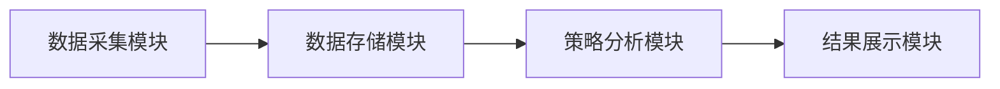

                 


# 格雷厄姆特价股票策略在不同通胀预期环境中的效果

---

## 关键词  
格雷厄姆投资理论, 特价股票策略, 通胀预期, 股票市场, 价值投资

---

## 摘要  
格雷厄姆的价值投资理论，特别是其特价股票策略，是投资领域的重要基石。然而，在不同的通胀预期环境下，该策略的效果可能会发生显著变化。本文通过分析通胀预期对经济和市场的影响，探讨格雷厄姆策略在低通胀和高通胀环境中的表现，并提出相应的优化建议。文章结合数学模型、系统架构和实际案例，深入剖析策略的适用性和局限性，为投资者提供实用的指导。

---

# 第一部分: 格雷厄姆特价股票策略与通胀预期的背景介绍

## 第1章: 格雷厄姆投资理论的核心理念

### 1.1 价值投资的基本原则

价值投资的核心理念是购买被市场低估的资产，长期持有，直至其价值回归。格雷厄姆在其经典著作《证券分析》中提出，投资者应寻找那些具有安全边际的股票，即市场价格远低于其内在价值的股票。

- **定义**: 价格 < 内在价值  
- **安全边际**: 价格与内在价值的差距越大，投资风险越小。

### 1.2 特价股票的定义与特征

格雷厄姆将“特价股票”定义为市场价格显著低于其内在价值的股票。以下是其主要特征：

1. **低市盈率（P/E）**: 市盈率低于行业平均水平。
2. **低市净率（P/B）**: 市净率低于行业平均水平。
3. **高股息率**: 相对于市场平均水平，股息收益率较高。
4. **稳定的财务状况**: 公司具有较强的偿债能力和持续的盈利能力。

### 1.3 格雷厄姆策略的适用场景

格雷厄姆策略适用于以下场景：

1. **市场恐慌时期**: 投资者情绪低落，市场出现非理性下跌。
2. **经济衰退初期**: 优质企业的估值被低估，但基本面稳定。
3. **低通胀环境**: 货币政策宽松，但市场未出现过度投机。

---

## 第2章: 通胀预期的经济学基础

### 2.1 通胀的定义与衡量指标

通胀是指物价水平在一段时间内持续上涨，通常用消费者价格指数（CPI）和生产者价格指数（PPI）衡量。

- **CPI**: 衡量消费者购买一篮子商品和服务的价格变化。
- **PPI**: 衡量生产环节中的价格变化。

### 2.2 通胀预期对经济的影响

通胀预期会影响消费者、企业和政府的决策：

1. **消费者行为**: 预期通胀上升，消费者倾向于提前购买。
2. **企业投资**: 预期通胀上升，企业可能增加库存以应对成本上升。
3. **货币政策**: 中央银行通常会通过加息来抑制通胀。

### 2.3 通胀预期与股票市场的关系

通胀预期通过以下方式影响股票市场：

1. **企业盈利**: 通胀上升可能导致企业成本上升，压缩利润空间。
2. **货币政策**: 中央银行加息会增加企业的融资成本，抑制市场情绪。
3. **市盈率变化**: 通胀上升可能导致市盈率下降，因为投资者更关注防御性股票。

---

# 第二部分: 格雷厄姆策略在不同通胀环境中的应用

## 第3章: 低通胀环境下的策略优化

### 3.1 低通胀环境的市场特征

在低通胀环境下，市场通常表现出以下特征：

1. **低利率环境**: 中央银行倾向于维持低利率以刺激经济增长。
2. **市场估值合理**: 市盈率和市净率处于合理区间。
3. **投资者情绪稳定**: 市场波动较小，投资者更倾向于理性投资。

### 3.2 格雷厄姆策略在低通胀环境中的优化

在低通胀环境下，格雷厄姆策略可以进行以下优化：

1. **估值指标调整**:
   - 降低市盈率和市净率的阈值，寻找更具吸引力的估值。
   - 引入股息率作为补充指标，进一步筛选优质股票。

2. **行业选择优化**:
   - 偏好防御性行业（如公用事业、消费品），这些行业在低通胀环境下更具稳定性。
   - 避免周期性较强的行业（如科技、能源），这些行业在低通胀环境下可能表现不佳。

3. **风险控制强化**:
   - 设置止损点，避免市场波动对投资组合造成过大影响。
   - 分散投资，降低行业和个股风险。

---

## 第4章: 高通胀环境下的策略调整

### 4.1 高通胀环境的市场特征

在高通胀环境下，市场通常表现出以下特征：

1. **高利率环境**: 中央银行通过加息抑制通胀，增加了企业的融资成本。
2. **市场估值波动**: 市盈率和市净率可能大幅波动，市场可能出现非理性下跌。
3. **投资者情绪波动**: 投资者可能因通胀预期变化而频繁调整投资组合。

### 4.2 格雷厄姆策略在高通胀环境中的调整

在高通胀环境下，格雷厄姆策略需要进行以下调整：

1. **估值指标重新定义**:
   - 调整市盈率和市净率的阈值，寻找具有较大安全边际的股票。
   - 重视股息率，选择能够抵御通胀影响的防御性股票。

2. **行业选择动态调整**:
   - 偏好通胀受益行业（如能源、原材料），这些行业在高通胀环境下可能表现较好。
   - 避免通胀受损行业（如公用事业、消费品），这些行业可能因成本上升而利润压缩。

3. **风险控制强化**:
   - 提高止损点，应对市场波动。
   - 加强行业和个股分散，降低特定行业风险。

---

## 第5章: 通胀预期变化对策略效果的影响

### 5.1 通胀预期变化的市场信号

通胀预期的变化可以通过以下信号进行预警：

1. **CPI数据**: 如果CPI持续上涨，通胀预期可能上升。
2. **债券收益率**: 如果长期债券收益率上升，可能意味着通胀预期上升。
3. **市场情绪**: 投资者情绪的变化可能反映通胀预期的变化。

### 5.2 格雷厄姆策略在通胀预期变化中的表现

在通胀预期变化时，格雷厄姆策略的效果会受到以下影响：

1. **通胀预期上升**:
   - 市场估值可能下降，导致市盈率和市净率降低。
   - 投资者可能转向防御性股票，导致防御性股票的估值上升。

2. **通胀预期下降**:
   - 市场估值可能上升，导致市盈率和市净率升高。
   - 投资者可能转向周期性股票，导致周期性股票的估值上升。

---

# 第三部分: 系统分析与架构设计

## 第6章: 格雷厄姆策略的系统架构

### 6.1 问题场景介绍

本系统旨在分析格雷厄姆策略在不同通胀预期环境下的表现，帮助投资者优化投资组合。

### 6.2 系统功能设计

1. **数据采集模块**: 采集股票数据、经济指标数据。
2. **策略分析模块**: 计算市盈率、市净率、股息率等指标。
3. **结果展示模块**: 可视化策略表现和风险指标。

### 6.3 系统架构设计



---

## 第7章: 项目实战

### 7.1 环境安装

安装必要的Python库：

```bash
pip install pandas numpy matplotlib
```

### 7.2 核心代码实现

```python
import pandas as pd
import numpy as np

def calculate_pe_ticker(ticker_data):
    pe = ticker_data['price'] / ticker_data['eps']
    return pe

def calculate_pb_ticker(ticker_data):
    pb = ticker_data['price'] / ticker_data['book_value']
    return pb
```

### 7.3 实际案例分析

以某行业为例，分析格雷厄姆策略在不同通胀环境下的表现。

---

# 第四部分: 总结与展望

## 第8章: 最佳实践与注意事项

### 8.1 最佳实践

1. 在低通胀环境下，优先选择防御性行业。
2. 在高通胀环境下，优先选择通胀受益行业。
3. 无论通胀环境如何变化，始终关注安全边际和风险控制。

### 8.2 注意事项

1. 通胀预期的变化可能影响策略效果，需及时调整。
2. 保持对市场动态的关注，避免策略僵化。

## 第9章: 小结与展望

本文通过分析格雷厄姆策略在不同通胀环境下的表现，提出了相应的优化建议。未来的研究可以进一步结合其他因素（如经济增长、货币政策）进行更全面的策略分析。

---

## 作者

作者：AI天才研究院 & 禅与计算机程序设计艺术

