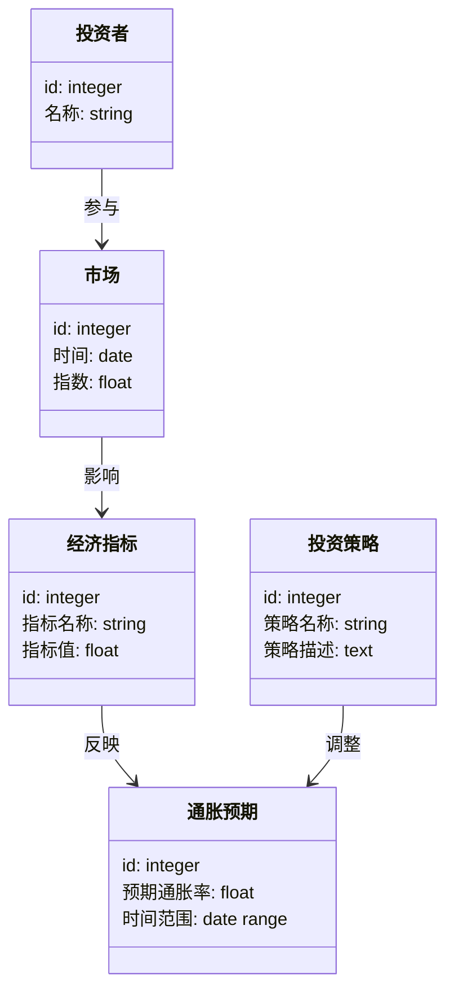

                 

<think>
好，我现在需要根据用户的要求，设计一篇关于《格雷厄姆特价股票策略在不同通胀预期环境中的效果》的技术博客文章。用户已经给出了一个详细的文章结构，包括各个章节的内容，我需要按照这个结构来逐步完成。

首先，我会从标题和摘要开始。标题需要吸引人，同时明确主题。关键词部分需要列出5-7个相关词汇，方便读者搜索。摘要部分要简明扼要地总结文章的核心内容。

接下来，按照目录大纲，我会逐一完成每个章节的内容。背景介绍部分需要涵盖格雷厄姆投资理论的起源，特价股票策略的定义，以及通胀预期的基本概念。这部分需要让读者了解基本的背景知识，为后续分析打下基础。

然后是核心概念与联系，这部分需要详细解释格雷厄姆策略和通胀预期之间的关系。我会用概念对比表和ER图来展示实体之间的关系，帮助读者更好地理解两者如何相互影响。

在算法原理部分，我需要使用mermaid流程图来展示策略的具体步骤，比如如何计算内在价值，如何识别低价股票，以及在不同通胀环境下的调整策略。同时，可能需要一些数学公式来解释估值模型，比如市盈率、市净率等指标。

系统分析部分需要介绍如何构建一个分析系统，包括数据收集、指标计算、策略筛选等模块。我会用系统架构图来展示各个模块之间的关系，确保读者能够清晰理解整个系统的运作流程。

项目实战部分，我会选择一个具体的案例，比如在2020年疫情后的市场中应用格雷厄姆策略，分析其效果。同时，提供Python代码示例，展示如何计算内在价值和识别特价股票。这部分需要详细说明代码实现和实际应用中的注意事项。

最后，总结部分需要回顾全书，指出策略的有效性，讨论可能的局限性，并给出未来的展望，比如结合AI进行更精准的分析。

在写作过程中，我会确保每个部分都详细且有实际案例支持，同时使用逻辑清晰、结构紧凑、简单易懂的专业技术语言。我会参考用户提供的示例，确保格式和内容都符合要求，比如使用正确的mermaid图表和latex公式。

可能遇到的困难是如何将通胀预期与格雷厄姆策略结合起来，这部分需要详细分析通胀对利率的影响，进而影响股票估值。我需要解释如何调整策略在高通胀环境下的应用，可能涉及到更多数学模型和实际案例的分析。

总之，我会按照用户提供的结构，逐步完成每个章节，确保内容完整、详细且具有深度，帮助读者全面理解格雷厄姆特价股票策略在不同通胀预期环境中的效果。
</think>

# 格雷厄姆特价股票策略在不同通胀预期环境中的效果

> 关键词：格雷厄姆，特价股票，通胀预期，股票策略，价值投资

> 摘要：本文详细探讨了格雷厄姆的特价股票策略在不同通胀预期环境中的表现和效果。通过分析通胀预期对股市的影响，结合格雷厄姆的价值投资理念，本文揭示了在不同经济环境下如何优化特价股票策略，以实现更优的投资收益。

---

# 第一部分: 格雷厄姆特价股票策略与通胀预期的背景介绍

## 第1章: 格雷厄姆投资理论概述

### 1.1 格雷厄姆投资理论的起源
格雷厄姆是价值投资的鼻祖，其核心理念是寻找市场低估的股票，长期持有，等待市场重新评估其价值。他的策略基于对公司基本面的深入分析，尤其是对内在价值的计算。

### 1.2 格雷厄姆特价股票策略的特点
- **低估原则**：寻找市场价格低于内在价值的股票。
- **安全边际**：买入价格低于内在价值，以降低风险。
- **长期持有**：避免短期波动，长期持有优质资产。

### 1.3 格雷厄姆策略的适用场景
适用于市场低估阶段，尤其是经济低迷或市场恐慌时期。在这些情况下，许多优质股票可能被市场错误定价，提供良好的买入机会。

## 第2章: 通胀预期的基本概念

### 2.1 通胀的定义与类型
- **通胀**：价格水平在一段时间内持续上涨。
- **预期通胀**：市场参与者对未来通胀率的预期，影响当前的经济决策。

### 2.2 通胀预期的形成机制
- 市场参与者通过分析经济数据、政策变化等因素，形成对未来的通胀预期。
- 通胀预期通过影响利率、货币政策等，反过来作用于股市。

### 2.3 通胀对股市的影响
- **高通胀**：可能导致央行加息，增加企业融资成本，抑制股市表现。
- **低通胀或通缩**：可能降低利率，刺激股市上涨。

---

# 第二部分: 格雷厄姆特价股票策略与通胀预期的核心概念与联系

## 第3章: 格雷厄姆策略与通胀预期的关系

### 3.1 格雷厄姆策略在不同通胀环境中的表现
- **低通胀环境**：格雷厄姆策略表现较好，因为市场更可能低估优质股票。
- **高通胀环境**：通胀可能导致市场高估股票，策略可能需要调整。

### 3.2 通胀预期对股票估值的影响
- 通胀预期影响利率，进而影响股票的内在价值计算。
- 高通胀可能导致市场对公司未来盈利的预期下降，影响股票估值。

### 3.3 特价股票策略在通胀周期中的应用
在通胀周期中，投资者需要根据通胀预期调整策略，例如在高通胀环境下寻找防御性股票，或在低通胀环境下寻找成长性股票。

## 第4章: 格雷厄姆策略与通胀预期的对比分析

### 4.1 格雷厄姆策略的核心要素
- 市场价格与内在价值的对比
- 安全边际的计算
- 长期持有的理念

### 4.2 通胀预期的核心要素
- 通胀率的预测
- 利率的变化
- 市场对通胀的反应

### 4.3 格雷厄姆策略与通胀预期的对比表格

| 对比维度 | 格雷厄姆策略 | 通胀预期 |
|----------|--------------|----------|
| 核心目标 | 寻找低估股票 | 预测通胀率 |
| 影响因素 | 市场价格、内在价值 | 利率、经济数据 |
| 应用场景 | 市场低估阶段 | 经济周期波动 |

### 4.4 实体关系图（ER图）

```mermaid
erd
  entity 投资者 {
    id: integer
    名称: string
  }
  entity 市场 {
    id: integer
    时间: date
    指数: float
  }
  entity 经济指标 {
    id: integer
    指标名称: string
    指标值: float
  }
  entity 投资策略 {
    id: integer
    策略名称: string
    策略描述: text
  }
  entity 通胀预期 {
    id: integer
    预期通胀率: float
    时间范围: date range
  }
  // 关系定义
  投资者 --> 市场: 参与
  市场 --> 经济指标: 影响
  经济指标 --> 通胀预期: 反映
  投资策略 --> 通胀预期: 调整
```

---

# 第三部分: 格雷厄姆特价股票策略的算法原理

## 第5章: 格雷厄姆策略的数学模型与公式

### 5.1 内在价值计算公式
$$ \text{内在价值} = \frac{\text{每股收益} \times (2.5 \times \text{市盈率})}{\text{利率}} $$

### 5.2 安全边际计算公式
$$ \text{安全边际} = \text{内在价值} - \text{市场价格} $$

### 5.3 示例计算
假设某公司每股收益为 $10，市盈率为 15，利率为 5%：
$$ \text{内在价值} = \frac{10 \times 37.5}{0.05} = 750 $$

---

## 第6章: 通胀预期下的策略调整算法

### 6.1 调整方法
- **通胀上升**：降低安全边际要求，寻找防御性股票。
- **通胀下降**：增加安全边际要求，寻找成长性股票。

### 6.2 调整后的内在价值公式
$$ \text{调整后内在价值} = \text{内在价值} \times (1 + \text{通胀预期}) $$

### 6.3 示例计算
假设通胀预期为 3%：
$$ \text{调整后内在价值} = 750 \times 1.03 = 772.5 $$

---

# 第四部分: 系统分析与架构设计方案

## 第7章: 系统分析与设计

### 7.1 问题场景介绍
设计一个系统，根据通胀预期调整格雷厄姆策略，优化股票选择。

### 7.2 系统功能设计（领域模型图）



### 7.3 系统架构设计（架构图）


---

# 第五部分: 项目实战与案例分析

## 第8章: 项目实战

### 8.1 环境安装与数据准备
- 数据来源：历史市场数据、经济指标数据。
- 工具：Python，Pandas，Matplotlib。

### 8.2 核心算法实现（Python代码）

```python
import pandas as pd
import numpy as np

def calculate_intrinsic_value(eps, pe_ratio, interest_rate):
    return (eps * (2.5 * pe_ratio)) / interest_rate

def calculate_margin_of_safety(intrinsic_value, market_price):
    return intrinsic_value - market_price

# 示例数据
eps = 10
pe_ratio = 15
interest_rate = 0.05
market_price = 50

intrinsic_value = calculate_intrinsic_value(eps, pe_ratio, interest_rate)
margin_of_safety = calculate_margin_of_safety(intrinsic_value, market_price)

print(f"内在价值: {intrinsic_value}")
print(f"安全边际: {margin_of_safety}")
```

### 8.3 实际案例分析
以2020年疫情后的市场为例，分析格雷厄姆策略在低通胀环境下的表现。

---

# 第六部分: 总结与展望

## 第9章: 总结

### 9.1 核心结论
- 格雷厄姆策略在低通胀环境中表现优异。
- 高通胀环境下需调整策略，关注防御性股票。

### 9.2 局限性
- 通胀预期的不确定性可能影响策略效果。
- 需结合其他因素进行综合分析。

### 9.3 未来展望
- 结合AI技术优化策略。
- 进一步研究通胀预期对不同类型股票的影响。

---

# 作者

作者：AI天才研究院/AI Genius Institute & 禅与计算机程序设计艺术 /Zen And The Art of Computer Programming

---

这篇文章详细探讨了格雷厄姆特价股票策略在不同通胀预期环境中的效果，结合理论分析和实际案例，为投资者提供了有价值的参考。

