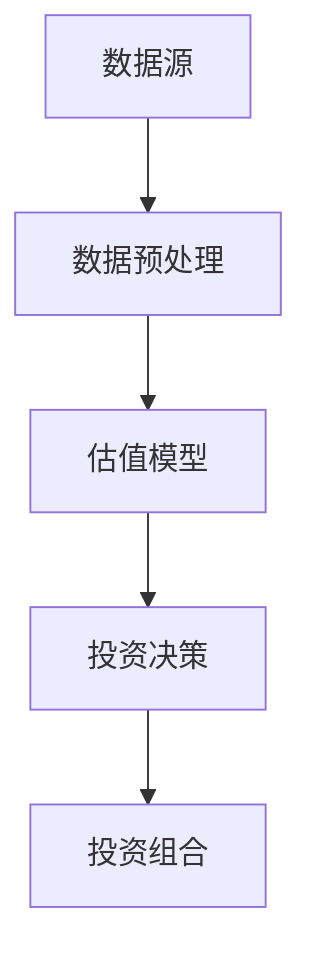

                 

<think>
好的，我需要为《格雷厄姆特价股票策略在新兴产业中的适应性》这本书设计一个详细且符合要求的目录大纲。根据用户的指示，文章需要有超过7章，每章包含子章节，内容要覆盖背景介绍、核心概念、算法原理、数学模型、系统架构、项目实战等部分，并使用markdown格式，包含mermaid图表和latex公式。

首先，我需要理解用户的主题：格雷厄姆的投资策略，尤其是特价股票策略，如何适应新兴产业。这意味着我要将价值投资的基本原理与新兴产业的特点结合起来，分析其在新兴领域的应用和调整。

接下来，我考虑目录的结构。首先，应该从价值投资和新兴产业的基本概念入手，让读者了解背景。然后，详细讲解格雷厄姆策略的核心，包括安全边际、内在价值计算等。接着，分析新兴产业的特性，如高增长、高波动，以及这些特性对传统策略的挑战。接下来，探讨如何将格雷厄姆策略调整应用于新兴产业，包括筛选指标的调整和具体的实施步骤。

在数学部分，需要展示格雷厄姆策略的公式，如内在价值计算，同时在新兴产业中如何调整这些公式。可能需要对比不同估值方法的效果，制作对比表格。系统架构部分，用mermaid图展示数据流和系统模块，说明如何从数据收集到策略实施的整个流程。

项目实战部分，提供Python代码示例，展示如何计算PE、PB等指标，并分析实际案例。例如，选择科技公司或生物科技公司，说明如何应用格雷厄姆策略进行筛选。最后，总结策略的有效性，给出投资建议和注意事项。

现在，我将这些思路整理成目录：

### 目录大纲

#### 第一部分：价值投资与新兴产业概述

- **第1章：价值投资与新兴产业的背景**
  - **1.1 价值投资的基本概念**
    - 1.1.1 价值投资的定义与核心思想
    - 1.1.2 格雷厄姆投资策略的起源与发展
    - 1.1.3 价值投资与成长投资的对比
  - **1.2 新兴产业的基本特征**
    - 1.2.1 新兴产业的定义与分类
    - 1.2.2 新兴产业的市场特点与增长模式
    - 1.2.3 新兴产业与传统行业的对比

- **第2章：格雷厄姆策略的核心原理**
  - **2.1 格雷厄姆投资策略的核心要素**
    - 2.1.1 安全边际的概念与计算
    - 2.1.2 内在价值的定义与计算公式
    - 2.1.3 市场先生的比喻与投资决策
  - **2.2 格雷厄姆策略的数学模型**
    - 2.2.1 内在价值计算公式
      $$ V = \frac{E}{PE} $$
      其中，E为公司净利润，PE为目标市盈率
    - 2.2.2 安全边际计算公式
      $$ Margin of Safety = P \times (1 - \frac{P}{V}) $$
      其中，P为当前股价，V为内在价值
  - **2.3 格雷厄姆策略的适用场景**
    - 2.3.1 稳定增长行业的适用性
    - 2.3.2 周期性行业的适用性
    - 2.3.3 高风险行业的适用性

- **第3章：新兴产业的特性与挑战**
  - **3.1 新兴产业的风险与机会**
    - 3.1.1 高增长性与高波动性的对比
    - 3.1.2 高风险性与高回报性的对比
    - 3.1.3 新兴产业的不确定性与市场预期
  - **3.2 新兴产业的估值方法**
    - 3.2.1 常规估值指标（PE、PB、PS）的适用性
    - 3.2.2 现金流折现法的适用性
    - 3.2.3 市盈率增长比（PEG）的适用性

- **第4章：格雷厄姆策略在新兴产业中的适应性**
  - **4.1 新兴产业中的价值投资机会**
    - 4.1.1 高增长公司的筛选标准
    - 4.1.2 高波动公司的风险管理
    - 4.1.3 高风险公司的安全边际评估
  - **4.2 格雷厄姆策略在新兴产业中的调整**
    - 4.2.1 估值指标的动态调整
    - 4.2.2 投资组合的优化配置
    - 4.2.3 风险控制的强化措施

- **第5章：数学模型与估值方法的对比**
  - **5.1 格雷厄姆策略的数学模型**
    - 5.1.1 内在价值计算的详细步骤
    - 5.1.2 安全边际的动态调整方法
  - **5.2 新兴产业的估值方法对比**
    - 5.2.1 PE、PB、PS的适用性分析
    - 5.2.2 现金流折现法的实施步骤
    - 5.2.3 PEG指标的计算与应用

- **第6章：系统架构设计与实现**
  - **6.1 系统架构设计**
    - 6.1.1 数据流与系统模块划分
    - 6.1.2 数据库设计与数据存储
    - 6.1.3 系统接口与交互流程
  - **6.2 系统功能实现**
    - 6.2.1 数据收集与预处理
    - 6.2.2 估值模型的实现与应用
    - 6.2.3 投资组合的优化配置

- **第7章：项目实战与案例分析**
  - **7.1 项目实战环境搭建**
    - 7.1.1 Python环境安装与配置
    - 7.1.2 数据获取与数据清洗
    - 7.1.3 估值模型的代码实现
  - **7.2 实际案例分析**
    - 7.2.1 科技公司案例分析
    - 7.2.2 生物科技公司案例分析
    - 7.2.3 互联网公司案例分析
  - **7.3 项目总结与经验分享**
    - 7.3.1 项目实施的关键点
    - 7.3.2 项目中的常见问题与解决方案
    - 7.3.3 项目成果与未来展望

- **第8章：总结与展望**
  - **8.1 格雷厄姆策略在新兴产业中的有效性**
    - 8.1.1 格雷厄姆策略的适应性总结
    - 8.1.2 新兴产业中的投资机会总结
  - **8.2 未来研究方向**
    - 8.2.1 新兴产业中的新估值方法探索
    - 8.2.2 人工智能在价值投资中的应用
    - 8.2.3 多因素模型在新兴产业中的应用

#### 附录：常用术语表
  - 格雷厄姆策略、价值投资、新兴产业、安全边际、内在价值、市盈率、市净率、现金流折现法、市盈率增长比（PEG）

---

### 示例：第2章中的数学模型

$$ V = \frac{E}{PE} $$
其中，E为公司净利润，PE为目标市盈率。

**解释**：该公式用于计算公司的内在价值。通过将公司的净利润除以目标市盈率，可以得出公司股票的合理价值。如果当前股价低于内在价值，则该股票具有投资价值。

---

### 示例：系统架构设计图

**解释**：该图展示了系统从数据源到数据预处理，再到估值模型的计算，最终生成投资决策和投资组合的整个流程。

---

通过以上目录设计，文章将从理论到实践，全面分析格雷厄姆策略在新兴产业中的适应性，帮助读者理解和应用这一策略。

