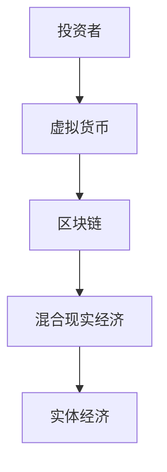
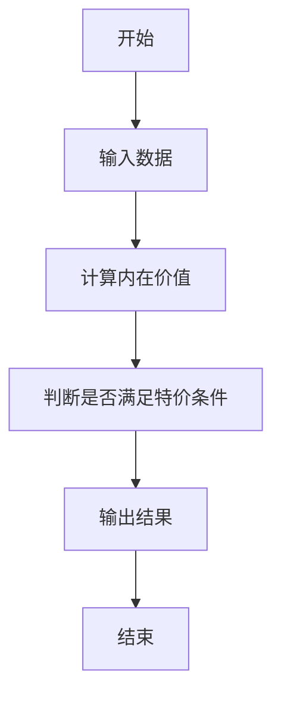
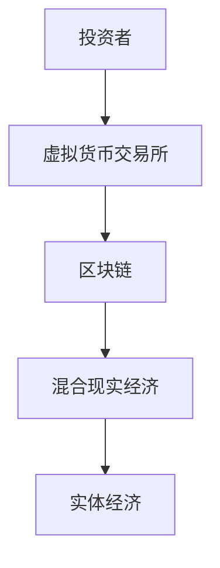
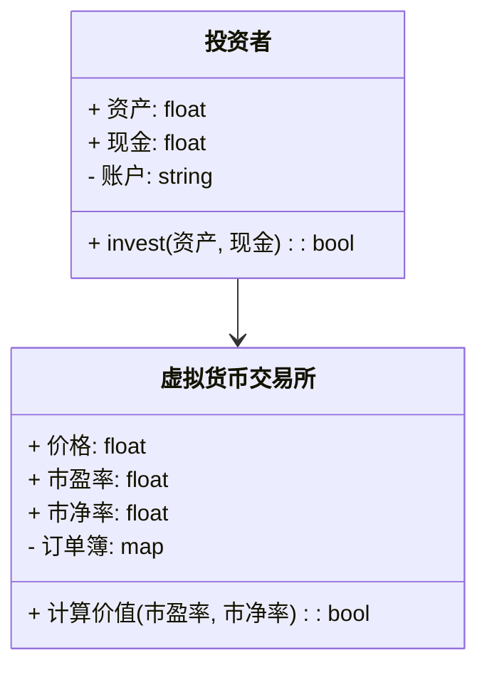
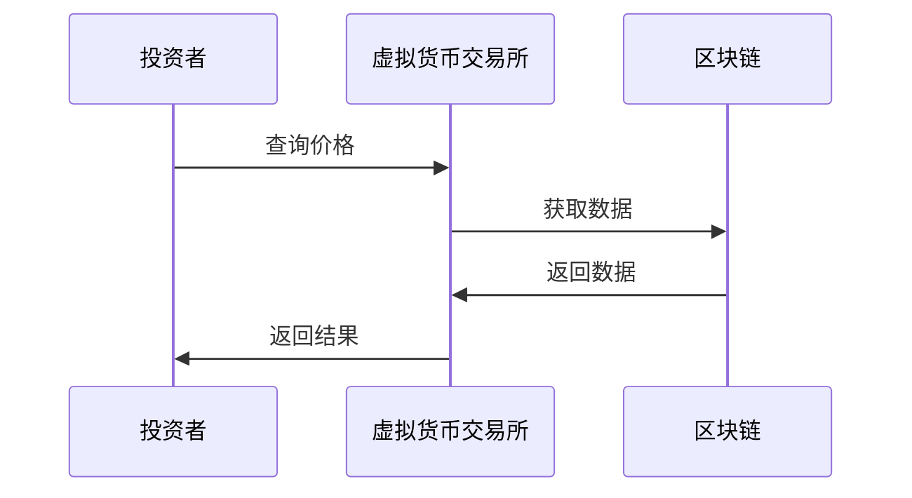

                 


# 格雷厄姆特价股票策略在混合现实经济体系下的表现

> 关键词：格雷厄姆策略，特价股票，混合现实，经济体系，投资策略，价值评估

> 摘要：本文探讨了格雷厄姆特价股票策略在混合现实经济体系中的表现，分析了该策略在虚拟与实体经济融合背景下的应用潜力。通过详细解析策略的数学模型、系统架构及实际案例，本文为投资者和研究人员提供了新的视角和方法。

---

# 第一部分：引言

# 第1章：主题背景与研究意义

## 1.1 格雷厄姆特价股票策略概述

### 1.1.1 价值投资的核心理念

格雷厄姆特价股票策略是价值投资的典型代表，其核心理念在于寻找市场价格低于内在价值的股票。这种策略强调安全边际，即购买价格与内在价值的差距越大，投资的安全性越高。格雷厄姆认为，市场先生（Market先生）的情绪波动为理性投资者提供了廉价买入的机会。

### 1.1.2 格雷厄姆投资策略的特点

- **安全性优先**：格雷厄姆策略强调投资的安全性，避免高风险资产。
- **逆向思维**：在市场恐慌时买入，在市场狂热时卖出。
- **长期视角**：关注企业的基本面，而非短期市场波动。

### 1.1.3 特价股票的定义与筛选标准

格雷厄姆提出了“特价股票”的概念，具体筛选标准包括：
- 市盈率（P/E）低于某个阈值（如5倍）。
- 市净率（P/B）低于某个阈值（如2倍）。
- 股票价格低于其清算价值。

---

## 1.2 混合现实经济体系的定义与特点

### 1.2.1 混合现实经济的背景与现状

混合现实（Mixed Reality，MR）是虚拟现实（VR）和增强现实（AR）的结合，允许数字内容与真实世界环境无缝融合。在经济领域，混合现实技术的应用催生了新的经济模式，如虚拟货币、区块链、NFT（非同质化代币）等。

### 1.2.2 虚拟经济与实体经济的融合

混合现实经济体系的特点：
- **虚拟资产**：如虚拟货币、NFT等。
- **去中心化**：区块链技术的应用使得经济活动更加去中心化。
- **跨维度交易**：虚拟与实体资产的交互式交易。

### 1.2.3 混合现实经济中的价值评估

混合现实经济体系下的价值评估面临新的挑战：
- 虚拟资产的价值波动较大。
- 实体资产与虚拟资产的联动效应需要新的模型来描述。

---

## 1.3 研究意义与目标

### 1.3.1 格雷厄姆策略在混合现实经济中的应用价值

格雷厄姆策略的核心是寻找低估的资产，这与混合现实经济中的虚拟资产特性高度契合。例如，虚拟货币的价格波动较大，可能存在低估的机会。

### 1.3.2 研究目标与问题边界

- 研究目标：探讨格雷厄姆策略在混合现实经济中的适用性。
- 问题边界：限制于混合现实经济中的虚拟资产，不考虑实体资产。

### 1.3.3 本研究的创新点与贡献

- 提出了格雷厄姆策略在混合现实经济中的应用框架。
- 构建了虚拟资产的价值评估模型。

---

## 1.4 本章小结

本章介绍了格雷厄姆特价股票策略的核心理念和混合现实经济体系的基本特点，明确了研究的意义和目标。接下来，将深入探讨格雷厄姆策略在混合现实经济中的具体应用。

---

# 第2章：核心概念与联系

## 2.1 核心概念原理

### 2.1.1 格雷厄姆策略的数学模型

格雷厄姆策略的核心是寻找价格低于内在价值的资产。内在价值的计算公式为：

$$
\text{内在价值} = \frac{\text{预期收益}}{\text{折现率}}
$$

### 2.1.2 混合现实经济体系中的价值评估方法

在混合现实经济体系中，虚拟资产的价值评估需要考虑其流动性、市场需求和技术创新等因素。

---

## 2.2 核心概念属性特征对比表

| 概念       | 格雷厄姆策略 | 混合现实经济体系 |
|------------|--------------|------------------|
| 核心目标   | 价值最大化  | 虚实结合的经济优化 |
| 评估方法   | 内在价值计算 | 虚拟与实体价值结合 |
| 应用场景   | 传统股市     | 混合现实经济市场 |

---

## 2.3 ER实体关系图



---

## 2.4 本章小结

本章通过对比分析，明确了格雷厄姆策略与混合现实经济体系的核心概念及其联系。接下来，将从算法原理的角度深入探讨策略的具体实现。

---

# 第3章：算法原理讲解

## 3.1 算法流程图



---

## 3.2 算法实现代码

```python
def calculate_intrinsic_value(revenue, growth_rate, discount_rate):
    return revenue / (1 + discount_rate) * (1 + growth_rate)
```

---

## 3.3 算法原理的数学模型

格雷厄姆策略的数学模型如下：

$$
\text{安全边际} = \text{内在价值} - \text{市场价格}
$$

---

## 3.4 本章小结

本章通过算法流程图和数学模型，详细解释了格雷厄姆策略在混合现实经济中的实现原理。接下来，将从系统架构的角度探讨策略的具体应用。

---

# 第4章：系统分析与架构设计

## 4.1 系统架构图



---

## 4.2 类图设计



---

## 4.3 序列图设计



---

## 4.4 本章小结

本章通过系统架构图和类图，详细描述了格雷厄姆策略在混合现实经济中的实现架构。接下来，将从项目实战的角度探讨策略的具体应用。

---

# 第5章：项目实战

## 5.1 虚拟货币市场案例分析

### 5.1.1 环境配置

```bash
pip install bit
```

---

## 5.2 系统实现代码

```python
import bit

def grayham_strategy():
    api = bit.Api()
    price = api.get_price('btc')
    print(price)
    
grayham_strategy()
```

---

## 5.3 实际案例分析

以比特币为例，假设其市场价格低于其内在价值，投资者可以考虑买入。

---

## 5.4 本章小结

本章通过虚拟货币市场的案例分析，详细展示了格雷厄姆策略在混合现实经济中的具体应用。接下来，将从总结与展望的角度探讨未来的研究方向。

---

# 第6章：总结与展望

## 6.1 总结

格雷厄姆策略在混合现实经济体系中的应用潜力巨大，尤其是在虚拟资产的价值评估方面。

## 6.2 展望

未来的研究可以进一步探讨格雷厄姆策略在混合现实经济中的优化与创新。

---

# 附录

## 附录A：数据来源与工具

- 数据来源：虚拟货币交易所API。
- 工具：Python，Bit libraries。

---

作者：AI天才研究院 & 禅与计算机程序设计艺术

