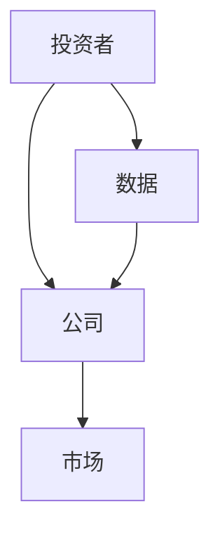
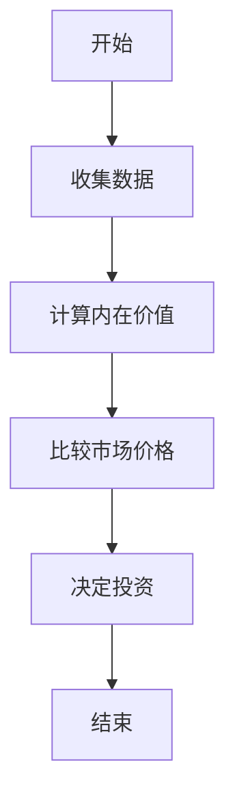
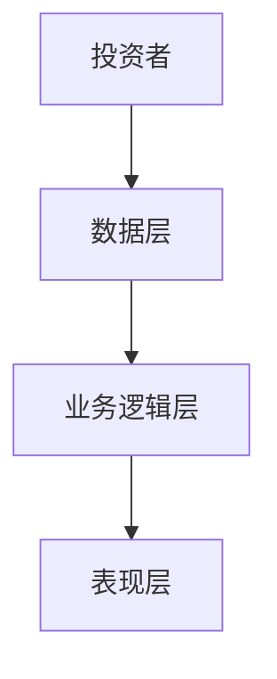

                 


# 格雷厄姆特价股票策略在高科技行业的应用挑战

> **关键词**：格雷厄姆投资理论、特价股票、高科技行业、价值投资、风险管理  
> **摘要**：本文探讨了格雷厄姆价值投资策略在高科技行业中的应用挑战，分析了高科技行业的特殊性对传统投资策略的影响，并提出了相应的解决方案和优化建议。

---

## 第一部分: 格雷厄姆特价股票策略概述

### 第1章: 格雷厄姆特价股票策略的核心概念

#### 1.1 格雷厄姆投资理论的起源与核心思想
格雷厄姆是价值投资的鼻祖，他提出的核心思想是寻找市场低估的股票进行投资。其核心概念包括：
- **安全边际**：买入价格低于内在价值，确保投资的安全性。
- **低市盈率**：选择市盈率低于市场平均水平的股票，认为这些股票具有更高的投资价值。

#### 1.2 高科技行业的特点与投资挑战
高科技行业具有以下特点：
- **高成长性**：行业增长速度快，但波动性也大。
- **高研发投入**：企业的研发投入占比较高，影响短期利润。
- **技术更新快**：技术变革迅速，企业面临较大的不确定性。

#### 1.3 格雷厄姆策略与高科技行业的结合
格雷厄姆策略在高科技行业的应用需要考虑以下几点：
- **高成长性企业的筛选**：选择那些具有持续增长潜力但市场价格被低估的企业。
- **研发投入的考量**：在评估内在价值时，需考虑企业的研发投入对未来的贡献。

---

## 第2章: 格雷厄姆策略在高科技行业的应用背景

### 2.1 高科技行业的发展现状与投资机会
高科技行业当前呈现出以下趋势：
- **人工智能和大数据**：成为推动行业增长的主要动力。
- **行业整合**：巨头企业通过并购扩张，市场集中度提高。
- **政策支持**：政府对高科技产业的扶持力度加大。

### 2.2 格雷厄姆策略在高科技行业的适应性分析
格雷厄姆策略在高科技行业的适应性分析包括：
- **内在价值的评估**：由于高科技企业的未来现金流难以准确预测，内在价值的计算更具挑战性。
- **市场波动性的影响**：高科技行业的股票价格波动较大，安全边际的计算需要更加谨慎。

---

## 第3章: 格雷厄姆策略在高科技行业的核心概念与联系

### 3.1 核心概念原理
格雷厄姆策略的核心在于寻找市场价格低于内在价值的股票。其数学模型为：
$$ V = \frac{E}{1 - g} $$
其中，\( E \) 表示未来现金流，\( g \) 表示增长率。

### 3.2 核心概念属性特征对比
以下表格对比了格雷厄姆策略与传统估值方法的差异：

| **对比维度** | **格雷厄姆策略** | **传统估值方法** |
|--------------|------------------|------------------|
| 适用场景     | 低估股票          | 高估股票          |
| 估值依据     | 内在价值          | 市场价格          |
| 风险控制     | 强调安全边际      | 侧重市场趋势      |

### 3.3 ER实体关系图架构


---

## 第4章: 格雷厄姆策略的算法原理与数学模型

### 4.1 格雷厄姆策略的数学模型
格雷厄姆的内在价值公式为：
$$ V = \frac{E}{1 - g} $$
其中，\( E \) 是未来现金流，\( g \) 是增长率。

### 4.2 算法流程图


### 4.3 Python实现代码
```python
def graham_value(enterprise_value, growth_rate):
    return enterprise_value / (1 - growth_rate)
```

---

## 第5章: 系统分析与架构设计方案

### 5.1 项目背景与目标
本项目旨在将格雷厄姆策略应用于高科技行业，筛选出具有投资价值的企业。

### 5.2 系统功能设计
系统功能包括：
- 数据收集与处理
- 内在价值计算
- 价格比较与投资决策

### 5.3 系统架构设计


---

## 第6章: 项目实战

### 6.1 环境安装
- Python 3.8+
- NumPy、Pandas等库

### 6.2 核心实现代码
```python
import numpy as np
import pandas as pd

def calculate_intrinsic_value(df, growth_rate):
    df['Intrinsic Value'] = df['Enterprise Value'] / (1 - growth_rate)
    return df

# 示例数据
data = {
    'Enterprise Value': [100, 200, 300],
    'growth_rate': [0.1, 0.15, 0.2]
}
df = pd.DataFrame(data)
result = calculate_intrinsic_value(df, 0.1)
print(result)
```

---

## 第7章: 最佳实践与总结

### 7.1 投资建议
- **长期视角**：关注企业的长期增长潜力。
- **风险管理**：合理控制投资组合的风险。

### 7.2 注意事项
- 高科技行业的技术变革快，需及时调整投资策略。
- 格雷厄姆策略在高科技行业的应用需要结合行业特点进行优化。

---

## 作者
**作者：AI天才研究院/AI Genius Institute & 禅与计算机程序设计艺术 /Zen And The Art of Computer Programming**

