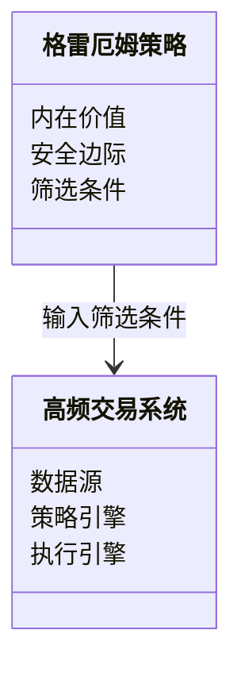
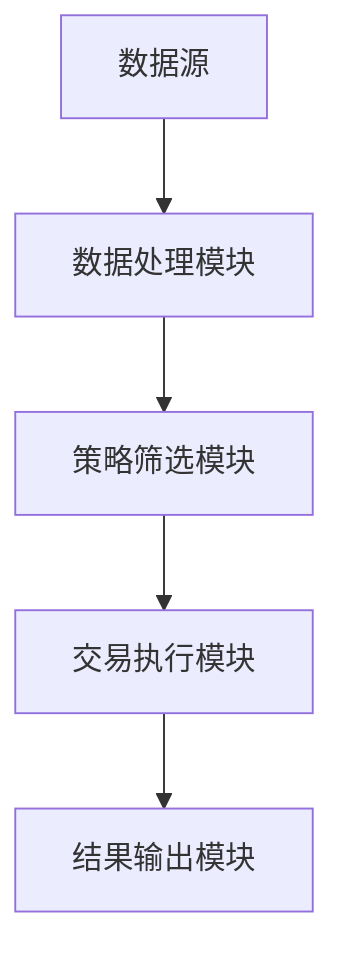
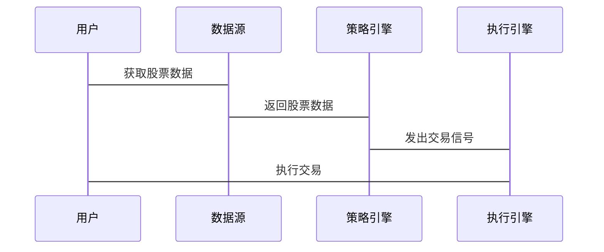

                 


# 格雷厄姆特价股票策略在高频交易环境下的适应性研究

**关键词**：格雷厄姆策略、高频交易、价值投资、算法交易、股票筛选

**摘要**：本文探讨了格雷厄姆价值投资策略在高频交易环境下的适应性。首先，介绍了格雷厄姆策略的核心概念和高频交易的基本特点，分析了两者结合的必要性和可能性。其次，详细阐述了格雷厄姆策略的数学模型与高频交易算法的实现原理。最后，通过系统架构设计和项目实战，展示了如何在高频交易环境下优化和实施格雷厄姆策略，并总结了相关经验和最佳实践。

---

## 第一部分: 格雷厄姆特价股票策略与高频交易环境概述

### 第1章: 格雷厄姆特价股票策略的核心概念

#### 1.1 格雷厄姆投资理论概述

##### 1.1.1 价值投资的基本原理
价值投资是一种以基本面分析为基础的投资策略，其核心思想是通过分析企业的财务状况、行业地位和未来前景，找到市场价值低于其内在价值的股票。格雷厄姆在其经典著作《The Intelligent Investor》中提出了这一理论，并强调了“安全边际”的重要性。

**公式：**
$$
\text{安全边际} = \text{内在价值} - \text{市场价格}
$$

##### 1.1.2 格雷厄姆的选股标准
格雷厄姆提出了一系列选股标准，包括：

1. **低市盈率（P/E）**：通常要求市盈率低于15。
2. **低市净率（P/B）**：通常要求市净率低于2。
3. **高股息率**：通常要求股息率超过5%。
4. **财务状况稳健性**：要求企业具备较强的盈利能力、较低的债务负担和充足的流动资金。

##### 1.1.3 安全边际的概念与计算
安全边际是格雷厄姆策略的核心，它反映了市场价格与内在价值之间的差距。计算公式如下：

$$
\text{安全边际} = \frac{\text{内在价值} - \text{市场价格}}{\text{内在价值}}
$$

#### 1.2 高频交易的基本特点

##### 1.2.1 高频交易的定义与特点
高频交易是指通过计算机算法在极短时间内进行大量交易的策略。其特点包括：

1. **高速**：交易执行速度极快，通常以毫秒为单位。
2. **高频**：短时间内进行大量交易。
3. **算法驱动**：依赖复杂的数学模型和算法。

##### 1.2.2 高频交易的核心技术
高频交易的核心技术包括：

1. **数据采集**：实时获取市场数据。
2. **算法开发**：设计交易算法。
3. **订单执行**：通过算法自动执行交易。

##### 1.2.3 高频交易与传统投资的区别
高频交易与传统投资的主要区别在于交易频率、策略复杂度和时间窗口。高频交易强调速度和算法，而传统投资更注重长期价值。

#### 1.3 格雷厄姆策略与高频交易的结合
格雷厄姆策略的核心是寻找市场低估的股票，而高频交易的优势在于快速执行交易。两者的结合可以通过算法快速筛选出符合条件的股票，并在最佳时机执行交易。

---

### 第2章: 格雷厄姆策略与高频交易的结合

#### 2.1 格雷厄姆策略在高频交易中的适用性

##### 2.1.1 格雷厄姆策略的可量化性
格雷厄姆策略可以通过量化模型实现，例如通过计算市盈率、市净率等指标筛选股票。

##### 2.1.2 高频交易对策略执行速度的要求
高频交易要求策略能够在极短时间内完成筛选和执行，因此需要优化算法和数据结构。

##### 2.1.3 两者的结合意义
结合格雷厄姆策略和高频交易，可以在短时间内快速发现并执行具有安全边际的交易机会。

#### 2.2 格雷厄姆策略在高频交易中的优化方向

##### 2.2.1 策略筛选条件的优化
可以通过调整筛选条件（例如放宽市盈率和市净率的标准）来适应高频交易的快速执行需求。

##### 2.2.2 策略执行效率的提升
通过优化算法和减少计算复杂度，可以提高策略的执行效率。

##### 2.2.3 策略风险控制的加强
高频交易的风险较高，因此需要加强风险控制，例如设置止损点和监控市场波动。

---

## 第二部分: 格雷厄姆特价股票策略的数学模型与算法原理

### 第3章: 格雷厄姆策略的数学模型

#### 3.1 格雷厄姆策略的核心公式

##### 3.1.1 内在价值的计算公式
$$
\text{内在价值} = \sum_{t=1}^{n} \frac{CF_t}{(1+r)^t}
$$

其中：
- $CF_t$：第$t$年的现金流
- $r$：折现率
- $n$：预测年数

##### 3.1.2 安全边际的计算公式
$$
\text{安全边际} = \text{内在价值} \times \text{安全边际系数}
$$

##### 3.1.3 市盈率与市净率的计算
- 市盈率（P/E）：$$\text{P/E} = \frac{\text{股价}}{\text{每股收益}}$$
- 市净率（P/B）：$$\text{P/B} = \frac{\text{股价}}{\text{每股净资产}}$$

#### 3.2 格雷厄姆策略的筛选条件

##### 3.2.1 低市盈率（P/E < 15）
$$
\text{P/E} < 15
$$

##### 3.2.2 低市净率（P/B < 2）
$$
\text{P/B} < 2
$$

##### 3.2.3 高股息率（股息率 > 5%）
$$
\text{股息率} > 5\%
$$

##### 3.2.4 财务状况稳健性分析
通过分析企业的财务报表，评估其盈利能力、债务负担和流动资金状况。

### 第4章: 高频交易中的算法实现

#### 4.1 高频交易的核心算法

##### 4.1.1 市场微观结构分析
高频交易需要分析市场微观结构，例如订单簿、成交情况等。

##### 4.1.2 算法交易的订单生成
通过算法生成订单，例如根据价格波动和成交量变化生成买卖信号。

##### 4.1.3 算法交易的订单执行
通过算法自动执行订单，例如使用TWAP（时间加权平均价格）或VWAP（成交量加权平均价格）算法。

#### 4.2 格雷厄姆策略在高频交易中的实现

##### 4.2.1 策略筛选的算法实现
通过算法快速筛选出符合条件的股票，例如通过计算市盈率、市净率等指标。

##### 4.2.2 策略执行效率的提升
通过优化算法和数据结构，提高策略的执行效率，例如使用并行计算和分布式系统。

##### 4.2.3 策略风险控制的算法实现
通过算法监控市场波动和风险指标，例如设置止损点和风险预警机制。

---

## 第三部分: 系统分析与架构设计方案

### 第5章: 格雷厄姆策略与高频交易系统的架构设计

#### 5.1 系统功能设计

##### 5.1.1 领域模型


##### 5.1.2 系统架构


#### 5.2 系统接口设计

##### 5.2.1 数据接口
- 数据源：股票数据接口
- 数据格式：JSON或CSV

##### 5.2.2 策略接口
- 策略筛选接口
- 策略执行接口

#### 5.3 系统交互序列图


---

## 第四部分: 项目实战

### 第6章: 格雷厄姆策略在高频交易中的实现

#### 6.1 环境安装
- 安装Python和相关库（如pandas、numpy、scikit-learn）
- 安装高频交易框架（如QuantLib、Backtrader）

#### 6.2 核心代码实现

##### 6.2.1 策略筛选模块
```python
import pandas as pd

def calculate_pe(stock_data):
    pe = stock_data['股价'] / stock_data['每股收益']
    return pe

def calculate_pb(stock_data):
    pb = stock_data['股价'] / stock_data['每股净资产']
    return pb

def screen_stocks(stock_data):
    pe = calculate_pe(stock_data)
    pb = calculate_pb(stock_data)
    return stock_data[(pe < 15) & (pb < 2) & (stock_data['股息率'] > 5)]
```

##### 6.2.2 策略执行模块
```python
import time

def execute_trade(signal):
    if signal['信号'] == '买入':
        print(f"买入 {signal['股票代码']}，价格：{signal['价格']}")
    elif signal['信号'] == '卖出':
        print(f"卖出 {signal['股票代码']}，价格：{signal['价格']}")
```

#### 6.3 代码应用解读与分析
- 策略筛选模块通过计算市盈率、市净率和股息率，筛选出符合条件的股票。
- 策略执行模块根据筛选结果发出买卖信号，并执行交易。

#### 6.4 实际案例分析
假设我们有以下股票数据：
| 股票代码 | 股价 | 每股收益 | 每股净资产 | 股息率 |
|----------|------|----------|------------|--------|
| A        | 10   | 0.67      | 5          | 6%     |
| B        | 20   | 1.33      | 10         | 4%     |

计算结果：
- 股票A：P/E = 10/0.67 ≈ 14.9 < 15，P/B = 10/5 = 2，股息率 = 6% > 5% → 符合筛选条件。
- 股票B：P/E = 20/1.33 ≈ 15 ≥ 15，P/B = 20/10 = 2，股息率 = 4% < 5% → 不符合筛选条件。

因此，股票A将被选中并执行买入交易。

#### 6.5 项目小结
通过代码实现，我们可以快速筛选出符合条件的股票，并在高频交易环境下执行交易。然而，高频交易的风险较高，需要加强风险控制和监控。

---

## 第五部分: 最佳实践

### 第7章: 最佳实践与经验总结

#### 7.1 高频交易中的注意事项
- **延迟问题**：高频交易对延迟要求极高，需要优化算法和硬件。
- **滑点问题**：高频交易容易受到市场滑点的影响，需要设置合理的止损点。
- **系统稳定性**：高频交易系统需要高度稳定，避免因系统故障导致重大损失。

#### 7.2 小结
格雷厄姆策略在高频交易环境下的适应性研究需要结合价值投资和算法交易的优势，通过优化算法和系统架构，实现快速、高效的交易。

#### 7.3 注意事项
- 高频交易需要严格的风控机制。
- 格雷厄姆策略的筛选条件需要根据市场变化进行动态调整。

#### 7.4 拓展阅读
- 《The Intelligent Investor》
- 《Algorithmic Trading: Winning Strategies and Their Rationale》
- 《Quantitative Equity Portfolio Management》

---

**作者：AI天才研究院/AI Genius Institute & 禅与计算机程序设计艺术 /Zen And The Art of Computer Programming**

