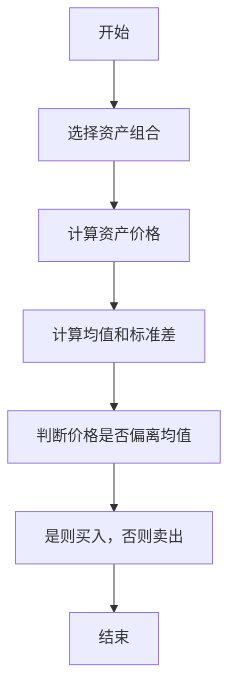
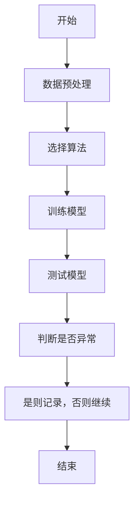
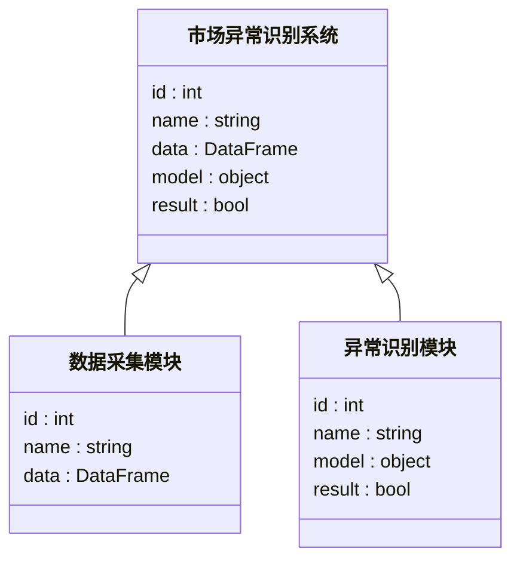
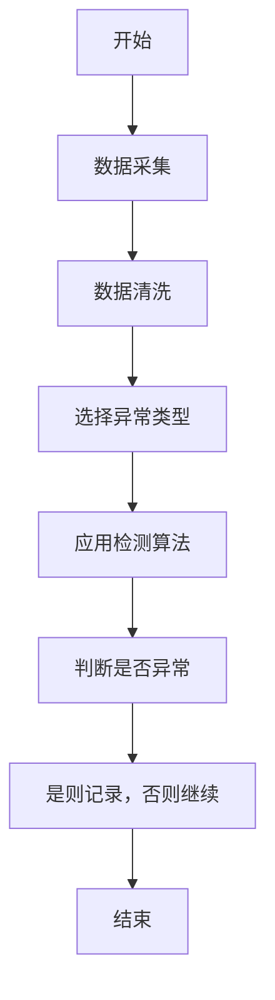
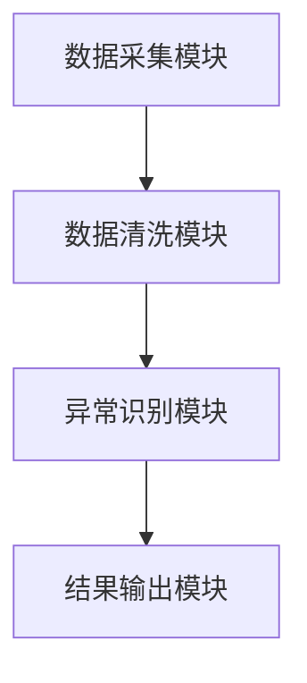
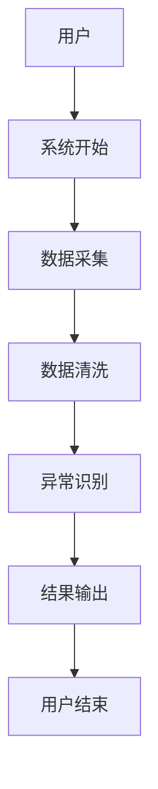

                 


# 格雷厄姆的市场异常理论

> 关键词：市场异常、价值投资、有效市场假说、统计套利、机器学习

> 摘要：本文深入探讨了格雷厄姆的市场异常理论，分析了其核心概念、算法原理、系统架构及项目实战。文章从市场异常现象的定义、分类及其与有效市场假说的关系入手，结合统计套利和机器学习方法，详细阐述了市场异常的识别与检测，并通过Python代码示例展示了其实现过程。最后，本文总结了最佳实践和注意事项，为读者提供了全面的理论与实践指导。

---

## 第一部分: 格雷厄姆的市场异常理论概述

### 第1章: 市场异常现象的定义与背景

#### 1.1 市场异常现象的定义

##### 1.1.1 什么是市场异常
市场异常（Market Anomalies）是指在金融市场上，价格或收益与理性预期模型预测的结果不符的现象。这些异常现象通常被认为是由投资者的行为偏差、信息不对称或市场机制不完善等因素引起的。

##### 1.1.2 市场异常的分类
市场异常可以分为以下几类：
1. **小盘股效应（Size Effect）**：小盘股的平均收益通常高于大盘股。
2. **动量效应（Momentum Effect）**：过去表现良好的资产未来仍可能表现良好。
3. **日历效应（Calendar Effect）**：某些特定时间段内资产价格表现出异常波动。
4. **股票分割效应（Stock Split Effect）**：股票分割后，价格通常会上涨。

##### 1.1.3 市场异常与有效市场假说的关系
有效市场假说（EMH）认为市场价格反映了所有可获得的信息，因此不存在持续的市场异常。然而，现实中确实存在一些市场异常现象，这表明市场并非完全有效。

#### 1.2 市场异常的历史背景

##### 1.2.1 早期市场异常研究回顾
早期的市场异常研究主要集中在统计套利和行为金融学领域。20世纪70年代，学者们开始系统地研究市场异常现象，并提出了许多理论模型。

##### 1.2.2 格雷厄姆与市场异常理论的关联
格雷厄姆是价值投资的鼻祖，他的投资理念强调买入低于内在价值的股票。虽然他的理论并非直接针对市场异常，但他的思想为后来的市场异常研究提供了重要启示。

##### 1.2.3 当代市场异常研究的发展
随着金融市场的复杂化和技术的进步，市场异常研究逐渐从单纯的统计分析转向结合行为金融学和机器学习的综合性研究。

#### 1.3 市场异常的理论基础

##### 1.3.1 有效市场假说的局限性
尽管有效市场假说在理论上成立，但现实中存在许多市场异常现象，说明市场并非完全有效。

##### 1.3.2 行为金融学与市场异常的关系
行为金融学认为，投资者的心理偏差和行为偏差会导致市场异常现象的发生。

##### 1.3.3 格雷厄姆投资理念与市场异常的结合
格雷厄姆的“价值投资”理念与市场异常的识别密切相关，他强调寻找被市场低估的股票，这与市场异常中的小盘股效应和动量效应有一定的关联。

### 第2章: 格雷厄姆的市场异常理论核心概念

#### 2.1 格雷厄姆市场异常理论的框架

##### 2.1.1 核心概念的定义
格雷厄姆的市场异常理论框架主要关注于股票市场的定价异常现象，包括小盘股效应、动量效应等。

##### 2.1.2 核心概念的属性特征对比表
以下是几种主要市场异常的对比表：

| 异常类型 | 定义 | 主要特征 | 统计检验方法 |
|----------|------|----------|--------------|
| 小盘股效应 | 小盘股收益高于大盘股 | 小盘股收益率较高 | t检验或回归分析 |
| 动量效应 | 过去表现好的资产未来表现好 | 动量效应显著 | 动量策略回测 |
| 日历效应 | 特定时间点的收益异常 | 年初效应、月末效应 | 时间序列分析 |
| 股票分割效应 | 分割后股价上涨 | 分割公告后的股价上涨 | 事件研究法 |

##### 2.1.3 核心概念的ER实体关系图
以下是市场异常理论的核心概念ER实体关系图：

```mermaid
erDiagram
    现象(市场异常现象) {
        id : string
        name : string
        type : string
        description : string
    }
    市场异常现象 <-- 关联 --> 小盘股效应
    市场异常现象 <-- 关联 --> 动量效应
    市场异常现象 <-- 关联 --> 日历效应
    市场异常现象 <-- 关联 --> 股票分割效应
```

#### 2.2 市场异常的主要类型

##### 2.2.1 小盘股效应
小盘股效应是指小盘股的平均收益通常高于大盘股。这种现象在20世纪70年代被发现，并成为市场异常研究的重要内容。

##### 2.2.2 动量效应
动量效应是指过去表现良好的资产未来仍可能表现良好。这种现象在股票市场上尤为明显，投资者可以通过动量策略进行投资。

##### 2.2.3 日历效应
日历效应是指某些特定时间段内资产价格表现出异常波动。例如，年初效应和月末效应就是常见的日历效应。

##### 2.2.4 股票分割效应
股票分割效应是指股票分割后，价格通常会上涨。这种现象可能是由于分割后股票的流动性提高所致。

#### 2.3 核心概念的数学模型与公式

##### 2.3.1 市场异常的度量公式
市场异常可以通过以下公式进行度量：
$$ \text{异常收益} = \text{实际收益} - \text{预期收益} $$

##### 2.3.2 市场异常的统计检验方法
常用的统计检验方法包括t检验和回归分析。例如，使用回归分析可以检验动量效应的显著性：
$$ R_i = \alpha + \beta R_{i-1} + \epsilon $$

##### 2.3.3 市场异常的回归模型
回归模型可以用于分析市场异常现象。例如，以下模型用于检验动量效应：
$$ R_{it} = \beta_1 + \beta_2 R_{i,t-1} + \epsilon $$

### 第3章: 格雷厄姆市场异常理论的算法原理

#### 3.1 市场异常的识别与检测

##### 3.1.1 基于统计套利的市场异常识别方法
统计套利是一种通过寻找资产价格偏离均值的机会进行投资的方法。以下是统计套利的流程图：



##### 3.1.2 基于机器学习的市场异常检测算法
机器学习算法，如支持向量机（SVM）和随机森林（Random Forest），可以用于市场异常检测。以下是机器学习检测的流程图：



##### 3.1.3 市场异常识别的流程图
以下是市场异常识别的流程图：


#### 3.2 市场异常的数学模型实现

##### 3.2.1 统计套利模型的数学推导
统计套利模型可以通过以下公式进行推导：
$$ \text{价差} = \text{资产A价格} - \text{资产B价格} $$
$$ \text{异常信号} = \text{价差} - \text{价差均值} $$

##### 3.2.2 市场异常的回归分析模型
回归分析模型可以用于检验动量效应：
$$ R_{it} = \beta_1 + \beta_2 R_{i,t-1} + \epsilon $$

##### 3.2.3 市场异常的分类算法实现
机器学习算法，如随机森林，可以通过以下步骤实现市场异常分类：
1. 数据预处理：清洗和特征提取。
2. 模型训练：使用训练数据训练模型。
3. 模型测试：使用测试数据评估模型性能。
4. 模型应用：对新数据进行异常检测。

#### 3.3 算法实现的Python代码示例

##### 3.3.1 统计套利模型的代码实现
以下是统计套利模型的Python代码示例：

```python
import pandas as pd
import numpy as np

# 数据收集
data = pd.read_csv('market_data.csv')

# 数据清洗
data.dropna(inplace=True)

# 计算价差
spread = data['资产A'] - data['资产B']

# 计算均值和标准差
mean_spread = spread.mean()
std_spread = spread.std()

# 判断异常信号
spread_anomaly = (spread - mean_spread) / std_spread > 2

# 输出结果
print(spread_anomaly)
```

##### 3.3.2 市场异常检测的机器学习代码
以下是机器学习检测市场异常的Python代码示例：

```python
from sklearn.ensemble import RandomForestClassifier
from sklearn.model_selection import train_test_split

# 数据收集
data = pd.read_csv('market_data.csv')

# 数据清洗
data.dropna(inplace=True)

# 特征提取
X = data[['特征1', '特征2', ...]]
y = data['标签']

# 划分训练集和测试集
X_train, X_test, y_train, y_test = train_test_split(X, y, test_size=0.2)

# 模型训练
model = RandomForestClassifier()
model.fit(X_train, y_train)

# 模型测试
score = model.score(X_test, y_test)
print(score)

# 模型应用
predictions = model.predict(X_test)
print(predictions)
```

##### 3.3.3 算法实现的详细注释与解释
以上代码示例展示了如何使用统计套利和机器学习算法进行市场异常检测。统计套利模型通过计算资产价格差来判断异常信号，而机器学习模型则通过特征提取和模型训练来实现异常检测。

### 第4章: 市场异常的系统分析与架构设计

#### 4.1 问题场景介绍

##### 4.1.1 市场异常的识别需求
市场异常识别的需求包括实时监控、异常预警和投资决策支持。

##### 4.1.2 系统目标与范围
系统的目标是实现市场异常的实时检测和预警，范围包括数据采集、异常识别和结果输出。

##### 4.1.3 系统的输入输出分析
系统的输入包括历史价格数据和市场数据，输出包括异常信号和投资建议。

#### 4.2 系统功能设计

##### 4.2.1 领域模型设计
以下是领域的类图：



##### 4.2.2 系统功能模块划分
系统的功能模块包括数据采集、异常识别和结果输出。

##### 4.2.3 系统功能流程图
以下是系统功能流程图：



#### 4.3 系统架构设计

##### 4.3.1 系统架构图
以下是系统的架构图：



##### 4.3.2 系统接口设计
系统接口包括数据输入接口、模型调用接口和结果输出接口。

##### 4.3.3 系统交互流程图
以下是系统交互流程图：



### 第5章: 项目实战

#### 5.1 项目环境安装

##### 5.1.1 安装Python环境
安装Python和必要的库，如pandas、numpy和scikit-learn。

##### 5.1.2 数据采集工具安装
安装数据采集工具，如requests和BeautifulSoup。

#### 5.2 系统核心实现源代码

##### 5.2.1 统计套利模型实现
以下是统计套利模型的Python代码：

```python
import pandas as pd
import numpy as np

# 数据采集
data = pd.read_csv('market_data.csv')

# 数据清洗
data.dropna(inplace=True)

# 计算价差
spread = data['资产A'] - data['资产B']

# 计算均值和标准差
mean_spread = spread.mean()
std_spread = spread.std()

# 判断异常信号
spread_anomaly = (spread - mean_spread) / std_spread > 2

# 输出结果
print(spread_anomaly)
```

##### 5.2.2 机器学习模型实现
以下是机器学习模型的Python代码：

```python
from sklearn.ensemble import RandomForestClassifier
from sklearn.model_selection import train_test_split

# 数据采集
data = pd.read_csv('market_data.csv')

# 数据清洗
data.dropna(inplace=True)

# 特征提取
X = data[['特征1', '特征2', ...]]
y = data['标签']

# 划分训练集和测试集
X_train, X_test, y_train, y_test = train_test_split(X, y, test_size=0.2)

# 模型训练
model = RandomForestClassifier()
model.fit(X_train, y_train)

# 模型测试
score = model.score(X_test, y_test)
print(score)

# 模型应用
predictions = model.predict(X_test)
print

