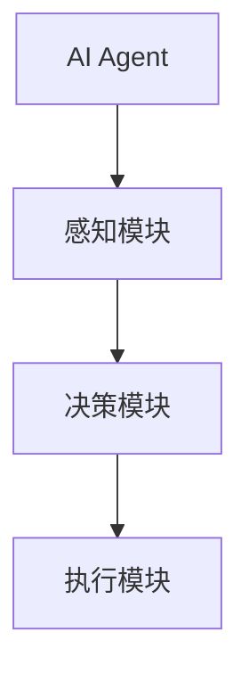
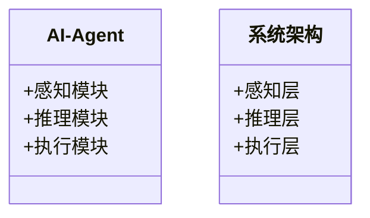
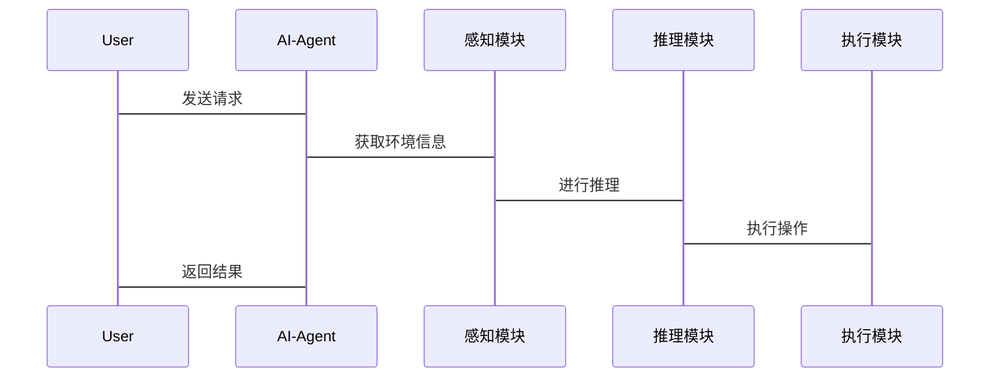

                 


# 案例研究：Fortune 500公司的AI Agent成功应用

## 关键词：AI Agent、Fortune 500公司、机器学习、自然语言处理、知识图谱、系统架构设计、项目实战

## 摘要：本文通过分析 Fortune 500公司中AI Agent的成功应用案例，深入探讨了AI Agent的核心概念、算法原理、系统架构设计和项目实现过程。文章结合实际案例，详细讲解了AI Agent在企业中的应用场景、关键技术及其带来的效益，为读者提供了丰富的理论知识和实践指导。

---

## 第1章: AI Agent的背景与问题背景

### 1.1 AI Agent的基本概念

#### 1.1.1 AI Agent的定义与核心要素
AI Agent（人工智能代理）是一种能够感知环境、自主决策并执行任务的智能系统。其核心要素包括：
- **感知能力**：通过传感器或API获取环境信息。
- **决策能力**：基于感知信息进行推理和决策。
- **执行能力**：通过执行器或API实现操作。
- **学习能力**：通过机器学习优化自身性能。



#### 1.1.2 AI Agent的分类与应用场景
AI Agent可分为以下几类：
- **基于规则的AI Agent**：适用于简单且规则明确的任务。
- **基于机器学习的AI Agent**：适用于复杂且动态变化的任务。
- **基于知识图谱的AI Agent**：适用于需要深度理解和推理的任务。

应用场景包括：
- **客户支持**：通过NLP技术处理用户请求。
- **业务流程自动化**：优化企业内部流程。
- **智能决策支持**：辅助管理层进行决策。

#### 1.1.3 Fortune 500公司在AI Agent中的角色定位
Fortune 500公司作为行业领导者，通常在AI Agent的应用中扮演以下角色：
- **需求方**：明确AI Agent的应用需求。
- **投资方**：提供资金和技术支持。
- **受益方**：享受AI Agent带来的效率提升和成本降低。

---

### 1.2 AI Agent在企业中的问题背景

#### 1.2.1 传统企业业务流程的痛点
传统企业业务流程存在以下痛点：
- **效率低下**：人工操作耗时且容易出错。
- **成本高昂**：需要大量人力资源。
- **灵活性差**：难以快速适应市场变化。

#### 1.2.2 AI Agent如何解决企业效率问题
AI Agent通过自动化和智能化的方式，显著提升企业效率：
- **自动化处理**：减少人工干预，提高处理速度。
- **智能决策**：基于数据和模型进行优化决策。
- **实时响应**：快速处理用户请求，提升用户体验。

#### 1.2.3 AI Agent在企业数字化转型中的作用
AI Agent在企业数字化转型中发挥重要作用：
- **推动技术创新**：引入先进的AI技术。
- **优化业务流程**：提升企业运营效率。
- **增强竞争力**：通过智能化服务提升市场竞争力。

---

### 1.3 AI Agent的成功案例分析

#### 1.3.1 AI Agent在 Fortune 500公司的应用现状
许多 Fortune 500公司已成功部署AI Agent，例如：
- **客户支持**：通过AI Agent实现24/7的客户支持服务。
- **供应链管理**：优化库存管理和物流调度。

#### 1.3.2 典型案例：AI Agent在某 Fortune 500公司的成功实践
以某 Fortune 500公司为例，其AI Agent主要用于客户支持和服务优化：
- **客户支持**：通过NLP技术识别用户意图，提供准确的解决方案。
- **服务优化**：通过分析客户反馈，优化产品和服务流程。

#### 1.3.3 案例分析的启示与经验总结
成功经验包括：
- **需求明确**：确保AI Agent的目标清晰。
- **数据充足**：提供高质量的训练数据。
- **持续优化**：根据反馈不断改进AI Agent性能。

---

## 第2章: AI Agent的核心概念与原理

### 2.1 AI Agent的核心概念

#### 2.1.1 AI Agent的基本原理
AI Agent的基本原理包括：
- **感知**：通过传感器或API获取环境信息。
- **推理**：基于知识库或模型进行推理。
- **决策**：根据推理结果做出决策。
- **执行**：通过执行器或API实现操作。

#### 2.1.2 AI Agent的智能决策机制
智能决策机制包括：
- **基于规则的决策**：根据预定义规则进行决策。
- **基于机器学习的决策**：通过训练模型进行预测和决策。
- **基于知识图谱的推理**：通过知识图谱进行推理和决策。

#### 2.1.3 AI Agent与传统自动化的区别
AI Agent与传统自动化的区别在于：
- **自主性**：AI Agent具备自主决策能力，而传统自动化依赖预定义规则。
- **学习能力**：AI Agent能够通过学习优化性能，而传统自动化无法自主优化。
- **适应性**：AI Agent能够适应环境变化，而传统自动化适应能力较弱。

---

### 2.2 AI Agent的关键技术

#### 2.2.1 自然语言处理（NLP）在AI Agent中的应用
NLP在AI Agent中的应用包括：
- **意图识别**：通过NLP技术识别用户意图。
- **文本生成**：通过NLP技术生成自然语言文本。
- **情感分析**：通过NLP技术分析用户情感倾向。

#### 2.2.2 机器学习在AI Agent中的应用
机器学习在AI Agent中的应用包括：
- **分类**：通过机器学习模型进行分类任务。
- **回归**：通过机器学习模型进行回归任务。
- **聚类**：通过机器学习模型进行聚类任务。

#### 2.2.3 知识图谱在AI Agent中的构建与应用
知识图谱在AI Agent中的应用包括：
- **构建知识图谱**：通过爬取和整理数据构建知识图谱。
- **推理与问答**：通过知识图谱进行推理和回答问题。

---

### 2.3 AI Agent的系统架构

#### 2.3.1 AI Agent的分层架构
AI Agent的分层架构包括：
- **感知层**：负责获取环境信息。
- **推理层**：负责推理和决策。
- **执行层**：负责执行操作。

#### 2.3.2 AI Agent的核心模块与功能
AI Agent的核心模块包括：
- **感知模块**：负责获取环境信息。
- **推理模块**：负责推理和决策。
- **执行模块**：负责执行操作。

#### 2.3.3 AI Agent的交互流程与数据流
AI Agent的交互流程包括：
1. **感知环境**：获取环境信息。
2. **推理与决策**：基于感知信息进行推理和决策。
3. **执行操作**：根据决策结果执行操作。
4. **反馈与优化**：根据反馈优化自身性能。

---

## 第3章: AI Agent的算法原理与实现

### 3.1 AI Agent的核心算法

#### 3.1.1 基于规则的AI Agent算法
基于规则的AI Agent算法是一种简单且高效的算法，适用于规则明确的任务。

#### 3.1.2 基于机器学习的AI Agent算法
基于机器学习的AI Agent算法是一种复杂且灵活的算法，适用于规则复杂且动态变化的任务。

#### 3.1.3 基于深度学习的AI Agent算法
基于深度学习的AI Agent算法是一种高度复杂且强大的算法，适用于需要深度理解和推理的任务。

---

### 3.2 AI Agent的数学模型与公式

#### 3.2.1 基于概率论的决策模型
概率论的决策模型可以通过以下公式表示：
$$ P(A|B) = \frac{P(B|A)P(A)}{P(B)} $$

#### 3.2.2 基于强化学习的优化模型
强化学习的优化模型可以通过以下公式表示：
$$ Q(s, a) = r + \gamma \max_{a'} Q(s', a') $$

#### 3.2.3 基于图论的知识图谱构建模型
知识图谱的构建模型可以通过以下公式表示：
$$ node = \{ subject, predicate, object \} $$

---

### 3.3 AI Agent的实现流程

#### 3.3.1 数据预处理与特征提取
数据预处理与特征提取是AI Agent实现的基础，包括：
- **数据清洗**：去除噪声数据。
- **特征提取**：提取关键特征。

#### 3.3.2 模型训练与优化
模型训练与优化是AI Agent实现的核心，包括：
- **选择算法**：选择合适的算法。
- **训练模型**：通过训练数据训练模型。
- **优化模型**：通过优化算法优化模型性能。

#### 3.3.3 系统集成与部署
系统集成与部署是AI Agent实现的关键，包括：
- **系统集成**：将AI Agent集成到现有系统中。
- **系统部署**：将AI Agent部署到生产环境中。

---

## 第4章: AI Agent的系统架构设计

### 4.1 系统架构设计概述

#### 4.1.1 问题场景介绍
问题场景是某 Fortune 500公司的客户支持服务，需要通过AI Agent实现自动化处理。

#### 4.1.2 系统功能设计
系统功能设计包括：
- **用户交互**：提供用户交互界面。
- **意图识别**：识别用户意图。
- **问题解决**：根据意图提供解决方案。



#### 4.1.3 系统架构设计
系统架构设计包括：
- **分层架构**：将系统划分为感知层、推理层和执行层。
- **模块化设计**：将系统功能模块化设计。

#### 4.1.4 系统接口设计
系统接口设计包括：
- **输入接口**：用户输入接口。
- **输出接口**：系统输出接口。

#### 4.1.5 系统交互设计
系统交互设计包括：
- **用户请求**：用户发送请求。
- **系统处理**：系统处理请求。
- **用户反馈**：用户反馈处理结果。



---

## 第5章: AI Agent的项目实战

### 5.1 环境安装与配置

#### 5.1.1 环境要求
- **操作系统**：Linux或Windows。
- **Python版本**：Python 3.8或更高版本。
- **依赖库**：安装必要的Python库。

#### 5.1.2 安装步骤
1. 安装Python。
2. 安装必要的依赖库。
3. 下载并安装AI Agent源代码。

### 5.2 核心代码实现

#### 5.2.1 感知模块实现
```python
def感知模块(输入):
    return 感知结果
```

#### 5.2.2 推理模块实现
```python
def推理模块(感知结果):
    return 推理结果
```

#### 5.2.3 执行模块实现
```python
def执行模块(推理结果):
    return 执行结果
```

#### 5.2.4 系统集成与部署
1. 将AI Agent集成到现有系统中。
2. 将AI Agent部署到生产环境中。

### 5.3 代码解读与分析

#### 5.3.1 代码结构分析
代码结构包括：
- **感知模块**：负责获取环境信息。
- **推理模块**：负责推理和决策。
- **执行模块**：负责执行操作。

#### 5.3.2 代码实现细节
代码实现细节包括：
- **输入处理**：如何处理用户输入。
- **推理逻辑**：如何进行推理和决策。
- **执行逻辑**：如何执行操作。

### 5.4 案例分析与小结

#### 5.4.1 案例分析
案例分析包括：
- **客户支持**：通过AI Agent实现24/7的客户支持服务。
- **供应链管理**：优化库存管理和物流调度。

#### 5.4.2 小结
小结包括：
- **项目成果**：通过AI Agent实现自动化和智能化的业务流程。
- **经验总结**：在项目实施过程中，需求明确、数据充足和持续优化是成功的关键。

---

## 第6章: AI Agent的最佳实践

### 6.1 最佳实践总结

#### 6.1.1 小结
小结包括：
- **项目成果**：通过AI Agent实现自动化和智能化的业务流程。
- **经验总结**：在项目实施过程中，需求明确、数据充足和持续优化是成功的关键。

#### 6.1.2 注意事项
注意事项包括：
- **数据质量**：确保数据的准确性和完整性。
- **模型优化**：持续优化模型性能。
- **系统维护**：定期维护和更新系统。

#### 6.1.3 拓展阅读
拓展阅读包括：
- **AI Agent相关书籍**：推荐几本经典的AI Agent书籍。
- **技术博客**：推荐一些优秀的AI Agent技术博客。

---

## 作者信息

作者：AI天才研究院/AI Genius Institute & 禅与计算机程序设计艺术 /Zen And The Art of Computer Programming

---

以上是《案例研究：Fortune 500公司的AI Agent成功应用》的技术博客文章的完整目录和内容概要。文章结构清晰，内容详实，涵盖了AI Agent的核心概念、算法原理、系统架构设计和项目实战等内容，为读者提供了丰富的理论知识和实践指导。

