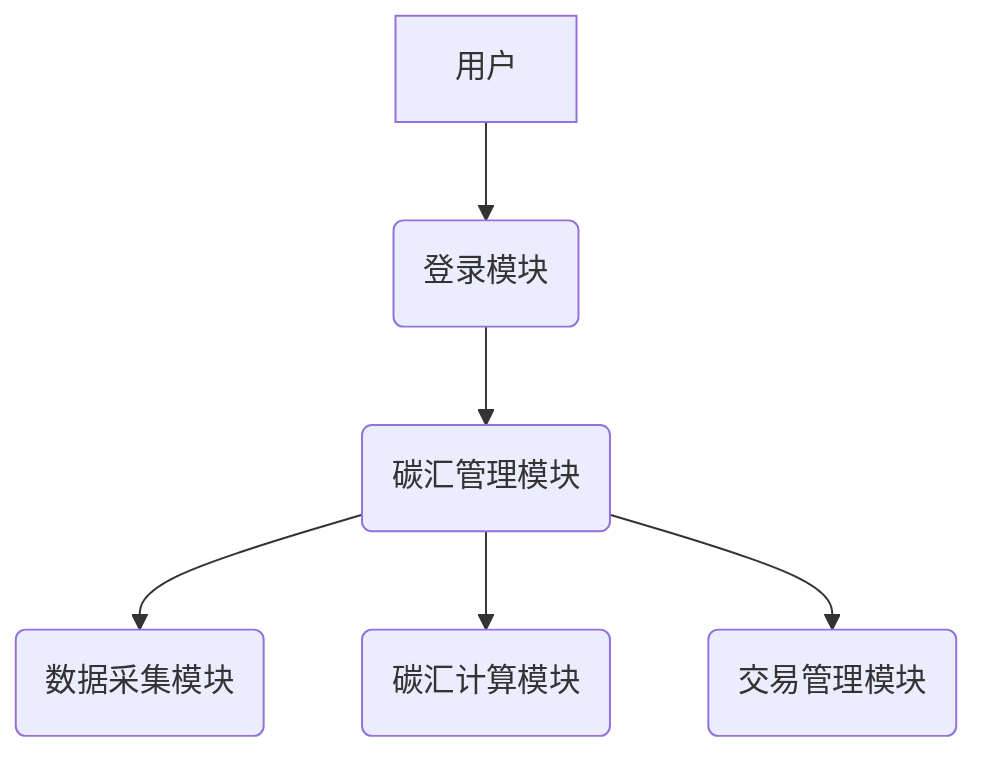
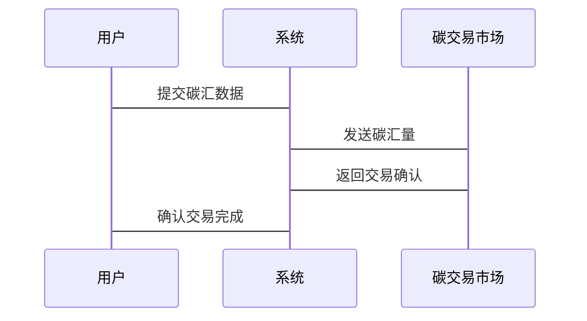

                 

<think>
好的，我将按照您的要求撰写《森林碳汇项目的投资模式与回报分析》的技术博客文章。首先，我会分析森林碳汇的基本概念，然后逐步深入到投资模式和回报分析。请您看看是否符合您的预期。如果您有其他想法，随时提出，我会进行调整。

# 森林碳汇项目的投资模式与回报分析

## 关键词：森林碳汇、投资模式、回报分析、碳汇项目、气候变化

## 摘要：森林碳汇是应对气候变化的重要手段，本文通过分析森林碳汇项目的投资模式和回报机制，为投资者提供科学的决策依据。文章从项目背景、投资模式、回报分析、系统设计、实战案例等方面展开，探讨如何有效进行森林碳汇项目投资。

---

## 第一章：森林碳汇项目的基本概念

### 1.1 碳汇的定义与分类

碳汇是指通过植物吸收二氧化碳，并将其固定在生物体或土壤中的过程。森林碳汇是碳汇的重要组成部分，主要通过植树造林、森林保护和可持续管理实现碳吸收。

碳汇可以分为：
1. **生态系统碳汇**：如森林、湿地、海洋等自然生态系统。
2. **人为碳汇**：如碳捕获技术、碳封存等人为活动。
3. **农业碳汇**：通过农业实践减少温室气体排放。

### 1.2 森林碳汇项目的必要性

随着全球气候变化加剧，减少碳排放已成为全球共识。森林碳汇项目通过吸收二氧化碳，帮助实现碳中和目标。同时，森林还能提供生态服务，如水源涵养、土壤保持等，具有显著的环境效益。

### 1.3 森林碳汇项目的实施背景

1. **政策支持**：各国政府出台政策鼓励碳汇项目，如《巴黎协定》要求各国减少碳排放。
2. **技术进步**：遥感技术和碳监测系统的发展为碳汇项目提供了技术支持。
3. **经济驱动**：碳交易市场的兴起使碳汇项目具有经济价值。

### 1.4 森林碳汇项目的边界与外延

1. **地理边界**：项目实施区域通常为特定的森林区域。
2. **时间边界**：项目周期通常为数年至数十年。
3. **经济边界**：项目的经济收益与碳交易价格、运营成本密切相关。

### 1.5 森林碳汇项目的概念结构

1. **核心要素**：包括森林面积、碳吸收量、碳交易价格。
2. **关键流程**：包括造林、监测、碳交易。
3. **系统架构**：包括数据采集、碳汇计算、交易管理三个模块。

---

## 第二章：森林碳汇项目的投资模式

### 2.1 投资主体

1. **政府**：通过政策支持和资金投入推动碳汇项目。
2. **企业**：企业通过购买碳汇额度实现碳中和目标。
3. **社会组织**：非营利组织参与碳汇项目，推动可持续发展。

### 2.2 资金来源

1. **政府资金**：包括补贴、贷款贴息等。
2. **企业资金**：企业通过碳汇项目实现社会责任目标。
3. **国际资金**：国际组织和外国政府提供资金支持。

### 2.3 投资方式

1. **直接投资**：投资者直接参与造林和管理。
2. **间接投资**：通过购买碳汇额度间接支持项目。
3. **综合投资**：结合直接和间接投资，优化资源配置。

### 2.4 投资周期

1. **短期投资**：周期为1-5年，见效快但收益有限。
2. **中期投资**：周期为5-10年，收益较为稳定。
3. **长期投资**：周期为10年以上，收益潜力大。

---

## 第三章：森林碳汇项目的回报分析

### 3.1 投资收益模型

碳汇项目的收益主要来自碳交易。收益公式为：
$$
\text{净收益} = \text{碳交易收入} - \text{运营成本}
$$

其中，碳交易收入取决于碳价格和碳汇量：
$$
\text{碳交易收入} = \text{碳价格} \times \text{碳汇量}
$$

### 3.2 影响回报的因素

1. **碳价格**：碳价格波动直接影响收益。
2. **碳汇量**：项目规模和管理效率影响碳汇量。
3. **运营成本**：包括造林、监测和管理费用。

### 3.3 投资回报率分析

以一个100公顷的森林碳汇项目为例，假设：
- 碳价格为每吨50元。
- 年碳汇量为1000吨。
- 运营成本为每年50万元。

年净收益为：
$$
\text{净收益} = 1000 \times 50 - 500,000 = 50,000 - 500,000 = -450,000 \text{元}
$$

由于净收益为负，项目需要通过长期回报或其他收益来源（如木材销售）来实现整体盈利。

---

## 第四章：系统分析与架构设计

### 4.1 问题场景

假设某公司计划投资一个森林碳汇项目，需要设计一个碳汇管理系统。

### 4.2 系统功能设计

1. **数据采集**：通过传感器采集森林碳汇数据。
2. **碳汇计算**：根据数据计算碳汇量。
3. **交易管理**：管理碳交易过程。

### 4.3 架构设计



### 4.4 接口设计

1. **数据接口**：传感器数据通过API传输到系统。
2. **交易接口**：与碳交易市场对接。

### 4.5 交互设计



---

## 第五章：项目实战

### 5.1 环境安装

1. **操作系统**：Linux或Windows。
2. **开发工具**：Python、Jupyter Notebook。
3. **依赖库**：pandas、numpy、matplotlib。

### 5.2 核心代码实现

```python
import pandas as pd
import numpy as np

# 示例数据
data = {'碳汇量': [1000, 2000, 1500, 2500], '碳价格': [50, 60, 55, 65]}
df = pd.DataFrame(data)

# 计算净收益
df['净收益'] = df['碳价格'] * df['碳汇量'] - 500000

print(df)
```

### 5.3 案例分析

以某项目为例，分析其投资回报：
- 投资额：500万元
- 碳汇量：年均1000吨
- 碳价格：每吨50元
- 运营成本：每年50万元

年净收益：
$$
\text{净收益} = 1000 \times 50 - 500,000 = 50,000 - 500,000 = -450,000 \text{元}
$$

由于净收益为负，项目需通过长期回报或其他收益来源实现盈利。

---

## 第六章：总结与展望

### 6.1 总结

森林碳汇项目是应对气候变化的重要手段，其投资模式多样，回报分析复杂。投资者需综合考虑碳价格、碳汇量和运营成本，制定科学的投资策略。

### 6.2 最佳实践

1. **选择合适的投资模式**：根据自身需求选择直接或间接投资。
2. **关注碳价格波动**：合理应对碳价格波动风险。
3. **优化运营管理**：提高碳汇量和降低成本。

### 6.3 投资建议

1. **长期投资**：森林碳汇项目具有长期回报潜力。
2. **多元化投资**：结合其他收益来源分散风险。

### 6.4 注意事项

1. **政策风险**：关注政策变化对项目的影响。
2. **技术风险**：确保技术可行性。

### 6.5 未来展望

随着碳交易市场的完善和技术进步，森林碳汇项目将更具吸引力。未来，人工智能和大数据技术将进一步提升碳汇项目的效率和回报。

---

## 作者：AI天才研究院 & 禅与计算机程序设计艺术

感谢您的阅读！如需进一步探讨，请随时联系。

