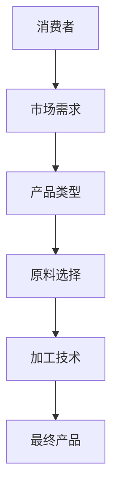

                 

# 植物基肉类替代品市场的增长与投资机会

---

## 关键词：植物基肉类替代品，市场增长，投资机会，技术创新，消费者行为

---

## 摘要：  
随着全球对健康、环保和可持续发展的关注日益增加，植物基肉类替代品市场正迎来快速增长。本文从市场背景、核心概念、技术原理、消费者行为、投资策略等多个维度，深入分析植物基肉类替代品市场的现状、驱动因素及未来发展趋势。通过技术与市场的结合，本文为投资者和企业提供清晰的洞察和战略建议，抓住这一领域的投资机会。

---

# 第1章 植物基肉类替代品市场的背景介绍

## 1.1 植物基肉类替代品的定义与核心概念  
植物基肉类替代品是指通过植物蛋白、脂肪和其他成分模拟传统肉类的质地、口感和营养的食品。其核心概念包括：

- **原料来源**：主要使用大豆蛋白、豌豆蛋白、小麦蛋白等植物蛋白。
- **产品形态**：包括肉饼、香肠、汉堡肉等，模拟传统肉类的质地和口感。
- **营养成分**：富含蛋白质、纤维，通常低脂、低胆固醇。

## 1.2 市场背景与问题描述  
- **全球肉类消费趋势**：随着人口增长和生活水平提高，传统肉类消费量持续增长，但其生产过程中的环境问题日益突出。
- **消费者需求变化**：健康意识提升，消费者更倾向于选择低脂、高蛋白的食品。
- **环境与健康驱动**：畜牧业是全球温室气体排放的主要来源之一，植物基肉类替代品的生产更环保。

## 1.3 植物基肉类替代品的核心属性  
- **营养性**：植物基肉类替代品通常提供丰富的蛋白质和纤维，但某些营养成分（如维生素B12）可能不足。
- **可持续性**：相比传统肉类，植物基肉类的生产过程更环保，用水和土地资源更少。
- **多样性**：市场上已有多种植物基肉类替代品，包括素肉饼、汉堡肉等，满足不同消费需求。

---

# 第2章 植物基肉类替代品的核心概念与联系

## 2.1 核心概念原理  
植物基肉类替代品的核心在于模拟传统肉类的质地和口感，主要通过以下技术实现：  
1. **蛋白质提取与加工**：使用大豆蛋白、豌豆蛋白等，通过挤压、成型等工艺制造肉质感。  
2. **脂肪替代**：使用植物油或脂肪模拟肉类的口感。  
3. **添加剂调整**：通过添加风味剂、色素等调整产品的感官特性。

## 2.2 核心概念属性对比表  

| 属性         | 传统肉类       | 植物基肉类替代品   |
|--------------|----------------|--------------------|
| 蛋白质含量   | 高             | 高                 |
| 脂肪含量     | 高             | 可调节             |
| 环境影响     | 高             | 低                 |
| 营养均衡     | 全面           | 可能缺乏维生素B12等 |

## 2.3 ER实体关系图  

---

# 第3章 植物基肉类替代品市场的增长驱动因素

## 3.1 市场增长驱动因素  
- **健康需求**：消费者更倾向于选择健康、低脂的食品。  
- **环保趋势**：减少对环境的影响，符合可持续发展理念。  
- **技术创新**：新型加工技术使植物基肉类的质地和口感更接近传统肉类。  

## 3.2 市场规模与增长预测  
- **全球市场规模**：预计未来五年年复合增长率（CAGR）为10%以上，到2030年市场规模将突破数百亿美元。  
- **区域市场**：欧美市场增长最快，中国和东南亚市场潜力巨大。  

## 3.3 竞争格局分析  
- **主要企业**：Beyond Meat、Impossible Foods、Kraft Heinz等。  
- **技术与品牌竞争**：企业通过技术创新和品牌营销争夺市场份额。  

---

# 第4章 植物基肉类替代品的技术创新与实现

## 4.1 替代蛋白技术  
- **豌豆蛋白的应用**：豌豆蛋白是植物基肉类的主要原料，具有较高的蛋白质含量和良好的加工性能。  
- **大豆蛋白的优势**：大豆蛋白成本低，但可能含有过敏原。  

## 4.2 细胞培养肉的技术原理  
细胞培养肉是另一种替代蛋白技术，通过培养动物细胞生产肉类产品。其主要步骤包括：  
1. 细胞培养：从动物细胞中提取细胞株，在受控环境中培养。  
2. 组织构建：通过生物工程手段将细胞组织构建为肉类产品。  

## 4.3 发酵技术的应用  
发酵技术用于生产植物基肉类的风味和质地，例如通过发酵产生特定的氨基酸和风味物质。  

---

# 第5章 消费者行为与市场趋势

## 5.1 消费者行为分析  
- **健康驱动型消费者**：注重低脂、高蛋白食品。  
- **环保驱动型消费者**：关注产品对环境的影响。  
- **价格敏感型消费者**：对价格敏感，更倾向于选择性价比高的产品。  

## 5.2 市场趋势与未来方向  
- **产品多样化**：开发更多种类的植物基肉类替代品，满足不同需求。  
- **品牌信任度**：消费者更倾向于选择知名品牌或有透明生产过程的企业。  

---

# 第6章 投资策略与风险管理

## 6.1 投资策略  
- **技术创新**：加大对新型加工技术和原料开发的投入。  
- **市场定位**：针对特定消费群体，精准定位市场。  
- **品牌营销**：通过营销提升品牌知名度和消费者信任度。  

## 6.2 风险管理  
- **技术风险**：关注技术可行性与成本控制。  
- **市场需求风险**：深入研究消费者需求，避免产品同质化。  
- **政策风险**：关注相关政策变化，确保合规性。  

---

# 第7章 结论与展望

## 7.1 结论  
植物基肉类替代品市场潜力巨大，技术创新和消费者需求是推动市场增长的关键因素。投资者应关注技术创新和市场定位，抓住这一领域的投资机会。

## 7.2 未来展望  
未来，植物基肉类替代品将更加多样化，技术也将更加成熟。随着消费者健康意识的提升和环保政策的推动，这一市场将继续保持快速增长。

---

# 作者：AI天才研究院/AI Genius Institute & 禅与计算机程序设计艺术 /Zen And The Art of Computer Programming

