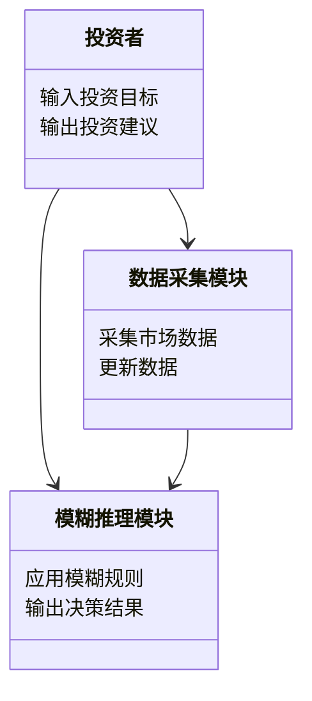
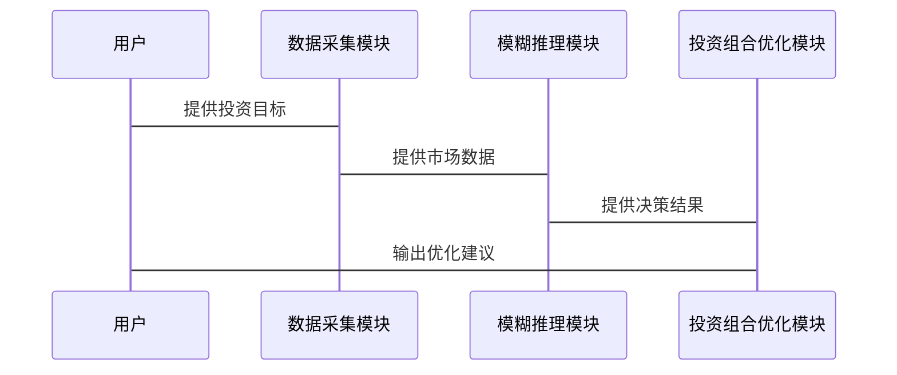

                 

<think>
好的，我需要帮助用户撰写一篇关于“模糊逻辑在投资决策支持系统中的应用”的技术博客文章。用户已经提供了一个详细的目录大纲，现在需要根据这个大纲来撰写整篇文章。我会按照目录的结构，逐一展开每个部分的内容，确保每部分内容详实，符合用户的格式和内容要求。

首先，我会先写文章的标题、关键词和摘要，这部分相对简单，主要概括文章的核心内容。接下来是每个章节的内容，每个章节都需要详细展开，包括定义、原理、应用、优缺点等，可能还需要插入数学公式、图表和代码示例，以增强文章的可读性和专业性。

在撰写过程中，我需要确保语言简洁明了，逻辑清晰，每章的小结能够总结本章的主要内容，帮助读者回顾和巩固所学知识。同时，我还要注意保持文章的整体连贯性，确保各章之间有良好的衔接。

最后，我会在文章末尾添加作者信息，按照用户的要求署名为“AI天才研究院”和“禅与计算机程序设计艺术”。整个撰写过程需要仔细思考每个部分的内容，确保覆盖所有用户要求的细节，同时保持文章的专业性和可读性。
</think>

# 模糊逻辑在投资决策支持系统中的应用

---

## 关键词：
模糊逻辑, 投资决策, 模糊推理, 模糊规则, 投资组合优化, 不确定性分析

---

## 摘要：
本文详细探讨了模糊逻辑在投资决策支持系统中的应用，从模糊逻辑的基本概念、算法原理到系统设计和项目实战，全面分析其在处理投资决策中不确定性问题的优势。通过数学模型、算法实现和系统架构的设计，展示了模糊逻辑如何帮助投资者在复杂多变的市场环境中做出更明智的决策。文章最后通过案例分析总结了模糊逻辑在投资决策中的最佳实践和未来发展方向。

---

## 第1章: 模糊逻辑与投资决策概述

### 1.1 模糊逻辑的定义与特点
模糊逻辑是一种处理不精确和模糊信息的数学工具，其核心在于将真实世界中常见的“程度”概念量化。与传统的二值逻辑（真/假）不同，模糊逻辑允许事物处于中间状态，例如“非常热”、“ somewhat cold”等。这种特性使其非常适合处理投资决策中常见的不确定性问题。

#### 1.1.1 模糊逻辑的定义
模糊逻辑由 Lofti Zadeh 在1965年提出，其核心是通过隶属度函数来表示元素属于某个集合的程度。例如，对于集合“年轻”，一个人的年龄可以是完全属于或不属于，但在模糊逻辑中，25岁的人可能有较高的隶属度属于“年轻”，而50岁的人则可能有较低的隶属度。

#### 1.1.2 模糊逻辑的核心特点
- **连续性**：模糊逻辑允许从0到1的连续隶属度值，而不是简单的二值。
- **不精确性**：模糊逻辑适合处理不精确、模糊的信息。
- **可解释性**：模糊逻辑可以通过语言规则（如“如果A，则B”）进行推理，具有较高的可解释性。

#### 1.1.3 模糊逻辑与传统逻辑的区别
| 特性                | 传统逻辑             | 模糊逻辑             |
|---------------------|----------------------|----------------------|
| 真值范围            | 0或1                 | [0,1]                |
| 处理方式            | 精确判断             | 模糊判断             |
| 可解释性            | 较低                 | 较高                 |

### 1.2 模糊逻辑在投资决策中的应用背景
投资决策是一个复杂的过程，涉及众多不确定因素，如市场波动、经济指标、公司财务状况等。传统的定量分析方法往往难以捕捉这些模糊信息，而模糊逻辑则能够有效地处理这些问题。

#### 1.2.1 投资决策的复杂性与不确定性
投资决策需要考虑多种因素，这些因素往往存在不确定性，例如：
- 市场趋势的预测
- 公司财务状况的变化
- 宏观经济政策的影响

#### 1.2.2 模糊逻辑在处理不确定性中的优势
模糊逻辑能够将专家的经验和知识转化为模糊规则，从而帮助投资者在面对模糊信息时做出更合理的决策。

#### 1.2.3 投资决策支持系统的概念与目标
投资决策支持系统（IDSS）是一种辅助投资者做出决策的计算机系统，其目标是通过整合模糊逻辑、数据分析等技术，提供更准确的投资建议。

### 1.3 本章小结
本章介绍了模糊逻辑的基本概念、特点及其在投资决策中的应用背景，强调了模糊逻辑在处理不确定性问题中的优势。

---

## 第2章: 模糊逻辑的核心概念与原理

### 2.1 模糊集合与隶属度函数
模糊集合是模糊逻辑的基础，其核心是隶属度函数，用于表示元素属于某个集合的程度。

#### 2.1.1 模糊集合的定义
模糊集合是由隶属度函数定义的集合，例如：
$$
A = \{x | \mu_A(x)\}
$$
其中，$\mu_A(x)$表示元素$x$属于集合$A$的隶属度，取值范围为[0,1]。

#### 2.1.2 隶属度函数的类型与选择
常见的隶属度函数包括：
- **梯形函数**：用于表示逐渐增加或减少的趋势。
- **三角函数**：用于表示中间趋势。
- **高斯函数**：用于表示正态分布。

选择隶属度函数时，需要根据具体问题和数据特点进行调整。

#### 2.1.3 隶属度函数的计算方法
以梯形函数为例，其计算公式为：
$$
\mu_A(x) = \begin{cases}
0, & x < a \\
(x - a)/(b - a), & a \leq x \leq b \\
1, & b \leq x \leq c \\
(x - c)/(d - c), & c \leq x \leq d \\
0, & x > d
\end{cases}
$$

### 2.2 模糊逻辑运算
模糊逻辑运算包括与运算、或运算和非运算。

#### 2.2.1 与运算
模糊逻辑的与运算可以通过以下公式表示：
$$
\mu_{A \cap B}(x) = \min(\mu_A(x), \mu_B(x))
$$

#### 2.2.2 或运算
模糊逻辑的或运算可以通过以下公式表示：
$$
\mu_{A \cup B}(x) = \max(\mu_A(x), \mu_B(x))
$$

#### 2.2.3 补运算
模糊逻辑的补运算可以通过以下公式表示：
$$
\mu_{\neg A}(x) = 1 - \mu_A(x)
$$

### 2.3 模糊推理与规则库设计
模糊推理是通过模糊规则对模糊信息进行处理的过程。

#### 2.3.1 模糊推理的基本原理
模糊推理基于模糊规则，例如：
- 如果A是高的，那么B是好的。
- 如果B是好的，那么C是值得投资的。

#### 2.3.2 模糊规则的表示方法
模糊规则通常表示为：
$$
\text{如果 } X \text{ 是 } A, \text{ 那么 } Y \text{ 是 } B
$$
其中，$A$和$B$是模糊概念。

#### 2.3.3 规则库的构建与管理
规则库需要根据具体问题进行设计，通常包括多个模糊规则。

### 2.4 模糊逻辑与投资决策的关系
模糊逻辑在投资决策中的应用主要体现在处理不确定性、提供模糊规则和优化投资组合等方面。

#### 2.4.1 模糊逻辑在投资决策中的作用
- 提供模糊规则，帮助投资者做出决策。
- 处理市场趋势的不确定性。
- 优化投资组合，降低风险。

#### 2.4.2 模糊逻辑与投资风险的关联
模糊逻辑可以帮助投资者更好地识别和管理投资风险。

#### 2.4.3 模糊逻辑在投资组合优化中的应用
通过模糊逻辑，投资者可以更好地平衡风险和收益，优化投资组合。

### 2.5 本章小结
本章详细讲解了模糊集合、隶属度函数、模糊逻辑运算和模糊推理的基本原理，以及它们在投资决策中的应用。

---

## 第3章: 模糊逻辑算法的数学模型与实现

### 3.1 模糊逻辑的数学模型
模糊逻辑的数学模型包括隶属度函数、模糊运算和模糊推理模型。

#### 3.1.1 隶属度函数的数学表达
以梯形函数为例：
$$
\mu_A(x) = \begin{cases}
0, & x < a \\
(x - a)/(b - a), & a \leq x \leq b \\
1, & b \leq x \leq c \\
(x - c)/(d - c), & c \leq x \leq d \\
0, & x > d
\end{cases}
$$

#### 3.1.2 模糊逻辑运算的数学公式
- 与运算：
$$
\mu_{A \cap B}(x) = \min(\mu_A(x), \mu_B(x))
$$
- 或运算：
$$
\mu_{A \cup B}(x) = \max(\mu_A(x), \mu_B(x))
$$
- 补运算：
$$
\mu_{\neg A}(x) = 1 - \mu_A(x)
$$

#### 3.1.3 模糊推理的数学模型
模糊推理可以通过以下步骤实现：
1. 确定模糊规则。
2. 计算模糊输入的隶属度。
3. 应用模糊规则进行推理。
4. 聚类得到最终结果。

### 3.2 模糊逻辑算法的实现步骤
#### 3.2.1 数据预处理
将输入数据转换为模糊集合的形式。

#### 3.2.2 隶属度计算
根据隶属度函数计算输入数据的隶属度。

#### 3.2.3 模糊推理与决策
通过模糊规则进行推理，得到最终的决策结果。

### 3.3 模糊逻辑算法的优化与改进
#### 3.3.1 算法优化的目标
提高算法的准确性和效率。

#### 3.3.2 常见的优化方法
- 参数优化：调整隶属度函数的参数。
- 算法改进：引入更高效的推理方法。

#### 3.3.3 优化算法的实现与比较
通过实验比较不同优化方法的效果。

### 3.4 本章小结
本章详细讲解了模糊逻辑的数学模型和实现步骤，介绍了优化方法及其效果。

---

## 第4章: 投资决策支持系统的系统设计

### 4.1 系统功能需求分析
投资决策支持系统需要具备数据采集、模糊推理、决策支持等功能。

#### 4.1.1 投资决策支持系统的核心功能
- 数据采集与处理。
- 模糊推理与决策支持。
- 投资组合优化。

### 4.2 系统功能设计
#### 4.2.1 领域模型设计
通过类图展示系统的主要功能模块。



#### 4.2.2 系统架构设计
通过架构图展示系统的整体架构。

```mermaid
container 系统架构 {
    数据采集模块
    模糊推理模块
    投资组合优化模块
    用户界面
}
```

#### 4.2.3 接口设计
系统需要与数据源、数据库和用户界面进行交互。

#### 4.2.4 交互设计
通过序列图展示用户与系统之间的交互流程。



### 4.3 本章小结
本章通过系统设计展示了投资决策支持系统的功能需求、架构设计和交互流程。

---

## 第5章: 项目实战

### 5.1 环境安装与配置
需要安装Python和相关库（如skfuzzy）。

### 5.2 核心功能实现
#### 5.2.1 隶属度计算
```python
import skfuzzy as fuzzy

x = np.linspace(0, 10, 100)
membership = fuzzy.trimf(x, [2, 5, 8])
```

#### 5.2.2 模糊推理实现
```python
from skfuzzy import control as ctrl

# 定义输入变量
price = ctrl.Antecedent(np.linspace(0, 100, 100), 'price')
volume = ctrl.Consequent(np.linspace(0, 100, 100), 'volume')

# 定义规则
rule = ctrl.Rule(price['high'], volume['high'])
```

#### 5.2.3 投资组合优化
通过模糊逻辑优化投资组合，降低风险。

### 5.3 实际案例分析
以股票投资为例，展示模糊逻辑在实际中的应用。

### 5.4 项目总结
总结项目实现的效果和经验教训。

### 5.5 本章小结
本章通过项目实战展示了模糊逻辑在投资决策支持系统中的具体应用。

---

## 第6章: 总结与展望

### 6.1 总结
模糊逻辑在投资决策中的应用优势明显，能够有效处理不确定性问题。

### 6.2 最佳实践 tips
- 合理选择隶属度函数。
- 定期更新模糊规则。

### 6.3 未来研究方向
- 模糊逻辑与其他人工智能技术的结合。
- 提高算法的效率和准确性。

### 6.4 本章小结
总结全文内容，展望未来发展方向。

---

## 作者：AI天才研究院/AI Genius Institute & 禅与计算机程序设计艺术 /Zen And The Art of Computer Programming

---

以上是文章的完整结构，接下来我会根据这个大纲，逐步展开每个部分的内容，撰写完整的技术博客文章。

