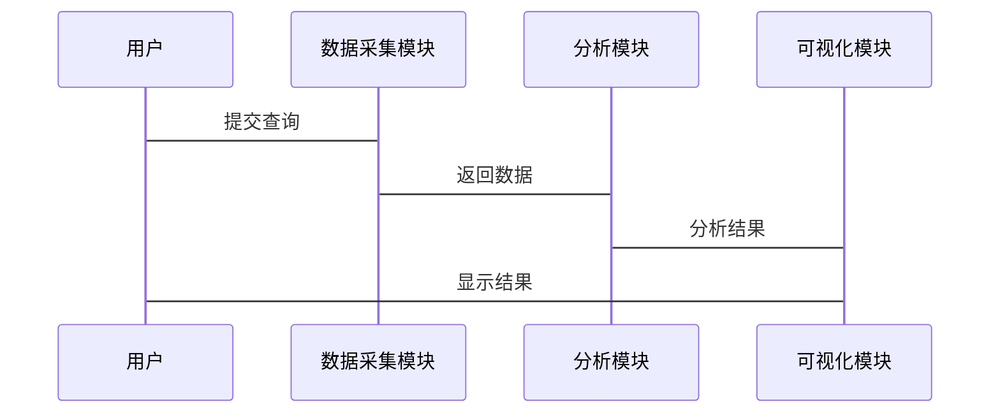

                 


# 气候变化减缓技术的专利分析与投资机会

## 关键词：气候变化、减缓技术、专利分析、投资机会、可再生能源、碳捕获、能效提升

## 摘要：
气候变化是全球面临的重大挑战，减缓技术的创新和应用是应对这一挑战的关键。本文通过系统化的专利分析，探讨气候变化减缓技术的现状、发展趋势及投资潜力。文章首先介绍气候变化的背景及其对人类社会的影响，随后分析减缓技术的主要领域，包括可再生能源、碳捕获与封存、能效提升等。接着，详细阐述专利分析的方法论，包括数据收集、预处理、技术趋势分析和竞争分析等步骤。在此基础上，构建数学模型和算法，用于评估技术的市场潜力和投资价值。通过系统设计和项目实战，展示如何利用专利分析为投资决策提供支持。最后，总结投资策略，提供最佳实践建议，展望未来的发展趋势。

---

# 第一部分: 气候变化减缓技术的背景与挑战

## 第1章: 气候变化的背景与技术挑战

### 1.1 气候变化的现状与影响
气候变化是指全球气候系统长期的变化，主要表现为全球变暖、极端天气事件增多、海平面上升等。这些变化对生态系统、农业、水资源和人类健康造成严重影响。气候变化的主要原因是温室气体（如二氧化碳、甲烷）的过度排放，主要来源于化石燃料的使用、工业生产和森林砍伐。

### 1.2 气候变化减缓技术的重要性
减缓技术旨在减少温室气体的排放或增加碳汇，是应对气候变化的关键手段。主要技术领域包括：
1. **可再生能源**：太阳能、风能、水能等，替代化石能源。
2. **碳捕获与封存（CCS）**：捕获工业过程中的二氧化碳并封存。
3. **能效提升**：通过技术优化减少能源消耗。

### 1.3 专利分析与投资机会的关联
专利分析是评估技术成熟度和市场潜力的重要工具。通过分析专利数量、申请趋势、技术分布，可以识别技术热点和投资机会。例如，可再生能源领域的专利数量快速增长，表明该领域具有较高的投资潜力。

---

# 第二部分: 气候变化减缓技术的核心概念与联系

## 第2章: 气候变化减缓技术的核心概念

### 2.1 减缓技术的分类与对比
将减缓技术分为三类：可再生能源、碳捕获与封存、能效提升，并通过对比分析其优缺点。

| 技术领域 | 优点 | 缺点 | 适用场景 |
|----------|------|------|----------|
| 可再生能源 | 清洁、可再生 | 成本高、技术依赖 | 电力生产 |
| 碳捕获与封存 | 减少现有排放 | 技术复杂、成本高 | 工业过程 |
| 能效提升 | 节能、成本低 | 技术成熟度低 | 各行业 |

### 2.2 专利分析的方法论
专利分析是通过检索、整理、分析专利数据，评估技术发展和市场潜力。步骤包括：
1. 数据收集：从专利数据库中检索相关专利。
2. 数据预处理：清洗数据，提取关键词和分类。
3. 技术趋势分析：分析专利申请趋势，识别技术热点。
4. 竞争分析：评估主要申请人的技术布局。

### 2.3 技术与投资的关联分析
技术成熟度与投资风险密切相关。例如，可再生能源技术较为成熟，投资风险较低，但市场竞争激烈。碳捕获技术尚处于研发阶段，投资风险较高，但潜在回报大。

---

# 第三部分: 气候变化减缓技术的算法原理

## 第3章: 专利分析的算法原理

### 3.1 文本挖掘与关键词提取
使用文本挖掘技术从专利描述中提取关键词，识别技术热点。例如，使用TF-IDF算法提取高频关键词。

### 3.2 技术趋势分析
通过时间序列分析，识别专利申请的趋势。例如，使用ARIMA模型预测未来专利申请数量。

### 3.3 竞争分析
分析主要申请人的专利布局，识别技术优势领域。例如，使用层次分析法（AHP）评估不同申请人的技术实力。

---

# 第四部分: 系统分析与架构设计

## 第4章: 气候变化减缓技术的系统架构

### 4.1 系统功能设计
系统包括数据采集、分析、可视化三个模块：
- 数据采集模块：从专利数据库中获取数据。
- 分析模块：进行文本挖掘和趋势分析。
- 可视化模块：展示分析结果。

### 4.2 系统架构设计
使用分层架构，数据层、业务逻辑层和表现层。数据层通过API接口与专利数据库连接，业务逻辑层处理数据，表现层展示结果。

### 4.3 系统交互设计
用户通过网页界面提交查询，系统返回分析结果。交互流程如图：



---

# 第五部分: 项目实战

## 第5章: 基于专利分析的投资决策

### 5.1 项目背景与目标
以可再生能源为例，分析其专利情况，评估投资潜力。

### 5.2 数据采集与处理
从专利数据库中获取可再生能源相关专利，清洗数据，提取关键词。

### 5.3 分析与可视化
使用Python代码进行文本挖掘和趋势分析，生成图表。

```python
import matplotlib.pyplot as plt
import pandas as pd

# 假设df是专利数据，'year'列为申请年份
df['year'].value_counts().sort_index().plot(kind='bar')
plt.title('专利申请趋势')
plt.xlabel('年份')
plt.ylabel('数量')
plt.show()
```

### 5.4 投资策略建议
基于分析结果，建议投资可再生能源领域的技术创新和专利布局。

---

# 第六部分: 投资策略与最佳实践

## 第6章: 投资策略与最佳实践

### 6.1 投资策略
1. **技术评估**：优先选择技术成熟、市场潜力大的领域。
2. **风险管理**：评估技术风险和市场风险，制定退出策略。

### 6.2 成功案例分析
分析某可再生能源公司专利布局的成功经验，总结其策略。

### 6.3 注意事项
1. 技术更新快，需持续关注专利动态。
2. 投资需考虑政策支持和市场需求。

### 6.4 未来展望
随着技术进步，碳捕获和能效提升领域将更具投资潜力。

---

# 结语

气候变化减缓技术的专利分析为投资决策提供了重要依据。通过系统化的分析和实战案例，我们可以识别高潜力技术领域，制定有效的投资策略。未来，随着技术的发展，气候变化减缓技术将发挥更大作用。

---

# 作者：AI天才研究院 & 禅与计算机程序设计艺术

