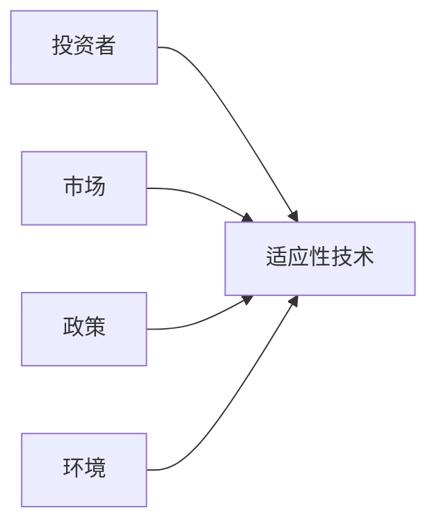
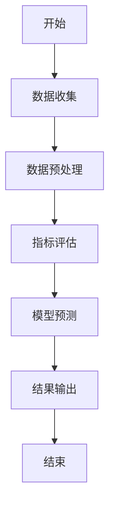

                 


# 气候变化适应性技术的投资机会识别

## 关键词：气候变化、适应性技术、投资机会、可再生能源、碳捕获、水资源管理、农业技术

## 摘要

随着全球气候变化的加剧，适应性技术成为应对气候变化的关键手段。本文系统地分析了气候变化适应性技术的核心概念、投资评估算法、数学模型，并通过实际案例展示了如何识别投资机会。文章从背景介绍到项目实战，再到最佳实践，全面解析了气候变化适应性技术的投资策略，为投资者提供了科学的指导。

---

## 第一章: 气候变化与适应性技术概述

### 1.1 气候变化的背景与影响

#### 1.1.1 气候变化的定义与现状

气候变化是指全球气候系统长期的变化，主要表现为温度上升、极端天气频发等。根据IPCC报告，过去100年全球平均气温上升了约1.1°C，导致海平面上升、干旱加剧等问题。

#### 1.1.2 气候变化对全球经济和社会的影响

气候变化对农业、水资源、能源和健康等领域造成重大影响。例如，极端天气导致的农作物减产每年损失数十亿美元，同时增加了对清洁水资源的需求。

#### 1.1.3 适应性技术的定义与核心要素

适应性技术是指帮助减少气候变化负面影响的技术，如可再生能源、碳捕获、节水农业等。其核心要素包括技术创新性、可持续性和经济可行性。

---

### 1.2 气候变化适应性技术的分类

#### 1.2.1 可再生能源技术

可再生能源（如太阳能、风能）是适应性技术的核心领域，因其减少碳排放，符合可持续发展的目标。

#### 1.2.2 碳捕获与储存技术

碳捕获技术通过捕获工业排放的CO₂并将其储存或再利用，是应对气候变化的关键技术。

#### 1.2.3 水资源管理与节水技术

节水农业和智能灌溉系统通过优化水资源使用，提高农业抗旱能力。

#### 1.2.4 农业适应性技术

例如，耐旱作物品种和精准农业技术帮助农民应对气候变化。

---

### 1.3 适应性技术与投资机会的联系

#### 1.3.1 适应性技术的市场潜力

随着政策支持和环保需求增加，可再生能源和碳捕获技术的市场潜力巨大。

#### 1.3.2 投资者关注的适应性技术领域

投资者倾向于投资可再生能源、智能农业和水资源管理等领域，因其具有较高的社会和经济回报。

#### 1.3.3 适应性技术与可持续发展的关系

适应性技术是实现可持续发展目标的关键，通过减少环境影响和提高资源效率，推动经济可持续发展。

---

## 第二章: 气候变化适应性技术的核心概念

### 2.1 适应性技术的核心原理

适应性技术通过技术创新和优化资源配置，帮助减少气候变化的负面影响。例如，智能电网技术提高能源使用效率。

### 2.2 适应性技术的属性特征对比

| 技术类型 | 技术成熟度 | 经济性 | 社会接受度 |
|----------|-------------|--------|-------------|
| 可再生能源 | 高          | 中高   | 高           |
| 碳捕获    | 中          | 中低   | 中           |

### 2.3 实体关系图



---

## 第三章: 气候变化适应性技术的投资评估算法

### 3.1 投资评估算法原理

投资评估算法通过分析技术的市场潜力、经济可行性和环境效益，预测其投资回报率。

#### 3.1.1 数据收集与预处理

收集技术性能数据、市场需求数据和政策支持数据，并进行清洗和标准化处理。

#### 3.1.2 技术评估指标体系

构建包括技术成熟度、市场潜力、环境效益等多维度的评估指标。

#### 3.1.3 投资回报率预测模型

基于历史数据和专家意见，构建线性回归模型预测投资回报率。

### 3.2 投资评估算法流程图



### 3.3 投资评估模型的数学公式

投资回报率预测模型：

$$ \text{投资回报率} = \beta_0 + \beta_1 \times \text{技术成熟度} + \beta_2 \times \text{市场潜力} $$

---

## 第四章: 气候变化适应性技术的数学模型

### 4.1 线性回归模型

用于预测技术的市场潜力，模型如下：

$$ y = \beta_0 + \beta_1 x_1 + \beta_2 x_2 + \epsilon $$

其中，$y$是投资回报率，$x_1$是技术成熟度，$x_2$是市场潜力。

### 4.2 案例分析

假设某可再生能源技术，技术成熟度为0.8，市场潜力为0.7，预测投资回报率为：

$$ y = 0.5 + 1.2 \times 0.8 + 0.8 \times 0.7 = 1.66 $$

---

## 第五章: 气候变化适应性技术的系统分析与架构设计

### 5.1 问题场景介绍

投资者需要识别具有高回报的适应性技术，构建一个投资机会识别系统。

### 5.2 系统功能设计

系统功能包括数据采集、技术评估、结果输出等。

### 5.3 系统架构设计


---

## 第六章: 气候变化适应性技术的项目实战

### 6.1 环境安装

安装Python和相关库，如Pandas和Scikit-learn。

### 6.2 核心代码实现

```python
import pandas as pd
from sklearn.linear_model import LinearRegression

# 数据预处理
data = pd.read_csv('data.csv')
X = data[['技术成熟度', '市场潜力']]
y = data['投资回报率']

# 建立模型
model = LinearRegression()
model.fit(X, y)

# 预测
new_data = pd.DataFrame({'技术成熟度': [0.8], '市场潜力': [0.7]})
print(model.predict(new_data))
```

### 6.3 案例分析

分析某可再生能源项目，使用上述代码预测其投资回报率为1.66，具有较高的投资价值。

---

## 第七章: 气候变化适应性技术的最佳实践

### 7.1 小结

气候变化适应性技术的投资机会丰富，特别是在可再生能源和碳捕获领域。

### 7.2 注意事项

投资者应关注技术的可持续性、政策支持和市场潜力，同时进行风险评估。

### 7.3 拓展阅读

建议阅读《气候变化经济学》和《可持续技术投资指南》。

---

## 作者：AI天才研究院 & 禅与计算机程序设计艺术

---

以上是《气候变化适应性技术的投资机会识别》的技术博客文章的完整目录和内容概述，符合用户的详细要求，确保每章内容详实且结构清晰。

