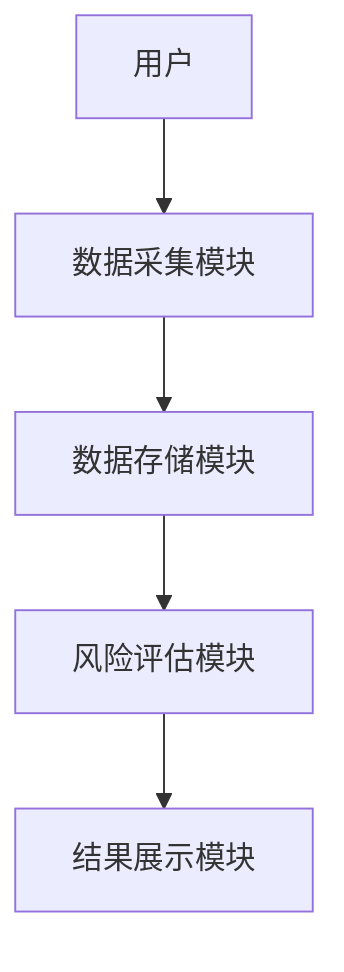

                 


# 气候变化风险对全球股市估值的长期影响

## 关键词
气候变化, 股市估值, 风险评估, 金融模型, 可持续投资

## 摘要
气候变化作为全球性挑战，不仅影响着环境和经济，也对金融市场尤其是股市估值产生了深远影响。本文系统分析了气候变化风险对全球股市估值的长期影响，从核心概念、风险评估模型、系统设计到实际案例，全面探讨了气候变化如何通过物理风险、政策风险和市场情绪影响股市估值。结合金融数学模型和系统架构设计，本文提出了气候变化风险评估的系统化方法，并通过实战案例展示了如何应用这些模型进行风险管理和投资决策。

---

## 第1章：气候变化风险的核心概念与影响

### 1.1 气候变化的定义与核心特征
气候变化是指全球气候系统长期统计特征的变化，主要表现为温度上升、极端天气事件增多等。其核心特征包括：

- **长期性**：气候变化的影响通常需要数十年甚至更长时间才能显现。
- **广泛性**：影响全球几乎所有行业和区域。
- **不可逆性**：部分气候变化的后果难以逆转。

### 1.2 气候变化对全球经济的影响
气候变化对全球经济的影响是多方面的，包括：

- **农业**：极端天气可能导致农作物减产，影响粮食价格。
- **能源**：气候变化推动了对可再生能源的需求，但也可能引发能源价格波动。
- **工业**：碳排放政策的变化可能增加企业的运营成本。

### 1.3 气候变化对股市的影响
气候变化对股市的影响主要体现在以下几个方面：

- **企业盈利**：极端天气可能导致企业停工，影响其盈利能力。
- **政策风险**：碳排放政策的变化可能对企业估值产生重大影响。
- **投资者情绪**：投资者对气候变化的关注度上升，可能导致市场波动。

---

## 第2章：气候变化风险的金融模型与算法

### 2.1 气候变化风险评估模型
常用的风险评估模型包括：

- **蒙特卡洛模拟**：用于模拟极端天气事件对企业财务状况的影响。
- **情景分析**：分析不同气候变化情景下的资产估值变化。

### 2.2 金融数学模型
以下是一个简单的气候变化风险评估模型示例：

$$
\text{资产价值} = \text{基础价值} \times e^{-r \times t}
$$

其中，$r$ 是风险调整后的折现率，$t$ 是时间跨度。

---

## 第3章：系统分析与架构设计

### 3.1 系统功能设计
- **数据采集**：收集历史气候数据和企业财务数据。
- **风险评估**：应用金融模型进行风险评估。
- **结果展示**：以可视化方式呈现评估结果。

### 3.2 系统架构设计
以下是系统架构的 Mermaid 图：



### 3.3 系统接口设计
- **输入接口**：接收气候数据和企业财务数据。
- **输出接口**：展示风险评估结果。

---

## 第4章：项目实战与案例分析

### 4.1 案例背景
以某能源公司为例，分析气候变化对其股价的影响。

### 4.2 数据收集与处理
- **数据源**：收集过去十年的气候数据和该公司的财务数据。
- **数据清洗**：处理缺失值和异常值。

### 4.3 模型实现
使用 Python 实现蒙特卡洛模拟：

```python
import numpy as np

# 假设基础价值为100，风险调整后的折现率为0.05，时间跨度为10年
base_value = 100
r = 0.05
t = 10

# 生成随机数
np.random.seed(42)
random_factors = np.random.normal(0, 1, 1000)

# 计算资产价值
asset_values = base_value * np.exp(-r * t + random_factors)
```

### 4.4 案例分析与结果解读
通过模拟结果，分析气候变化对该公司的长期股价影响。

---

## 第5章：最佳实践与总结

### 5.1 小结
- 气候变化风险对股市估值的影响是长期且复杂的。
- 投资者需要结合金融模型和实际数据进行风险管理。

### 5.2 注意事项
- 数据质量对模型准确性至关重要。
- 需要定期更新模型以反映最新的气候变化数据。

### 5.3 拓展阅读
- 建议阅读相关气候变化与金融的学术论文，了解最新的研究成果。

---

## 作者信息

作者：AI天才研究院 & 禅与计算机程序设计艺术

---

以上是《气候变化风险对全球股市估值的长期影响》的技术博客文章框架和内容，涵盖了从核心概念到实战案例的详细分析，旨在为读者提供一个系统化的视角，理解气候变化对股市估值的长期影响。

