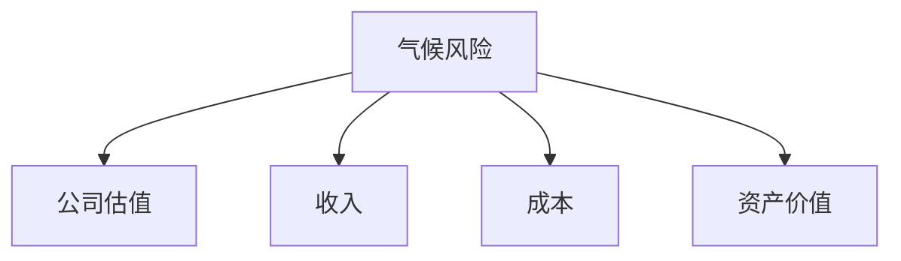
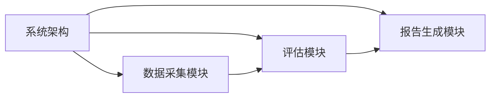

                 

# 气候风险信息披露对公司估值的影响

> **关键词**：气候风险、信息披露、公司估值、风险管理、可持续发展、气候变化

> **摘要**：随着全球气候变化的加剧，气候风险已成为企业和投资者关注的焦点。本文从气候风险的定义、分类出发，分析了气候风险对公司估值的影响机制，探讨了气候风险信息披露的现状与挑战，并提出了基于情景分析和蒙特卡洛模拟的气候风险量化方法。同时，通过实际案例分析和系统设计，展示了如何将气候风险披露与公司估值分析相结合，为企业的风险管理提供理论支持和实践指导。

---

## 第1章：气候变化与气候风险概述

### 1.1 气候变化的背景与影响

#### 1.1.1 气候变化的定义与现状

气候变化是指地球气候系统长期的变化趋势，主要表现为全球变暖、极端天气事件增多等。根据联合国政府间气候变化专门委员会（IPCC）的报告，人类活动（尤其是化石燃料的使用）是气候变化的主要驱动因素。

#### 1.1.2 气候变化对企业的影响

气候变化对企业的影响是多方面的，包括：

- **物理风险**：极端天气事件（如洪水、干旱、飓风）对企业运营的直接影响。
- **转型风险**：向低碳经济转型过程中政策变化、技术变革对企业造成的成本增加或竞争优势丧失。
- **法律与声誉风险**：因不符合碳排放标准或社会责任要求而面临诉讼或声誉损失。

#### 1.1.3 气候风险的定义与分类

**气候风险**是指由于气候变化或应对气候变化的政策和措施而导致企业或经济系统遭受损失或损害的可能性。气候风险可以分为以下几类：

| **分类维度** | **具体分类** | **描述** |
|--------------|---------------|-----------|
| 风险来源     | 物理风险       | 极端天气事件对企业运营的影响 |
|              | 转型风险       | 低碳转型政策对企业业务模式的影响 |
|              | 诉讼风险       | 因碳排放问题面临的法律诉讼风险 |
| 影响范围     | 资产风险       | 对企业资产价值的影响 |
|              | 收入风险       | 对企业收入和利润的影响 |

### 1.2 气候风险信息披露的重要性

#### 1.2.1 气候风险信息披露的定义

气候风险信息披露（Climate Risk Disclosure）是指企业公开与其业务相关的气候风险信息，包括风险来源、潜在影响及应对策略等。

#### 1.2.2 气候风险信息披露的必要性

- **提升透明度**：帮助投资者了解企业的气候风险管理能力。
- **增强信任**：通过披露信息，企业可以展示其社会责任感。
- **合规要求**：越来越多的国家和地区要求企业披露气候相关信息（如欧盟的CSRD、美国的SEC规则）。

#### 1.2.3 气候风险信息披露的边界与外延

气候风险信息披露的边界主要在于如何量化风险及其对财务的影响，外延则涉及企业的整个价值链。

---

## 第2章：气候风险与公司估值的关系

### 2.1 气候风险对公司估值的影响机制

#### 2.1.1 气候风险如何影响企业价值

气候风险通过以下方式影响企业价值：

1. **收入影响**：极端天气可能导致生产中断，影响收入。
2. **成本影响**：应对气候变化的措施（如购买碳配额）会增加成本。
3. **资产价值影响**：高碳资产可能因政策变化而贬值。

#### 2.1.2 气候风险对资产价值的影响

高碳行业的资产（如化石燃料储备）可能因政策变化而大幅贬值。例如，假设某企业拥有价值100亿元的煤炭储备，若碳中和政策实施，这部分资产可能仅值40亿元。

#### 2.1.3 气候风险对收入与成本的影响

- **收入**：气候变化可能导致某些地区的需求下降，影响收入。
- **成本**：企业可能需要投入更多资源用于减排或适应气候变化。

### 2.2 气候风险与公司估值的核心概念联系

#### 2.2.1 气候风险的属性特征对比表

| **属性**       | **特征**                     |
|----------------|------------------------------|
| 风险类型       | 物理风险、转型风险、诉讼风险 |
| 时间跨度       | 短期、中期、长期             |
| 影响范围       | 全球性、区域性               |
| 可量化性       | 部分可量化                   |

#### 2.2.2 气候风险与公司估值的ER实体关系图

---

## 第3章：气候风险信息披露的现状与挑战

### 3.1 气候风险信息披露的现状

#### 3.1.1 全球气候风险信息披露的发展历程

- **早期阶段**：2000年代初，部分企业开始自愿披露气候相关信息。
- **快速发展阶段**：2010年后，随着巴黎协定的签署，气候信息披露成为全球趋势。
- **当前阶段**：欧盟的CSRD（企业可持续发展报告指令）和美国的SEC新规则推动了气候信息披露的标准化。

#### 3.1.2 当前主要的气候风险披露框架

- **TCFD（气候相关财务信息披露工作组）**：全球广泛采用的框架，强调治理、战略、风险管理、指标与目标。
- **CDSB（国际可持续准则委员会）**：专注于与财务报表结合的气候信息披露。
- **GRI（全球报告倡议）**：非财务报告中常用的框架。

#### 3.1.3 不同地区与行业的披露实践

- **地区差异**：欧盟、美国、中国等地区对气候信息披露的要求不同。
- **行业差异**：高碳行业（如能源、制造）的披露要求更高。

### 3.2 气候风险信息披露的主要挑战

#### 3.2.1 数据收集与评估的困难

- 数据不足：部分企业缺乏足够的历史数据支持气候风险评估。
- 数据质量：数据的准确性和完整性可能影响评估结果。

#### 3.2.2 利益相关者的期望差异

- 投资者、政府、非政府组织等对气候信息披露的需求不同，导致企业难以统一应对。

#### 3.2.3 披露标准的不统一性

- 不同地区和行业采用的披露标准不同，增加了企业的合规成本。

---

## 第4章：气候风险评估与量化方法

### 4.1 气候风险评估的数学模型与方法

#### 4.1.1 蒙特卡洛模拟在气候风险评估中的应用

蒙特卡洛模拟是一种概率分析方法，常用于评估不确定性对整体模型的影响。在气候风险评估中，可以模拟不同气候情景下的企业价值变化。

#### 4.1.2 气候风险情景分析模型

情景分析是通过构建不同气候情景（如最乐观、最可能、最悲观）来评估企业价值的变化。

#### 4.1.3 气候风险影响的线性回归模型

假设企业价值与气候风险相关，可以通过线性回归模型量化其影响：

$$ Value = \beta_0 + \beta_1 \times Risk + \epsilon $$

其中，$Risk$是气候风险指标，$\beta_1$是回归系数。

---

## 第5章：气候风险披露对不同行业的影响

### 5.1 高碳行业的影响

高碳行业（如能源、制造）的气候风险较高，披露要求严格，且需要更多的转型投资。

### 5.2 低碳行业的影响

低碳行业（如可再生能源、电动汽车）的气候风险较低，但需要关注政策变化和技术创新。

### 5.3 不同规模企业的影响

- **大型企业**：更容易获得资源进行气候风险评估和披露。
- **中小型企业**：资源有限，可能难以满足复杂的披露要求。

---

## 第6章：系统设计与实现

### 6.1 系统功能设计

- **数据采集**：收集企业的气候相关信息。
- **风险评估**：基于模型计算气候风险对企业价值的影响。
- **信息披露**：生成符合要求的气候风险披露报告。

### 6.2 系统架构设计

### 6.3 系统接口设计

- **输入接口**：接收企业的气候相关数据。
- **输出接口**：生成气候风险评估报告。

### 6.4 系统交互设计

---

## 第7章：项目实战与案例分析

### 7.1 项目背景

选择一个高碳行业（如能源公司）进行气候风险评估和信息披露。

### 7.2 数据采集与处理

- **数据来源**：企业财务数据、行业报告、气候数据。
- **数据清洗**：处理缺失值和异常值。

### 7.3 气候风险评估

使用蒙特卡洛模拟评估不同气候情景下的企业价值变化。

### 7.4 报告生成

根据评估结果生成气候风险披露报告，并提交给相关监管机构。

---

## 第8章：结论与展望

### 8.1 结论

气候风险信息披露是企业风险管理的重要组成部分，其对公司的估值影响深远。企业需要积极应对气候变化，提升信息披露能力。

### 8.2 未来展望

- **技术进步**：人工智能和大数据技术将推动气候风险评估的精准化。
- **政策完善**：全球气候披露标准将更加统一和严格。
- **行业创新**：企业将开发更多适应气候变化的创新模式。

---

**作者：AI天才研究院/AI Genius Institute & 禅与计算机程序设计艺术 /Zen And The Art of Computer Programming**

