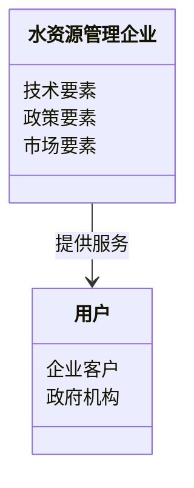

                 


# 水资源管理相关企业的投资前景分析

> 关键词：水资源管理、投资前景、企业分析、产业链、商业模式、算法模型

> 摘要：随着全球水资源短缺问题日益严重，水资源管理相关企业的重要性愈发凸显。本文从水资源管理的背景与现状出发，详细分析了水资源管理相关企业的核心概念与联系，探讨了投资分析方法，包括算法与数学模型的应用，系统架构设计，以及项目实战案例。最后，总结了投资策略与注意事项，为投资者提供了全面的分析框架。

---

## 第1章: 水资源管理的背景与现状

### 1.1 水资源管理的基本概念

#### 1.1.1 水资源管理的定义
水资源管理是指通过科学规划和合理利用水资源，以满足人类社会、经济和生态需求的过程。它涉及水的收集、分配、储存、处理和再利用等多个环节。

#### 1.1.2 水资源管理的核心要素
- **水量**：确保水资源的可持续供应。
- **水质**：防止污染，保障水体质量。
- **水权**：明确水资源的使用权和分配权。
- **技术**：利用先进技术优化水资源利用。

#### 1.1.3 水资源管理的分类与层次
- **微观层面**：家庭、企业用水管理。
- **中观层面**：区域水资源规划。
- **宏观层面**：国家或全球水资源战略。

### 1.2 水资源管理的现状与挑战

#### 1.2.1 全球水资源分布与利用现状
全球水资源分布不均，且淡水资源有限。目前，全球约8亿人缺乏清洁饮水，水资源利用效率低下。

#### 1.2.2 水资源管理的主要挑战
- **水资源短缺**：部分地区面临水资源枯竭。
- **污染问题**：工业废水、农业面源污染严重。
- **管理不善**：制度不完善，技术落后。

#### 1.2.3 技术与政策在水资源管理中的作用
- **技术**：智能监测、污水处理等技术的应用。
- **政策**：政府法规、市场机制的推动。

### 1.3 水资源管理相关企业的投资背景

#### 1.3.1 水资源管理企业的定义与范围
水资源管理企业包括提供节水设备、污水处理、水资源监测等服务的企业。

#### 1.3.2 投资水资源管理企业的动机与目标
- **动机**：响应政策号召，抓住市场机遇。
- **目标**：通过技术创新和管理优化，提升水资源利用效率。

#### 1.3.3 水资源管理企业的市场潜力与风险
- **潜力**：政策支持、市场需求增长。
- **风险**：技术门槛高，政策变化快。

---

## 第2章: 水资源管理相关企业的核心概念与联系

### 2.1 水资源管理产业链分析

#### 2.1.1 产业链的构成与各环节的作用
- **上游**：设备制造、原材料供应。
- **中游**：水资源监测、处理服务。
- **下游**：农业、工业用水。

#### 2.1.2 上下游产业的相互影响
- 上游设备质量影响中游服务效果。
- 下游需求变化驱动中游服务调整。

#### 2.1.3 产业链中的关键节点分析
- **技术节点**：技术创新是核心竞争力。
- **政策节点**：政策支持影响市场发展。

### 2.2 水资源管理企业的商业模式

#### 2.2.1 传统商业模式的特征
- 以项目承包为主，收益依赖政府招标。

#### 2.2.2 新型商业模式的创新
- **BOT模式**：建设-运营-转让。
- **PPP模式**：公私合作。

#### 2.2.3 商业模式与企业绩效的关系
- 创新型商业模式有助于提升企业竞争力。

### 2.3 水资源管理相关企业的核心要素分析

#### 2.3.1 技术要素
- 智能监测技术、高效污水处理技术。

#### 2.3.2 政策要素
- 政府政策、环保法规。

#### 2.3.3 市场要素
- 市场需求、竞争状况。

---

## 第3章: 水资源管理相关企业的投资分析方法

### 3.1 投资分析的基本原理

#### 3.1.1 投资分析的定义与目的
通过分析企业财务状况、市场前景，评估投资价值。

#### 3.1.2 投资分析的基本步骤
1. **数据收集**：企业财务报表、市场数据。
2. **数据分析**：财务指标分析、市场趋势分析。
3. **风险评估**：市场风险、政策风险。

### 3.2 投资分析的核心指标

#### 3.2.1 财务指标
- 净利润增长率、ROE（净资产收益率）。

#### 3.2.2 市场指标
- 市场占有率、行业增长率。

#### 3.2.3 风险指标
- 政策风险、技术风险。

### 3.3 投资分析的数学模型

#### 3.3.1 净现值（NPV）模型
$$ NPV = \sum_{t=1}^{n} \frac{C_t}{(1 + r)^t} - I $$

其中：
- $C_t$：第t年的现金流。
- $r$：折现率。
- $I$：初始投资。

#### 3.3.2 内部收益率（IRR）模型
$$ IRR = \text{使 NPV = 0 的 r} $$

---

## 第4章: 水资源管理相关企业的系统分析与架构设计

### 4.1 问题场景介绍
分析一家中型水资源管理企业的投资前景。

### 4.2 项目介绍
开发一个水资源管理系统，优化企业运营。

### 4.3 系统功能设计

#### 4.3.1 领域模型


### 4.4 系统架构设计

#### 4.4.1 架构图


### 4.5 系统接口设计

#### 4.5.1 接口交互
- 数据采集接口：传感器数据传输。
- 用户界面接口：数据可视化。

---

## 第5章: 水资源管理相关企业的项目实战

### 5.1 环境安装

#### 5.1.1 开发环境
- 操作系统：Windows 10。
- 开发工具：Python 3.8，Jupyter Notebook。

### 5.2 系统核心实现源代码

#### 5.2.1 数据分析代码
```python
import pandas as pd

# 数据加载
df = pd.read_csv('water_data.csv')

# 数据处理
df['usage_ratio'] = df['usage'] / df['capacity']
```

#### 5.2.2 模型实现
```python
from sklearn import linear_model

# 线性回归模型
model = linear_model.LinearRegression()
model.fit(X, y)
```

### 5.3 代码应用解读与分析

#### 5.3.1 数据处理
- 清洗数据，处理缺失值。

#### 5.3.2 模型预测
- 使用线性回归预测企业收益。

### 5.4 实际案例分析

#### 5.4.1 案例介绍
分析一家污水处理企业的投资前景。

#### 5.4.2 数据分析与结果解读
- 收益预测：未来三年收益增长15%。
- 风险评估：政策风险较低。

### 5.5 项目小结

#### 5.5.1 成功经验
- 数据分析准确，模型预测合理。

#### 5.5.2 问题与改进
- 数据不足，需进一步收集。

---

## 第6章: 总结与建议

### 6.1 最佳实践 tips
- 关注政策变化，选择创新商业模式。
- 注重技术创新，提升企业竞争力。

### 6.2 小结
水资源管理企业投资前景广阔，需结合技术与政策，优化商业模式。

### 6.3 注意事项
- 风险评估：政策、技术风险。
- 数据质量：确保数据准确可靠。

### 6.4 拓展阅读
推荐阅读《水资源管理技术与投资分析》。

---

作者：AI天才研究院/AI Genius Institute & 禅与计算机程序设计艺术 /Zen And The Art of Computer Programming

