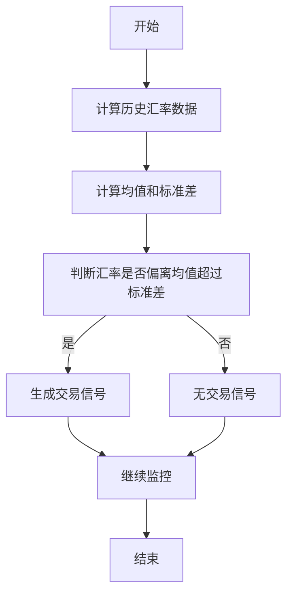
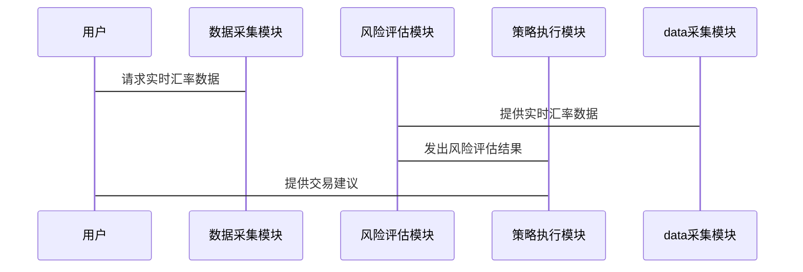

                 


```markdown
# 汇率波动风险管理策略

> 关键词：汇率波动、风险管理、金融模型、算法、系统架构、套期保值

> 摘要：本文详细探讨了汇率波动风险管理的背景、影响因素、核心策略、数学模型与算法，以及系统的架构与实现。通过分析汇率波动的主要影响因素，如经济指标、市场情绪和地缘政治因素，本文提出了多种风险管理策略，包括风险识别与评估、对冲策略和分散策略。同时，本文详细介绍了时间序列分析和统计套利策略的数学模型与算法，并设计了一个完整的汇率风险管理系统，包括功能设计、架构设计、接口设计和交互流程。最后，通过项目实战和最佳实践，本文为读者提供了实用的汇率风险管理方案。

---

## 第一部分：汇率波动风险管理的背景与意义

### 第1章：汇率波动的定义与特点

#### 1.1 汇率的基本概念
汇率是指两种货币之间的兑换比率，通常表示为基准货币相对于其他货币的汇率。例如，USD/CNY 表示1美元兑换多少人民币。

#### 1.2 汇率波动的特征
- **波动性**：汇率受多种因素影响，经常出现短期剧烈波动。
- **周期性**：汇率波动往往呈现出一定的周期性，如经济周期和市场情绪周期。
- **非线性**：汇率波动可能受到多种复杂因素的共同作用，表现出非线性特征。

#### 1.3 汇率波动对经济的影响
- **国际贸易**：汇率波动直接影响出口和进口成本，影响贸易平衡。
- **外汇储备**：汇率波动可能导致外汇储备的价值波动，影响国家的金融稳定。
- **企业经营**：汇率波动会影响企业的利润和成本，特别是跨国企业。

### 第2章：汇率风险管理的重要性

#### 2.1 企业面临汇率波动的风险
- **财务风险**：汇率波动可能导致企业财务报表价值波动，影响利润。
- **运营风险**：汇率波动可能影响进口和出口成本，影响供应链稳定性。
- **信用风险**：汇率波动可能导致交易对手的信用风险增加。

#### 2.2 汇率波动对国际贸易的影响
- **价格竞争力**：汇率波动会影响出口产品的价格竞争力，影响市场份额。
- **贸易结算**：汇率波动可能导致贸易结算中的损失，影响贸易伙伴的关系。

#### 2.3 风险管理的必要性
- **保护企业利润**：通过有效的汇率风险管理，企业可以减少汇率波动对利润的影响。
- **提升竞争力**：通过合理管理汇率风险，企业可以更好地应对国际市场的竞争。
- **维护金融稳定**：有效的汇率风险管理有助于维护国家金融稳定，减少系统性风险。

---

## 第二部分：汇率波动的主要影响因素

### 第3章：经济因素对汇率的影响

#### 3.1 利率水平
- **利率差异**：不同国家的利率差异会影响汇率，利率高的国家货币通常升值。
- **货币政策**：央行的货币政策，如加息或降息，会影响汇率走势。

#### 3.2 经济增长速度
- **经济实力**：经济增长快的国家，货币通常更具吸引力，汇率可能上升。
- **投资吸引力**：经济增长预期好的国家，吸引更多的外国投资，推动汇率上升。

#### 3.3 通货膨胀率
- **购买力平价理论**：通货膨胀率高的国家，货币购买力下降，可能导致汇率下降。
- **实际利率**：通货膨胀率与实际利率相关，影响汇率走势。

### 第4章：市场情绪与预期

#### 4.1 投资者情绪
- **市场情绪指标**：投资者情绪是影响汇率波动的重要因素，通常通过市场参与者的买卖行为反映。
- **市场预期**：市场参与者对未来汇率走势的预期会影响当前的汇率波动。

#### 4.2 市场预期的形成
- **新闻发布**：重要新闻事件可能导致市场预期变化，进而影响汇率。
- **市场参与者的预期**：不同市场参与者（如机构投资者、个人投资者）的预期不同，影响整体市场情绪。

### 第5章：地缘政治因素

#### 5.1 政治稳定性
- **政局稳定**：政治稳定的国家，货币通常更受市场欢迎。
- **政治动荡**：政治不稳定可能导致货币贬值，影响汇率波动。

#### 5.2 地缘政治冲突
- **贸易制裁**：贸易制裁可能导致货币贬值，影响汇率走势。
- **国际关系**：国际关系紧张可能导致市场避险情绪上升，影响汇率波动。

---

## 第三部分：汇率波动风险管理的核心策略

### 第6章：风险识别与评估

#### 6.1 风险识别方法
- **情景分析**：通过假设不同的情景，评估汇率波动对企业的影响。
- **压力测试**：模拟极端市场条件下汇率波动对企业的影响，评估企业的风险承受能力。

#### 6.2 风险评估模型
- **VaR模型**：Value at Risk（VaR）是常用的金融风险评估工具，用于估计在一定置信水平下，资产可能遭受的最大损失。
- **CVaR模型**：Conditional Value at Risk（CVaR）是VaR的扩展，用于估计在超过VaR水平下的平均损失。

### 第7章：风险对冲策略

#### 7.1 远期外汇合约
- **远期合约**：企业可以通过签订远期外汇合约，锁定未来的汇率，减少汇率波动风险。
- **执行价格**：远期合约的执行价格是双方协商确定的，确保在约定日期以预定汇率进行外汇兑换。

#### 7.2 期权与互换
- **期权**：企业可以购买外汇期权，获得在特定时间以特定价格买卖外汇的权利，而非义务。
- **互换**：通过货币互换，企业可以将一种货币的债务转换为另一种货币的债务，降低汇率风险。

#### 7.3 货币市场套期保值
- **套期保值**：企业通过在货币市场上进行套期保值，锁定当前汇率，避免未来汇率波动带来的损失。

### 第8章：风险分散策略

#### 8.1 多种货币组合
- **多货币投资**：通过投资多种货币，分散汇率波动风险，避免单一货币波动带来的损失。
- **货币分散化**：在国际贸易中，分散交易货币种类，降低单一货币波动的影响。

#### 8.2 选择合适的风险管理工具
- **组合管理**：通过组合使用不同的风险管理工具，如远期合约和期权，分散风险，提高风险管理效果。

---

## 第四部分：汇率波动风险管理的数学模型与算法

### 第9章：时间序列分析

#### 9.1 ARIMA模型
- **ARIMA模型**：自回归积分滑动平均模型，用于预测时间序列数据。
- **模型结构**：ARIMA(p, d, q)，其中p为自回归阶数，d为差分阶数，q为滑动平均阶数。
- **应用案例**：使用ARIMA模型预测未来汇率走势，帮助企业在未来进行有效的汇率风险管理。

#### 9.2 GARCH模型
- **GARCH模型**：广义自回归条件异方差模型，用于建模和预测金融时间序列中的波动性。
- **模型结构**：GARCH(p, q)，其中p为自回归阶数，q为滑动平均阶数。
- **应用案例**：使用GARCH模型预测汇率波动性，帮助企业更好地进行风险评估。

#### 9.3 算法实现与案例分析
- **Python代码实现**：使用Python的statsmodels库实现ARIMA和GARCH模型，分析历史汇率数据，预测未来汇率走势。
- **案例分析**：通过具体案例分析，展示如何利用ARIMA和GARCH模型进行汇率风险管理。

### 第10章：统计套利策略

#### 10.1 均值回归策略
- **策略原理**：利用汇率的均值回归特性，当汇率偏离长期均值时，预期汇率会回归均值，进行买卖操作。
- **交易信号**：当汇率偏离均值达到一定幅度时，触发交易信号，进行套利交易。

#### 10.2 动量策略
- **策略原理**：利用汇率的动量效应，即近期汇率走势对未来汇率走势有预测能力，进行交易。
- **交易信号**：当汇率走势形成趋势时，进行顺势交易，获取趋势收益。

#### 10.3 算法流程图


---

## 第五部分：汇率风险管理系统的架构与实现

### 第11章：系统功能设计

#### 11.1 数据采集模块
- **数据来源**：从央行、外汇交易中心等权威机构获取实时汇率数据。
- **数据存储**：将获取的汇率数据存储在数据库中，供后续分析使用。

#### 11.2 风险评估模块
- **模型选择**：根据企业需求选择合适的数学模型（如ARIMA、GARCH）进行风险评估。
- **风险报告生成**：根据模型计算结果，生成风险评估报告，帮助企业了解当前汇率风险状况。

#### 11.3 策略执行模块
- **策略选择**：根据风险评估结果，选择合适的对冲或分散策略。
- **交易执行**：通过交易系统执行交易指令，进行套期保值或统计套利。

### 第12章：系统架构设计

#### 12.1 分层架构
- **数据层**：负责数据的采集、存储和管理。
- **业务逻辑层**：负责风险评估、策略选择和交易执行。
- **用户界面层**：提供友好的用户界面，方便用户进行操作和监控。

#### 12.2 微服务架构
- **模块化设计**：将系统功能分解为多个微服务，每个微服务负责特定的功能（如数据采集、风险评估、交易执行）。
- **服务通信**：通过API网关和消息队列实现微服务之间的通信和协作。

#### 12.3 系统交互流程图


---

## 第六部分：项目实战

### 第13章：环境安装与配置

#### 13.1 安装Python环境
- **安装Python**：下载并安装Python，建议使用最新稳定版本。
- **安装依赖库**：安装必要的Python库，如pandas、numpy、statsmodels、matplotlib等。

#### 13.2 数据源获取
- **数据获取工具**：使用requests库从互联网获取实时汇率数据。
- **数据存储**：将获取的数据存储在CSV文件或数据库中。

### 第14章：核心代码实现

#### 14.1 时间序列分析代码
```python
import pandas as pd
import numpy as np
from statsmodels.tsa.arima_model import ARIMA
import matplotlib.pyplot as plt

# 加载数据
data = pd.read_csv('exchange_rate.csv')

# 拟合ARIMA模型
model = ARIMA(data['rate'], order=(5, 1, 0))
model_fit = model.fit()

# 预测未来汇率
forecast = model_fit.forecast(steps=10)
print(forecast)

# 绘制实际值与预测值的对比图
plt.plot(data['rate'], label='Actual')
plt.plot(forecast[0], label='Forecast')
plt.xlabel('Time')
plt.ylabel('Exchange Rate')
plt.legend()
plt.show()
```

#### 14.2 统计套利策略代码
```python
import pandas as pd
import numpy as np
from sklearn.linear_model import LinearRegression
import matplotlib.pyplot as plt

# 加载数据
data = pd.read_csv('exchange_rate.csv')

# 均值回归策略
def mean_reversion_strategy(data, window=20):
    mean = data['rate'].rolling(window).mean()
    std = data['rate'].rolling(window).std()
    signals = []
    for i in range(len(data)):
        if data['rate'][i] > mean.iloc[i] + 2*std.iloc[i]:
            signals.append(-1)
        elif data['rate'][i] < mean.iloc[i] - 2*std.iloc[i]:
            signals.append(1)
        else:
            signals.append(0)
    return signals

# 生成交易信号
signals = mean_reversion_strategy(data)

# 绘制信号图
plt.plot(data.index, data['rate'], label='Exchange Rate')
plt.scatter(data.index, data['rate'], c=signals, cmap='viridis', label='Signals')
plt.colorbar(label='Signals')
plt.xlabel('Time')
plt.ylabel('Exchange Rate')
plt.legend()
plt.show()
```

### 第15章：案例分析与项目总结

#### 15.1 案例分析
- **案例背景**：某跨国企业面临人民币升值压力，希望通过汇率风险管理工具锁定汇率，减少财务风险。
- **策略选择**：选择使用远期外汇合约锁定未来6个月的汇率，同时利用统计套利策略进行短期套利。
- **实施效果**：通过远期合约锁定汇率，成功减少因人民币升值带来的财务损失；通过统计套利策略，抓住短期汇率波动机会，增加额外收益。

#### 15.2 项目总结
- **系统优势**：通过系统化的风险管理，企业能够有效降低汇率波动带来的风险，提升财务稳定性。
- **未来优化方向**：引入更多先进的数学模型，优化系统架构，提高系统的实时性和响应速度。

---

## 第七部分：最佳实践与未来展望

### 第16章：最佳实践

#### 16.1 定期监控
- **实时监控**：企业应实时监控汇率波动情况，及时调整风险管理策略。
- **定期评估**：定期评估现有风险管理策略的有效性，及时优化和调整。

#### 16.2 分散投资
- **多货币投资**：通过投资多种货币，分散汇率风险，避免单一货币波动带来的损失。
- **多样化策略**：结合对冲和套利等多种策略，提高风险管理效果。

#### 16.3 建立应急机制
- **风险应急预案**：制定应对极端汇率波动的应急预案，确保企业在极端情况下能够迅速响应，减少损失。
- **危机管理团队**：建立专业的危机管理团队，负责处理突发事件，降低风险影响。

### 第17章：未来展望

#### 17.1 人工智能与大数据的应用
- **AI驱动的预测模型**：利用机器学习和深度学习技术，构建更复杂的预测模型，提高汇率波动预测的准确性。
- **大数据分析**：通过大数据分析，发现更多的市场规律和交易机会，优化风险管理策略。

#### 17.2 区块链技术的应用
- **区块链在外汇交易中的应用**：利用区块链技术，提高外汇交易的透明度和安全性，降低交易成本。
- **智能合约**：利用智能合约自动执行交易指令，提高交易效率，减少人为干预。

---

## 结语

汇率波动风险管理是一个复杂而重要的领域，涉及多种因素和策略。通过本文的详细分析和实际案例，读者可以更好地理解汇率波动的风险管理策略，并能够在实际操作中应用这些策略，降低汇率波动带来的风险，提升企业的财务稳定性和竞争力。

---

## 作者

作者：AI天才研究院 & 禅与计算机程序设计艺术
```

