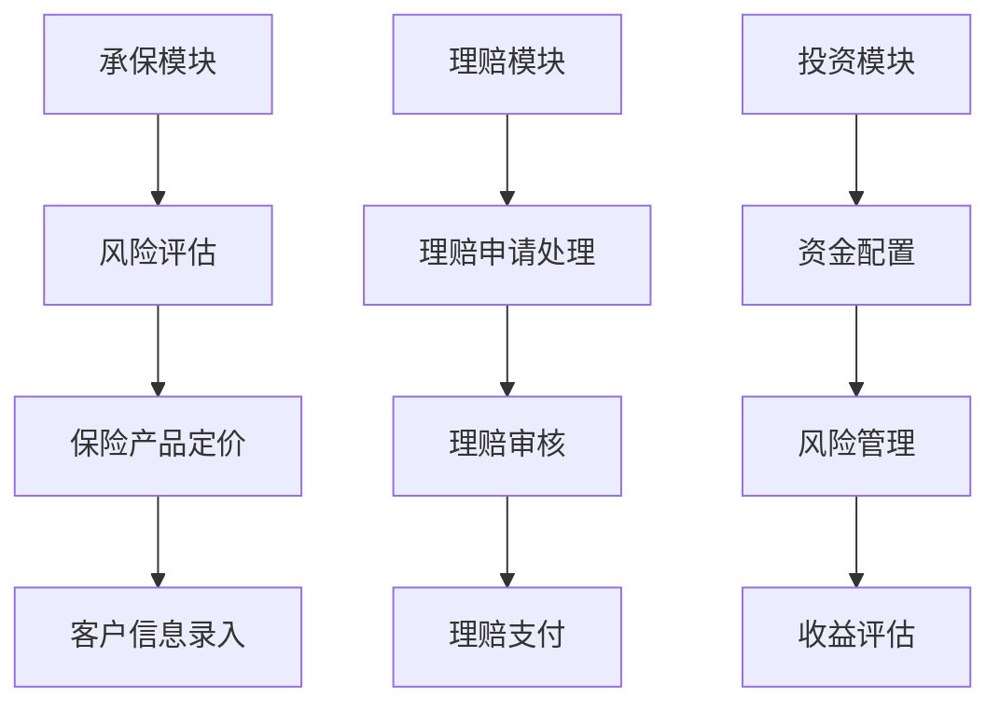

                 

<think>
好的，我现在需要根据用户的请求，为《沃伦巴菲特的保险业价值链分析》这本书设计一个详细的目录大纲。用户希望这个目录结构清晰、逻辑严谨，并且包含多个章节和小节，每个部分都要详细展开。同时，用户还提到了一些具体的格式和内容要求，比如使用Markdown格式，包含数学公式、算法流程图等。

首先，我需要明确这本书的主题：分析保险业的价值链，并结合巴菲特的投资策略进行深入探讨。因此，目录应该涵盖保险业的基本概念、巴菲特的分析框架、保险业的关键环节分析、投资策略、数学模型、系统架构设计以及项目实战等内容。

接下来，我会按照用户提供的示例，将目录分为几个主要部分。首先是概述，然后是关键环节分析，接着是巴菲特的分析框架，之后是案例分析，系统架构设计，项目实战，最后是总结与展望。每个主要部分下设章节，章节下设小节，部分小节下有三级目录，确保结构清晰，内容详尽。

在设计过程中，我需要确保每个部分都符合用户的约束条件，比如字数在10000到12000字左右，使用Markdown格式，包含背景介绍、核心概念、算法原理、数学模型、系统架构设计和项目实战等内容。同时，每个部分都需要有详细的解释和具体的例子，帮助读者理解和应用。

在思考过程中，我可能会遗漏一些细节，比如数学模型的详细推导或系统架构的具体设计。这时，我需要回头检查，确保每个部分都涵盖所有必要的内容，并且逻辑连贯，层层递进。例如，在分析保险业的承保环节时，不仅要介绍风险评估模型，还要详细解释模型的数学公式和应用场景。

最后，我需要确保整个目录结构不仅满足用户的需求，还要具备一定的可读性和专业性，适合技术博客的读者阅读。这样，读者在阅读后能够对保险业的价值链和巴菲特的投资策略有全面的理解，并能够应用这些知识进行实际分析和投资。

综上所述，我会按照上述思路，逐步构建一个详尽且符合要求的目录大纲，确保覆盖所有必要的内容，同时保持结构清晰和逻辑严谨。
</think>

# 沃伦巴菲特的保险业价值链分析

---

## 关键词：
1. 保险业
2. 巴菲特
3. 价值链分析
4. 投资策略
5. 数学模型
6. 系统架构
7. 项目实战

---

## 摘要：
本文从沃伦巴菲特的价值投资理念出发，深入分析保险业的价值链，探讨其关键环节的运作机制、巴菲特的分析框架及投资策略。通过数学模型、系统架构设计和实际案例，揭示保险业的内在逻辑和投资机会，为投资者提供理论支持和实践指导。

---

# 第1章: 保险业的价值链与巴菲特的分析框架

## 1.1 保险业的基本概念
### 1.1.1 保险的定义与分类
- 保险的定义：风险管理工具，通过分担风险实现经济补偿。
- 分类：寿险、健康险、财产险、责任险。

### 1.1.2 保险业的价值链构成
- 上游：承保、精算、风险评估。
- 中游：销售、理赔、客户服务。
- 下游：投资、再保险、风险管理。

### 1.1.3 巴菲特与保险业的渊源
- 巴菲特对保险业的投资策略：寻找具有长期竞争优势的保险公司。
- 伯克希尔哈撒韦的保险业务：通过控股公司模式，整合资源，实现协同效应。

---

## 1.2 巴菲特的投资理念
### 1.2.1 价值投资的核心思想
- 买入低于内在价值的资产，长期持有。
- 重视企业的财务健康状况和竞争优势。

### 1.2.2 巴菲特的保险投资策略
- 保险公司的浮存金：利用保费收入进行投资，创造额外收益。
- 保险公司的财务稳定性：关注偿付能力、资本充足率和盈利能力。

### 1.2.3 保险业的长期投资价值
- 保险行业的周期性弱，具有防御性。
- 保险产品的市场需求稳定，符合长期投资逻辑。

---

## 1.3 保险业的分析框架
### 1.3.1 保险公司的核心竞争力
- 产品创新能力：开发符合市场需求的保险产品。
- 售后服务能力：提供优质的客户服务和理赔支持。
- 投资能力：通过有效的资产配置实现收益最大化。

### 1.3.2 保险产品的定价与风险评估
- 保险产品的定价模型：基于风险的精算方法。
- 风险评估：使用概率论和统计模型评估保险标的的风险。

### 1.3.3 保险公司的财务健康状况
- 财务指标分析：关注ROE（净资产收益率）、ROA（资产收益率）等指标。
- 资本结构分析：评估公司的偿债能力和财务稳定性。

---

# 第2章: 保险业的关键环节分析

## 2.1 承保环节
### 2.1.1 承保策略的制定
- 目标客户选择：基于风险评估模型筛选优质客户。
- 保险条款设计：制定合理的保险期限、保费和理赔条件。

### 2.1.2 风险评估模型
- 使用概率论和统计模型评估风险。
- 风险评估模型的数学表达式：
  - $$ R = \sum_{i=1}^{n} P_i \cdot L_i $$
  - 其中，$R$ 表示总体风险，$P_i$ 表示第 $i$ 种风险发生的概率，$L_i$ 表示第 $i$ 种风险的损失。

### 2.1.3 承保流程的优化
- 数据驱动的决策：利用大数据技术优化承保流程。
- 智能风控系统：通过机器学习模型识别潜在风险。

---

## 2.2 理赔环节
### 2.2.1 理赔流程的标准化
- 理赔申请的受理：确保信息的准确性和完整性。
- 理赔审核的效率：通过自动化系统缩短理赔时间。

### 2.2.2 理赔风险的控制
- 通过精算模型评估理赔风险。
- 使用反欺诈技术识别虚假理赔。

### 2.2.3 理赔效率的提升
- 自动化理赔系统：减少人工干预，提高理赔速度。
- 在线理赔平台：方便客户随时随地提交理赔申请。

---

## 2.3 投资环节
### 2.3.1 保险资金的投资策略
- 资本配置：根据市场环境调整股票、债券和现金的比例。
- 风险管理：通过分散投资降低风险。

### 2.3.2 投资组合的风险管理
- 使用VaR（在险价值）模型评估投资组合的风险。
- $$ VaR = \sigma \cdot z $$
  - 其中，$\sigma$ 表示标准差，$z$ 表示对应的风险系数。

### 2.3.3 投资收益的评估
- 使用CAPM（资本资产定价模型）评估投资收益。
  - $$ E(r_i) = r_f + \beta_i (E(r_m) - r_f) $$
  - 其中，$E(r_i)$ 表示资产的预期收益，$r_f$ 表示无风险利率，$\beta_i$ 表示资产的系统性风险系数，$E(r_m)$ 表示市场预期收益。

---

# 第3章: 巴菲特的保险投资策略

## 3.1 投资策略的核心要素
### 3.1.1 保险公司的财务稳定性
- 关注资产负债表：评估公司的偿付能力和资本充足率。
- 关注利润表：评估公司的盈利能力。

### 3.1.2 保险产品的市场需求
- 寿险产品：需求稳定，受人口老龄化影响较大。
- 财产险产品：需求受经济周期影响较大。

### 3.1.3 行业的竞争格局
- 行业集中度：分析前几名保险公司的市场份额。
- 竞争优势：分析公司的品牌、渠道和服务能力。

---

## 3.2 巴菲特的选股标准
### 3.2.1 企业的财务健康状况
- 关注ROE和ROA等财务指标。
- 关注企业的负债结构和偿债能力。

### 3.2.2 企业的竞争优势
- 企业的市场地位：是否具有定价权。
- 企业的竞争优势：成本优势、技术优势或品牌优势。

### 3.2.3 企业的管理团队
- 管理团队的稳定性。
- 管理团队的决策能力和战略眼光。

---

# 第4章: 保险业的数学模型与算法

## 4.1 保险产品的定价模型
### 4.1.1 精算模型
- 使用线性回归模型预测保险产品的需求和价格。
  - $$ P = \beta_0 + \beta_1 X + \epsilon $$
  - 其中，$P$ 表示保险产品的价格，$X$ 表示影响价格的因素，$\epsilon$ 表示误差项。

### 4.1.2 风险定价模型
- 使用泊松回归模型预测保险产品的理赔频率。
  - $$ \lambda = e^{\beta_0 + \beta_1 X} $$
  - 其中，$\lambda$ 表示理赔频率，$X$ 表示影响理赔频率的因素。

---

## 4.2 投资组合的风险管理模型
### 4.2.1 VaR模型
- $$ VaR = \sigma \cdot z $$
- 其中，$\sigma$ 表示投资组合的收益率标准差，$z$ 表示对应的风险系数。

### 4.2.2 CVaR模型
- $$ CVaR = E[X | X \geq VaR] $$
- 其中，$X$ 表示投资组合的收益率，$VaR$ 表示在险价值。

---

## 4.3 系统架构设计
### 4.3.1 保险系统的功能模块
- 承保模块：负责客户信息录入、保险产品定价、风险评估。
- 理赔模块：负责理赔申请处理、理赔审核、理赔支付。
- 投资模块：负责资金配置、风险管理、收益评估。

### 4.3.2 系统架构的流程图


---

# 第5章: 项目实战

## 5.1 保险公司的数据分析
### 5.1.1 环境配置
- 数据库：使用MySQL存储保险公司的承保、理赔和投资数据。
- 开发工具：使用Python和Jupyter Notebook进行数据分析。

### 5.1.2 数据收集
- 收集保险公司的承保数据、理赔数据和投资数据。
- 数据清洗：处理缺失值和异常值。

### 5.1.3 数据分析
- 使用Pandas进行数据分析，使用Matplotlib和Seaborn进行数据可视化。

### 5.1.4 代码实现
```python
import pandas as pd
import numpy as np
import matplotlib.pyplot as plt
import seaborn as sns

# 数据加载
df = pd.read_csv('insurance_data.csv')

# 数据清洗
df.dropna(inplace=True)
df['理赔金额'].replace(0, np.nan, inplace=True)

# 数据分析
print(df.describe())
print(df.corr())

# 数据可视化
plt.figure(figsize=(10,6))
sns.histplot(df['保费'], bins=10, kde=True)
plt.title('保费分布')
plt.show()
```

---

## 5.2 保险产品的风险评估
### 5.2.1 风险评估模型
- 使用逻辑回归模型预测保险产品的理赔概率。
  - $$ P(Y=1) = \frac{e^{\beta_0 + \beta_1 X}}{1 + e^{\beta_0 + \beta_1 X}} $$
  - 其中，$Y$ 表示理赔事件，$X$ 表示影响理赔概率的因素。

### 5.2.2 代码实现
```python
from sklearn.linear_model import LogisticRegression
from sklearn.metrics import accuracy_score

# 数据预处理
X = df[['保费', '年龄', '性别']]
y = df['理赔概率']

# 模型训练
model = LogisticRegression()
model.fit(X, y)

# 模型评估
print(accuracy_score(y, model.predict(X)))
```

---

## 5.3 投资组合的收益评估
### 5.3.1 资金配置
- 使用均值-方差优化模型进行资金配置。
  - $$ \text{Minimize } \sigma^2 \text{ subject to } \mu = \text{target return} $$
  - 其中，$\sigma^2$ 表示投资组合的方差，$\mu$ 表示目标收益。

### 5.3.2 代码实现
```python
import numpy as np
from scipy.optimize import minimize

# 定义目标函数
def objective(x, mu, cov_matrix):
    return np.dot(x.T, np.dot(cov_matrix, x))

# 约束条件
mu = np.array([0.1, 0.05])  # 目标收益
cov_matrix = np.array([[0.05, 0.02], [0.02, 0.03]])

# 求解优化问题
x = minimize(objective, np.array([0.5, 0.5]), 
              method='SLSQP', 
              constraints={'type': 'eq', 'fun': lambda x: np.dot(cov_matrix, x) - mu})

print(x.x)
```

---

## 5.4 项目小结
- 通过数据分析和模型构建，可以有效地评估保险产品的风险和收益。
- 通过均值-方差优化模型可以实现资金的最优配置。

---

# 第6章: 总结与展望

## 6.1 总结
- 巴菲特的保险投资策略注重企业的财务健康状况和竞争优势。
- 保险业的价值链分析需要结合承保、理赔和投资三个环节。
- 数学模型和算法在保险业的分析中具有重要作用。

## 6.2 展望
- 随着人工智能技术的发展，保险业的分析将更加精准和高效。
- 区块链技术在保险业的应用将提升理赔的透明度和效率。

## 6.3 投资建议
- 选择具有长期竞争优势的保险公司。
- 关注保险产品的市场需求和行业竞争格局。

## 6.4 注意事项
- 保险投资具有一定的风险，需要谨慎评估。
- 关注宏观经济环境和政策变化对保险业的影响。

---

# 作者：AI天才研究院 & 禅与计算机程序设计艺术

---

本文通过系统的分析和实践，揭示了保险业的价值链和巴菲特的投资策略，为投资者提供了理论支持和实践指导。希望读者能够通过本文，深入了解保险业的内在逻辑，并能够在实际投资中灵活运用这些知识。

