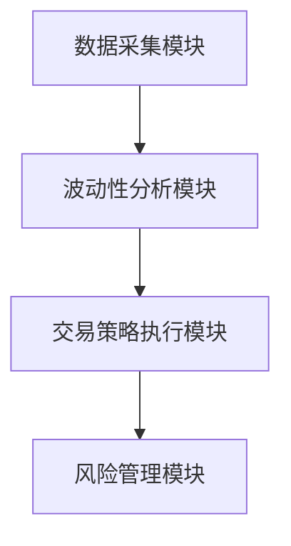

                 


# 波动性投资：如何从市场震荡中获利

> 关键词：波动性投资, 市场震荡, 技术分析, 交易策略, 风险管理

> 摘要：波动性投资是一种通过捕捉市场波动性来获利的投资策略。本文将详细分析波动性投资的核心概念、数学模型、系统架构设计以及实际案例。我们还将探讨波动性投资中的风险管理策略，并通过实战案例帮助读者理解如何在市场波动中获利。

---

## 第一部分: 波动性投资概述

### 第1章: 波动性投资的定义与背景

#### 1.1 波动性投资的核心概念
##### 1.1.1 什么是波动性投资
波动性投资是指通过分析市场波动性来寻找投资机会的一种策略。与传统投资相比，波动性投资更关注短期价格波动，而不是长期价值。

##### 1.1.2 波动性投资的特点
波动性投资具有以下特点：
- 短期性：关注短期价格波动
- 技术性：依赖技术分析
- 高风险：波动性越高，风险越大

##### 1.1.3 波动性投资与传统投资的区别
- 投资目标：传统投资关注长期价值，波动性投资关注短期价格波动
- 分析方法：传统投资依赖基本面分析，波动性投资依赖技术分析
- 风险承受：传统投资风险较低，波动性投资风险较高

#### 1.2 波动性投资的背景与重要性
##### 1.2.1 当前市场波动性的现状
近年来，全球市场波动性显著增加，尤其是2020年新冠疫情爆发期间，市场波动性达到历史新高。

##### 1.2.2 波动性投资的潜在机会
市场波动性为投资者提供了短期获利的机会，尤其是在市场剧烈波动时。

##### 1.2.3 波动性投资的风险与挑战
波动性投资面临的主要风险包括市场风险、流动性风险和模型风险。

---

### 第2章: 波动性投资的核心原理

#### 2.1 波动性投资的基本原理
##### 2.1.1 波动性的来源
市场波动性来源于多种因素，包括经济数据、公司财报、政策变化和市场情绪等。

##### 2.1.2 市场波动的周期性分析
市场波动具有周期性，可以通过技术分析工具（如移动平均线、RSI等）进行预测。

##### 2.1.3 波动性与资产定价的关系
波动性是资产定价的重要因素之一，高波动性资产通常具有更高的预期收益。

#### 2.2 波动性投资的核心策略
##### 2.2.1 技术分析在波动性投资中的应用
技术分析是波动性投资的核心工具，常用的技术指标包括：
- 移动平均线（MA）
- 相对强度指数（RSI）
- 布林格带（Bollinger Bands）

##### 2.2.2 基本面分析与波动性投资的结合
基本面分析可以帮助投资者识别市场波动的潜在驱动因素。

##### 2.2.3 波动性投资中的风险管理
风险管理是波动性投资成功的关键，常用的风险管理工具包括止损订单和风险分散策略。

---

### 第3章: 波动性投资的数学模型与算法

#### 3.1 波动性指标的计算方法
##### 3.1.1 均方差（Variance）与标准差（Standard Deviation）
均方差是衡量资产收益波动性的指标，标准差是均方差的平方根。

$$\text{Variance} = \frac{1}{n}\sum_{i=1}^{n}(x_i - \mu)^2$$
$$\text{Standard Deviation} = \sqrt{\text{Variance}}$$

##### 3.1.2 波动率（Volatility）的计算公式
波动率通常以年化标准差的形式表示。

$$\text{Annualized Volatility} = \sqrt{252 \times \text{Variance}}$$

##### 3.1.3 相关系数（Correlation Coefficient）
相关系数衡量两个资产之间的相关性。

$$\rho = \frac{\text{Cov}(x, y)}{\sigma_x \sigma_y}$$

#### 3.2 波动性预测模型
##### 3.2.1 时间序列分析模型（ARIMA）
ARIMA模型可以用于预测未来的波动性。

##### 3.2.2 GARCH模型
GARCH模型是一种广泛应用于金融市场的波动性预测模型。

##### 3.2.3 机器学习在波动性预测中的应用
机器学习算法（如随机森林和神经网络）可以用于预测市场波动性。

---

### 第4章: 波动性投资的系统架构设计

#### 4.1 波动性投资系统的组成
##### 4.1.1 数据采集模块
数据采集模块负责获取实时市场数据。

##### 4.1.2 波动性分析模块
波动性分析模块使用技术指标和模型进行波动性分析。

##### 4.1.3 交易策略执行模块
交易策略执行模块根据分析结果执行交易指令。

#### 4.2 波动性投资系统的架构图


---

### 第5章: 波动性投资的实战案例分析

#### 5.1 波动性投资的策略实现
##### 5.1.1 基于技术指标的交易策略
例如，使用RSI指标进行超买超卖交易。

##### 5.1.2 基于机器学习的波动性预测策略
使用神经网络模型预测未来波动性。

##### 5.1.3 实战案例的代码实现
```python
import pandas as pd
import numpy as np
import matplotlib.pyplot as plt

# 示例代码：计算移动平均线
data = pd.read_csv('market_data.csv')
data['MA_50'] = data['Price'].rolling(50).mean()
plt.plot(data['Price'], label='Price')
plt.plot(data['MA_50'], label='MA_50')
plt.legend()
plt.show()
```

#### 5.2 波动性投资的实际案例分析
##### 5.2.1 历史市场波动中的投资机会
例如，2020年新冠疫情爆发期间的市场波动性提供了大量投资机会。

##### 5.2.2 突发事件对市场波动的影响
突发事件（如地缘政治冲突）通常会导致市场波动性急剧上升。

##### 5.2.3 波动性投资策略的调整与优化
根据市场变化不断调整交易策略。

---

### 第6章: 波动性投资的最佳实践与注意事项

#### 6.1 波动性投资的最佳实践
##### 6.1.1 风险管理的重要性
始终使用止损订单来控制风险。

##### 6.1.2 波动性投资中的纪律性
严格按照交易计划执行，避免情绪化交易。

##### 6.1.3 持续学习与市场适应
不断学习新的技术和市场动态，保持对市场的敏感性。

#### 6.2 波动性投资的注意事项
##### 6.2.1 避免过度交易
过度交易会导致交易成本增加，影响收益。

##### 6.2.2 控制仓位规模
避免过度杠杆，控制仓位规模。

##### 6.2.3 保持耐心
市场波动是短期的，需要耐心等待合适的投资机会。

---

## 总结

波动性投资是一种高风险高回报的投资策略，通过技术分析和风险管理可以在市场波动中获利。然而，投资者需要具备丰富的知识和经验，才能在波动性市场中取得成功。

作者：AI天才研究院/AI Genius Institute & 禅与计算机程序设计艺术 /Zen And The Art of Computer Programming

