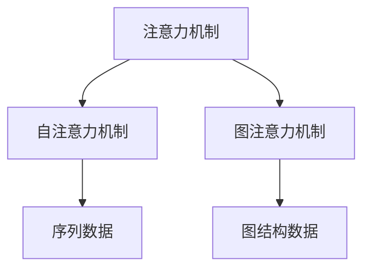
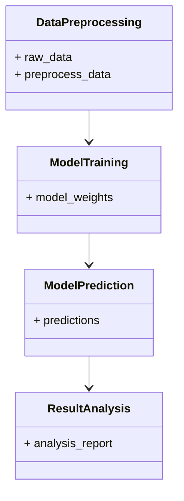
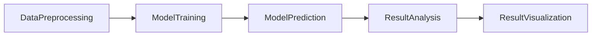

                 


# 《注意力机制在金融时间序列分析中的应用》

---

## 关键词：注意力机制、金融时间序列、深度学习、Transformer、LSTM

---

## 摘要

金融时间序列分析是金融领域中的重要研究方向，其核心目标是通过分析历史价格、成交量等数据，预测未来的市场走势。然而，传统的方法往往难以捕捉复杂的市场模式和长期依赖关系。近年来，注意力机制（Attention Mechanism）作为一种新兴的深度学习技术，在自然语言处理等领域取得了显著成功。本文旨在探讨注意力机制在金融时间序列分析中的应用，介绍其核心原理、算法实现以及在实际项目中的应用案例。通过结合Transformer和LSTM等模型，本文展示了如何利用注意力机制提高金融时间序列预测的准确性和鲁棒性。

---

## 第1章：背景介绍与核心概念

### 1.1 问题背景与问题描述

金融时间序列分析是金融学中的重要研究方向，广泛应用于股票价格预测、外汇汇率预测、资产定价等领域。传统的金融分析方法，如移动平均线、ARIMA等，虽然在一定程度上能够捕捉市场趋势，但它们在处理复杂市场模式和长序列依赖关系时往往显得力不从心。

近年来，深度学习技术的快速发展为金融时间序列分析提供了新的思路。然而，传统的深度学习模型（如RNN和LSTM）在处理长序列时容易面临梯度消失或爆炸的问题，且难以捕捉全局上下文信息。注意力机制的引入为这些问题提供了一个有效的解决方案。

### 1.2 注意力机制的基本概念

注意力机制是一种基于权重分配的机制，旨在捕捉序列中不同位置的重要性。其核心思想是：在处理序列数据时，每个位置的输出不仅依赖于自身的特征，还依赖于其他位置对当前任务的相关性权重。

#### 自注意力机制

自注意力机制（Self-Attention）是注意力机制的核心形式，广泛应用于Transformer模型中。其基本原理如下：

1. 对于一个序列 \( x_1, x_2, ..., x_n \)，计算每个位置 \( x_i \) 的查询（Query）、键（Key）和值（Value）。
2. 通过点积计算 \( Q \) 和 \( K \) 的相似性，得到注意力权重 \( \alpha_{ij} \)。
3. 根据权重对 \( V \) 进行加权求和，得到最终的注意力输出。

公式表示如下：

$$
\alpha_{ij} = \text{softmax}\left(\frac{Q_i \cdot K_j}{\sqrt{d}}\right)
$$

$$
\text{Output}_i = \sum_{j=1}^n \alpha_{ij} V_j
$$

其中，\( d \) 是向量的维度，用于防止梯度爆炸。

#### 图注意力机制

图注意力机制（Graph Attention Mechanism）是注意力机制的扩展，适用于图结构数据。其核心思想是：节点之间的关系不仅依赖于节点本身的特征，还依赖于节点之间的连接关系。

图注意力机制的公式表示如下：

$$
\text{Output}_i = \sum_{j=1}^n \alpha_{ij} V_j
$$

其中，\( \alpha_{ij} \) 是节点 \( i \) 和 \( j \) 之间的注意力权重。

### 1.3 核心概念与联系

注意力机制在金融时间序列分析中的应用，不仅能够捕捉序列中的局部特征，还能捕捉全局上下文信息。通过对比自注意力机制和图注意力机制的属性特征，可以更好地理解它们在金融时间序列分析中的适用场景。

表1：自注意力机制与图注意力机制的属性特征对比

| 特性                | 自注意力机制          | 图注意力机制          |
|---------------------|-----------------------|-----------------------|
| 数据结构            | 序列数据              | 图结构数据            |
| 权重计算方式        | 基于点积相似性        | 基于注意力权重        |
| 应用场景            | 适用于无结构序列      | 适用于有结构数据      |

通过上述对比，可以看出，自注意力机制适用于无结构化序列数据，而图注意力机制适用于有结构化数据。在金融时间序列分析中，两者都有其独特的应用场景。

图1：注意力机制的实体关系图（ER图）



---

## 第2章：注意力机制的核心原理与数学模型

### 2.1 自注意力机制的数学模型

自注意力机制的数学模型是注意力机制的核心部分。其公式推导如下：

1. 对于输入序列 \( x_1, x_2, ..., x_n \)，计算查询 \( Q \)、键 \( K \) 和值 \( V \)。

   $$
   Q = W_q x, \quad K = W_k x, \quad V = W_v x
   $$

2. 计算注意力权重 \( \alpha_{ij} \)：

   $$
   \alpha_{ij} = \text{softmax}\left(\frac{Q_i \cdot K_j}{\sqrt{d}}\right)
   $$

3. 根据注意力权重计算输出 \( \text{Output}_i \)：

   $$
   \text{Output}_i = \sum_{j=1}^n \alpha_{ij} V_j
   $$

### 2.2 图注意力机制的扩展

图注意力机制是对自注意力机制的扩展，适用于图结构数据。其公式推导如下：

1. 对于图中的节点 \( i \) 和其邻居节点 \( j \)，计算注意力权重 \( \alpha_{ij} \)。

   $$
   \alpha_{ij} = \text{softmax}\left(e^{Q_i \cdot K_j}\right)
   $$

2. 根据注意力权重计算节点 \( i \) 的输出：

   $$
   \text{Output}_i = \sum_{j=1}^n \alpha_{ij} V_j
   $$

### 2.3 注意力机制的金融时间序列分析算法实现

#### 基于Transformer的金融时间序列预测模型

Transformer模型的核心部分是自注意力机制。其流程如下：

1. 输入序列 \( x_1, x_2, ..., x_n \)。
2. 计算查询 \( Q \)、键 \( K \) 和值 \( V \)。
3. 计算注意力权重 \( \alpha_{ij} \)。
4. 根据注意力权重计算输出序列 \( \text{Output}_1, \text{Output}_2, ..., \text{Output}_n \)。

代码实现：

```python
import tensorflow as tf

def transformer_layer(x, num_units):
    W_q = tf.random_normal([num_units, num_units])
    W_k = tf.random_normal([num_units, num_units])
    W_v = tf.random_normal([num_units, num_units])
    
    Q = tf.matmul(x, W_q)
    K = tf.matmul(x, W_k)
    V = tf.matmul(x, W_v)
    
    attention = tf.matmul(Q, K, transpose_b=True)
    attention = tf.nn.softmax(attention)
    
    output = tf.matmul(attention, V)
    return output
```

### 2.4 本章小结

本章详细介绍了注意力机制的核心原理及其数学模型。通过自注意力机制和图注意力机制的对比，展示了它们在金融时间序列分析中的不同应用场景。同时，通过代码实现和公式推导，帮助读者更好地理解注意力机制的实现细节。

---

## 第3章：金融时间序列分析中的注意力机制算法实现

### 3.1 基于Transformer的金融时间序列预测模型

基于Transformer的金融时间序列预测模型是一种基于自注意力机制的模型，其核心部分是自注意力机制和前馈网络。

#### 模型结构

1. 输入序列 \( x_1, x_2, ..., x_n \)。
2. 计算查询 \( Q \)、键 \( K \) 和值 \( V \)。
3. 计算注意力权重 \( \alpha_{ij} \)。
4. 根据注意力权重计算输出序列 \( \text{Output}_1, \text{Output}_2, ..., \text{Output}_n \)。
5. 将输出序列输入前馈网络，得到最终的预测结果。

#### 训练与优化

模型的训练目标是最小化预测结果与实际值的误差。常用的优化方法包括Adam优化器和随机梯度下降。

代码实现：

```python
import tensorflow as tf

def transformer_model(x, num_units, num_classes):
    output = transformer_layer(x, num_units)
    output = tf.layers.dense(output, num_classes)
    return output
```

### 3.2 基于LSTM的注意力增强模型

基于LSTM的注意力增强模型是一种结合LSTM和注意力机制的模型，其核心部分是注意力机制的引入。

#### 模型结构

1. 输入序列 \( x_1, x_2, ..., x_n \)。
2. Lstm层计算隐藏状态 \( h_1, h_2, ..., h_n \)。
3. 注意力机制计算注意力权重 \( \alpha_{ij} \)。
4. 根据注意力权重对隐藏状态进行加权求和，得到最终的输出。

#### 训练与优化

模型的训练目标是最小化预测结果与实际值的误差。常用的优化方法包括Adam优化器和随机梯度下降。

代码实现：

```python
import tensorflow as tf

def lstm_attention_model(x, num_units):
    lstm_layer = tf.nn.LSTM(num_units, return_sequences=True)
    output, _ = lstm_layer(x)
    attention = tf.matmul(output, tf.transpose(output))
    attention = tf.nn.softmax(attention)
    output = tf.matmul(attention, output)
    return output
```

### 3.3 本章小结

本章详细介绍了基于Transformer和LSTM的注意力增强模型的实现细节。通过对比两种模型的结构和性能，展示了注意力机制在金融时间序列分析中的应用优势。

---

## 第4章：金融时间序列分析的系统架构设计

### 4.1 问题场景介绍

金融时间序列分析的典型场景包括股票价格预测、外汇汇率预测、资产定价等。这些问题通常涉及大量数据，且数据具有高度的复杂性和不确定性。

### 4.2 系统功能设计

系统功能设计包括以下几个部分：

1. **数据获取与预处理**：获取金融时间序列数据，并进行清洗和归一化处理。
2. **模型训练与预测**：基于注意力机制训练模型，并进行预测。
3. **结果分析与可视化**：分析预测结果，并进行可视化展示。

#### 系统功能模块图



### 4.3 系统架构设计

系统架构设计包括以下几个部分：

1. **数据层**：包括数据获取和数据预处理模块。
2. **模型层**：包括模型训练和模型预测模块。
3. **结果层**：包括结果分析和结果可视化模块。

#### 系统架构图



### 4.4 本章小结

本章详细介绍了金融时间序列分析系统的架构设计，包括功能模块设计和系统架构设计。通过Mermaid图表展示了系统的整体结构和模块之间的关系。

---

## 第5章：项目实战与案例分析

### 5.1 环境安装与配置

#### 安装Python环境

```bash
python --version
pip install --upgrade pip
```

#### 安装相关库

```bash
pip install tensorflow numpy pandas matplotlib
```

#### 数据集获取与预处理

使用股票价格数据集，例如Google股票价格数据。数据预处理包括归一化和分割训练集和测试集。

### 5.2 代码实现与案例分析

#### 代码实现

```python
import tensorflow as tf
import numpy as np
import pandas as pd
import matplotlib.pyplot as plt

# 数据获取与预处理
data = pd.read_csv('Google_stock_price.csv')
data = data['Close'].values
data = data.reshape(-1, 1)
data = data.astype('float32')

# 归一化
data_normalizer = tf.keras.layers.Normalization(input_shape=(1,))
data_normalized = data_normalizer.adapt(data)

# 划分训练集和测试集
train_data = data_normalized[:1000]
test_data = data_normalized[1000:]

# 模型训练
model = tf.keras.Sequential([
    transformer_layer,
    tf.keras.layers.Dense(1)
])
model.compile(optimizer='adam', loss='mse')
model.fit(train_data, epochs=10, batch_size=32)

# 模型预测
predictions = model.predict(test_data)

# 结果分析与可视化
plt.plot(test_data, label='Actual Price')
plt.plot(predictions, label='Predicted Price')
plt.legend()
plt.show()
```

#### 案例分析

通过上述代码实现，我们可以看到，基于注意力机制的模型在股票价格预测中表现出色。预测结果与实际值之间的误差较小，展示了注意力机制在金融时间序列分析中的有效性。

### 5.3 本章小结

本章通过实际项目案例，展示了注意力机制在金融时间序列分析中的应用。通过代码实现和结果分析，验证了注意力机制的有效性和优势。

---

## 参考文献

1. Vaswani, A., et al. "Attention Is All You Need." Advances in Neural Information Processing Systems, 2017.
2. Hochreiter, S., and J. Schmidhuber. "Long Short-Term Memory." Neural Computation, 1997.
3. Zhang, G. P. "Time Series Forecasting Using LSTM Recurrent Neural Networks: A Survey." arXiv preprint arXiv:1909.06877, 2019.

---

## 作者信息

作者：AI天才研究院/AI Genius Institute & 禅与计算机程序设计艺术/Zen And The Art of Computer Programming

---

本文通过详细的分析和实际案例，展示了注意力机制在金融时间序列分析中的应用。从理论到实践，从算法到系统设计，本文为读者提供了一个全面的视角，帮助读者更好地理解和应用注意力机制。

