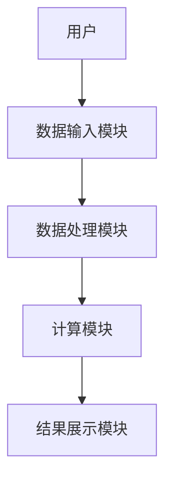

                 


# 深入解析企业估值的计算公式

> 关键词：企业估值、财务模型、价值评估、投资分析、估值公式、DCF模型

> 摘要：企业估值是投资分析和财务管理中的核心问题之一，涉及多种方法和公式。本文系统地介绍了企业估值的核心概念、主要方法（收益法、资产法、市场法）及其数学模型，并通过实际案例分析和系统架构设计，深入探讨了这些方法在实际应用中的具体实现和注意事项。文章还提供了详细的代码实现和最佳实践建议，帮助读者全面掌握企业估值的计算公式和应用场景。

---

## 第一部分：企业估值的核心概念与方法论

### 第1章：引言

#### 1.1 企业估值的背景与重要性
- 企业估值的定义与背景
- 企业估值在投资决策中的作用
- 企业估值的核心问题：确定企业的内在价值

#### 1.2 企业估值的主要方法
- 收益法、资产法、市场法的概述
- 各种方法的适用场景与优缺点对比
- 企业估值公式的核心要素：现金流、资产、市场可比性

---

## 第二部分：企业估值的核心公式与方法

### 第2章：收益法的原理与应用

#### 2.1 收益法的基本原理
- 收益法的定义：基于未来现金流的折现计算企业价值
- 自由现金流（FCF）的计算公式
- 折现率（r）的确定方法
- 永续期假设与增长模型（如永续增长模型、周期性调整模型）

#### 2.2 收益法的具体应用
- 企业未来现金流的预测与调整
- 折现率的敏感性分析
- 收益法的公式推导与案例分析
$$
\text{企业价值} = \sum_{t=1}^{n} \frac{\text{FCF}_t}{(1 + r)^t}
$$

---

## 第三部分：数学模型与算法实现

### 第3章：收益法的数学模型与代码实现

#### 3.1 收益法的数学推导
- 自由现金流的计算公式
- 折现率的确定方法
- 现金流的贴现与汇总

#### 3.2 收益法的Python代码实现
```python
def discounted_cash_flow(fcf, r, n):
    return sum(fcf / (1 + r) ** t for t in range(1, n+1))
```

---

## 第四部分：系统架构与项目实战

### 第4章：企业估值系统的架构设计

#### 4.1 系统功能设计
- 数据输入模块：现金流、资产、市场数据的输入
- 计算模块：收益法、资产法、市场法的计算
- 结果展示模块：企业价值的可视化输出

#### 4.2 系统架构图


---

## 第五部分：项目实战与案例分析

### 第5章：收益法的实际应用

#### 5.1 项目背景
- 某企业的现金流预测与折现率分析

#### 5.2 代码实现
```python
# 现金流预测
cf = [100, 120, 150, 200, 250]
r = 0.1
n = 5
# 计算现值
pv = discounted_cash_flow(cf, r, n)
print(f"企业价值：{pv}")
```

---

## 第六部分：小结与最佳实践

### 第6章：小结与注意事项

#### 6.1 各种方法的优缺点总结
- 收益法的优缺点
- 资产法的优缺点
- 市场法的优缺点

#### 6.2 实际应用中的注意事项
- 数据的准确性与完整性
- 模型的假设与限制
- 方法的结合与优化

#### 6.3 拓展阅读与学习资源
- 推荐书籍与在线资源
- 进一步学习的方向

---

## 作者

作者：AI天才研究院/AI Genius Institute & 禅与计算机程序设计艺术 /Zen And The Art of Computer Programming

