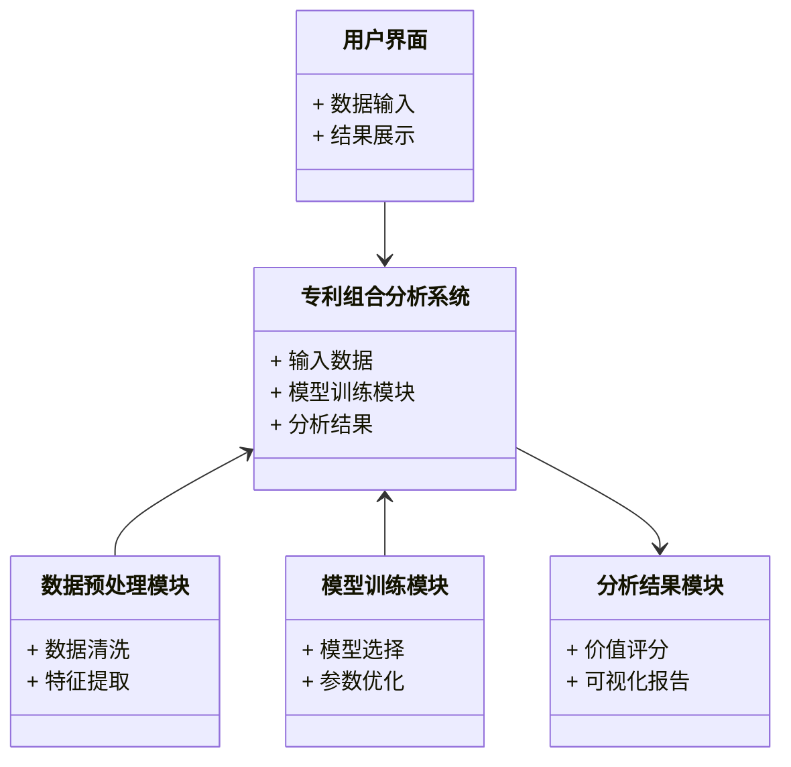
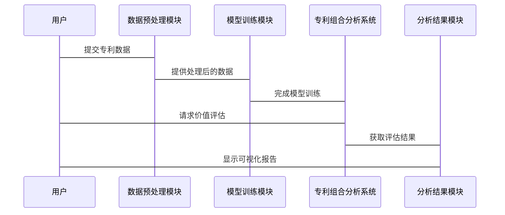

                 


# 深度学习分析公司专利组合价值

> 关键词：深度学习，专利组合，知识产权，技术评估，价值分析

> 摘要：本文探讨了如何利用深度学习技术分析公司专利组合的价值。通过背景介绍、核心概念、算法原理、系统架构、项目实战和最佳实践等部分，详细阐述了深度学习在专利组合分析中的应用及其优势。

---

# 第1章 深度学习与专利组合价值分析的背景

## 1.1 专利在现代企业中的战略地位

### 1.1.1 专利的基本概念与作用
专利是企业保护创新技术的重要手段，能够为企业带来经济利益和竞争优势。专利组合是指一组相互关联的专利，通常围绕某一技术领域或产品构建，以最大化其整体价值。

### 1.1.2 专利组合的定义与特点
专利组合是由多个专利组成的集合，具有协同效应和防御性。其特点包括技术相关性、法律覆盖范围和商业目标的一致性。

### 1.1.3 专利组合在企业竞争中的重要性
专利组合不仅是企业技术实力的体现，还可以用于防御诉讼、获取许可收入和提升市场地位。

## 1.2 深度学习技术的崛起

### 1.2.1 深度学习技术的基本概念
深度学习是一种人工智能技术，通过多层神经网络模拟人类学习过程，能够处理复杂的数据模式。

### 1.2.2 深度学习在数据分析中的优势
深度学习能够处理非结构化数据（如文本、图像），具有自动特征提取和高精度预测的优势。

### 1.2.3 深度学习在知识产权领域的应用潜力
深度学习可以用于专利文本分析、技术趋势预测和价值评估，为企业提供智能化的知识产权管理工具。

## 1.3 本章小结
专利组合价值分析是企业战略的重要组成部分，而深度学习技术为企业提供了高效、智能的解决方案。

---

# 第2章 专利组合价值分析的核心概念与框架

## 2.1 专利组合分析的基本原理

### 2.1.1 专利组合的构成要素
专利组合通常包括核心专利、外围专利和防御性专利，覆盖技术的不同层面和应用场景。

### 2.1.2 专利组合的价值评估维度
专利组合的价值可以从技术强度、法律稳定性、市场影响力和经济收益等方面进行评估。

### 2.1.3 专利组合分析的流程与方法
专利组合分析通常包括数据收集、特征提取、模型训练和结果解读等步骤。

## 2.2 深度学习在专利组合分析中的应用框架

### 2.2.1 数据采集与预处理
数据采集包括专利文本和相关 metadata 的获取，预处理包括清洗、分词和向量化。

### 2.2.2 模型训练与优化
模型训练需要使用标注数据，优化目标函数和调整超参数以提升模型性能。

### 2.2.3 结果分析与可视化
结果分析包括预测值与实际值的对比，可视化工具用于展示模型的性能和分析结果。

## 2.3 核心概念对比分析

### 2.3.1 传统专利分析方法与深度学习方法的对比
传统方法依赖人工经验，深度学习方法具有自动化和高精度的优势。

### 2.3.2 不同深度学习模型的优劣势分析
RNN适合序列数据，BERT适合语义理解，根据具体场景选择合适的模型。

### 2.3.3 专利组合分析的边界与外延
专利组合分析的边界包括数据范围和模型适用性，外延则包括技术预测和商业应用。

## 2.4 本章小结
深度学习为专利组合分析提供了新的思路和方法，但需要结合具体场景和数据特点。

---

# 第3章 专利组合价值分析的深度学习算法原理

## 3.1 深度学习模型的选择与优化

### 3.1.1 常见深度学习模型简介
包括RNN、CNN和Transformer等模型，适用于不同的数据类型和任务。

### 3.1.2 适合专利组合分析的模型选择
根据任务需求选择模型，如文本分类任务适合使用BERT。

### 3.1.3 模型优化策略与技巧
包括数据增强、模型调参和使用预训练模型等技巧。

## 3.2 基于深度学习的专利文本分析

### 3.2.1 专利文本的特征提取
使用词嵌入（如Word2Vec）提取文本特征，构建模型的输入向量。

### 3.2.2 基于RNN的序列建模
RNN适合处理专利文本的时序性，捕捉上下文信息。

### 3.2.3 基于BERT的专利文本理解
BERT通过预训练可以更好地理解专利文本的语义。

## 3.3 专利组合价值预测的数学模型

### 3.3.1 模型输入与输出的定义
输入为专利文本和相关特征，输出为专利组合的价值评分。

### 3.3.2 损失函数的定义与优化目标
使用交叉熵损失函数，优化目标是最小化损失值。

$$ L = -\sum_{i=1}^{n} y_i \log p_i + (1-y_i)\log (1-p_i) $$

### 3.3.3 模型训练与评估
训练过程包括正向传播和反向传播，评估指标包括准确率、召回率和F1值。

## 3.4 本章小结
深度学习模型在专利文本分析中表现出色，但需要结合具体任务进行优化。

---

# 第4章 系统分析与架构设计方案

## 4.1 问题场景介绍

### 4.1.1 项目背景
企业希望通过深度学习技术分析专利组合的价值，优化知识产权管理。

### 4.1.2 项目目标
构建一个基于深度学习的专利组合价值分析系统，提供智能化的评估工具。

## 4.2 系统功能设计

### 4.2.1 领域模型设计
使用Mermaid绘制类图，展示系统的功能模块和交互关系。



### 4.2.2 系统架构设计
使用Mermaid绘制架构图，展示系统的整体架构和模块划分。

```mermaid
archi
    专利组合分析系统 {
        数据预处理模块
        模型训练模块
        分析结果模块
        用户界面
    }
```

### 4.2.3 系统交互设计
使用Mermaid绘制序列图，展示用户与系统之间的交互流程。



## 4.3 本章小结
系统架构设计为专利组合价值分析提供了清晰的实现路径和模块划分。

---

# 第5章 项目实战：基于深度学习的专利组合价值分析系统

## 5.1 环境安装与配置

### 5.1.1 安装Python和相关库
安装Python 3.8及以上版本，使用pip安装TensorFlow、Keras、BERT等库。

### 5.1.2 安装Jupyter Notebook
用于数据处理和模型开发，提供交互式编程环境。

## 5.2 系统核心实现源代码

### 5.2.1 数据预处理代码
```python
import pandas as pd
from tensorflow.keras.preprocessing.text import Tokenizer

# 读取专利文本数据
df = pd.read_csv('patent_data.csv')
texts = df['text'].values
labels = df['value'].values

# 分词与向量化
tokenizer = Tokenizer(num_words=10000)
tokenizer.fit_on_texts(texts)
sequences = tokenizer.texts_to_sequences(texts)
```

### 5.2.2 模型训练代码
```python
from tensorflow.keras.models import Sequential
from tensorflow.keras.layers import Dense, LSTM, Dropout

model = Sequential()
model.add(LSTM(128, dropout=0.2, recurrent_dropout=0.2, input_shape=(None, 1)))
model.add(Dense(64, activation='relu'))
model.add(Dense(1, activation='sigmoid'))
model.compile(loss='binary_crossentropy', optimizer='adam', metrics=['accuracy'])
```

### 5.2.3 模型评估代码
```python
from sklearn.metrics import accuracy_score, recall_score, f1_score

y_pred = model.predict_classes(test_sequences)
print(f"Accuracy: {accuracy_score(y_test, y_pred)}")
print(f"Recall: {recall_score(y_test, y_pred)}")
print(f"F1 Score: {f1_score(y_test, y_pred)}")
```

## 5.3 实际案例分析与解读

### 5.3.1 数据获取与处理
从公开专利数据库获取相关数据，清洗和预处理后输入模型。

### 5.3.2 模型训练与优化
通过多次迭代优化模型参数，提升预测准确率和召回率。

### 5.3.3 结果解读与分析
通过混淆矩阵和ROC曲线分析模型性能，解读专利组合的实际价值。

## 5.4 本章小结
项目实战验证了深度学习在专利组合价值分析中的有效性，同时积累了实践经验。

---

# 第6章 最佳实践与注意事项

## 6.1 最佳实践 tips

### 6.1.1 数据预处理注意事项
确保数据清洗和分词的准确性，避免噪声数据影响模型性能。

### 6.1.2 模型调优技巧
结合交叉验证和网格搜索，选择最优模型参数。

### 6.1.3 可视化与解释性分析
使用SHAP或LIME等工具解释模型预测结果，提升分析的可解释性。

## 6.2 拓展阅读与深入学习
建议阅读相关学术论文和技术报告，关注深度学习在知识产权领域的最新研究进展。

## 6.3 注意事项与风险提示

### 6.3.1 数据隐私与合规性
确保数据来源合法，遵守相关法律法规。

### 6.3.2 模型泛化能力
避免过拟合，确保模型在不同数据集上的泛化能力。

### 6.3.3 实际应用中的边界条件
考虑专利组合分析的实际应用场景和限制条件。

## 6.4 本章小结
最佳实践和注意事项为读者提供了实用的指导，帮助更好地理解和应用深度学习技术。

---

# 结语

深度学习为专利组合价值分析提供了全新的视角和方法。通过系统化的分析和实践，企业可以更高效地评估和管理知识产权，提升竞争力。

---

# 作者

作者：AI天才研究院/AI Genius Institute & 禅与计算机程序设计艺术 /Zen And The Art of Computer Programming

