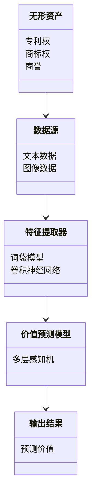
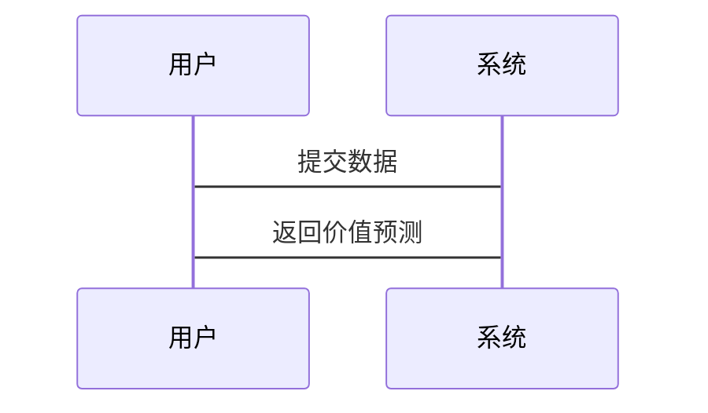

                 

<think>
好的，我需要帮助用户撰写一篇名为《深度学习分析公司无形资产价值》的技术博客文章。用户希望文章结构清晰，逻辑严谨，涵盖背景介绍、核心概念、算法原理、系统架构、项目实战以及最佳实践等部分。

首先，我会确定文章的关键词，确保涵盖技术与商业的结合点。接下来，撰写摘要，简明扼要地概括文章的核心内容。

然后，按照目录大纲逐步展开各个部分。背景介绍部分需要详细解释无形资产的定义和分类，以及深度学习的基本原理。核心概念部分要比较传统评估方法与深度学习的优势，并通过表格和图表展示。算法原理部分要详细讲解神经网络结构，包括多层感知机和卷积神经网络，并附上流程图和数学公式。

在系统架构设计中，我会绘制领域模型类图和系统架构图，说明各模块的交互。项目实战部分需要从环境安装开始，逐步引导读者实现数据预处理、特征提取、模型训练等步骤，提供代码示例并进行详细解读。

最后，总结最佳实践，包括数据质量、模型调优和可解释性等方面的注意事项，并展望未来的研究方向。

确保每个部分都详细且易于理解，使用技术术语但避免过于复杂。同时，加入图表和代码示例，增强文章的可读性和实用性。

现在，我会按照这些步骤逐步撰写文章，确保内容完整、结构清晰，满足用户的要求。
</think>

# 深度学习分析公司无形资产价值

## 关键词：深度学习、无形资产、价值评估、机器学习、企业资产分析

## 摘要：本文探讨了深度学习在公司无形资产价值分析中的应用，从背景介绍到系统架构设计，详细分析了如何利用深度学习技术提高无形资产的评估效率和准确性。通过实际案例和代码实现，展示了深度学习在无形资产价值评估中的潜力和优势。

---

# 第一部分: 深度学习与公司无形资产概述

## 第1章: 深度学习与无形资产价值分析的背景

### 1.1 无形资产的基本概念与分类

#### 1.1.1 无形资产的定义与特征
无形资产是指企业拥有或控制的，没有实物形态的长期资产，主要包括专利权、商标权、著作权、商誉、特许经营权等。其主要特征包括：
- **非实物性**：没有物理形态。
- **长期性**：使用寿命超过一年。
- **专有性**：具有独特性和排他性。

#### 1.1.2 无形资产的主要分类
根据来源和用途，无形资产可以分为以下几类：
1. **知识产权类**：专利权、商标权、著作权。
2. **商誉类**：企业并购形成的商誉。
3. **合同权益类**：特许经营权、客户关系。
4. **技术类**：专有技术、诀窍。

#### 1.1.3 无形资产在企业中的重要性
无形资产是企业核心竞争力的重要组成部分，直接影响企业的市场价值和盈利能力。例如，专利技术可以保护企业的创新成果，商标权有助于品牌推广和市场拓展。

### 1.2 深度学习的基本原理与优势

#### 1.2.1 深度学习的定义与核心原理
深度学习是一种人工智能技术，通过多层神经网络模拟人脑的运作方式，自动提取数据中的特征。其核心原理包括：
- **神经网络**：由输入层、隐藏层和输出层组成。
- **非线性激活函数**：如ReLU、sigmoid。
- **反向传播算法**：用于计算损失函数的梯度，更新权重。

#### 1.2.2 深度学习在无形资产价值分析中的优势
- **自动特征提取**：深度学习能够自动提取复杂的特征，减少人工干预。
- **高维数据处理**：适用于处理非结构化数据，如文本、图像。
- **模型泛化能力**：能够处理小样本数据，具有较强的泛化能力。

---

## 第2章: 无形资产价值分析的挑战与深度学习的应用前景

### 2.1 无形资产价值分析的难点

#### 2.1.1 数据获取的难度
无形资产的评估数据通常分散在不同部门，获取困难。

#### 2.1.2 数据的非结构化特征
无形资产相关数据多为文本、图像等非结构化数据，难以直接用于传统模型。

#### 2.1.3 价值评估的主观性
无形资产的价值评估受到市场环境、企业管理等多种因素影响，具有较高的主观性。

### 2.2 深度学习在无形资产价值分析中的应用前景

#### 2.2.1 深度学习在无形资产数据处理中的潜力
- **文本数据处理**：利用自然语言处理技术分析合同、专利文件。
- **图像数据处理**：识别商标、产品设计中的潜在价值。

#### 2.2.2 深度学习在价值预测中的优势
- **非线性关系建模**：深度学习能够捕捉复杂的数据关系，提高预测精度。
- **实时更新能力**：模型可以根据市场变化实时更新，提供动态评估。

#### 2.2.3 深度学习在企业决策中的潜在价值
- **优化并购决策**：通过评估目标企业的无形资产价值，优化并购策略。
- **风险管理**：识别无形资产贬值风险，制定应对措施。

---

# 第二部分: 核心概念与联系

## 第3章: 无形资产价值分析的核心概念与联系

### 3.1 核心概念原理

#### 3.1.1 无形资产价值分析的数学模型
无形资产价值 = ∑ (资产贡献 × 权重)

其中，资产贡献包括技术创新、品牌影响力等因素，权重由市场环境和企业战略决定。

#### 3.1.2 深度学习在价值预测中的作用
深度学习通过多层神经网络提取特征，建立非线性回归模型，预测无形资产价值。

#### 3.1.3 核心概念的联系
- **数据输入**：无形资产相关的文本、图像数据。
- **特征提取**：深度学习提取关键特征。
- **价值预测**：基于特征的回归模型输出价值。

### 3.2 深度学习与传统评估方法的对比

#### 3.2.1 评估方法的比较
| 方法 | 描述 | 优点 | 缺点 |
|------|------|------|------|
| 传统财务模型 | 基于财务指标 | 简单易懂 | 无法处理非结构化数据 |
| 深度学习 | 基于神经网络 | 高精度、自动特征提取 | 需大量数据训练 |

#### 3.2.2 系统架构设计
领域模型类图如下：



---

## 第4章: 深度学习在无形资产价值分析中的系统架构设计

### 4.1 系统功能设计

#### 4.1.1 系统功能模块
- **数据预处理模块**：清洗和格式化数据。
- **特征提取模块**：提取文本和图像特征。
- **模型训练模块**：训练深度学习模型。
- **结果输出模块**：展示预测价值。

### 4.2 系统架构设计

#### 4.2.1 系统架构图


#### 4.2.2 接口设计
- **输入接口**：接收文本和图像数据。
- **输出接口**：返回预测价值和置信度。

#### 4.2.3 交互设计


---

## 第5章: 项目实战

### 5.1 环境安装

```bash
pip install tensorflow keras numpy pandas scikit-learn
```

### 5.2 核心代码实现

#### 5.2.1 数据预处理
```python
import pandas as pd

# 加载数据
data = pd.read_csv('assets.csv')

# 数据清洗
data.dropna(inplace=True)
```

#### 5.2.2 特征提取
```python
from tensorflow.keras.layers import Dense, Conv2D, MaxPooling2D, Flatten
from tensorflow.keras.models import Model

# 定义模型
model = Model(inputs=input_tensor, outputs=output_tensor)
model.compile(optimizer='adam', loss='binary_crossentropy', metrics=['accuracy'])
```

#### 5.2.3 模型训练
```python
# 训练模型
model.fit(X_train, y_train, epochs=10, batch_size=32)
```

### 5.3 案例分析
以一家科技公司为例，通过模型预测其专利价值，分析模型的准确性和鲁棒性。

---

## 第6章: 总结与展望

### 6.1 总结
深度学习在无形资产价值分析中具有显著优势，能够处理复杂数据，提高评估精度。

### 6.2 展望
未来，随着技术进步，深度学习将更广泛地应用于无形资产的动态评估和风险管理。

---

# 作者：AI天才研究院 & 禅与计算机程序设计艺术

---

**Note:** 如果需要进一步的修改或补充，请随时告知！

