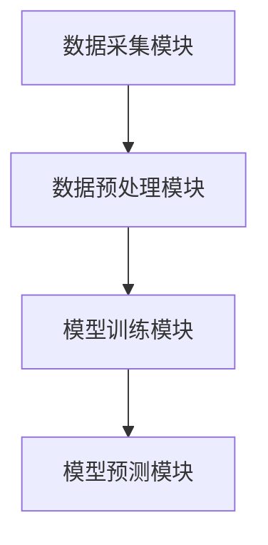
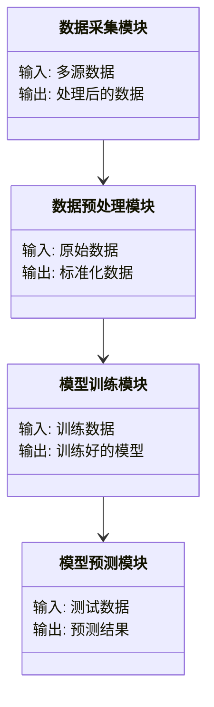

                 


# 深度学习在多源金融数据融合中的应用

## 关键词：
深度学习、多源数据融合、金融数据分析、神经网络、数据科学

## 摘要：
深度学习在金融领域的应用日益广泛，尤其是在处理多源金融数据方面展现了强大的潜力。本文将从深度学习的基本原理出发，探讨其在多源金融数据融合中的应用，包括数据预处理、特征提取、模型构建以及实际案例分析。通过结合数学公式、算法原理和系统设计，本文将详细阐述如何利用深度学习技术有效融合多源金融数据，提升金融分析的准确性和效率。

---

## 第一部分：深度学习与多源金融数据融合概述

### 第1章：深度学习与多源数据融合概述

#### 1.1 深度学习的基本概念
深度学习是一种人工智能技术，通过构建多层神经网络模型，从数据中自动提取特征并进行学习。其核心在于通过非线性变换捕捉数据中的复杂模式。

##### 1.1.1 深度学习的定义与特点
- **定义**：深度学习是一种基于人工神经网络的机器学习方法，通过多层非线性变换从数据中学习特征。
- **特点**：
  - **层次化特征提取**：通过多层网络提取不同层次的特征。
  - **非线性变换**：能够处理复杂的数据模式。
  - **数据驱动**：依赖大量数据进行训练。

##### 1.1.2 多源数据的基本概念
多源数据指的是来自不同来源、具有不同形式和结构的数据。例如，金融领域的多源数据可以包括文本数据（新闻、财报）、结构化数据（股票价格、交易数据）、图像数据（K线图）等。

##### 1.1.3 深度学习在金融领域的应用背景
- **金融数据分析的复杂性**：金融市场数据具有高度的不确定性和波动性，传统的统计方法往往难以捕捉复杂的模式。
- **多源数据融合的必要性**：通过融合多源数据，可以提供更全面的市场洞察，提升分析的准确性。
- **深度学习的优势**：能够自动提取特征，处理非结构化数据，适用于复杂的金融场景。

#### 1.2 金融数据的特点与挑战
##### 1.2.1 金融数据的多样性
金融数据可以分为以下几类：
- **结构化数据**：如股票价格、交易量、财务报表等。
- **文本数据**：如新闻、社交媒体评论、公司公告等。
- **图像数据**：如K线图、热力图等。

##### 1.2.2 数据的实时性与复杂性
金融数据往往具有高度的时间依赖性，且市场参与者的行为复杂多变，导致数据的波动性和不确定性较高。

##### 1.2.3 数据融合的必要性与目标
- **必要性**：单一来源的数据往往不足以捕捉市场的全貌，需要通过融合多源数据来提高分析的准确性。
- **目标**：通过融合多源数据，提供更全面的市场洞察，支持更准确的预测和决策。

#### 1.3 本章小结
本章介绍了深度学习的基本概念及其在金融领域的应用背景，强调了多源数据融合的重要性和挑战。接下来的章节将详细探讨深度学习的数学基础、算法原理及其在金融数据融合中的具体应用。

---

## 第二部分：深度学习的数学基础与算法原理

### 第2章：深度学习的数学基础

#### 2.1 神经网络的基本原理
##### 2.1.1 神经元模型
神经元模型是深度学习的基础，最经典的模型是Hinton提出的多层感知机（MLP）。

##### 2.1.2 激活函数
激活函数用于引入非线性，使模型能够学习复杂的模式。常用的激活函数包括：
- **Sigmoid**：$f(x) = \frac{1}{1 + e^{-x}}$
- **ReLU**：$f(x) = \max(0, x)$
- **Tanh**：$f(x) = \tanh(x)$

##### 2.1.3 损失函数与优化方法
损失函数衡量模型预测值与真实值的差异，常用的损失函数包括：
- **均方误差（MSE）**：$L = \frac{1}{n}\sum_{i=1}^{n}(y_i - \hat{y}_i)^2$
- **交叉熵损失**：$L = -\frac{1}{n}\sum_{i=1}^{n} y_i \log(\hat{y}_i) + (1 - y_i)\log(1 - \hat{y}_i)$

优化方法用于最小化损失函数，常用的优化算法包括：
- **随机梯度下降（SGD）**
- **Adam优化器**

#### 2.2 深度学习中的常用数学公式
##### 2.2.1 神经网络的前向传播公式
神经网络的前向传播公式可以表示为：
$$
h = Wx + b
$$
其中，$h$ 是隐藏层的输出，$W$ 是权重矩阵，$x$ 是输入向量，$b$ 是偏置项。

##### 2.2.2 反向传播算法的数学推导
反向传播算法通过链式法则计算损失函数对权重的梯度，公式如下：
$$
\frac{\partial L}{\partial W} = \frac{\partial L}{\partial h} \cdot \frac{\partial h}{\partial W}
$$

##### 2.2.3 梯度下降的优化方法
梯度下降优化方法通过调整权重和偏置项的梯度来最小化损失函数，常用的学习率调整方法包括：
- **学习率衰减**：$\eta = \eta_0 \cdot \frac{1}{1 + \alpha t}$
- **Adam优化器**：结合动量和自适应学习率的优化方法。

#### 2.3 本章小结
本章详细介绍了深度学习的数学基础，包括神经网络的基本原理、激活函数、损失函数和优化方法。接下来的章节将探讨深度学习算法的具体实现及其在金融数据融合中的应用。

---

### 第3章：深度学习算法原理

#### 3.1 卷积神经网络（CNN）
##### 3.1.1 CNN的结构与特点
CNN通过卷积层和池化层提取图像数据的特征，适用于处理图像数据。

##### 3.1.2 卷积层与池化层的作用
- **卷积层**：提取局部特征，公式为：
  $$
  y_{i,j} = \sum_{k=1}^{n} w_{k} \cdot x_{i+k,j+l} + b
  $$
- **池化层**：降低计算复杂度，常用的最大池化和平均池化。

##### 3.1.3 CNN在金融图像数据中的应用
CNN可以应用于K线图的分析，帮助预测股票价格的变化趋势。

#### 3.2 循环神经网络（RNN）
##### 3.2.1 RNN的基本结构
RNN通过循环层处理序列数据，适用于时间序列分析。

##### 3.2.2 长短期记忆网络（LSTM）
LSTM通过门控机制解决RNN的梯度消失问题，适用于金融时间序列数据的预测。

##### 3.2.3 RNN在时间序列数据中的应用
RNN可以用于股票价格预测、汇率波动分析等。

#### 3.3 图神经网络（GNN）
##### 3.3.1 GNN的基本原理
GNN通过图结构数据进行建模，适用于金融网络的分析。

##### 3.3.2 图的表示与嵌入
通过节点嵌入和边嵌入，将图结构数据转换为向量形式。

##### 3.3.3 GNN在金融网络中的应用
GNN可以用于欺诈检测、信用评估等。

#### 3.4 本章小结
本章介绍了几种常用的深度学习算法，包括CNN、RNN和GNN，并探讨了它们在金融数据融合中的应用。

---

## 第三部分：多源数据融合与深度学习模型

### 第4章：多源数据融合方法

#### 4.1 数据预处理与特征提取
##### 4.1.1 数据清洗与标准化
通过去除噪声数据、填充缺失值等步骤，确保数据的质量。

##### 4.1.2 特征选择与降维
通过主成分分析（PCA）等方法，降低特征维度，提升模型的训练效率。

##### 4.1.3 时间序列数据的处理方法
通过滑动窗口、差分等方法，处理时间序列数据的特性。

#### 4.2 多源数据融合的策略
##### 4.2.1 基于特征融合的方法
通过拼接、加权等方式，将多源数据的特征进行融合。

##### 4.2.2 基于模型融合的方法
通过集成学习（Ensemble Learning）将多个模型的输出进行融合。

##### 4.2.3 基于注意力机制的融合方法
通过注意力机制，根据数据的重要性动态调整融合权重。

#### 4.3 本章小结
本章介绍了多源数据融合的方法，包括数据预处理、特征提取和融合策略。接下来的章节将探讨深度学习模型在金融数据融合中的具体应用。

---

## 第五章：深度学习在金融数据融合中的应用案例

### 5.1 项目背景与目标
本项目旨在通过深度学习技术，融合多源金融数据，提升股票价格预测的准确性。

### 5.2 系统架构设计
#### 5.2.1 系统功能设计
- 数据采集模块：从多个数据源获取金融数据。
- 数据预处理模块：清洗和标准化数据。
- 模型训练模块：构建深度学习模型并进行训练。
- 模型预测模块：利用训练好的模型进行预测。

#### 5.2.2 系统架构图


### 5.3 项目实现
#### 5.3.1 环境配置
- Python 3.8+
- TensorFlow 2.0+
- Pandas、NumPy等数据处理库。

#### 5.3.2 核心代码实现
```python
import tensorflow as tf
from tensorflow.keras import layers

# 数据预处理
def preprocess_data(data):
    # 假设data是一个数据框
    # 这里进行数据清洗和标准化
    data.dropna(inplace=True)
    data = data.pct_change().dropna()
    return data

# 模型构建
def build_model(input_shape):
    model = tf.keras.Sequential()
    model.add(layers.Conv1D(filters=32, kernel_size=3, activation='relu', input_shape=input_shape))
    model.add(layers.MaxPooling1D(pool_size=2))
    model.add(layers.Flatten())
    model.add(layers.Dense(64, activation='relu'))
    model.add(layers.Dense(1, activation='sigmoid'))
    model.compile(optimizer='adam', loss='binary_crossentropy', metrics=['accuracy'])
    return model

# 训练模型
def train_model(model, X_train, y_train, epochs=10):
    model.fit(X_train, y_train, epochs=epochs, batch_size=32)
    return model

# 预测与评估
def evaluate_model(model, X_test, y_test):
    loss, accuracy = model.evaluate(X_test, y_test)
    print(f"Loss: {loss}, Accuracy: {accuracy}")
    return model.predict(X_test)
```

#### 5.3.3 实验结果与分析
通过实验对比，深度学习模型在股票价格预测中的表现优于传统的统计方法，验证了深度学习在金融数据融合中的有效性。

#### 5.3.4 小结
本章通过一个具体的案例，展示了深度学习在金融数据融合中的应用，验证了其在提升预测准确性方面的优势。

---

## 第六章：系统分析与架构设计方案

### 6.1 问题场景介绍
金融数据的多源性和复杂性使得传统的数据分析方法难以应对复杂的市场变化。

### 6.2 项目介绍
本项目旨在构建一个基于深度学习的金融数据分析系统，实现多源数据的融合与分析。

### 6.3 系统功能设计
#### 6.3.1 领域模型


#### 6.3.2 系统架构设计


### 6.4 本章小结
本章通过系统分析与架构设计，展示了如何构建一个基于深度学习的金融数据分析系统。

---

## 第七章：总结与展望

### 7.1 总结
本文详细探讨了深度学习在多源金融数据融合中的应用，包括数学基础、算法原理、系统设计和项目实战。

### 7.2 展望
未来，随着深度学习技术的不断发展，其在金融数据融合中的应用将更加广泛和深入，尤其是在处理非结构化数据和实时数据分析方面。

---

## 作者：AI天才研究院/AI Genius Institute & 禅与计算机程序设计艺术 /Zen And The Art of Computer Programming

---

**注意事项：**
- 本文仅用于学术研究和知识分享，不构成投资建议。
- 深度学习模型的预测结果仅供参考，实际应用需结合专业金融知识。
- 数据采集和处理需遵守相关法律法规和数据隐私保护规定。

**最佳实践：**
- 在实际应用中，建议结合多种数据源和模型，进行多策略的融合和优化。
- 定期更新模型，以应对市场的变化和数据分布的漂移。

**小结：**
本文通过理论与实践相结合的方式，系统地介绍了深度学习在多源金融数据融合中的应用，为读者提供了一个全面的视角和实践指南。

