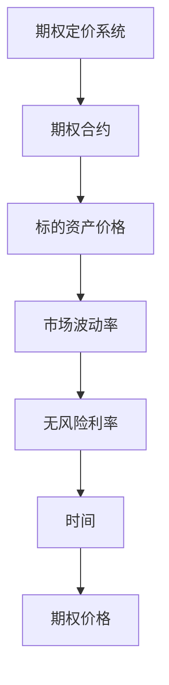
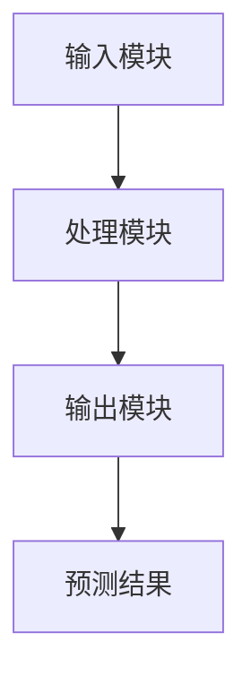

                 

<think>
好，我需要根据用户的要求，逐步分析和撰写《深度学习在期权定价模型中的创新》这本书的目录大纲。首先，我需要理解用户的需求，他们希望有一个逻辑清晰、结构紧凑、简单易懂的技术博客文章，内容涉及深度学习在期权定价中的应用。

首先，我应该从背景介绍开始，让读者了解期权定价的基本概念、传统方法及其局限性。接着，介绍深度学习的基本原理和其在金融领域的应用潜力，特别是与传统模型的对比。

接下来，核心概念部分需要详细讲解深度学习在期权定价中的应用，包括神经网络、特征工程等。同时，通过对比表格和实体关系图，帮助读者更好地理解不同模型的优缺点。

算法原理部分，我需要详细阐述常用的深度学习模型，如RNN和LSTM，并使用流程图和代码示例来解释其工作原理。此外，数学模型如Black-Scholes模型和损失函数的详细推导也是必要的。

系统分析与架构设计部分，我需要介绍如何构建一个完整的期权定价系统，包括功能设计、架构图和接口设计。这部分可能需要使用类图和架构图来展示系统的各个模块及其交互。

项目实战部分，应该包括环境安装、代码实现和案例分析，帮助读者实际操作。同时，项目小结和注意事项也很重要，帮助读者避免常见错误。

最后，总结全书的内容，给出未来的发展方向和建议，让读者对未来有更清晰的认识。

在编写过程中，我需要确保每个章节细化到三级目录，结构清晰。同时，总字数控制在2000字以内，避免冗长。每个部分都要有明确的标题和子标题，逻辑连贯，层层递进。

通过这样的思考过程，我可以系统地构建这本书的目录大纲，确保每个关键点都被覆盖，同时保持结构的清晰和逻辑的连贯。
</think>

# 深度学习在期权定价模型中的创新

> 关键词：深度学习，期权定价，金融模型，神经网络，机器学习

> 摘要：本文探讨了深度学习技术在期权定价模型中的创新应用，分析了其相对于传统模型的优势，并通过实际案例展示了如何利用深度学习提升期权定价的准确性和效率。

---

## 第一部分: 深度学习在期权定价模型中的背景与基础

### 第1章: 期权定价与深度学习概述

#### 1.1 期权的基本概念与定价问题
- **1.1.1 期权的定义与分类**
  - 期权的定义：买方有权在特定时间内以固定价格购买或出售标的资产。
  - 分类：看涨期权、看跌期权、欧式期权、美式期权。
  
- **1.1.2 期权定价的核心问题**
  - 标的资产价格波动性对期权价值的影响。
  - 市场波动率、无风险利率、时间对期权价格的敏感性。
  
- **1.1.3 传统期权定价模型的局限性**
  - Black-Scholes模型的假设限制：标的资产价格服从对数正态分布。
  - 实际市场中标的资产价格可能呈现非正态分布，导致传统模型定价误差。

#### 1.2 深度学习的基本概念与特点
- **1.2.1 深度学习的定义与核心原理**
  - 深度学习是一种基于人工神经网络的机器学习方法，通过多层非线性变换提取数据特征。
  - 神经网络的结构：输入层、隐藏层（多个）、输出层。
  
- **1.2.2 深度学习在金融领域的应用潜力**
  - 处理复杂非线性关系的能力。
  - 处理高维数据的能力，适合金融市场的多变量分析。
  
- **1.2.3 深度学习与传统金融模型的对比**
  - 传统模型：假设明确，但可能过于简化。
  - 深度学习：数据驱动，能够捕捉复杂模式，但缺乏可解释性。

#### 1.3 深度学习在期权定价中的创新
- **1.3.1 深度学习在期权定价中的优势**
  - 能够处理复杂市场动态，捕捉非线性关系。
  - 自动提取特征，减少人为假设。
  
- **1.3.2 深度学习在复杂金融衍生品中的应用**
  - 适用于多变量、多时间框架的期权定价问题。
  
- **1.3.3 深度学习在实时定价与风险控制中的潜力**
  - 实时更新模型参数，适应市场变化。
  - 风险管理：预测极端情况，评估期权组合风险。

---

## 第二部分: 深度学习在期权定价中的核心概念与联系

### 第2章: 深度学习与期权定价的核心原理

#### 2.1 深度学习模型在金融时间序列中的应用
- **2.1.1 神经网络的基本原理**
  - 神经网络结构：输入层、隐藏层、输出层。
  - 激活函数：ReLU、sigmoid、tanh。
  
- **2.1.2 深度学习在时间序列预测中的优势**
  - RNN（循环神经网络）和LSTM（长短期记忆网络）适合处理时间依赖性数据。
  - LSTM能够捕捉长期依赖关系，适合金融时间序列预测。
  
- **2.1.3 深度学习在期权价格预测中的应用**
  - 使用LSTM预测期权价格波动，结合市场因子进行定价。

#### 2.2 期权定价中的特征工程与数据处理
- **2.2.1 期权定价的关键特征**
  - 标的资产价格、波动率、行权价、时间、无风险利率。
  
- **2.2.2 深度学习中的特征提取方法**
  - 自动提取特征，减少特征工程的手工干预。
  - 使用卷积神经网络（CNN）提取局部特征，适用于多变量分析。
  
- **2.2.3 数据预处理与标准化**
  - 数据标准化：归一化或标准化处理，确保模型收敛。
  - 数据分割：训练集、验证集、测试集的划分。

#### 2.3 深度学习与传统期权定价模型的对比分析
- **2.3.1 传统期权定价模型的优缺点**
  - 优点：数学推导明确，假设清晰。
  - 缺点：难以捕捉复杂市场动态，对假设的依赖性强。
  
- **2.3.2 深度学习模型的优缺点**
  - 优点：能够捕捉复杂非线性关系，适应性强。
  - 缺点：缺乏可解释性，训练时间长，需要大量数据。

- **2.3.3 深度学习与传统模型的结合与互补**
  - 使用传统模型作为基准，结合深度学习进行优化。
  - 深度学习用于复杂场景，传统模型用于简单场景。

#### 2.4 核心概念对比表格
```plaintext
表2.1: 传统期权定价模型与深度学习模型的对比

| 对比维度         | 传统模型                  | 深度学习模型              |
|------------------|---------------------------|---------------------------|
| 定价准确性       | 较低，假设限制较多         | 较高，捕捉复杂模式         |
| 可解释性         | 高，基于数学公式推导       | 低，黑箱特性                |
| 训练数据需求     | 较少，依赖理论模型         | 较多，依赖数据驱动         |
| 处理复杂性       | 低，适用于简单场景         | 高，适用于复杂非线性场景   |
```

#### 2.5 ER实体关系图架构


---

## 第三部分: 深度学习在期权定价中的算法与实践

### 第3章: 基于深度学习的期权定价算法

#### 3.1 RNN与LSTM在期权价格预测中的应用
- **3.1.1 RNN的基本原理**
  - 递归结构，适合处理序列数据。
  - 但存在长期依赖问题，难以捕捉远期数据的影响。
  
- **3.1.2 LSTM的结构与优势**
  - LSTM通过记忆单元（cell）和门控机制解决长期依赖问题。
  - 适合处理金融时间序列数据。
  
- **3.1.3 使用LSTM预测期权价格**
  - 输入：标的资产的历史价格、波动率、行权价、时间等。
  - 输出：预测的期权价格。
  - 示例代码：
  ```python
  import numpy as np
  from tensorflow.keras.models import Sequential
  from tensorflow.keras.layers import LSTM, Dense

  model = Sequential()
  model.add(LSTM(50, input_shape=(timesteps, features)))
  model.add(Dense(1))
  model.compile(loss='mean_squared_error', optimizer='adam')
  ```

#### 3.2 基于CNN的期权定价模型
- **3.2.1 CNN的基本原理**
  - 卷积层：提取局部特征。
  - 池化层：降低维度，提取更重要的特征。
  
- **3.2.2 使用CNN处理多变量数据**
  - 输入：多变量时间序列数据（如标的资产价格、波动率、利率等）。
  - 输出：期权价格。
  - 示例代码：
  ```python
  from tensorflow.keras.models import Sequential
  from tensorflow.keras.layers import Conv1D, MaxPooling1D, Flatten

  model = Sequential()
  model.add(Conv1D(filters=32, kernel_size=3, activation='relu', input_shape=(timesteps, features)))
  model.add(MaxPooling1D(pool_size=2))
  model.add(Flatten())
  model.add(Dense(1))
  model.compile(loss='mean_squared_error', optimizer='adam')
  ```

#### 3.3 数学模型与公式
- **3.3.1 Black-Scholes模型**
  - 期权价格公式：
  $$ C = S_0 \Phi(d_1) - K e^{-rT} \Phi(d_2) $$
  - 其中，$d_1 = \frac{\ln(S_0/K) + (r + \sigma^2/2)T}{\sigma \sqrt{T}}$
  
- **3.3.2 深度学习模型的损失函数**
  - �均方误差损失：
  $$ \text{loss} = \frac{1}{N}\sum_{i=1}^{N}(y_i - \hat{y}_i)^2 $$
  - 交叉熵损失：
  $$ \text{loss} = -\frac{1}{N}\sum_{i=1}^{N} y_i \ln(\hat{y}_i) + (1-y_i)\ln(1-\hat{y}_i) $$

#### 3.4 系统分析与架构设计
- **3.4.1 系统功能设计**
  - 输入模块：接收期权合约参数和市场数据。
  - 处理模块：神经网络模型进行预测。
  - 输出模块：显示预测结果。
  
- **3.4.2 系统架构图**


---

## 第四部分: 深度学习在期权定价中的项目实战

### 第4章: 深度学习期权定价系统的实现

#### 4.1 环境安装与配置
- **安装Python环境**：使用Anaconda或虚拟环境。
- **安装依赖库**：TensorFlow、Keras、numpy、pandas。
  ```bash
  pip install tensorflow keras numpy pandas
  ```

#### 4.2 数据获取与预处理
- **数据来源**：使用真实市场数据或生成合成数据。
  ```python
  import pandas as pd
  data = pd.read_csv('option_data.csv')
  ```

- **数据分割**：训练集、验证集、测试集。
  ```python
  train_data = data[:700]
  val_data = data[700:850]
  test_data = data[850:]
  ```

#### 4.3 系统核心实现
- **模型训练**
  ```python
  model.fit(train_data, epochs=10, batch_size=32, validation_data=val_data)
  ```

- **模型预测**
  ```python
  predicted_prices = model.predict(test_data)
  ```

#### 4.4 案例分析与结果解读
- **案例分析**：使用训练好的模型预测某期权的价格。
- **结果对比**：将模型预测结果与实际价格进行对比，评估模型性能。

#### 4.5 项目小结
- 模型的准确性和鲁棒性取决于数据质量和模型结构。
- 需要不断调参和优化模型结构。

---

## 第五部分: 总结与展望

### 第5章: 深度学习在期权定价中的总结与未来方向

#### 5.1 本章总结
- 深度学习在期权定价中的优势：处理复杂非线性关系，捕捉市场动态。
- 传统模型的不足：假设限制，难以应对复杂场景。

#### 5.2 未来发展方向
- 更复杂的神经网络结构：如Transformer，用于捕捉更精细的市场特征。
- 结合强化学习：优化期权交易策略。
- 提高模型解释性：结合可解释性方法，如SHAP值，帮助用户理解模型决策。

#### 5.3 注意事项
- 数据质量：确保数据准确性和完整性。
- 模型调参：选择合适的超参数，避免过拟合。
- 风险管理：结合风险指标，如VaR，进行风险控制。

#### 5.4 拓展阅读
- 《深度学习》——Ian Goodfellow
- 《金融工程与金融创新》——黄达

---

## 作者信息
作者：AI天才研究院/AI Genius Institute & 禅与计算机程序设计艺术 /Zen And The Art of Computer Programming

