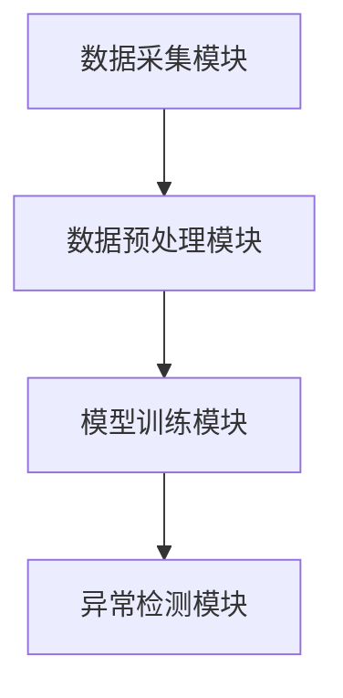
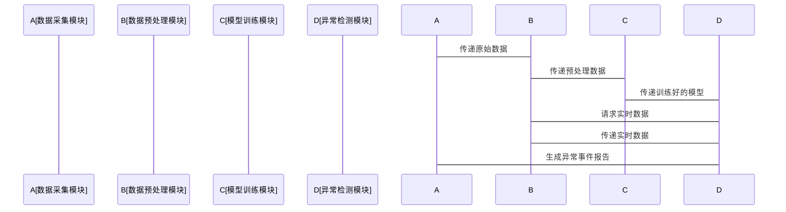

                 


# 深度学习在金融时间序列异常检测中的应用

> 关键词：深度学习，时间序列，异常检测，金融，LSTM，Transformer，股票价格

> 摘要：本文深入探讨了深度学习在金融时间序列数据异常检测中的应用。从基本概念和问题背景出发，详细介绍了几种主流的深度学习模型，如RNN、LSTM、Transformer等，并通过实际案例分析展示了这些模型在金融领域的应用效果。文章还讨论了系统架构设计和项目实现过程，并提出了最佳实践建议。通过本文，读者可以全面了解深度学习在金融时间序列异常检测中的原理、方法和应用。

---

# 第一部分: 深度学习与金融时间序列异常检测的背景

## 第1章: 深度学习与时间序列数据概述

### 1.1 深度学习的基本概念

深度学习是一种基于人工神经网络的机器学习方法，通过多层非线性变换来学习数据的高层次特征。与传统机器学习方法相比，深度学习能够自动提取特征，适用于复杂的数据模式分析。

#### 1.1.1 深度学习的定义与特点
- **定义**：深度学习是一种机器学习技术，通过多层神经网络结构来模拟人脑的学习方式。
- **特点**：
  - **自动特征提取**：无需手动提取特征，能够从原始数据中学习高层次的特征。
  - **非线性关系**：能够捕捉复杂的非线性关系。
  - **高维数据处理**：适用于高维数据的分析。

#### 1.1.2 时间序列数据的特性
时间序列数据是指按照时间顺序排列的数据，具有以下特性：
- **顺序性**：数据的顺序非常重要，前后相关。
- **趋势性**：数据可能呈现上升或下降的趋势。
- **周期性**：数据可能具有一定的周期性，如月度、季度或年度周期。
- **波动性**：数据可能因市场波动、突发事件等因素出现异常值。

#### 1.1.3 深度学习在时间序列分析中的优势
- **捕捉复杂模式**：深度学习能够捕捉时间序列中的复杂模式，如长距离依赖关系。
- **自动特征提取**：能够自动提取时间序列中的特征，减少手动特征工程的工作量。
- **高精度预测**：在金融时间序列预测中，深度学习模型通常表现出较高的精度。

### 1.2 金融时间序列数据的特点

金融时间序列数据具有以下几个特点：
- **高波动性**：金融市场的波动性较大，容易受到突发事件的影响。
- **复杂性**：金融数据通常受到多种因素的影响，如市场情绪、政策变化等。
- **异常事件的潜在影响**：异常事件（如市场操纵、欺诈行为）可能对金融市场造成重大影响。

#### 1.2.1 金融时间序列数据的应用场景
- **股票价格预测**：通过分析历史股价数据，预测未来的价格走势。
- **市场风险评估**：通过分析市场波动性，评估投资组合的风险。
- **欺诈检测**：通过分析交易数据，识别异常交易行为。

### 1.3 异常检测的基本概念

#### 1.3.1 异常检测的定义
异常检测是指识别数据中与正常数据模式不符的异常点或事件。

#### 1.3.2 异常检测的应用场景
- **欺诈检测**：识别异常交易行为。
- **系统监控**：监控系统运行状态，识别异常事件。
- **金融风险控制**：识别金融市场中的异常波动。

#### 1.3.3 金融领域中的异常检测需求
- **及时性**：需要快速识别异常事件，以便及时采取措施。
- **准确性**：需要准确识别异常事件，避免误报或漏报。
- **复杂性**：金融数据复杂，异常检测需要考虑多种因素。

---

## 第2章: 金融时间序列异常检测的挑战与解决方案

### 2.1 金融时间序列异常检测的挑战

#### 2.1.1 数据的稀疏性
金融时间序列数据通常具有较高的稀疏性，即正常数据较多，异常数据较少。这使得异常检测模型的训练较为困难。

#### 2.1.2 高维数据的处理难度
金融数据通常涉及多个维度，如股票价格、成交量、市场指数等。高维数据的处理需要复杂的特征工程和模型设计。

#### 2.1.3 计算资源的限制
深度学习模型通常需要大量的计算资源，尤其是在处理高维时间序列数据时，计算成本较高。

### 2.2 深度学习在异常检测中的优势

#### 2.2.1 模型的表达能力
深度学习模型具有强大的表达能力，能够捕捉复杂的时间序列模式。

#### 2.2.2 对复杂模式的捕捉能力
深度学习模型能够捕捉时间序列中的长距离依赖关系，适合处理金融时间序列数据。

#### 2.2.3 自动特征提取的优势
深度学习模型能够自动提取特征，减少手动特征工程的工作量。

### 2.3 本章小结

---

# 第二部分: 深度学习模型在时间序列分析中的应用

## 第3章: 常见深度学习模型概述

### 3.1 循环神经网络（RNN）

#### 3.1.1 RNN的基本结构
- **输入层**：接收时间序列数据。
- **隐藏层**：通过循环结构处理序列数据，维护一个隐藏状态。
- **输出层**：生成预测结果。

#### 3.1.2 长短期记忆网络（LSTM）
- **记忆单元**：LSTM通过记忆单元（Memory Cell）来保存长期信息。
- **遗忘门**：控制哪些信息需要遗忘。
- **输入门**：控制哪些新信息需要存储。
- **输出门**：控制哪些信息需要输出。

#### 3.1.3 注意力机制的引入
- **注意力机制**：通过引入注意力机制，模型可以关注重要的时间步信息，提高预测精度。

#### 3.1.4 RNN与LSTM的对比
| 特性         | RNN              | LSTM             |
|--------------|-------------------|------------------|
| 长距离依赖   | 无法处理长距离依赖 | 可以处理长距离依赖 |
| 计算复杂度   | 较低              | 较高             |
| 应用场景     | 简单序列任务      | 复杂序列任务     |

### 3.2 变换器（Transformer）

#### 3.2.1 Transformer的结构特点
- **编码器-解码器结构**：通过编码器将输入序列编码为一个向量，解码器根据编码结果生成输出序列。
- **自注意力机制**：通过自注意力机制，模型可以关注输入序列中的重要部分。
- **前馈网络**：编码器和解码器中的前馈网络用于特征变换。

#### 3.2.2 Transformer与RNN/LSTM的对比
| 特性         | RNN              | LSTM             | Transformer      |
|--------------|-------------------|------------------|-----------------|
| 结构复杂度   | 较低              | 较高             | 较高            |
| 计算复杂度   | 较低              | 较高             | 较高            |
| 应用场景     | 简单序列任务      | 复杂序列任务     | 复杂序列任务    |

---

## 第4章: 深度学习模型在金融时间序列异常检测中的应用

### 4.1 基于RNN的异常检测

#### 4.1.1 RNN模型的应用
- **输入数据**：将时间序列数据输入RNN模型，生成隐藏状态。
- **异常检测**：通过比较隐藏状态与正常状态的差异，识别异常事件。

#### 4.1.2 LSTM模型的应用
- **输入数据**：将时间序列数据输入LSTM模型，生成隐藏状态。
- **异常检测**：通过比较隐藏状态与正常状态的差异，识别异常事件。

### 4.2 基于Transformer的异常检测

#### 4.2.1 Transformer模型的应用
- **输入数据**：将时间序列数据输入Transformer模型，生成编码向量。
- **异常检测**：通过比较编码向量与正常向量的差异，识别异常事件。

#### 4.2.2 注意力机制的作用
- **注意力权重**：通过注意力机制，模型可以关注重要的时间步信息，提高异常检测的准确性。

---

## 第5章: 深度学习模型的数学原理

### 5.1 RNN的数学模型

#### 5.1.1 RNN的前向传播
$$
h_t = \sigma(W_h h_{t-1} + W_x x_t + b)
$$

其中：
- \( h_t \) 表示第 \( t \) 时刻的隐藏状态
- \( x_t \) 表示第 \( t \) 时刻的输入
- \( W_h \) 和 \( W_x \) 是权重矩阵
- \( b \) 是偏置项
- \( \sigma \) 是激活函数（如sigmoid）

#### 5.1.2 LSTM的数学模型
$$
f_t = \sigma(W_f [h_{t-1}, x_t])
$$

$$
i_t = \sigma(W_i [h_{t-1}, x_t])
$$

$$
o_t = \sigma(W_o [h_{t-1}, x_t])
$$

$$
c_t = f_t \cdot c_{t-1} + i_t \cdot tanh(W_c [h_{t-1}, x_t])
$$

$$
h_t = o_t \cdot tanh(c_t)
$$

其中：
- \( f_t \) 是遗忘门
- \( i_t \) 是输入门
- \( o_t \) 是输出门
- \( c_t \) 是记忆单元
- \( W_f, W_i, W_o \) 是遗忘门、输入门和输出门的权重矩阵
- \( W_c \) 是记忆单元的权重矩阵

### 5.2 Transformer的数学模型

#### 5.2.1 自注意力机制
$$
\text{Attention}(Q, K, V) = \text{softmax}\left(\frac{QK^T}{\sqrt{d_k}}\right)V
$$

其中：
- \( Q \) 是查询向量
- \( K \) 是键向量
- \( V \) 是值向量
- \( d_k \) 是向量的维度

#### 5.2.2 前馈网络
$$
\text{FFN}(x) = \text{ReLU}(W_1 x + b_1) W_2 + b_2
$$

其中：
- \( W_1 \) 和 \( W_2 \) 是前馈网络的权重矩阵
- \( b_1 \) 和 \( b_2 \) 是偏置项
- \( \text{ReLU} \) 是激活函数

---

# 第三部分: 系统分析与架构设计

## 第6章: 系统分析与架构设计

### 6.1 项目介绍

#### 6.1.1 项目背景
本项目旨在利用深度学习技术，实现金融时间序列数据的异常检测。通过分析股票价格数据，识别异常交易行为。

### 6.2 系统功能设计

#### 6.2.1 数据采集模块
- **功能**：从金融数据源（如股票市场数据API）获取实时数据。
- **输入**：股票代码、时间范围
- **输出**：时间序列数据

#### 6.2.2 数据预处理模块
- **功能**：对获取的原始数据进行清洗、标准化等处理。
- **输入**：原始时间序列数据
- **输出**：预处理后的数据

#### 6.2.3 模型训练模块
- **功能**：训练深度学习模型（如LSTM、Transformer）。
- **输入**：预处理后的数据
- **输出**：训练好的模型

#### 6.2.4 异常检测模块
- **功能**：利用训练好的模型，实时检测异常事件。
- **输入**：实时时间序列数据
- **输出**：异常事件报告

### 6.3 系统架构设计

#### 6.3.1 系统架构图


#### 6.3.2 系统接口设计
- **数据采集模块接口**：
  - 输入：股票代码、时间范围
  - 输出：时间序列数据

- **数据预处理模块接口**：
  - 输入：原始时间序列数据
  - 输出：预处理后的数据

- **模型训练模块接口**：
  - 输入：预处理后的数据
  - 输出：训练好的模型

- **异常检测模块接口**：
  - 输入：实时时间序列数据
  - 输出：异常事件报告

### 6.4 系统交互流程图



---

# 第四部分: 项目实战

## 第7章: 项目实战

### 7.1 环境安装

#### 7.1.1 安装Python
```bash
python --version
pip install --upgrade pip
```

#### 7.1.2 安装深度学习库
```bash
pip install tensorflow keras numpy pandas matplotlib
```

### 7.2 系统核心实现源代码

#### 7.2.1 数据预处理代码
```python
import pandas as pd
import numpy as np

def load_data(stock_code, start_date, end_date):
    # 从数据源获取数据
    data = pd.read_csv(f'data/{stock_code}.csv', 
                       parse_dates=['date'], 
                       index_col='date')
    data = data.loc[start_date:end_date]
    return data

def preprocess_data(data):
    # 数据清洗
    data.dropna(inplace=True)
    # 标准化处理
    from sklearn.preprocessing import StandardScaler
    scaler = StandardScaler()
    data_scaled = scaler.fit_transform(data)
    return data_scaled
```

#### 7.2.2 模型训练代码
```python
from tensorflow.keras.models import Sequential
from tensorflow.keras.layers import LSTM, Dense, Dropout

def build_lstm_model(input_shape):
    model = Sequential()
    model.add(LSTM(units=64, 
                   return_sequences=True, 
                   input_shape=input_shape))
    model.add(Dropout(0.2))
    model.add(LSTM(units=32, return_sequences=False))
    model.add(Dense(1))
    model.compile(loss='mean_squared_error', optimizer='adam')
    return model

def train_model(model, X_train, y_train, epochs=100, batch_size=32):
    model.fit(X_train, y_train, 
             epochs=epochs, 
             batch_size=batch_size, 
             validation_split=0.2)
    return model
```

#### 7.2.3 异常检测代码
```python
def detect_anomalies(model, scaler, X_test):
    predictions = model.predict(X_test)
    # 反标准化
    predictions = scaler.inverse_transform(predictions)
    actual_values = scaler.inverse_transform(y_test)
    # 计算异常分数
    anomalies = np.where(np.abs(predictions - actual_values) > 0.2, True, False)
    return anomalies
```

### 7.3 代码应用解读与分析

#### 7.3.1 数据预处理
- **数据加载**：从CSV文件中加载股票价格数据。
- **数据清洗**：删除缺失值。
- **数据标准化**：使用标准差标准化数据，确保模型输入的标准化。

#### 7.3.2 模型训练
- **模型构建**：构建一个两层LSTM网络，包含Dropout层防止过拟合。
- **模型训练**：使用训练数据训练模型，设置100个 epochs 和32 batch size。

#### 7.3.3 异常检测
- **模型预测**：使用训练好的模型预测测试数据。
- **反标准化**：将预测结果和真实值进行反标准化处理。
- **异常判断**：通过计算预测值和真实值的差值，判断是否为异常点。

### 7.4 项目小结

---

# 第五部分: 总结与展望

## 第8章: 总结与展望

### 8.1 总结

深度学习在金融时间序列异常检测中的应用具有显著的优势。通过深度学习模型，可以自动提取特征，捕捉复杂的时间序列模式，提高异常检测的准确性和效率。本文通过实际案例分析，展示了深度学习在金融时间序列异常检测中的应用效果。

### 8.2 未来展望

尽管深度学习在金融时间序列异常检测中表现出色，但仍存在一些挑战和改进空间：
- **模型的可解释性**：需要提高模型的可解释性，以便更好地理解异常事件的原因。
- **计算资源的限制**：需要优化模型结构，降低计算成本。
- **多模态数据的融合**：可以尝试将文本数据、新闻数据等多模态数据与时间序列数据结合，提高异常检测的准确性。

---

# 作者：AI天才研究院 & 禅与计算机程序设计艺术

---

以上是《深度学习在金融时间序列异常检测中的应用》的完整目录和内容概览。通过本文，读者可以系统地了解深度学习在金融时间序列异常检测中的原理、方法和应用。

